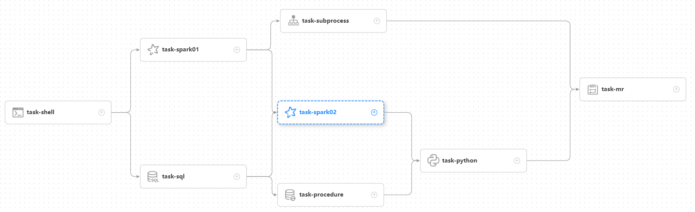

## 시스템 아키텍처 설계

스케줄링 시스템의 아키텍처를 설명하기 전에 먼저 일반적으로 사용되는 스케줄링 용어를 이해하겠습니다.
스케줄링 시스템

### 1.용어집

**DAG:** 전체 이름은 방향성 비순환 그래프이며 DAG라고 합니다.워크플로의 작업은
방향성 비순환 그래프 형태이며 위상 순회는 차수 0인 노드에서 수행됩니다.
후속 노드가 없습니다.예가 아래에 나와 있습니다.

**프로세스 정의**: 작업 노드를 드래그하고 노드 간의 연결을 설정하여 형성된 **DAG**를 시각화합니다.

**프로세스 인스턴스**: 프로세스 인스턴스는 다음을 통해 생성될 수 있는 프로세스 정의의 인스턴스화입니다.
수동 시작 또는 예약된 트리거링.프로세스 정의가 실행될 때마다 프로세스 인스턴스가 생성됩니다.

**작업 인스턴스**: 특정 실행을 나타내는 프로세스 정의 내의 작업 노드 인스턴스화
그 임무의.

**작업 유형**: 현재 SHELL, SQL, SUB_WORKFLOW, PROCEDURE, MR, SPARK, PYTHON, DEPENDENT(
상황에 따라 다름), 동적 플러그인 확장을 지원할 계획입니다. 참고: **SUB_WORKFLOW**는 다른 플러그인과 연결되어야 합니다.
별도로 시작하고 실행할 수 있는 별도의 프로세스 정의인 워크플로 정의

**예약 방법**: 시스템은 예약된 트리거링(cron 표현식 기반)과 수동 트리거링을 지원합니다.
명령 유형 지원: 워크플로 시작, 현재 노드에서 실행 시작, 내결함성 워크플로 재개,
일시 중지 프로세스 재개, 실패한 노드에서 실행 시작, 보완, 타이밍, 재실행, 일시 중지, 중지, 대기 스레드 재개.
그 중에서 **Resume Fault-Tolerant Workflow** 및 **Resume wait thread** 명령 유형은 내부에서 사용됩니다.
스케줄링 제어이며 외부에서 호출할 수 없습니다.

**예약됨**: 시스템은 **quartz** 분산 스케줄러를 채택하고 cron 표현식의 시각적 생성을 지원합니다.

**종속성**: 시스템은 이전 노드와 후속 노드 간의 단순한 **DAG** 종속성을 지원할 뿐만 아니라
**작업 종속** 노드를 제공하여 **프로세스 간** 종속성을 지원합니다.

**우선순위**: 프로세스 인스턴스와 작업 인스턴스 모두에 대한 우선순위 설정을 지원합니다.우선순위가 지정되지 않은 경우
시스템은 기본적으로 FIFO(선입선출) 실행 순서를 따릅니다.

**이메일 알림**: **SQL 작업** 지원 쿼리 결과 이메일 전송, 프로세스 인스턴스 실행 결과 이메일 알림 및 오류
허용 오차 알림

**실패 전략**: 병렬 작업 실행이 포함된 워크플로의 경우 시스템은 두 가지 오류 처리 전략을 제공합니다.
**계속** 작업이 실패하면 시스템은 실패에 관계없이 완료될 때까지 다른 병렬 작업을 계속 실행합니다.
모든 병렬 작업 실행이 완료된 후에만 전체 프로세스가 실패로 표시됩니다.
**종료**는 작업 실패 시 시스템이 즉시 프로세스를 실패로 표시하고 현재 프로세스를 종료함을 의미합니다.
병렬 작업 실행

**보완**: 기록 데이터 백필, **간격 병렬** 및 **직렬** 두 가지 보완 모드 지원,
**날짜 범위** 및 **날짜 열거**를 포함한 두 가지 날짜 선택 방법이 있습니다.

### 2.모듈 소개

- Dolphinscheduler-master 마스터 모듈은 워크플로우 관리 및 오케스트레이션을 제공합니다.

- Dolphinscheduler-worker 모듈은 작업 실행 관리를 제공합니다.

- AlertServer 서비스를 제공하는 돌고래 스케줄러 경고 경보 모듈입니다.

- ApiServer 서비스를 제공하는 Dolphinscheduler-api 웹 애플리케이션 모듈입니다.

- Dolphinscheduler-common 일반 상수 열거, 유틸리티 클래스, 데이터 구조 또는 기본 클래스

- Dolphinscheduler-dao는 데이터베이스 액세스와 같은 작업을 제공합니다.

- 돌고래 스케줄러 추출 돌고래 스케줄러 추출 모듈, 마스터/작업자/경고 SDK를 제공합니다.

- Quartz, Zookeeper, 로그 클라이언트 액세스 서비스, 호출하기 쉬운 서버를 포함한 돌고래 스케줄러 서비스 서비스 모듈
모듈과 API 모듈

- Dolphinscheduler-ui 프론트엔드 모듈

### 요약스케줄링의 관점에서 이 문서에서는 아키텍처 원칙과 구현을 미리 소개합니다.
빅 데이터 분산 워크플로우 스케줄링 시스템인 DolphinScheduler의 아이디어.계속됩니다