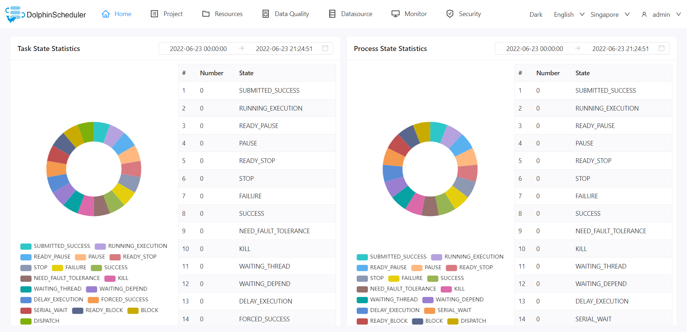

# DolphinScheduler 소개

Apache DolphinScheduler는 분산·확장이 쉬운 시각화 DAG 워크플로우 태스크 스케줄링 오픈소스 시스템입니다. 기업 환경에 맞춰 태스크, 워크플로우, 전 생명주기 데이터 처리 과정을 시각적으로 다룰 수 있는 솔루션을 제공합니다.

Apache DolphinScheduler는 복잡한 데이터 태스크 의존 관계를 해결하고, 애플리케이션에 데이터 및 다양한 OPS 오케스트레이션 관계를 제공합니다. 데이터 연구·개발 및 ETL 의존성이 얽혀 있어 태스크 상태를 모니터링하기 어려운 문제를 해소합니다. DolphinScheduler는 DAG(Directed Acyclic Graph, 방향 비순환 그래프) 방식으로 태스크를 조합하며, 태스크 실행 상태를 실시간으로 모니터링하고, 재시도·특정 노드부터 실패 복구·일시정지·재개·종료 등의 동작을 지원합니다.

