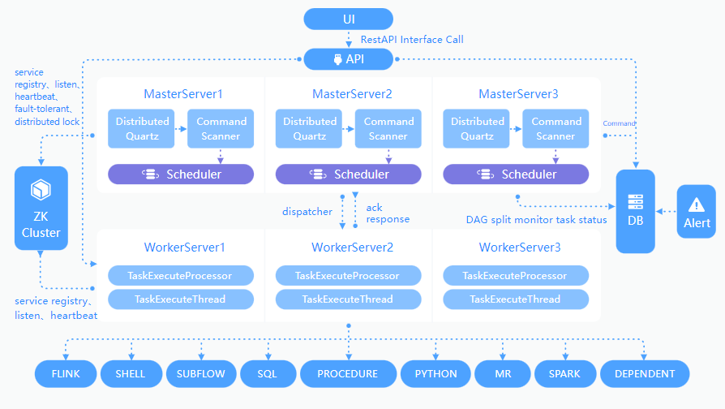
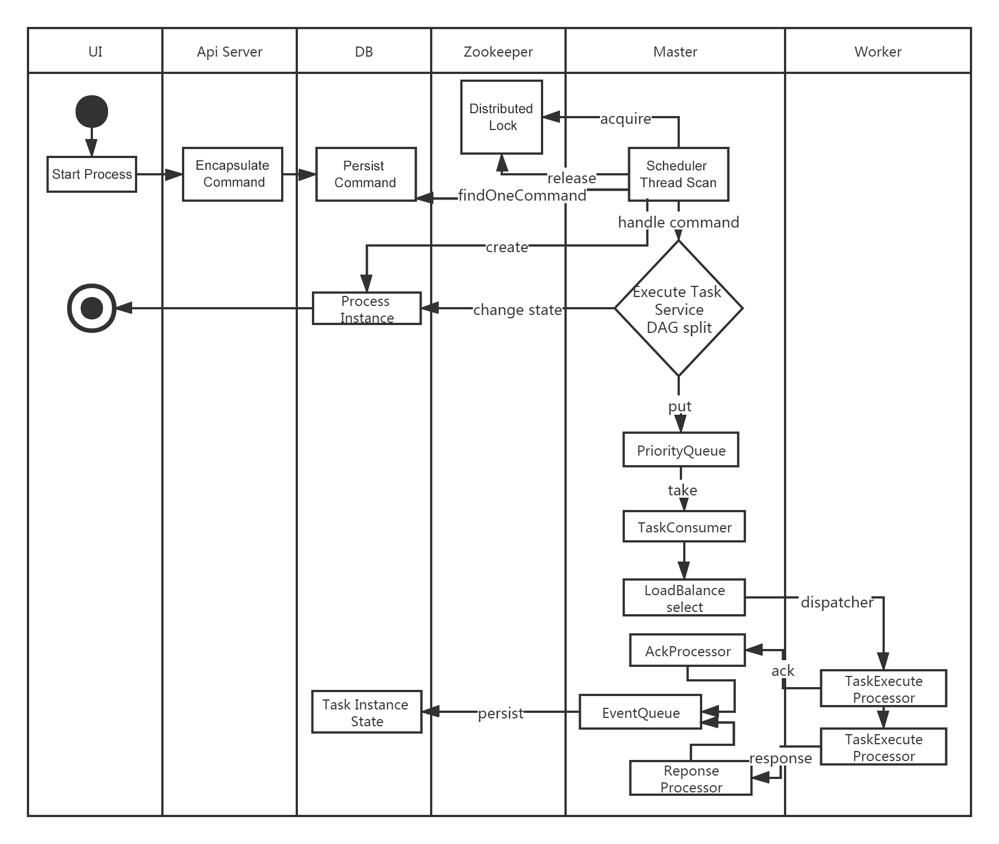
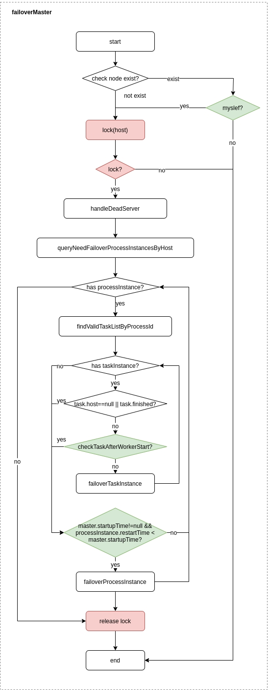
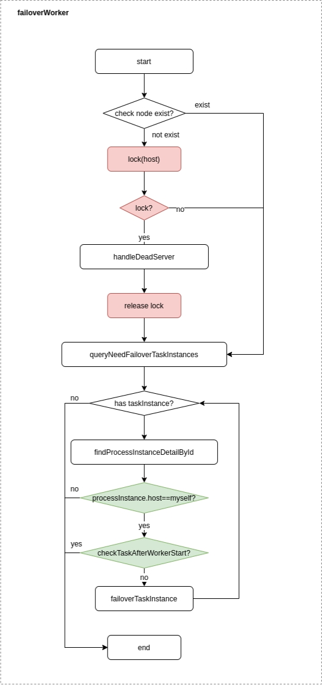

# 시스템 아키텍처 설계

## 시스템 구조

### 시스템 아키텍처 다이어그램

<p 정렬="중앙">

<p 정렬="중앙">
<em>시스템 아키텍처 다이어그램</em>
</p>
</p>

### 시작 프로세스 활동 다이어그램

<p 정렬="중앙">

<p 정렬="중앙">
<em>프로세스 활동 다이어그램 시작</em>
</p>
</p>

### 아키텍처 설명

- **마스터서버**

MasterServer는 분산 및 분산 설계 개념을 채택합니다.MasterServer는 주로 DAG 작업 분할, 작업 제출 모니터링, 다른 MasterServer와 WorkerServer의 상태 모니터링을 동시에 담당합니다.
MasterServer 서비스가 시작되면 ZooKeeper에 임시 노드를 등록하고 ZooKeeper의 임시 노드의 변경 사항을 모니터링하여 내결함성을 수행합니다.
MasterServer는 netty를 기반으로 모니터링 서비스를 제공합니다.

#### 서비스에는 주로 다음이 포함됩니다.

- **DistributedQuartz** 분산 일정 구성 요소는 주로 예약된 작업의 시작 및 중지 작업을 담당합니다.Quartz가 작업을 시작하면 마스터 내부에 처리 작업의 후속 작업을 담당하는 스레드 풀이 있게 됩니다.

- **MasterSchedulerService**는 데이터베이스의 `t_ds_command` 테이블을 정기적으로 스캔하고 다양한 **명령 유형**에 따라 다양한 비즈니스 작업을 실행하는 스캐닝 스레드입니다.

- **WorkflowExecuteRunnable**은 주로 DAG 작업 분할, 작업 제출 모니터링 및 다양한 이벤트 유형의 논리적 처리를 담당합니다.

- **TaskExecuteRunnable**은 주로 작업 처리 및 지속성을 담당하며 작업 이벤트를 생성하여 프로세스 인스턴스의 이벤트 큐에 제출합니다.

- **EventExecuteService**는 주로 프로세스 인스턴스의 이벤트 큐 폴링을 담당합니다.

- **StateWheelExecuteThread**는 주로 프로세스 인스턴스 및 작업 시간 초과, 작업 재시도, 작업 종속 폴링을 담당하고 해당 프로세스 인스턴스 또는 작업 이벤트를 생성하여 프로세스 인스턴스의 이벤트 큐에 제출합니다.

- **FailoverExecuteThread**는 주로 마스터 결함 허용 및 작업자 결함 허용 논리를 담당합니다.

- **작업자 서버**

WorkerServer는 또한 분산 및 분산 설계 개념을 채택합니다.WorkerServer는 주로 작업 실행과 로그 서비스 제공을 담당합니다.

WorkerServer 서비스가 시작되면 ZooKeeper에 임시 노드를 등록하고 하트비트를 유지합니다.
WorkerServer는 netty를 기반으로 모니터링 서비스를 제공합니다.

#### 서비스에는 주로 다음이 포함됩니다.

- **WorkerManagerThread**는 주로 작업 대기열 제출을 담당하며 작업 대기열에서 지속적으로 작업을 수신하고 처리를 위해 스레드 풀에 제출합니다.

- **TaskExecuteThread**는 주로 작업 실행 프로세스와 다양한 작업 유형에 따른 작업의 실제 처리를 담당합니다.

- **RetryReportTaskStatusThread**는 작업 상태 손실을 방지하기 위해 마스터가 상태 승인에 응답할 때까지 작업 상태를 마스터에 보고하기 위해 정기적으로 폴링하는 역할을 주로 담당합니다.

- **동물원 사육사**

시스템의 ZooKeeper 서비스, MasterServer 및 WorkerServer 노드는 모두 클러스터 관리 및 내결함성을 위해 ZooKeeper를 사용합니다.진화하는 요구 사항과 최신 배포 환경으로 인해 DolphinScheduler는 이제 ZooKeeper뿐만 아니라 **JDBC** 및 **Etcd** 구현을 기반으로 하는 이벤트 모니터링 및 분산 잠금을 지원합니다.- **JDBC**
DolphinScheduler는 'dolphinscheduler-registry/dolphinscheduler-registry-plugins/dolphinscheduler-registry-jdbc' 모듈에 있는 JDBC 기반 레지스트리 구현도 제공합니다.ZooKeeper 또는 Etcd와 같은 외부 시스템과 달리 JDBC 접근 방식은 관계형 데이터베이스를 활용하여 이벤트 모니터링 및 분산 잠금을 지원하므로 이미 SQL 데이터베이스에 의존하는 환경에 적합합니다.

- **이벤트 모니터링**

- **구독방법**
`JdbcRegistry`의 `subscribe(StringwatchedPath, SubscribeListener Listener)` 메소드는 `JdbcRegistryDataChangeListenerAdapter`를 사용하여 데이터 변경 리스너를 등록합니다.데이터베이스의 지정된 키 또는 경로에 대한 변경(예: 생성, 업데이트 또는 삭제)이 발생하면 어댑터는 이러한 변경 사항을 DolphinScheduler `Event` 알림으로 변환하고 `SubscribeListener` 콜백을 트리거합니다.

- **폴링/트리거 메커니즘**
내부적으로 시스템은 주기적인 폴링이나 트리거 기반 메커니즘을 사용하여 데이터베이스에 저장된 레지스트리 데이터의 변경 사항을 감지하고 ZooKeeper와 유사한 Watcher와 유사한 동작을 시뮬레이션합니다.

- **분산 잠금**

- **잠금 획득 및 해제**
JDBC 레지스트리는 각각 차단 및 시간 초과 기반 잠금 획득에 해당하는 `acquireLock(String key)` 및 `acquireLock(String key, long timeout)` 메서드를 모두 제공합니다.이러한 메서드는 내부적으로 `JdbcRegistryClient.acquireJdbcRegistryLock(...)`을 호출하여 데이터베이스 레코드를 통해 잠금을 관리하고 분산 환경에서 상호 배제를 보장합니다.

- **임시 잠금과 영구 잠금 비교**
데이터 항목은 **일시적** 또는 **지속적**으로 분류됩니다.임시 잠금의 경우 클라이언트 연결이 끊기거나 실패하면 하트비트 메커니즘이 경과를 감지하고 자동으로 잠금 기록을 정리하여 잠금을 해제합니다.

- **잠금 관리**
내부적으로는 `JdbcRegistryLockManager`(또는 이에 상응하는 구성 요소)와 같은 구성 요소가 행 수준 잠금 또는 특정 데이터베이스 필드를 사용하여 원자 잠금 작업을 보장하고 여러 마스터/작업자가 동일한 잠금을 위해 경쟁하는 경우에도 일관성을 유지합니다.

***

**이벤트 모니터링** 및 **분산 잠금**에 JDBC를 활용함으로써 DolphinScheduler는 외부 레지스트리 센터에 의존하지 않고도 안정적인 작업 조정 및 일정 관리를 달성할 수 있으므로 강력한 데이터베이스 인프라를 선호하거나 이미 보유하고 있는 환경에 매력적인 옵션이 됩니다.

- **기타**

DolphinScheduler는 Etcd 기반 레지스트리 구현도 제공합니다.'dolphinscheduler-registry/dolphinscheduler-registry-plugins/dolphinscheduler-registry-etcd' 모듈에 구현된 Etcd 기반 레지스트리는 Jetcd 클라이언트 라이브러리를 활용하여 Etcd 클러스터와 상호 작용합니다.이 구현은 다음과 같은 몇 가지 주요 기능을 제공합니다.

- **이벤트 모니터링**
- **API 보기**
`EtcdRegistry` 클래스는 Etcd의 Watch API를 사용하여 지정된 키 또는 키 접두사의 변경 사항(생성, 업데이트 또는 삭제)을 관찰합니다.낮은 수준의 Etcd 감시 이벤트는 DolphinScheduler의 'Event' 개체로 변환되어 실시간 알림을 위한 'SubscribeListener' 콜백을 트리거합니다.
- **분산 잠금**
- **임대 기반 잠금**
`EtcdKeepAliveLeaseManager`는 지정된 TTL로 임대를 부여하고 Etcd의 연결 유지 메커니즘을 통해 지속적으로 활성화됩니다.클라이언트 연결이 끊어지면 임대가 자동으로 만료되어 수동 개입 없이 잠금이 해제됩니다.

- **연결 상태 모니터링**
'EtcdConnectionStateListener'는 DolphinScheduler와 Etcd 클러스터 간의 연결 상태를 추적합니다.연결이 끊어지거나 다시 연결되면 필요에 따라 잠금을 다시 설정하거나 서비스를 다시 등록합니다.

- **구성**- **유연한 구성**
Etcd 레지스트리의 동작은 구성 파일의 다양한 설정(엔드포인트, 네임스페이스, SSL, 인증 등)을 매핑하는 `EtcdRegistryProperties`에 의해 제어됩니다.이러한 설정은 `EtcdRegistryAutoConfiguration`을 통해 Spring Boot 자동 구성 프로세스에 통합되어 `registry.type`이 `"etcd"`로 설정된 경우 Etcd 레지스트리가 자동으로 인스턴스화되도록 보장합니다.

이러한 구성 요소를 함께 사용하면 DolphinScheduler가 Etcd를 대체 레지스트리 센터로 안정적으로 사용할 수 있습니다.이는 낮은 대기 시간, 높은 확장성 및 배포 용이성이 중요한 클라우드 네이티브 환경에서 특히 유용합니다.

***

Redis를 기반으로 대기열도 구현했지만 DolphinScheduler는 가능한 한 적은 수의 구성 요소에 의존하기를 바라며 결국 Redis 구현을 제거했습니다.

- **경고서버**

알람 서비스를 제공하고, 알람 플러그인을 통해 풍부한 알람 방법을 구현합니다.

- **API**

API 인터페이스 계층은 주로 프런트 엔드 UI 계층의 요청을 처리하는 역할을 합니다.서비스는 외부에 요청 서비스를 제공하기 위해 RESTful API를 일률적으로 제공합니다.

- **UI**

시스템의 프런트 엔드 페이지는 시스템의 다양한 시각적 작업 인터페이스를 제공합니다. 자세한 내용은 [기능 소개](../guide/homepage.md) 섹션을 참조하세요.

### 건축 디자인 아이디어

#### 탈중앙화 VS 중앙화

##### 중앙집중적 사고

중앙 집중식 디자인 개념은 비교적 간단합니다.분산 클러스터의 노드는 책임에 따라 대략 두 가지 역할로 나뉩니다.

<p 정렬="중앙">

</p>

- 마스터의 역할은 주로 작업 분배 및 슬레이브의 상태 모니터링을 담당하며 슬레이브 노드가 "busy dead" 또는 "idle dead" 상태에 있지 않도록 슬레이브에 대한 작업 균형을 동적으로 조정할 수 있습니다.
- Worker의 역할은 주로 Master에 대한 작업 실행 및 하트비트 유지 관리를 담당하므로 Master가 Slave에 작업을 할당할 수 있습니다.

중앙 집중식 사고 설계의 문제점:

- 마스터에게 문제가 발생하면 지휘관 없이 팀이 목적 없이 성장하고 클러스터 전체가 붕괴됩니다.이 문제를 해결하기 위해 대부분의 마스터 및 슬레이브 아키텍처 모델은 핫 대기 또는 콜드 대기 또는 자동 전환 또는 수동 전환이 가능한 활성 및 대기 마스터 설계 방식을 채택합니다.시스템 가용성을 향상시키기 위해 자동으로 마스터를 선택하고 전환하는 기능을 갖춘 새로운 시스템이 점점 더 많아지고 있습니다.
- 또 다른 문제는 스케줄러가 마스터에 있는 경우 다른 시스템에서 실행되는 DAG의 다른 작업을 지원할 수 있지만 마스터에 과부하가 발생한다는 것입니다.스케줄러가 슬레이브에 있는 경우 DAG의 모든 작업은 특정 시스템에만 작업을 제출할 수 있습니다.병렬 작업이 많아지면 슬레이브에 가해지는 압력도 더 커질 수 있습니다.

##### 탈중앙화

<p 정렬="중앙">

</p>- 분산형 설계에서는 일반적으로 마스터 또는 슬레이브의 개념이 없습니다.모든 역할이 동일하고 지위가 동일하며 글로벌 인터넷은 전형적인 분산형 분산 시스템입니다.네트워크에 연결된 모든 노드가 다운되면 작은 범위의 기능에만 영향을 미칩니다.
- 분산형 설계의 핵심 설계는 전체 분산 시스템에서 다른 노드와 구별되는 "관리자"가 없어 단일 지점 장애가 발생하지 않는다는 것입니다.그러나 "관리자" 노드가 없기 때문에 각 노드는 필요한 기계 정보를 얻기 위해 다른 노드와 통신해야 하며, 분산 시스템 통신의 불안정성은 위 기능을 구현하는 데 어려움을 크게 증가시킵니다.
- 실제로 진정한 분산형 분산 시스템은 드뭅니다.대신 역동적인 중앙 집중식 분산 시스템이 끊임없이 쏟아져 나옵니다.이 아키텍처에서는 클러스터의 관리자가 미리 설정되지 않고 동적으로 선택되며 클러스터에 장애가 발생하면 클러스터의 노드가 자동으로 "회의"를 열어 새로운 "관리자"를 선출하여 작업을 주재합니다.가장 일반적인 경우는 ZooKeeper와 Go 언어로 구현된 Etcd입니다.
- DolphinScheduler의 탈중앙화는 Master와 Worker가 ZooKeeper에 등록되어 Master Cluster와 Worker Cluster에 Centerless 기능을 구현하는 것입니다.ZooKeeper 분산 잠금을 사용하여 마스터 또는 작업자 중 하나를 작업을 수행할 "관리자"로 선택합니다.

#### 내결함성 설계

내결함성은 서비스 가동 중지 시간 내결함성과 작업 재시도로 구분되고, 서비스 가동 중지 시간 내결함성은 마스터 내결함성과 작업자 내결함성으로 구분됩니다.

##### 다운타임 내결함성

서비스 내결함성 설계는 ZooKeeper의 Watcher 메커니즘에 의존하며 구현 원리는 그림에 나와 있습니다.

<p 정렬="중앙">

</p>
그 중 마스터는 다른 마스터와 워커의 디렉토리를 모니터링합니다.제거 이벤트가 발생하면 특정 비즈니스 로직에 따라 프로세스 인스턴스 또는 태스크 인스턴스의 내결함성을 수행합니다.

- 마스터 내결함성:

<p 정렬="중앙">

</p>

내결함성 범위: 호스트 관점에서 볼 때 마스터의 내결함성 범위에는 다음이 포함됩니다. 자체 호스트 및 레지스트리에 존재하지 않는 노드 호스트 및 전체 내결함성 프로세스가 잠깁니다.

내결함성 콘텐츠: 마스터의 내결함성 콘텐츠에는 내결함성 프로세스 인스턴스와 작업 인스턴스가 포함됩니다.내결함성 이전에는 인스턴스 시작 시간과 서버 시작 시간을 비교하고, 서버 시작 시간 이후이면 내결함성을 건너뜁니다.

내결함성 사후 처리: ZooKeeper Master의 내결함성이 완료된 후 DolphinScheduler의 스케줄러 스레드로 일정을 다시 조정하고 DAG를 순회하여 "실행 중" 및 "제출 성공" 작업을 찾습니다."실행 중인" 작업에 대한 작업 인스턴스의 상태를 모니터링하고 "성공적인 커밋" 작업에 대해서는 작업 대기열이 이미 존재하는지 확인해야 합니다.존재하는 경우 태스크 인스턴스의 상태를 모니터링하십시오.그렇지 않으면 태스크 인스턴스를 다시 제출하십시오.

- 작업자 내결함성:

<p 정렬="중앙">

</p>

내결함성 범위: 프로세스 인스턴스의 관점에서 각 마스터는 자체 프로세스 인스턴스의 내결함성만 담당합니다.`handleDeadServer`인 경우에만 잠깁니다.

내결함성 콘텐츠: 작업자 노드의 제거 이벤트를 보낼 때 마스터 전용 내결함성 작업 인스턴스입니다.내결함성 이전에는 인스턴스 시작 시간과 서버 시작 시간을 비교하고, 서버 시작 시간 이후이면 내결함성을 건너뜁니다.내결함성 사후 처리: 마스터 스케줄러 스레드가 작업 인스턴스가 "내결함성" 상태에 있음을 발견하면 작업을 인계받아 다시 제출합니다.

참고: "네트워크 지터"로 인해 노드는 짧은 시간 내에 ZooKeeper로 하트비트를 잃을 수 있으며 노드의 제거 이벤트가 발생할 수 있습니다.이러한 상황에서는 가장 간단한 방법을 사용합니다. 즉, 노드와 ZooKeeper 시간 초과 연결이 발생하면 Master 또는 Worker 서비스를 직접 중지합니다.

##### 작업이 실패했으며 다시 시도하세요.

여기서는 먼저 작업 실패 재시도, 프로세스 실패 복구, 프로세스 실패 재실행의 개념을 구별해야 합니다.

- 작업 실패 재시도는 작업 수준에서 일정 시스템에 의해 자동으로 수행됩니다.예를 들어 셸 작업이 3번 재시도하도록 설정된 경우 셸 작업이 실패한 후 최대 3번까지 다시 실행을 시도합니다.
- 프로세스 실패 복구는 프로세스 수준에서 수동으로 수행됩니다.복구는 **실패한 노드** 또는 **현재 노드**에서만 수행할 수 있습니다.
- 프로세스 실패 재실행도 프로세스 수준에서 수동으로 수행되며, 재실행은 시작 노드부터 수행됩니다.

요점 다음으로 워크플로의 작업 노드를 두 가지 유형으로 나눕니다.

- 하나는 쉘 태스크, SQL 태스크, 스파크 태스크 등 실제 스크립트나 프로세스 명령에 해당하는 비즈니스 태스크이다.

- 또 하나는 논리적 태스크로서 실제 스크립트나 프로세스 명령을 실행하지 않고 하위 프로세스 태스크, 종속 태스크 등 전체 프로세스 흐름에 대한 논리적 처리만 수행합니다.

**비즈니스 노드**는 실패한 재시도 횟수를 구성할 수 있습니다.작업 노드가 실패하면 성공하거나 재시도 시간을 초과할 때까지 자동으로 재시도합니다.**논리 노드** 실패 재시도는 지원되지 않습니다.

최대 재시도 횟수에 도달하는 워크플로에 작업 오류가 있는 경우 워크플로는 실패하고 중지되며 실패한 워크플로는 수동으로 다시 실행되거나 복구 작업을 처리할 수 있습니다.

#### 작업 우선순위 설계

초기 일정 설계 시 우선순위 설계가 없고 공정한 일정을 사용하는 경우 먼저 제출된 작업이 나중에 제출된 작업과 동시에 완료되어 프로세스나 작업의 우선순위가 무효화될 수 있습니다.그래서 우리는 이것을 다시 디자인했으며 현재 디자인은 다음과 같습니다.

- **동일 프로세스 내 태스크** 이전보다 **동일 프로세스 인스턴스 우선순위** 이전 **동일 프로세스 내 태스크 우선순위**에 따라 프로세스 태스크 제출 순서가 가장 높은 것부터 가장 낮은 것 순으로 진행됩니다.
- 구체적인 구현은 태스크 인스턴스의 JSON에 따라 우선순위를 파싱한 후 **프로세스 인스턴스 우선순위_프로세스 인스턴스 id_task 우선순위_태스크 id** 정보를 ZooKeeper 태스크 큐에 저장하는 것입니다.작업 대기열에서 가져올 때 문자열을 비교하여 우선 순위가 가장 높은 작업을 가져올 수 있습니다.
- 프로세스 정의의 우선순위는 일부 프로세스가 다른 프로세스보다 먼저 처리되어야 한다는 점을 고려하는 것입니다.프로세스가 시작되거나 예약될 때 우선순위를 구성합니다.HIGHEST, HIGH, MEDIUM, LOW, LOWEST의 총 5가지 레벨이 있습니다.아래와 같이

<p 정렬="중앙">

</p>

- 작업 우선순위도 HIGHEST, HIGH, MEDIUM, LOW, LOWEST의 5단계로 구분됩니다.아래와 같이:

<p 정렬="중앙">

</p>

#### 로그백 및 Netty 구현 로그 액세스- 웹(UI)과 작업자가 항상 같은 머신에 있는 것은 아니기 때문에 로그를 보는 것은 로컬 파일을 쿼리하는 것과 같지 않습니다.두 가지 옵션이 있습니다:
- ES 검색엔진에 로그를 올려보세요.
- 네티 통신을 통해 원격 로그 정보를 획득합니다.
- DolphinScheduler의 경량성을 최대한 고려하여 로그 정보에 대한 원격 액세스를 구현하려면 gRPC를 선택하십시오.

<p 정렬="중앙">

</p>

- 자세한 내용은 다음 예와 같이 Master 및 Worker의 로그백 구성을 참조하십시오.```xml
<conversionRule conversionWord="message" converterClass="org.apache.dolphinscheduler.plugin.task.api.log.SensitiveDataConverter"/>
<appender name="TASKLOGFILE" class="ch.qos.logback.classic.sift.SiftingAppender">
    <filter class="org.apache.dolphinscheduler.plugin.task.api.log.TaskLogFilter"/>
    <Discriminator class="org.apache.dolphinscheduler.plugin.task.api.log.TaskLogDiscriminator">
        <key>taskAppId</key>
        <logBase>${log.base}</logBase>
    </Discriminator>
    <sift>
        <appender name="FILE-${taskAppId}" class="ch.qos.logback.core.FileAppender">
            <file>${log.base}/${taskAppId}.log</file>
            <encoder>
                <pattern>
                            [%level] %date{yyyy-MM-dd HH:mm:ss.SSS Z} [%thread] %logger{96}:[%line] - %message%n
                </pattern>
                <charset>UTF-8</charset>
            </encoder>
            <append>true</append>
        </appender>
    </sift>
</appender>
````

## 요약

스케줄링의 관점에서 이 글은 빅데이터 분산 워크플로우 스케줄링 시스템인 DolphinScheduler의 아키텍처 원리와 구현 아이디어를 사전에 소개합니다.계속됩니다.