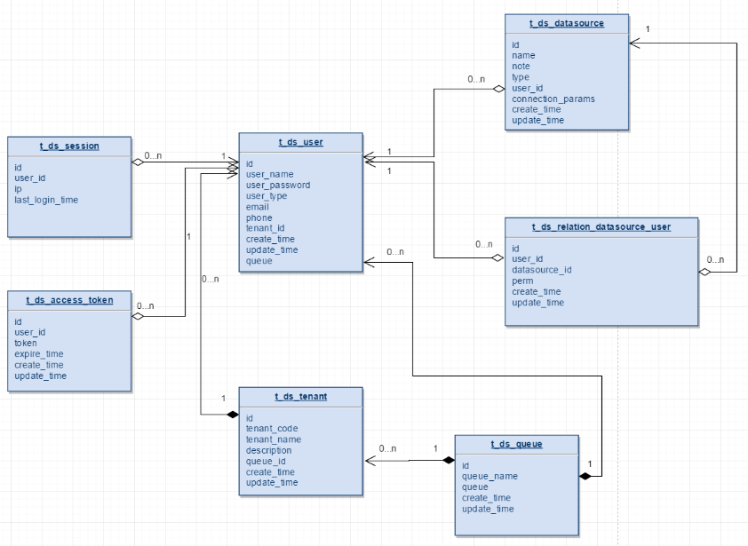
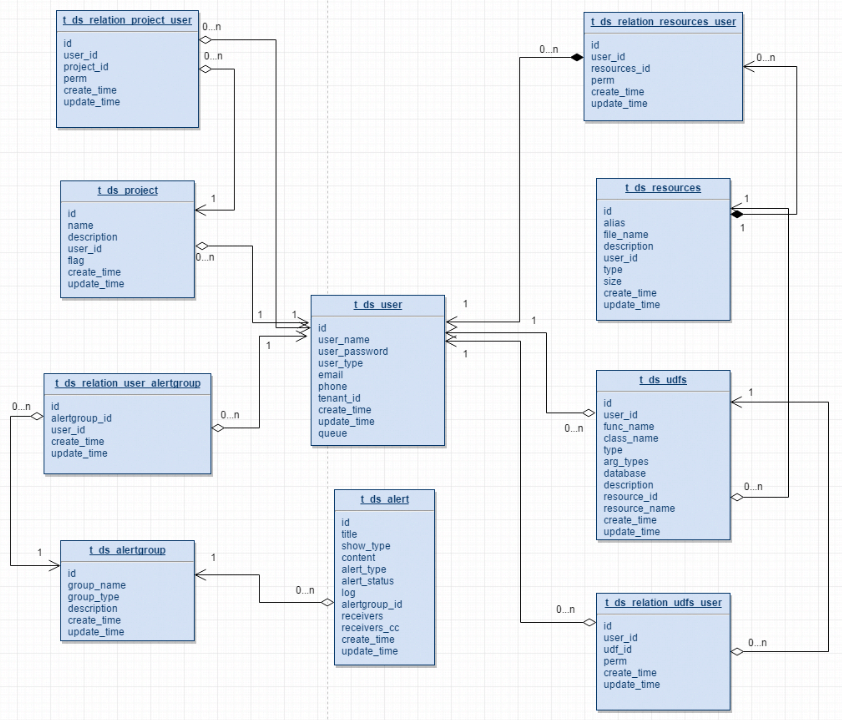
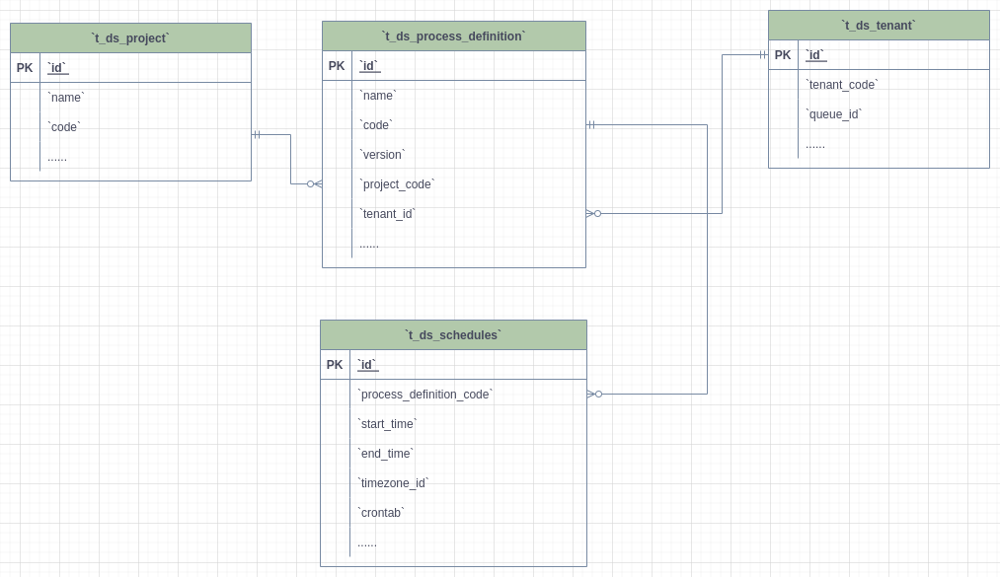
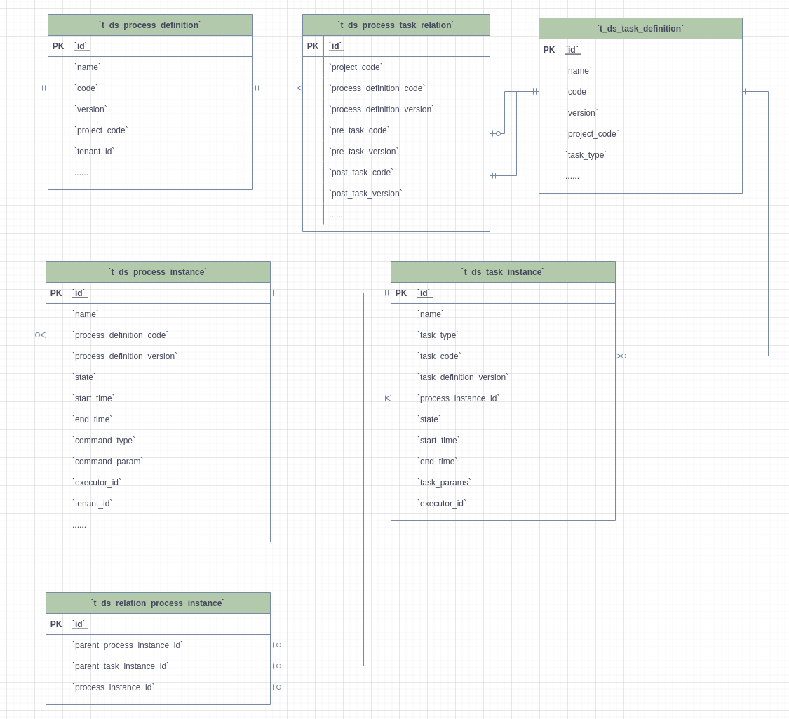

# 메타데이터

## 테이블 스키마

`dolphinscheduler/dolphinscheduler-dao/src/main/resources/sql`에 있는 SQL 파일을 참조하세요.

---

## E-R 다이어그램

### 사용자 대기열 데이터 소스

- 한 테넌트가 여러 사용자를 소유할 수 있습니다.
- `t_ds_user` 테이블의 대기열 필드는 `t_ds_queue` 테이블의 `queue_name` 정보를 저장하고, `t_ds_tenant`는 `queue_id` 열을 사용하여 대기열 정보를 저장합니다.프로세스 정의를 실행하는 동안 사용자 큐의 우선순위가 가장 높습니다.사용자 대기열이 null인 경우 테넌트 대기열을 사용합니다.
- `t_ds_datasource` 테이블의 `user_id` 필드에는 데이터 소스를 생성한 사용자가 표시됩니다.`t_ds_relation_datasource_user`의 user_id는 데이터 소스에 대한 권한이 있는 사용자를 나타냅니다.

### 프로젝트 자원 경고

- 사용자는 여러 프로젝트를 가질 수 있으며, 사용자 프로젝트 인증은 `t_ds_relation_project_user` 테이블의 `project_id` 및 `user_id`를 사용하여 관계 바인딩을 완료합니다.
- `t_ds_projcet` 테이블의 `user_id`는 프로젝트를 생성한 사용자를 나타내고, `t_ds_relation_project_user` 테이블의 `user_id`는 프로젝트에 대한 권한이 있는 사용자를 나타냅니다.

### 프로젝트 - 테넌트 - 프로세스 정의 - 일정

- 프로젝트에는 여러 프로세스 정의가 있을 수 있으며 각 프로세스 정의는 하나의 프로젝트에만 속합니다.
- 테넌트는 여러 프로세스 정의에서 사용될 수 있으며, 각 프로세스 정의는 하나의 테넌트만 선택해야 합니다.
- 워크플로 정의에는 하나 이상의 일정이 있을 수 있습니다.

### 프로세스 정의 실행

- 프로세스 정의는 't_ds_process_task_relation'을 통해 연결되고 관련 키는 'code + version'인 여러 작업 정의에 해당합니다.작업의 사전 작업이 비어 있으면 해당 'pre_task_node' 및 'pre_task_version'은 0입니다.
- 프로세스 정의는 여러 프로세스 인스턴스 `t_ds_process_instance`를 가질 수 있으며, 하나의 프로세스 인스턴스는 하나 이상의 작업 인스턴스 `t_ds_task_instance`에 해당합니다.
- `t_ds_relation_process_instance` 테이블에 저장된 데이터는 프로세스 정의에 하위 프로세스가 포함된 경우를 처리하는 데 사용됩니다.'parent_process_instance_id'는 하위 프로세스를 포함하는 기본 프로세스 인스턴스의 ID를 나타내고, 'process_instance_id'는 하위 프로세스 인스턴스의 ID를 나타내며, 'parent_task_instance_id'는 하위 프로세스 노드의 작업 인스턴스 ID를 나타냅니다.프로세스 인스턴스 테이블과 작업 인스턴스 테이블은 각각 ​​`t_ds_process_instance` 테이블과 `t_ds_task_instance` 테이블에 해당합니다.