## 아키텍처 디자인

일정 시스템의 아키텍처를 설명하기 전에 먼저 일정 시스템의 공통명사에 대해 알아보겠습니다.

### 1.명사해석

**DAG：** 전체 이름 방향성 비순환 그래프(DAG라고 함). 워크플로의 작업은 방향성 비순환 그래프 형태로 조합되며, 후속 노드가 없을 때까지 진입도가 0인 노드에서 토폴로지적으로 통과됩니다.예를 들어 다음 그림은 다음과 같습니다.

<p 정렬="중앙">
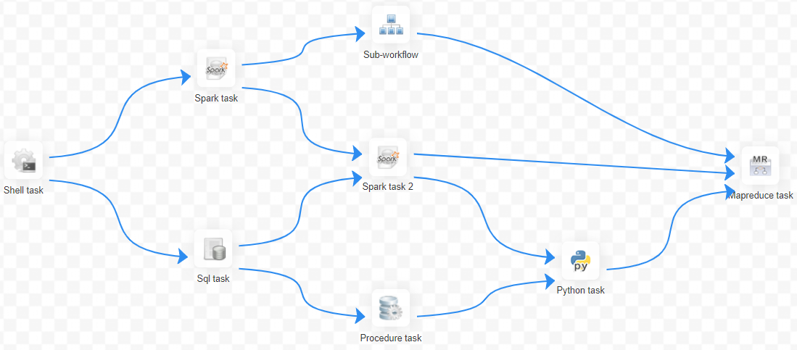
<p 정렬="중앙">
<em>데이트 예</em>
</p>
</p>

**프로세스 정의**: 작업 노드를 드래그하고 작업 노드 연결을 설정하여 시각화 **DAG**

**프로세스 인스턴스**: 프로세스 인스턴스는 수동 시작이나 예약을 통해 생성될 수 있는 프로세스 정의의 인스턴스화입니다.프로세스 정의가 한 번 실행되면 새 프로세스 인스턴스가 생성됩니다.

**작업 인스턴스**: 작업 인스턴스는 프로세스 인스턴스가 실행될 때 특정 작업 노드의 인스턴스화로, 특정 작업 실행 상태를 나타냅니다.

**작업 유형**: 현재 SHELL, SQL, SUB_WORKFLOW, PROCEDURE, MR, SPARK, PYTHON, DEPENDENT(종속성)를 지원하고 동적 플러그인 확장을 지원할 계획입니다. 참고: 하위 **SUB_WORKFLOW**도 별도로 시작할 수 있는 별도의 프로세스 정의입니다.

**일정 모드** : 시스템은 cron 표현식을 기반으로 타이밍 일정과 수동 일정을 지원합니다.명령 유형 지원: 워크플로 시작, 현재 노드에서 실행 시작, 내결함성 워크플로 재개, 프로세스 일시 중지 재개, 실패한 노드에서 실행 시작, 보완, 타이머, 재실행, 일시 중지, 중지, 대기 스레드 재개.여기서 **내결함성 워크플로우를 복구**하고 **대기 스레드를 복원** 두 가지 명령 유형은 스케줄링 내부 제어에 사용되며 외부에서 호출할 수 없습니다.

**Timed Schedule**: 시스템은 **quartz** 분산 스케줄러를 사용하고 cron 표현식 시각화 생성을 지원합니다.

**종속성**: 시스템은 **DAG** 선행 노드와 후속 노드 간의 단순 종속성을 지원할 뿐만 아니라 **작업 종속성** 노드, **프로세스 간 사용자 지정 작업 종속성** 지원도 제공합니다.

**우선순위**: 프로세스 인스턴스 및 태스크 인스턴스의 우선순위를 지원합니다.프로세스 인스턴스와 태스크 인스턴스 우선순위가 설정되지 않은 경우 기본값은 선입선출입니다.

**메일 경고**: **SQL 작업** 쿼리 결과 이메일 보내기, 프로세스 인스턴스 실행 결과 이메일 경고 및 내결함성 경고 알림 지원

**실패 정책**: 병렬로 실행되는 작업의 경우, 실패한 작업이 있는 경우 두 가지 실패 정책 처리 방법을 제공합니다.**계속**은 프로세스 실패가 끝날 때까지 작업 상태가 병렬로 실행됨을 의미합니다.**종료**는 실패한 작업이 발견되면 Kill이 실행 중인 병렬 작업도 삭제하고 프로세스가 종료됨을 의미합니다.

**보완**: 기록 데이터를 보완하고 **간격 병렬 및 직렬** 두 가지 보완 방법을 지원합니다.

### 2.시스템 아키텍처

#### 2.1 시스템 아키텍처 다이어그램

<p 정렬="중앙">
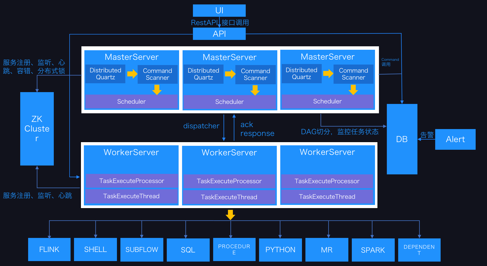
<p 정렬="중앙">
<em>시스템 아키텍처 다이어그램</em>
</p>
</p>

#### 2.2 아키텍처 설명

- **마스터서버**

MasterServer는 분산형 비중앙 설계 개념을 채택합니다.MasterServer는 주로 DAG 작업 분할, 작업 제출 모니터링, 다른 MasterServer 및 WorkerServer의 상태 모니터링을 담당합니다.
MasterServer 서비스가 시작되면 Zookeeper에 임시 노드를 등록하고 내결함성 처리를 위해 Zookeeper 임시 노드 상태 변경을 수신합니다.

##### 서비스에는 주로 다음이 포함됩니다.- **Distributed Quartz** 분산 일정 구성 요소는 주로 예약된 작업의 시작 및 중지 작업을 담당합니다.Quartz가 작업을 선택하면 마스터는 내부적으로 작업의 후속 작업을 담당하는 스레드 풀을 갖습니다.

- **MasterSchedulerThread**는 다양한 **명령 유형**을 기반으로 다양한 비즈니스 작업에 대해 데이터베이스의 **명령** 테이블을 주기적으로 스캔하는 스캔 스레드입니다.

- **MasterExecThread**는 주로 DAG 작업 분할, 작업 제출 모니터링, 다양한 명령 유형의 논리 처리를 담당합니다.

- **MasterTaskExecThread**는 주로 작업 지속성을 담당합니다.

- **작업자 서버**

- WorkerServer도 분산형, 비중앙형 설계 개념을 채택합니다.WorkerServer는 주로 작업 실행과 로그 서비스 제공을 담당합니다.WorkerServer 서비스가 시작되면 Zookeeper에 임시 노드를 등록하고 하트비트를 유지합니다.

##### 이 서비스에는 다음이 포함됩니다.

- **FetchTaskThread**는 주로 **Task Queue**에서 지속적으로 작업을 수신하고 다양한 작업 유형에 따라 해당 실행기를 호출하는 **TaskScheduleThread**를 담당합니다.
- **동물원 사육사**

ZooKeeper 서비스, 시스템의 MasterServer 및 WorkerServer 노드는 모두 클러스터 관리 및 내결함성을 위해 ZooKeeper를 사용합니다.또한 ZooKeeper를 기반으로 이벤트 모니터링 및 분산 잠금도 수행합니다.
Redis를 기반으로 하는 대기열도 구현했지만 DolphinScheduler가 가능한 한 적은 구성 요소에 의존하기를 바라며 결국 Redis 구현을 제거했습니다.

- **작업 대기열**

작업 대기열 작업이 제공됩니다.현재 큐는 Zookeeper 기반으로도 구현되어 있습니다.대기열에 저장된 정보가 적기 때문에 대기열에 너무 많은 데이터가 있다고 걱정할 필요가 없습니다.실제로 우리는 시스템 안정성과 성능에 아무런 영향을 미치지 않는 백만 수준의 데이터 스토리지 대기열을 과도하게 측정했습니다.

- **경고**

알람 관련 인터페이스를 제공합니다.인터페이스에는 주로 **알람**이 포함됩니다.두 가지 유형의 알람 데이터에 대한 저장, 조회, 알림 기능입니다.알림 기능에는 **메일 알림**과 **SNMP(아직 구현되지 않음)**의 두 가지 유형이 있습니다.

- **API**

API 인터페이스 계층은 주로 프런트 엔드 UI 계층의 요청을 처리하는 역할을 합니다.이 서비스는 외부에서 요청 서비스를 제공하기 위해 RESTful API를 제공합니다.
인터페이스에는 워크플로 생성, 정의, 쿼리, 수정, 릴리스, 오프라인, 수동 시작, 중지, 일시 중지, 재개, 이 노드에서 실행 시작 등이 포함됩니다.

- **UI**

시스템의 프런트 엔드 페이지는 시스템의 다양한 시각적 작업 인터페이스를 제공합니다.자세한 내용은 [빠른 시작](https://dolphinscheduler.apache.org/en-us/docs/3.1.2/about/introduction) 섹션을 참조하세요.

#### 2.3 건축 디자인 아이디어

##### I. 탈중앙화 vs 중앙화

###### 중앙화 사상

중앙 집중식 디자인 개념은 비교적 간단합니다.분산 클러스터의 노드는 해당 역할에 따라 두 가지 역할로 나뉩니다.

<p 정렬="중앙">

</p>

- Master의 역할은 주로 작업 분배와 Slave의 건강 상태를 감독하는 역할을 담당합니다.슬레이브 노드가 "사용 중"이거나 "무료" 상태가 되지 않도록 슬레이브에 대한 작업 균형을 동적으로 조정할 수 있습니다.
- Worker의 역할은 주로 Task의 실행을 담당하며, Master가 Slave에게 Task를 할당할 수 있도록 Master와의 하트비트를 유지하는 역할을 합니다.

중앙 집중식 설계의 문제점:- 마스터에 문제가 발생하면 그룹에는 리더가 없으며 전체 클러스터가 충돌합니다.이 문제를 해결하기 위해 대부분의 마스터/슬레이브 아키텍처 모드는 핫 대기 또는 콜드 대기, 자동 전환 또는 수동 전환이 가능한 마스터 및 백업 마스터의 설계 방식을 채택하며 점점 더 많은 새로운 시스템을 사용할 수 있습니다.시스템 가용성을 향상시키기 위해 마스터를 전환하는 기능을 자동으로 선택합니다.
- 또 다른 문제는 스케줄러가 마스터에 있는 경우 다른 시스템에서 실행되는 하나의 DAG에서 다른 작업을 지원할 수 있지만 마스터의 과부하가 발생한다는 것입니다.스케줄러가 슬레이브에 있는 경우 DAG의 모든 작업은 하나의 시스템에만 제출될 수 있습니다.병렬 작업이 더 많으면 슬레이브에 가해지는 압력이 더 커질 수 있습니다.

###### 탈중앙화

<p 정렬="가운데"

</p>

- 분산형 설계에는 일반적으로 마스터/슬레이브 개념이 없으며 모든 역할이 동일하고 상태가 동일하며 글로벌 인터넷은 전형적인 분산형 분산 시스템이며 네트워크로 연결된 임의 노드 장비는 모두 작은 범위의 기능에만 영향을 미칩니다.
- 분산형 설계의 핵심 설계는 전체 분산 시스템에서 다른 노드와 다른 "관리자"가 없어 단일 장애 지점 문제가 없다는 것입니다.그러나 "관리자" 노드가 없기 때문에 각 노드는 필요한 기계 정보를 얻기 위해 다른 노드와 통신해야 하며, 신뢰할 수 없는 분산 시스템 통신 회선은 위 기능을 구현하는 데 어려움을 크게 증가시킵니다.
- 실제로 진정한 분산형 분산 시스템은 드뭅니다.대신, 역동적인 중앙 집중식 분산 시스템이 지속적으로 등장하고 있습니다.이 아키텍처에서 클러스터의 관리자는 사전 설정이 아닌 동적으로 선택되며, 클러스터에 장애가 발생하면 클러스터의 노드는 새로운 "관리자"를 선출하기 위해 자발적으로 "회의"를 개최합니다.가서 그 일을 감리하십시오.가장 일반적인 경우는 ZooKeeper와 Go에서 구현된 Etcd입니다.
- DolphinScheduler의 탈중앙화는 Master/Worker를 ZooKeeper에 등록하는 것입니다.마스터 클러스터와 작업자 클러스터는 중앙에 위치하지 않으며 Zookeeper 분산 잠금을 사용하여 마스터 또는 작업자 한 명을 작업을 수행할 "관리자"로 선출합니다.

##### 2、분산 잠금 실습

DolphinScheduler는 ZooKeeper 분산 잠금을 사용하여 동시에 스케줄러를 실행하는 마스터를 하나만 구현하거나 작업 제출을 수행하는 작업자를 하나만 구현합니다.

1. 분산 잠금을 획득하기 위한 핵심 프로세스 알고리즘은 다음과 같습니다.

<p 정렬="중앙">
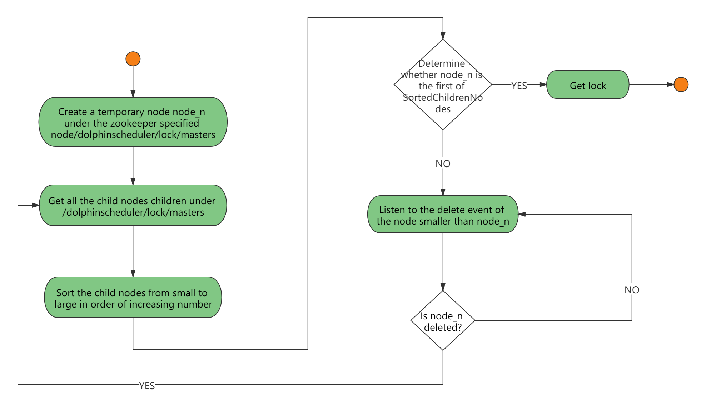
</p>

2. DolphinScheduler의 스케줄러 스레드 분산 잠금 구현 흐름 차트:

<p 정렬="중앙">
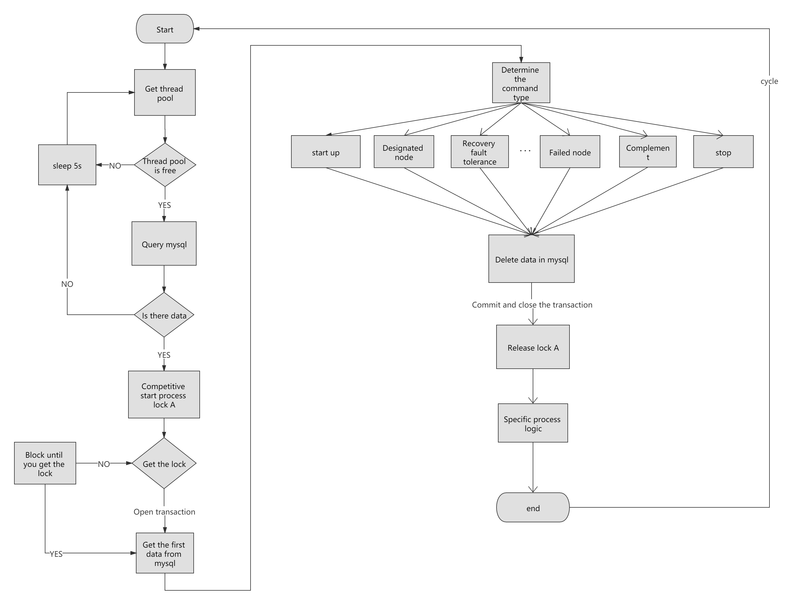
</p>

##### 셋째, 스레드가 부족하여 루프 대기 문제가 발생합니다.

- DAG에 하위 프로세스가 없는 경우 Command의 데이터 수가 스레드 풀에서 설정한 임계값보다 크면 직접 프로세스가 기다리거나 실패합니다.
- 대규모 DAG에 다수의 하위 프로세스가 중첩된 경우 다음 그림은 "죽은" 상태가 됩니다.

<p 정렬="중앙">
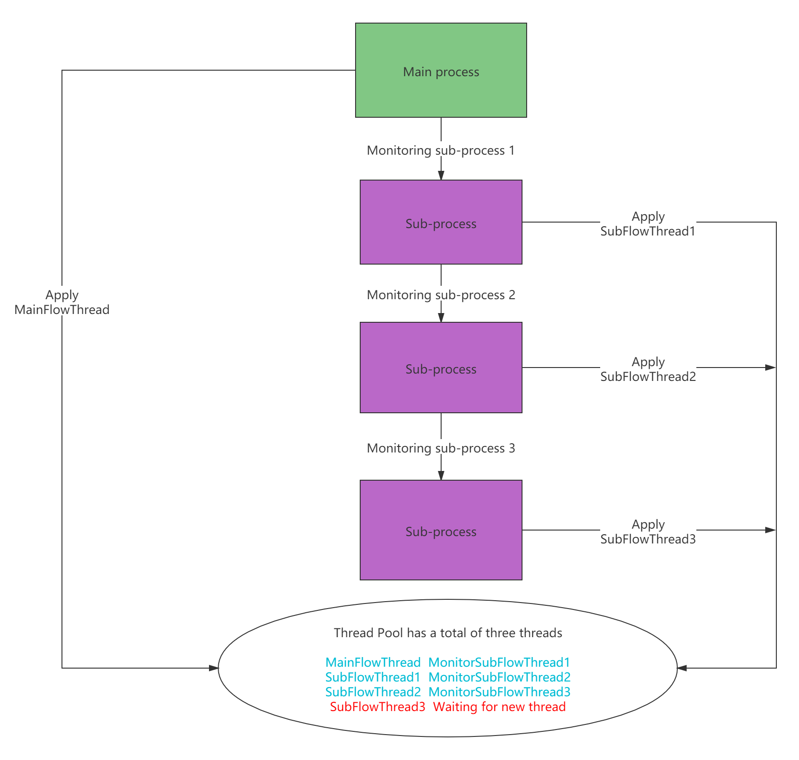
</p>위 그림에서 MainFlowThread는 SubFlowThread1이 끝나기를 기다리고, SubFlowThread1은 SubFlowThread2가 끝나기를 기다리고, SubFlowThread2는 SubFlowThread3이 끝나기를 기다리고, SubFlowThread3은 스레드 풀에서 새로운 스레드를 기다리게 되며, 그러면 전체 DAG 프로세스가 종료될 수 없으므로 스레드가 해제될 수 없습니다.이는 하위 상위 프로세스 루프 대기 상태를 형성합니다.이 시점에서 이러한 "고착"을 해결하기 위해 스레드를 추가하기 위해 새 마스터가 시작되지 않는 한 예약 클러스터는 더 이상 사용할 수 없습니다.

교착상태를 해결하기 위해 새로운 마스터를 시작하는 것은 다소 불만족스러워 보이므로 이러한 위험을 줄이기 위해 다음 세 가지 옵션을 제안했습니다.

1. 모든 마스터의 스레드 수를 합산한 후 각 DAG에 필요한 스레드 수를 계산합니다. 즉, DAG 프로세스가 실행되기 전에 미리 계산합니다.다중 마스터 스레드 풀이기 때문에 전체 스레드 수를 실시간으로 얻을 가능성은 거의 없습니다.
2. 단일 마스터 스레드 풀을 판단합니다.스레드 풀이 가득 차면 스레드가 직접 실패하도록 하십시오.
3. 리소스가 부족한 명령 유형을 추가합니다.스레드 풀이 부족하면 기본 프로세스가 일시 중지됩니다.이렇게 하면 스레드 풀에 새로운 스레드가 생겨서 리소스가 부족한 프로세스를 중단했다가 다시 깨울 수 있습니다.

참고: 마스터 스케줄러 스레드는 명령을 받을 때 FIFO를 사용할 수 있습니다.

그래서 우리는 스레드 부족 문제를 해결하기 위해 세 번째 방법을 선택했습니다.

##### IV.내결함성 설계

내결함성은 서비스 내결함성과 작업 재시도로 구분됩니다.서비스 결함 허용은 마스터 결함 허용과 작업자 결함 허용의 두 가지 유형으로 나뉩니다.

###### 1. 다운타임 내결함성

서비스 내결함성 설계는 ZooKeeper의 Watcher 메커니즘에 의존합니다.구현 원칙은 다음과 같습니다.

<p 정렬="중앙">
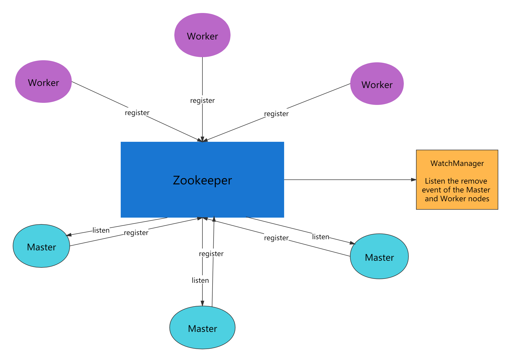
</p>

마스터는 다른 마스터와 작업자의 디렉터리를 모니터링합니다.제거 이벤트가 감지되면 특정 비즈니스 로직에 따라 프로세스 인스턴스가 내결함성이 있거나 작업 인스턴스가 내결함성이 있는 것입니다.

- 마스터 내결함성 흐름도:

<p 정렬="중앙">
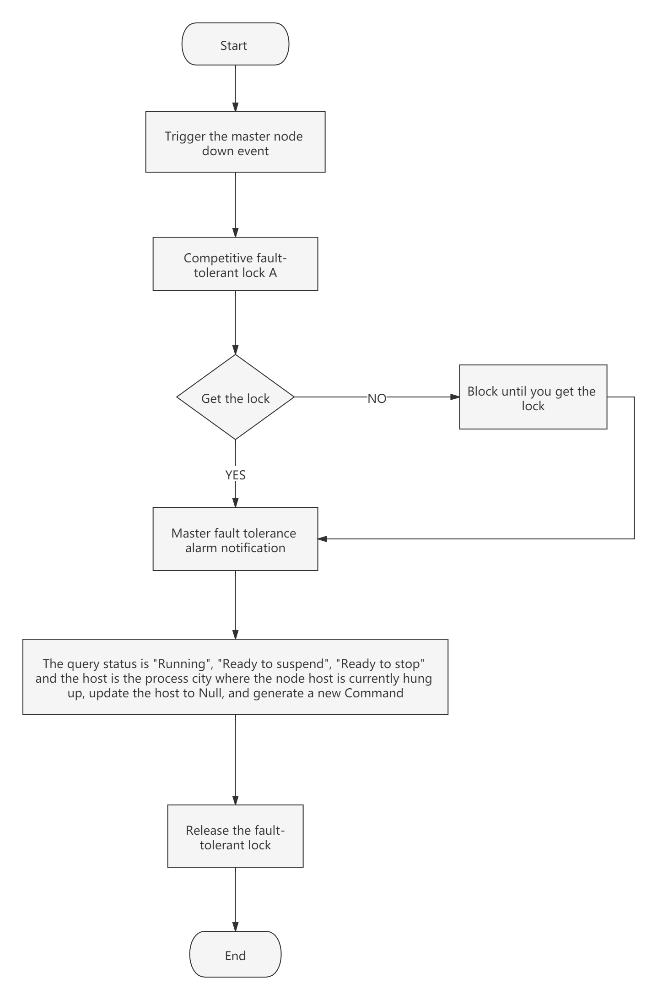
</p>

ZooKeeper 마스터가 내결함성을 갖춘 후에는 DolphinScheduler의 Scheduler 스레드에 의해 다시 예약됩니다.DAG를 탐색하여 "실행 중" 및 "제출 성공" 작업을 찾고 "실행 중" 작업에 대한 작업 인스턴스 상태를 모니터링합니다.작업 대기열이 이미 존재하는지 확인해야 합니다.존재하는 경우 태스크 인스턴스의 상태를 모니터링하십시오.존재하지 않는 경우 태스크 인스턴스를 다시 제출하십시오.

- 작업자 내결함성 흐름도:

<p 정렬="중앙">
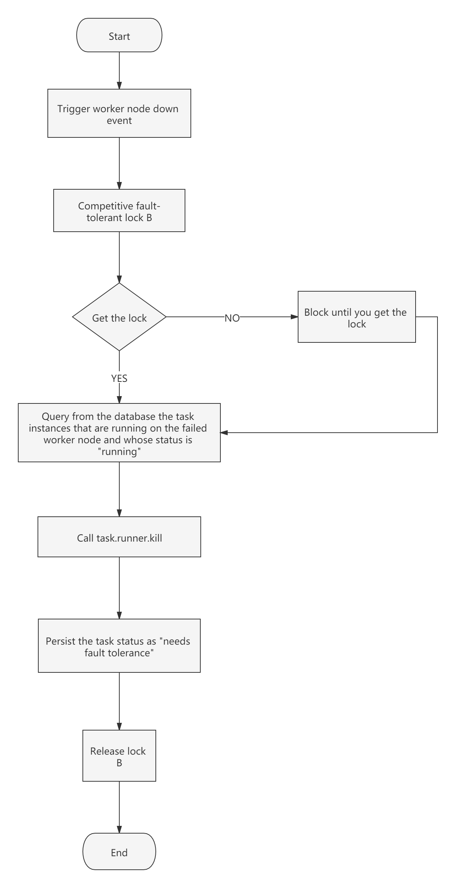
</p>

마스터 스케줄러 스레드가 작업 인스턴스를 "내결함성 필요"로 찾으면 작업을 인계받아 다시 제출합니다.

참고: "네트워크 지터"로 인해 노드가 짧은 시간 내에 ZooKeeper의 하트비트를 잃을 수 있으므로 해당 노드의 제거 이벤트가 발생합니다.이 경우 가장 쉬운 방법을 사용합니다. 즉, 노드가 ZooKeeper와의 연결 시간 초과가 발생하면 마스터 또는 작업자 서비스를 직접 중지합니다.

###### 2. 작업 실패 재시도

여기서는 먼저 작업 실패 재시도, 프로세스 실패 복구, 프로세스 실패 재실행의 개념을 구별해야 합니다.- 작업 실패 재시도는 작업 수준으로, 스케줄링 시스템에 의해 자동으로 수행됩니다.예를 들어, 셸 작업이 재시도 횟수를 3번으로 설정하면 셸 작업은 실행 실패 후 최대 3번 실행을 시도합니다.
- 프로세스 오류 복구는 프로세스 수준이며 수동으로 수행됩니다. 복구는 **실패한 노드** 또는 **현재 노드**에서만 수행할 수 있습니다.
- 프로세스 실패 재실행도 프로세스 수준이며 수동으로 수행되며 재실행은 시작 노드에서 수행됩니다.

다음으로 주제에 대해 이야기해 보겠습니다. 워크플로의 작업 노드를 두 가지 유형으로 나누었습니다.

- 하나는 비즈니스 노드로, Shell 노드, MR 노드, Spark 노드, 종속 노드 등 실제 스크립트나 처리문에 해당합니다.
- 실제 스크립트나 명령문 처리를 수행하지 않고 하위 흐름 섹션과 같은 전체 프로세스 흐름에 대한 논리적 처리를 수행하는 논리 노드도 있습니다.

각 **서비스 노드**는 실패한 재시도 횟수를 구성할 수 있습니다.작업 노드가 실패하면 성공하거나 구성된 재시도 횟수를 초과할 때까지 자동으로 재시도합니다.**논리 노드**는 실패한 재시도를 지원하지 않습니다.그러나 논리 노드의 작업은 재시도를 지원합니다.

최대 재시도 횟수에 도달한 워크플로에 작업 오류가 있는 경우 워크플로는 중지되지 않으며 실패한 워크플로를 수동으로 다시 실행하거나 프로세스를 재개할 수 있습니다.

##### V. 작업 우선순위 설계

초기 스케줄링 설계에서 우선순위 설계와 공정한 스케줄링 설계가 없으면 먼저 제출된 작업이 나중에 제출된 작업과 동시에 완료될 수 있지만 프로세스나 작업의 우선순위를 설정할 수 없는 상황에 직면하게 됩니다.우리는 이것을 다시 디자인했으며 현재 다음과 같이 디자인하고 있습니다.

- **다른 프로세스 인스턴스 우선순위**에 따라 **동일 프로세스 인스턴스 우선순위** 우선순위 **동일 프로세스 내의 작업 우선순위**가 **동일 프로세스**보다 우선합니다. 커밋 순서가 높음에서 낮음으로 작업 처리를 위해 이동합니다.
- 구체적인 구현은 태스크 인스턴스의 json에 따라 우선순위를 결정한 후 **프로세스 인스턴스 우선순위_프로세스 인스턴스 id_태스크 우선순위_태스크 ID** 정보를 ZooKeeper 태스크 큐에 저장하고, 태스크 큐에서 얻은 경우 문자열 비교를 통해 먼저 실행해야 할 태스크를 얻을 수 있습니다.
- 프로세스 정의의 우선순위는 일부 프로세스가 다른 프로세스보다 먼저 처리되어야 한다는 것입니다.이는 프로세스 시작 시 또는 예약된 시작 시 구성될 수 있습니다.5가지 레벨이 있으며 그 다음에는 HIGHEST, HIGH, MEDIUM, LOW, LOWEST가 있습니다.아래와 같이

<p 정렬="중앙">
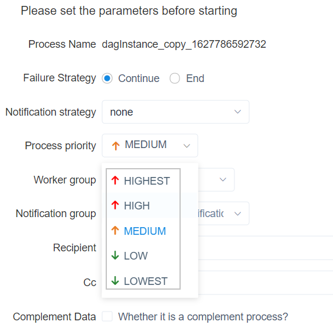
</p>

- 작업의 우선순위도 HIGHEST, HIGH, MEDIUM, LOW, LOWEST의 5단계로 구분됩니다.아래와 같이

<p align="center">`
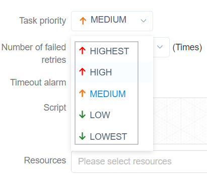
</p>

##### Ⅵ.Logback 및 gRPC는 로그 액세스를 구현합니다.

- 웹(UI)과 워커가 반드시 같은 머신에 있을 필요는 없기 때문에 로그를 보는 것은 로컬 파일을 쿼리하는 것과는 다릅니다.두 가지 옵션이 있습니다:
- ES 검색엔진에 로그를 올려보세요.
- gRPC 통신을 통해 원격 로그 정보 획득
- DolphinScheduler의 경량성을 최대한 고려하여 원격 접속 로그 정보를 구현하기 위해 gRPC를 선택했습니다.

<p 정렬="중앙">
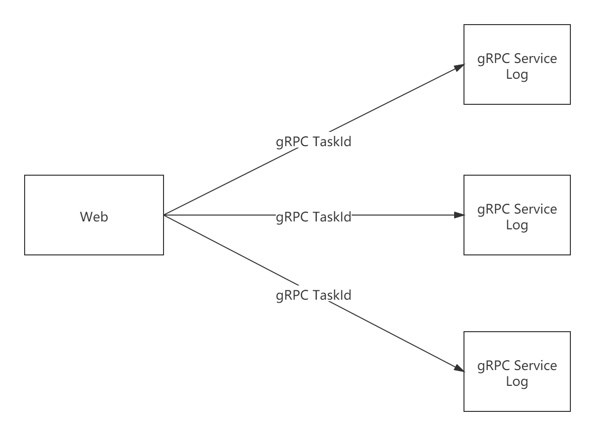
</p>

- 사용자 정의 Logback FileAppender 및 필터 기능을 사용하여 각 작업 인스턴스에 대한 로그 파일을 생성합니다.
- FileAppender의 주요 구현은 다음과 같습니다.```java
 /**
  * task log appender
  */
 Public class TaskLogAppender extends FileAppender<ILoggingEvent> {

     ...

    @Override
    Protected void append(ILoggingEvent event) {

        If (currentlyActiveFile == null){
            currentlyActiveFile = getFile();
        }
        String activeFile = currentlyActiveFile;
        // thread name: taskThreadName-processDefineId_processInstanceId_taskInstanceId
        String threadName = event.getThreadName();
        String[] threadNameArr = threadName.split("-");
        // logId = processDefineId_processInstanceId_taskInstanceId
        String logId = threadNameArr[1];
        ...
        super.subAppend(event);
    }
}
````

/프로세스 정의 id/프로세스 인스턴스 id/작업 인스턴스 id.log 형식으로 로그를 생성합니다.

- 필터는 TaskLogInfo로 시작하는 스레드 이름과 일치합니다.
- TaskLogFilter는 다음과 같이 구현됩니다.```java
 /**
 * task log filter
 */
Public class TaskLogFilter extends Filter<ILoggingEvent> {

    @Override
    Public FilterReply decide(ILoggingEvent event) {
        If (event.getThreadName().startsWith("TaskLogInfo-")){
            Return FilterReply.ACCEPT;
        }
        Return FilterReply.DENY;
    }
}
````

### 요약

본 논문에서는 스케줄링부터 시작하여 빅데이터 분산 워크플로우 스케줄링 시스템인 DolphinScheduler의 아키텍처 원리와 구현 아이디어를 소개합니다.계속됩니다