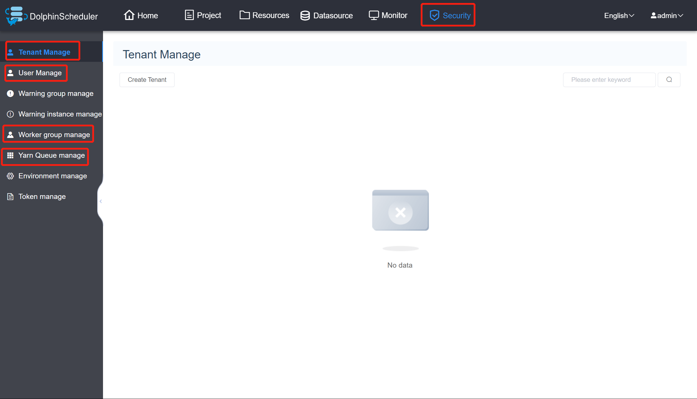
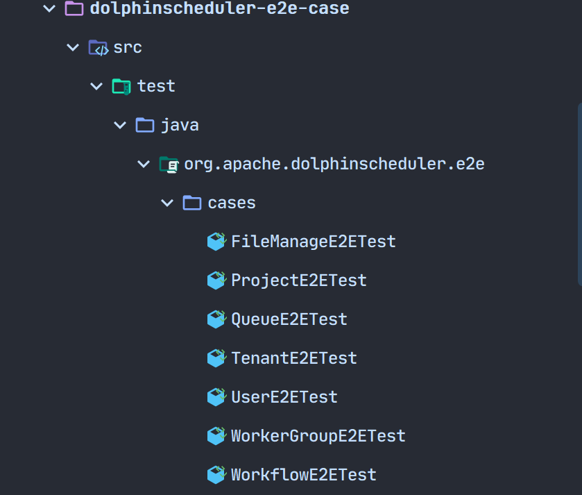
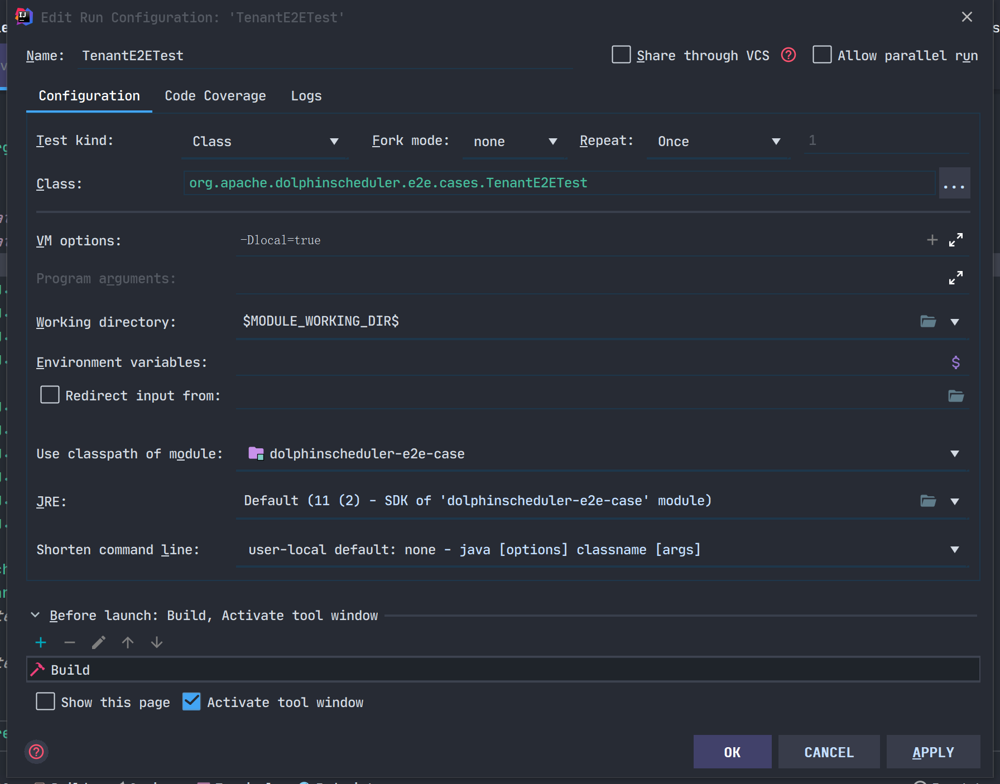
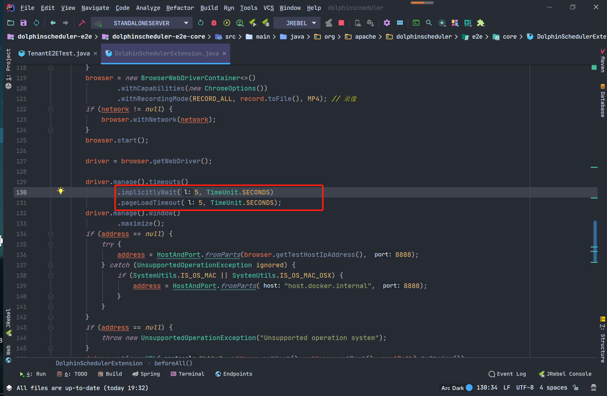
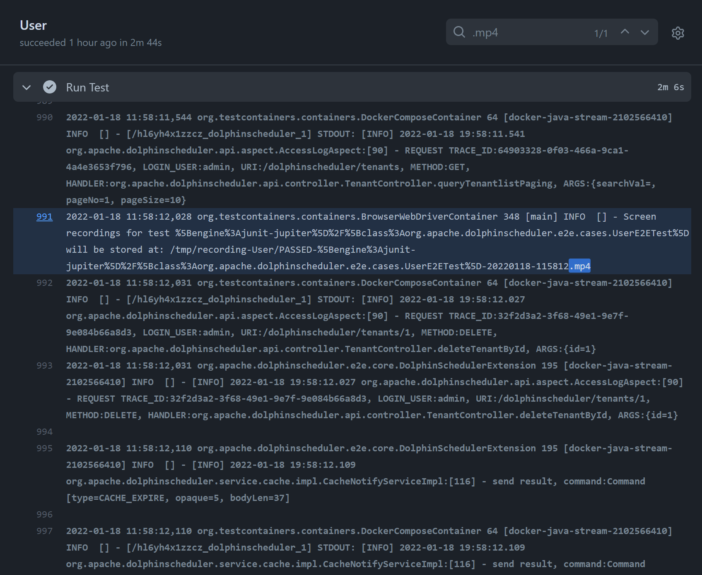

# DolphinScheduler E2E 자동화 테스트

## I. 준비 지식

### 1. E2E 테스트와 단위 테스트의 차이점

"End to End"를 의미하는 E2E는 "end-to-end" 테스트로 번역될 수 있습니다.특정 진입점부터 시작하여 특정 작업이 완료될 때까지 점진적으로 작업을 수행하는 사용자를 모방합니다.그리고 단위 테스트는 다릅니다. 후자는 일반적으로 매개 변수, 유형 및 매개 변수 값, 인수 수, 반환 값, 오류 발생 등을 테스트해야 하며, 목적은 작업을 완료하는 특정 기능이 모든 경우에 안정적이고 신뢰할 수 있는지 확인하는 것입니다.단위 테스트에서는 모든 기능이 올바르게 작동하면 전체 제품도 작동할 것이라고 가정합니다.

이와 대조적으로 E2E 테스트는 모든 사용 시나리오를 포괄해야 한다는 필요성을 그다지 강조하지 않고 전체 작업 체인이 완료될 수 있는지 여부에 중점을 둡니다.웹 프런트엔드의 경우 인터페이스 레이아웃과 콘텐츠 정보가 기대에 부응하는지 여부도 고려됩니다.

예를 들어, 로그인 페이지의 E2E 테스트는 사용자가 정상적으로 접속하여 로그인할 수 있는지, 로그인에 실패할 경우 오류 메시지가 제대로 출력되는지에 대한 테스트이다.합법적이지 않은 입력이 처리되는지 여부는 큰 문제가 되지 않습니다.

### 2. 셀레늄 테스트 프레임워크

[Selenium](https://www.selenium.dev)은 웹 브라우저에서 자동화된 테스트를 실행하기 위한 오픈 소스 테스트 도구입니다.프레임워크는 WebDriver를 사용하여 브라우저의 기본 구성 요소를 통해 웹 서비스 명령을 브라우저 기본 호출로 변환하여 작업을 완료합니다.간단히 말해서 브라우저를 시뮬레이트하고 페이지 요소에 대한 선택 작업을 수행합니다.

WebDriver는 웹 브라우저의 동작을 제어하기 위해 언어 중립적인 인터페이스를 정의하는 API 및 프로토콜입니다.모든 브라우저에는 드라이버라고 하는 특정 WebDriver 구현이 있습니다.드라이버는 브라우저에 위임하고 Selenium 및 브라우저와의 통신을 처리하는 구성 요소입니다.

Selenium 프레임워크는 다양한 브라우저 백엔드와의 투명한 작업을 허용하는 사용자 지향 인터페이스를 통해 이러한 모든 구성 요소를 함께 연결하여 브라우저 간 및 플랫폼 간 자동화를 가능하게 합니다.

## Ⅱ.E2E 테스트

### 1. E2E-페이지

DolphinScheduler의 E2E 테스트는 docker-compose를 사용하여 배포됩니다.현재 테스트는 독립형 모드로 주로 "추가, 삭제, 변경 및 확인"과 같은 일부 기본 기능을 확인하는 데 사용됩니다.서비스 간 협업이나 서비스 간 통신 메커니즘 등 추가 클러스터 검증을 위해서는 'deploy/docker/docker-compose.yml' 구성을 참조하세요.

E2E 테스트(프론트엔드 부분)에서는 [페이지 모델](https://www.selenium.dev/documentation/guidelines/page_object_models/) 양식을 사용하며, 주로 각 페이지에 해당하는 모델을 생성합니다.다음은 로그인 페이지의 예입니다.```java
package org.apache.dolphinscheduler.e2e.pages;

import org.apache.dolphinscheduler.e2e.pages.common.NavBarPage;
import org.apache.dolphinscheduler.e2e.pages.security.TenantPage;

import org.openqa.selenium.WebElement;
import org.openqa.selenium.remote.RemoteWebDriver;
import org.openqa.selenium.support.FindBy;
import org.openqa.selenium.support.ui.ExpectedConditions;
import org.openqa.selenium.support.ui.WebDriverWait;

import lombok.Getter;
import lombok.SneakyThrows;

@Getter
public final class LoginPage extends NavBarPage {
    @FindBy(id = "inputUsername")
    private WebElement inputUsername;

    @FindBy(id = "inputPassword")
    private WebElement inputPassword;

    @FindBy(id = "btnLogin")
    private WebElement buttonLogin;

    public LoginPage(RemoteWebDriver driver) {
        super(driver);
    }

    @SneakyThrows
    public TenantPage login(String username, String password) {
        inputUsername().sendKeys(username);
        inputPassword().sendKeys(password);
        buttonLogin().click();

        new WebDriverWait(driver, 10)
            .until(ExpectedConditions.urlContains("/#/security"));

        return new TenantPage(driver);
    }
}
````

테스트 과정에서는 페이지의 모든 요소가 아닌 집중해야 할 요소만 테스트합니다.따라서 로그인 페이지에는 사용자 이름, 비밀번호 및 로그인 버튼 요소만 선언됩니다.FindBy 인터페이스는 Vue 파일에서 해당 ID 또는 클래스를 찾기 위해 Selenium 테스트 프레임워크에서 제공됩니다.

또한 테스트 과정에서는 요소를 직접 조작하지 않습니다.일반적인 선택은 재사용 효과를 얻기 위해 해당 방법을 패키지하는 것입니다.예를 들어 로그인하려는 경우 `public TenantPage login()` 메서드를 통해 사용자 이름과 비밀번호를 입력하여 전달하는 요소를 조작하여 로그인 효과를 얻습니다. 즉, 사용자가 로그인을 마치면 보안 센터(기본적으로 테넌트 관리 페이지로 이동)로 이동합니다.

SecurityPage는 주로 TenantPage, UserPage, WorkerGroupPage 및 QueuePage를 포함하여 해당 사이드바 점프를 테스트하는 goToTab 메서드를 제공합니다.이러한 페이지는 동일한 방식으로 구현되며 주로 양식의 입력, 추가 및 삭제 버튼이 해당 페이지로 돌아갈 수 있는지 테스트합니다.```java
public <T extends SecurityPage.Tab> T goToTab(Class<T> tab) {
       if (tab == TenantPage.class) {
           WebElement menuTenantManageElement = new WebDriverWait(driver, 60)
                   .until(ExpectedConditions.elementToBeClickable(menuTenantManage));
           ((JavascriptExecutor)driver).executeScript("arguments[0].click();", menuTenantManageElement);
           return tab.cast(new TenantPage(driver));
       }
       if (tab == UserPage.class) {
           WebElement menUserManageElement = new WebDriverWait(driver, 60)
                   .until(ExpectedConditions.elementToBeClickable(menUserManage));
           ((JavascriptExecutor)driver).executeScript("arguments[0].click();", menUserManageElement);
           return tab.cast(new UserPage(driver));
       }
       if (tab == WorkerGroupPage.class) {
           WebElement menWorkerGroupManageElement = new WebDriverWait(driver, 60)
                   .until(ExpectedConditions.elementToBeClickable(menWorkerGroupManage));
           ((JavascriptExecutor)driver).executeScript("arguments[0].click();", menWorkerGroupManageElement);
           return tab.cast(new WorkerGroupPage(driver));
       }
       if (tab == QueuePage.class) {
           menuQueueManage().click();
           return tab.cast(new QueuePage(driver));
       }
       throw new UnsupportedOperationException("Unknown tab: " + tab.getName());
   }
````



탐색 모음 옵션 점프를 위해 `org/apache/dolphinscheduler/e2e/pages/common/NavBarPage.java`에 goToNav 메소드가 제공됩니다.현재 지원되는 페이지는 ProjectPage, SecurityPage 및 ResourcePage입니다.```java
    public <T extends NavBarItem> T goToNav(Class<T> nav) {
        if (nav == ProjectPage.class) {
            WebElement projectTabElement = new WebDriverWait(driver, 60)
                .until(ExpectedConditions.elementToBeClickable(projectTab));
            ((JavascriptExecutor)driver).executeScript("arguments[0].click();", projectTabElement);
            return nav.cast(new ProjectPage(driver));
        }

        if (nav == SecurityPage.class) {
            WebElement securityTabElement = new WebDriverWait(driver, 60)
                .until(ExpectedConditions.elementToBeClickable(securityTab));
            ((JavascriptExecutor)driver).executeScript("arguments[0].click();", securityTabElement);
            return nav.cast(new SecurityPage(driver));
        }

        if (nav == ResourcePage.class) {
            WebElement resourceTabElement = new WebDriverWait(driver, 60)
                .until(ExpectedConditions.elementToBeClickable(resourceTab));
            ((JavascriptExecutor)driver).executeScript("arguments[0].click();", resourceTabElement);
            return nav.cast(new ResourcePage(driver));
        }

        throw new UnsupportedOperationException("Unknown nav bar");
    }
````

### E2E-사례

현재 지원되는 E2E 테스트 사례에는 파일 관리, 프로젝트 관리, 대기열 관리, 테넌트 관리, 사용자 관리, 작업자 그룹 관리 및 워크플로 테스트가 포함됩니다.



다음은 테넌트 관리 테스트의 예입니다.앞서 설명했듯이 배포를 위해 docker-compose를 사용하므로 각 테스트 케이스마다 해당 파일을 주석 형식으로 가져와야 합니다.

브라우저는 Selenium과 함께 제공되는 RemoteWebDriver를 사용하여 로드됩니다.각 테스트 케이스가 시작되기 전에 수행해야 할 몇 가지 준비 작업이 있습니다.예: 사용자 로그인, 해당 페이지로 이동(특정 테스트 사례에 따라 다름).```java
@BeforeAll
public static void setup() {
    new LoginPage(browser)
            .login("admin", "dolphinscheduler123") 
            .goToNav(SecurityPage.class) 
            .goToTab(TenantPage.class)
    ;
}
````

준비가 완료되면 공식적인 테스트 케이스 작성을 위한 시간입니다.테스트 순서를 확인하기 위해 모듈화를 위해 @Order() 주석 형식을 사용합니다.테스트가 실행된 후 어설션을 사용하여 테스트가 성공했는지 확인하고, 어설션이 true를 반환하면 테넌트 생성이 성공한 것입니다.다음 코드를 참조로 사용할 수 있습니다.```java
    @Test
    @Order(10)
    void testCreateTenant() {
        final TenantPage page = new TenantPage(browser);
        page.create(tenant);

        await().untilAsserted(() -> assertThat(page.tenantList())
                .as("Tenant list should contain newly-created tenant")
                .extracting(WebElement::getText)
                .anyMatch(it -> it.contains(tenant)));
    }
````

나머지도 비슷한 경우이며, 구체적인 소스코드를 참고하면 이해가 가능하다.

https://github.com/apache/dolphinscheduler/tree/dev/dolphinscheduler-e2e/dolphinscheduler-e2e-case/src/test/java/org/apache/dolphinscheduler/e2e/cases

## III.보충제

E2E 테스트를 로컬에서 실행하는 경우 먼저 로컬 서비스를 시작해야 합니다. 다음 페이지를 참조하세요.
[개발-환경-설정](./development-environment-setup.md)

E2E 테스트를 로컬로 실행하는 경우 `-Dlocal=true` 매개변수를 구성하여 로컬로 연결하고 UI 변경을 용이하게 할 수 있습니다.

'M1' 칩으로 E2E 테스트를 실행할 때 '-Dm1_chip=true' 매개변수를 사용하여 지원되는 컨테이너를 구성할 수 있습니다.
'ARM64'.



로컬 실행 중에 연결 시간 초과가 발생하면 로드 시간을 권장되는 30 이상으로 늘립니다.



테스트 실행은 MP4 파일로 제공됩니다.

