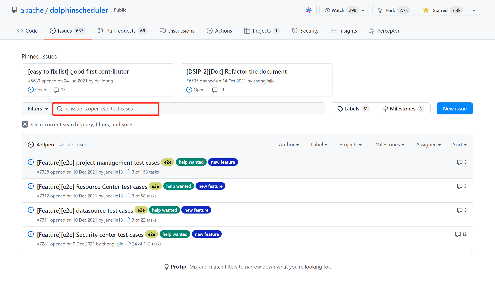
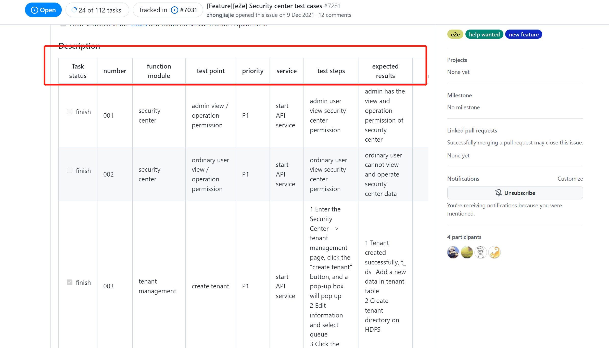

# DolphinScheduler E2E 테스트 기여 가이드

E2E 테스트의 주요 목적은 실제 사용자 시나리오를 시뮬레이션하여 시스템과 해당 구성 요소의 통합 및 데이터 무결성을 확인하는 것입니다.이를 통해 테스트 범위를 확장하고 시스템의 상태와 안정성을 보장할 수 있습니다.테스트 작업량과 비용이 어느 정도 감소합니다.간단히 말해서, E2E 테스트는 프로그램을 블랙박스로 취급하고 사용자 관점에서 실제 시스템의 액세스 동작을 시뮬레이션하여 테스트에 대한 입력(사용자 행동/시뮬레이션된 데이터)이 예상한 결과를 제공하는지 확인하는 것입니다.따라서 커뮤니티는 DolphinScheduler에 E2E 자동화 테스트를 추가하기로 결정했습니다.

현재 커뮤니티 E2E 테스트는 아직 전체 범위에 도달하지 않았으므로 이 문서는 더 많은 파트너가 참여할 수 있도록 안내하기 위해 작성되었습니다.

### 해당 ISSUE를 어떻게 찾을 수 있나요?

E2E 테스트 페이지는 현재 프로젝트 관리, 리소스 센터, 데이터 소스 및 보안 센터의 4개 페이지로 나누어져 있습니다.

기여자는 GitHub로 이동하여 [apace/dolphinscheduler](https://github.com/apache/dolphinscheduler)를 검색한 다음 [문제 목록](https://github.com/apache/dolphinscheduler/issues?q=is%3Aissue+is%3Aopen+e2e+test+cases)에서 'e2e 테스트 케이스'를 검색하여 작업을 찾을 수 있습니다.아래 그림과 같습니다.

각 이슈에는 테스트할 콘텐츠와 예상 결과가 나열되어 있으며, 이는 설명에서 확인할 수 있습니다.현재 페이지에 접속하면 관심 있는 문제를 선택할 수 있습니다. 예를 들어 보안 센터 테스트에 참여하려면 테스트하려는 사례에 대해 해당 문제 아래에 댓글을 남겨주시면 됩니다.

- 작업 상태: 테스트가 완료되면 완료된 것으로 간주되며 기여자로서 미해결 테스트를 찾아야 합니다.
- 번호: 테스트 케이스 일련번호.
- 기능 모듈: 테스트할 기능 모듈, 여러 테스트 케이스를 포함하는 기능 모듈입니다.
- 테스트 포인트: 테스트해야 할 사항에 대한 구체적인 예입니다.예를 들어 페이지의 버튼 클릭 동작, 페이지 점프 기능 등이 있습니다.
- 우선순위: 테스트 케이스의 우선순위, **높은 우선순위를 찾는 것을 권장**.
- 서비스: 테스트 과정에서 시작해야 하는 서비스입니다.
- 테스트 단계: 각 테스트 케이스에 대해 수행할 테스트 단계입니다.
- 예상 결과: 예상되는 테스트 결과입니다.
- 실제 결과: 실제 결과입니다.
- 비고 : 테스트 과정에서 필요한 주의 사항입니다.

### 테스트 코드는 어떻게 작성하나요?

해당 작업을 수행한 후 다음 단계는 코드 작성의 핵심에 도달하는 것입니다.많은 파트너가 E2E 테스트 코드에 익숙하지 않을 수 있으므로 [e2e-test](../e2e-test.md) 페이지를 참조하세요.

### Pull Request는 어떻게 제출하나요?

오픈 소스 커뮤니티 참여는 이슈, 풀 요청, 번역 등 다양한 형태로 이루어질 수 있습니다.E2E 테스트 프로세스에 참여하려면 기여자는 먼저 풀 요청을 제출하는 간단한 프로세스를 이해해야 합니다. [풀 요청](./pull-request.md)을 참조하세요.