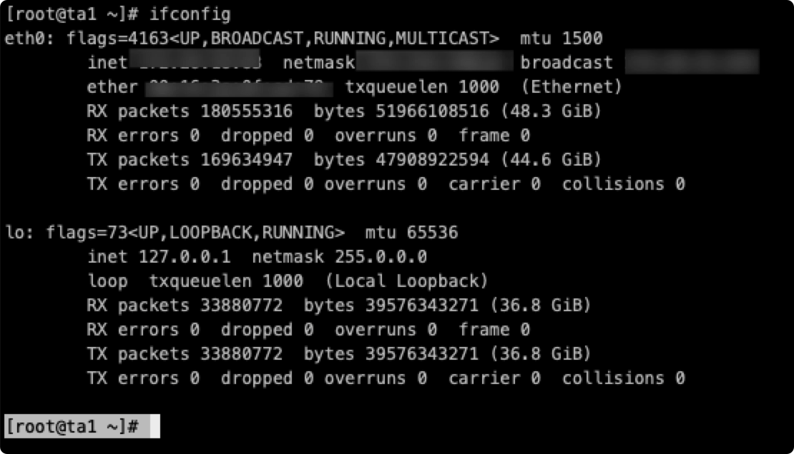

<!-- markdown-link-check-disable -->

## Q: 이 프로젝트의 이름은 무엇인가요?

A: 돌핀스케줄러

---

## Q: DolphinScheduler 서비스 소개 및 권장 런닝 메모리

A: DolphinScheduler는 MasterServer, WorkerServer, ApiServer, AlertServer, LoggerServer 및 UI의 5개 서비스로 구성됩니다.

|서비스 |설명 |
|---------------|-------------------------------------------------------------------------------------------------------------------------|
|마스터서버 |DAG 세분화 및 작업 상태 모니터링을 주로 담당 |
|작업자서버/로거서버 |주로 작업 상태의 제출, 실행 및 업데이트를 담당합니다.LoggerServer는 Rest Api가 RPC를 통해 로그를 보는 데 사용됩니다.
|API서버 |호출할 UI에 대한 Rest Api 서비스 제공 |
|경보서버 |알람 서비스 제공 |
|UI |첫 페이지 표시 |

참고:**서비스 수가 많기 때문에 단일 머신 배포는 코어 4개, 16G 이상을 권장합니다.**

---

## Q: 시스템은 어떤 메일함을 지원하나요?

A: 대부분의 사서함을 지원합니다. qq, 163, 126, 139, outlook, aliyun 등이 지원됩니다.TLS 및 SSL 프로토콜을 지원합니다. 이는 Dolphinscheduler의 UI에서 구성할 수 있습니다.
[이메일 알람 설정 방법](../en/guide/alert/email.md).

---

## Q: 일반적인 시스템 가변 시간 매개변수는 무엇이며 어떻게 사용합니까?

A: 시스템 매뉴얼의 '시스템 매개변수'를 참조하십시오.

---

## 질문: pip install kazoo 설치 시 오류가 발생합니다.꼭 설치해야 하나요?

A: 이것은 Zookeeper가 사용해야 하는 Python 연결이며, Zookeeper에서 마스터/작업자 임시 노드 정보를 삭제하는 데 사용됩니다.따라서 처음 설치하는 경우 오류를 무시할 수 있습니다.버전 1.3.0 이후에는 kazoo가 필요하지 않으므로 kazoo가 수행한 작업을 대체하는 프로그램을 사용합니다.

---

## Q: 머신 실행 작업을 지정하는 방법

A: 버전 1.2 이하, **관리자**를 사용하여 작업자 그룹을 생성하거나, **프로세스 정의가 시작될 때** 작업자 그룹을 지정**하거나, **작업 노드에서 작업자 그룹을 지정**합니다.지정하지 않은 경우 기본값을 사용합니다. **기본값은 작업 제출 및 실행에 사용할 클러스터의 모든 작업자 중 하나를 선택하는 것입니다.**
버전 1.3에서는 작업자에 대한 작업자 그룹을 설정할 수 있습니다.

---

## Q: 작업의 우선순위

A: **프로세스 및 작업의 우선순위**도 지원합니다.우선순위 **최고, 높음, 중간, 낮음, 최저**의 5가지 수준이 있습니다.**서로 다른 프로세스 인스턴스 간에 우선순위를 설정할 수도 있고, 동일한 프로세스 인스턴스에서 서로 다른 작업 인스턴스의 우선순위를 설정할 수도 있습니다.** 자세한 내용은 아키텍처 설계의 작업 우선순위 설계를 참조하세요.

---

## Q: Dolphinscheduler-grpc에서 오류가 발생합니다.

A: 루트 디렉터리에서 실행합니다: mvn -U clean package 어셈블리:어셈블리 -Dmaven.test.skip=true 그런 다음 전체 프로젝트를 새로 고칩니다.
버전 1.3에서는 grpc를 사용하지 않고 netty를 직접 사용합니다.

---

## 질문: DolphinScheduler는 Windows에서의 실행을 지원합니까?

A: 이론적으로는 **작업자만 Linux에서 실행하면 됩니다**.다른 서비스는 Windows에서 정상적으로 실행될 수 있습니다.그러나 여전히 Linux에 배포하는 것이 좋습니다.

---

## 질문: UI가 Linux에서 node-sass 프롬프트를 컴파일합니다. 오류: EACCESS: 권한 거부됨, mkdir xxxx

A: **npm install node-sass --unsafe-perm**을 별도로 설치한 다음 **npm install**을 설치하세요.

---

## Q: UI가 정상적으로 로그인이 되지 않습니다.A: 1, 노드 시작인 경우 Dolphinscheduler-ui 아래의 .env API_BASE 구성이 Api Server 서비스 주소인지 확인하세요.

​ 2, **install-dolphinscheduler-ui.sh**를 통해 nginx로 부팅하고 설치한 경우 **/etc/nginx/conf.d/dolphinscheduler.conf**의 Proxy_pass 구성이 Api Server 서비스 주소인지 확인하세요.

​ 3, 위 구성이 맞다면 Api Server 서비스가 정상인지 확인해 주시고,

​ 컬 http://localhost:12345/dolphinscheduler/users/get-user-info, Api 서버 로그 확인,

​ if Prompt cn.dolphinscheduler.api.interceptor.LoginHandlerInterceptor:[76] - 세션 정보가 null이면 Api Server 서비스가 정상임을 증명합니다.

​ 4, 위에 문제가 없다면 **application.properties**에 있는 **server.context-path 및 server.port 구성**이 올바른지 확인해야 합니다.

---

## Q: 프로세스 정의를 수동으로 시작하거나 예약한 후에는 프로세스 인스턴스가 생성되지 않습니다.

A: 1, 먼저 jps를 통해 MasterServer 서비스가 존재하는지 확인하거나, 서비스 모니터링에서 zk에 마스터 서비스가 있는지 직접 확인하세요.

​ 2,마스터 서비스가 있는 경우 **명령 상태 통계** 또는 **t_ds_error_command**에 새로운 레코드가 추가되었는지 확인합니다.추가된 경우 **메시지란을 확인해주세요.**

---

## Q : 작업 상태는 항상 제출 성공 상태입니다.

A: 1, **먼저 jps를 통해 WorkerServer 서비스가 있는지 확인**하거나, 서비스 모니터링에서 zk에 작업자 서비스가 있는지 직접 확인하세요.

​ 2, **WorkerServer** 서비스가 정상이라면 **MasterServer가 작업을 zk 대기열에 넣었는지 확인해야 합니다.MasterServer 로그와 zk 큐에서 작업이 차단되었는지 확인해야 합니다.**

​ 3, 위와 같은 문제가 없다면 Worker 그룹이 지정되어 있는지 확인해야 하는데 **작업자별로 그룹화된 기계가 온라인 상태가 아닙니다**.

---

## Q: Docker 이미지와 Dockerfile이 있나요?

A: Docker 이미지와 Dockerfile을 제공하세요.

도커 이미지 주소: https://hub.docker.com/r/apache/dolphinscheduler

Dockerfile 주소: https://github.com/apache/dolphinscheduler/tree/dev/dolphinscheduler-dist/src/main/docker

---

## Q : install.sh 문제에 주의가 필요합니다

A: 1, 대체 변수에 특수 문자가 포함된 경우 **전송하려면 \ 전송 문자를 사용하세요**

​ 2, installPath="/data1_1T/dolphinscheduler", **이 디렉터리는 원클릭으로 현재 설치된 install.sh 디렉터리와 동일할 수 없습니다.**

​ 3, 배포 사용자 = "dolphinscheduler", **배포 사용자는 sudo 권한이 있어야 합니다**, 작업자는 sudo -u 테넌트 sh xxx.command에 의해 실행되기 때문입니다.

​ 4, monitorServerState = "false", 서비스 모니터링 스크립트가 시작되었는지 여부, 기본값은 서비스 모니터링 스크립트를 시작하지 않는 것입니다.**서비스 모니터링 스크립트가 시작되면 마스터 및 작업자 서비스가 5분마다 모니터링되며 머신이 다운되면 자동으로 다시 시작됩니다.**

​ 5, hdfsStartupSate="false", HDFS 리소스 업로드 기능 활성화 여부.기본값은 활성화되어 있지 않습니다.**활성화하지 않으면 리소스 센터를 사용할 수 없습니다.** 활성화하면 conf/common/hadoop/hadoop.properties에서 resources.hdfs.fs.defaultFS 및 Yarn 구성을 구성해야 합니다.namenode HA를 사용하는 경우 core-site.xml 및 hdfs-site.xml을 conf 루트 디렉터리에 복사해야 합니다.

​ 참고: **1.0.x 버전은 hdfs 루트 디렉터리를 자동으로 생성하지 않으므로 직접 생성해야 하며, hdfs 작업 권한이 있는 사용자를 배포해야 합니다.**

---

## Q : 프로세스 정의 및 프로세스 인스턴스 오프라인 예외

A : **1.0.4 이전 버전**의 경우 escheduler-api cn.escheduler.api.quartz 패키지 아래의 코드를 수정하세요.```
public boolean deleteJob(String jobName, String jobGroupName) {
    lock.writeLock().lock();
    try {
      JobKey jobKey = new JobKey(jobName,jobGroupName);
      if(scheduler.checkExists(jobKey)){
        logger.info("try to delete job, job name: {}, job group name: {},", jobName, jobGroupName);
        return scheduler.deleteJob(jobKey);
      }else {
        return true;
      }

    } catch (SchedulerException e) {
      logger.error(String.format("delete job : %s failed",jobName), e);
    } finally {
      lock.writeLock().unlock();
    }
    return false;
  }
````

---

## Q: HDFS 시작 전에 생성된 테넌트는 리소스센터를 정상적으로 사용할 수 있나요?

A: 아니요. HDFS에서 생성된 테넌트가 시작되지 않았기 때문에 테넌트 디렉터리가 HDFS에 등록되지 않습니다.따라서 마지막 리소스는 오류를 보고합니다.

---

## Q: 다중 마스터 및 다중 작업자 상태에서 서비스가 손실됩니다. 내결함성을 유지하는 방법은 무엇입니까?

A: **참고:** **마스터는 마스터 및 작업자 서비스를 모니터링합니다.**

​ 1. 마스터 서비스가 손실되면 다른 마스터가 정지된 마스터의 프로세스를 이어받아 계속해서 워커 작업 상태를 모니터링하게 됩니다.

​ 2，Worker 서비스가 손실되면 마스터는 Worker 서비스가 사라졌는지 모니터링합니다.Yarn 작업이 있는 경우 Kill Yarn 작업이 다시 시도됩니다.

자세한 내용은 아키텍처의 내결함성 설계를 참조하세요.

---

## Q : 마스터와 워커가 분산한 머신에 대한 내결함성

A: 1.0.3 버전은 마스터 시작 프로세스의 내결함성만 구현하고 작업자 내결함성을 사용하지 않습니다.즉, 작업자가 정지하면 마스터가 존재하지 않습니다.이 과정에서 문제가 발생하게 됩니다.이 문제를 해결하기 위해 버전 **1.1.0**에 마스터 및 작업자 시작 내결함성을 추가할 예정입니다.이 문제를 수동으로 수정하려면 **다시 시작하는 동안 프로세스를 실행하고 삭제된 실행 중인 작업자 작업에 대해 실행 중인 작업을 수정해야 합니다.실행 중인 프로세스는 재시작 시 실패 상태로 설정됩니다**.그런 다음 실패한 노드에서 프로세스를 재개합니다.

---

## Q : 1초마다 실행되도록 타이밍을 설정하기가 쉽습니다.

A : 타이밍을 설정할 때 참고하세요.첫 번째 숫자(\* \* \* \* _ ? _)를 \*로 설정하면 1초마다 실행한다는 의미입니다.**최근 예정된 시간 목록은 버전 1.1.0에 추가될 예정입니다.** 지난 5개의 실행 시간은 http://cron.qqe2.com/에서 온라인으로 볼 수 있습니다.

---

## Q: 타이밍에 유효한 시간 범위가 있나요?

A: 예, **타이밍 시작 및 종료 시간이 동일한 경우 이 타이밍은 유효하지 않은 타이밍이 됩니다.시작시간과 종료시간 중 종료시간이 현재 시간보다 작을 경우 해당 시간이 자동으로 삭제될 가능성이 매우 높습니다.**

---

## Q: 작업 종속성에 대한 여러 구현이 있습니다.

A: 1, **DAG** 간의 작업 종속성은 DAG 분할의 **0도**에서 발생합니다.

​ 2, **작업 종속 노드**가 있으며, 크로스 프로세스 작업 또는 프로세스 종속성을 달성할 수 있습니다. 시스템 매뉴얼의 (종속) 노드 설계를 참조하세요.

​ 참고: **프로젝트 간 프로세스 또는 작업 종속성은 지원되지 않습니다**

---

## Q: 프로세스 정의를 시작하는 방법에는 여러 가지가 있습니다.

A: 1, **프로세스 정의 목록**에서 **시작** 버튼을 클릭하세요.

​ 2, **프로세스 정의 목록에 타이머가 추가됩니다**, 일정 시작 프로세스 정의.

​ 3, 프로세스 정의 **DAG 페이지 보기 또는 편집**, **작업 노드 마우스 오른쪽 버튼 클릭** 프로세스 정의 시작.

​ 4, 프로세스에 대한 DAG 편집을 정의하고 일부 작업의 실행 플래그를 **실행 금지**로 설정할 수 있습니다. 프로세스 정의가 시작되면 노드 연결이 DAG에서 제거됩니다.

---

## Q : Python 작업 설정 Python 버전

A: 1，**1.0.3 이후 버전의 경우** `bin/env/dolphinscheduler_env.sh`에서 `$PYTHON_LAUNCHER`만 수정하면 됩니다.```
export PYTHON_LAUNCHER=/bin/python/bin/python3
````

참고: 이는 단순한 PYTHON_LAUNCHER가 아닌 Python 명령의 절대 경로인 **PYTHON_LAUNCHER** 입니다.또한 PATH를 내보낼 때 직접 수행해야 합니다.```
export PATH=$HADOOP_HOME/bin:$SPARK_HOME/bin:$PYTHON_LAUNCHER:$JAVA_HOME/bin:$HIVE_HOME/bin:$PATH
````

​ 2，1.0.3 이전 버전의 경우 Python 작업은 Python 버전의 시스템만 지원합니다.Python 버전 지정을 지원하지 않습니다.

---

## Q: 작업자 작업은 sudo -u 테넌트 sh xxx.command를 통해 하위 프로세스를 생성하며 종료 시 종료됩니다.

A: 1.0.4에 종료 작업을 추가하고 해당 작업에 의해 생성된 다양한 하위 프로세스를 모두 종료할 예정입니다.

---

## Q ： DolphinScheduler에서 대기열을 사용하는 방법, 사용자 대기열과 테넌트 대기열은 무엇을 의미합니까?

A ： DolphinScheduler의 대기열은 사용자 또는 테넌트에서 구성할 수 있습니다.**사용자가 지정한 대기열의 우선순위는 테넌트 대기열의 우선순위보다 높습니다.** 예를 들어 MR 작업에 대한 대기열을 지정하려면 대기열은 mapreduce.job.queuename으로 지정됩니다.

참고: 위의 방법을 사용하여 대기열을 지정할 때 MR은 다음 방법을 사용합니다.```
   Configuration conf = new Configuration();
GenericOptionsParser optionParser = new GenericOptionsParser(conf, args);
String[] remainingArgs = optionParser.getRemainingArgs();
````

Spark 작업인 경우 --queue 모드는 대기열을 지정합니다.

---

## Q : 마스터 또는 작업자가 다음과 같은 알람을 보고합니다.

<p 정렬="중앙">

</p>

A ： conf 아래의 master.properties **master.reserved.memory** 값을 더 작은 값(예: 0.1)으로 변경하거나 Worker.properties **worker.reserved.memory** 값을 더 작은 값(예: 0.1)으로 변경합니다.

---

## Q: 하이브 버전이 1.1.0+cdh5.15.0인데 SQL 하이브 작업 연결이 잘못 보고됩니다.

<p 정렬="중앙">

</p>

A ： 하이브폼을 할게요```
<dependency>
    <groupId>org.apache.hive</groupId>
    <artifactId>hive-jdbc</artifactId>
    <version>2.3.9</version>
</dependency>
````

로 바꾸다```
<dependency>
    <groupId>org.apache.hive</groupId>
    <artifactId>hive-jdbc</artifactId>
    <version>1.1.0</version>
</dependency>
````

---

## Q : 작업자 서버 추가 방법

A: 1, 배포 사용자 및 호스트 매핑을 생성합니다. [클러스터 배포](https://dolphinscheduler.apache.org/en-us/docs/3.1.2/user_doc/installation/cluster)의 1.3 부분을 참조하세요.

​ 2, 호스트 매핑 및 SSH 액세스를 구성하고 디렉터리 권한을 수정합니다.[클러스터 배포](https://dolphinscheduler.apache.org/en-us/docs/3.1.2/user_doc/installation/cluster) 1.4 부분을 참조하세요.

​ 3, 이미 배포된 작업자 서버에서 배포 디렉터리를 복사합니다.

​ 4, bin 디렉토리로 이동한 후 작업자 서버를 시작합니다.        ```
        ./dolphinscheduler-daemon.sh start worker-server
````

---

## Q : DolphinScheduler가 새 버전을 출시할 때 현재 버전과 최신 버전 간의 변경 사항과 업그레이드 방법 및 버전 번호 사양

A: 1, Apache 프로젝트의 출시 프로세스는 메일링 리스트에서 이루어집니다.DolphinScheduler의 메일링 리스트를 구독하면 릴리스가 진행 중일 때 릴리스 이메일을 받게 됩니다.DolphinScheduler의 메일링 리스트를 구독하려면 이 [소개](https://github.com/apache/dolphinscheduler#get-help)를 따르세요.

2, 새 버전이 게시되면 변경 로그를 설명하는 릴리스 노트가 있으며 이전 버전을 새 버전으로 업그레이드하는 문서도 있습니다.

3, 버전 번호는 x.y.z입니다. x가 증가하면 새 아키텍처의 버전을 나타냅니다.y가 증가하면 스크립트나 기타 수동 처리를 통해 업그레이드해야 하기 전에 y 버전과 호환되지 않는다는 의미입니다.z 증가가 버그 수정을 나타내는 경우 업그레이드는 완전히 호환됩니다.추가 처리가 필요하지 않습니다.남은 문제는 1.0.2 업그레이드가 1.0.1과 호환되지 않으며 업그레이드 스크립트가 필요하다는 것입니다.

---

## Q : 앞의 작업이 실패하더라도 후속 작업은 실행할 수 있습니다.

A: 워크플로를 시작할 때 작업 실패 전략(계속 또는 실패)을 설정할 수 있습니다.


---

## Q : 워크플로 템플릿 DAG, 워크플로 인스턴스, 작업 작업 및 이들 간의 관계는 무엇인가요?DAG는 최대 100개의 동시성을 지원합니다. 이는 100개의 워크플로 인스턴스가 동시에 생성되고 실행된다는 의미입니까?DAG의 작업 노드에도 동시 번호 구성이 있습니다.작업이 여러 스레드와 동시에 실행될 수 있다는 뜻인가요?최대 개수는 100인가요?

답:

1.2.1 버전```
master.properties
Control the max parallel number of master node workflows
master.exec.threads=100

Control the max number of parallel tasks in each workflow
master.exec.task.number=20

worker.properties
Control the max parallel number of worker node tasks
worker.exec.threads=100
````

---

## Q : 작업자 그룹 관리 페이지에 버튼이 표시되지 않습니다.

<p 정렬="중앙">

</p>
A: 버전 1.3.0의 경우 k8s를 지원하려고 하지만 IP는 항상 변경되므로 UI에서 구성할 수 없으며 작업자는 작업자.속성에서 그룹 이름을 구성할 수 있습니다.

---

## Q: mysql jdbc 커넥터를 도커 이미지에 추가하면 안 되는 이유는 무엇인가요?

A: mysql jdbc 커넥터의 라이선스는 apache v2 라이선스와 호환되지 않으므로 docker 이미지에 포함될 수 없습니다.

---

## Q : 태스크 인스턴스가 여러 원사 애플리케이션을 제출하면 항상 실패합니다.

<p 정렬="중앙">

</p>
A: 이 버그는 개발 및 요구사항/TODO 목록에서 수정되었습니다.

---

## Q : 마스터 서버와 워커 서버가 며칠 동안 실행 후 비정상적으로 종료됩니다.

<p 정렬="중앙">

</p>
A: 세션 시간 초과가 0.3초로 너무 짧습니다.Zookeeper.properties에서 구성 항목을 변경합니다.```
zookeeper.session.timeout=60000
zookeeper.connection.timeout=30000
````

---

## Q : docker-compose 기본 구성을 사용하여 시작되었으며 사육사 오류가 표시됩니다.

<p 정렬="중앙">

</p>
A: 이 문제는 dev-1.3.0에서 해결되었습니다.이 [pr](https://github.com/apache/dolphinscheduler/pull/2595)은 이 버그를 해결했습니다. 간단한 변경 로그입니다.```
1. add zookeeper environment variable ZOO_4LW_COMMANDS_WHITELIST in docker-compose.yml file.
2. change the data type of minLatency, avgLatency and maxLatency from int to float.
````

---

## Q: 데이터베이스가 지연되고 로그 표시 작업 인스턴스가 null일 때 일부 작업이 항상 실행될 것임을 인터페이스에 표시합니다.

<p 정렬="중앙">

</p>
<p 정렬="중앙">

</p>

A: 이 [버그](https://github.com/apache/dolphinscheduler/issues/1477)는 문제 세부 사항을 설명하며 버전 1.2.1에서 해결되었습니다.

1.2.1 미만 버전의 경우 이 상황에 대한 몇 가지 팁:```
1. clear the task queue in zk for path: /dolphinscheduler/task_queue
2. change the state of the task to failed( integer value: 6).
3. run the work flow by recover from failed
````

---

## Q: Zookeeper 마스터 znode 목록 IP 주소는 원하는 IP eth0 또는 eth1 대신 127.0.0.1이며 작업 로그를 볼 수 없습니다.

A: 버그 수정:```
1, confirm hostname
$hostname
hadoop1
2, hostname -i
127.0.0.1 10.3.57.15
3, edit /etc/hosts,delete hadoop1 from 127.0.0.1 record
$cat /etc/hosts
127.0.0.1 localhost
10.3.57.15 ds1 hadoop1
4, hostname -i
10.3.57.15
````

호스트 이름 cmd는 서버 호스트 이름을 반환하고, 호스트 이름 -i는 /etc/hosts에 구성된 일치하는 모든 IP를 반환합니다.따라서 127.0.0.1과 일치하는 호스트 이름을 삭제하고 모든 127.0.0.1 해상도 기록을 제거하는 대신 내부 IP 해상도만 유지합니다.호스트 이름 cmd가 /etc/hosts에 구성된 올바른 내부 IP를 반환하는 한 이 버그를 수정할 수 있습니다.DolphinScheduler는 호스트 이름 -i 명령으로 반환된 첫 번째 레코드를 사용합니다.제 생각에는 DS는 ip를 얻기 위해 호스트 이름 -i를 사용해서는 안 됩니다. 많은 회사에서 devops가 서버 이름을 구성했기 때문에 /etc/hosts 대신 구성 파일이나 znode에 구성된 ip를 사용하는 것이 좋습니다.

---

## Q : 스케줄링 시스템이 두 번째 빈도 작업을 설정하여 시스템 충돌을 일으켰습니다.

A: 일정 시스템은 두 번째 빈도 작업을 지원하지 않습니다.

---

## Q : 프런트엔드 코드 컴파일(dolphinscheduler-ui) 표시 오류로 인해 "https://github.com/sass/node-sass/releases/download/v4.13.1/darwin-x64-72_bound.node"를 다운로드할 수 없습니다.

A: 1, cd Dolphinscheduler-ui 및 node_modules 디렉토리 삭제```
sudo rm -rf node_modules
````

​ 2, npmmirror.com을 통해 node-sass를 설치합니다.```
sudo npm uninstall node-sass
sudo npm i node-sass --sass_binary_site=https://npmmirror.com/mirrors/node-sass/
````

3, 2단계 실패 시 [참조 URL](https://github.com/apache/dolphinscheduler/blob/dev/docs/docs/en/contribute/frontend-development.md)을 이용해 주세요.```
sudo npm rebuild node-sass
````

이 문제가 해결되었을 때 매번 이 노드를 다운로드하지 않으려면 시스템 환경 변수를 SASS_BINARY_PATH= /xxx/xxx/xxx/xxx.node로 설정할 수 있습니다.

---

## Q : postgres 대신 mysql을 데이터베이스로 사용할 경우 어떻게 설정하나요?

A: 1, 프로젝트 루트 디렉터리 maven 구성 파일을 편집하고 mysql 드라이버가 로드될 수 있도록 범위 테스트 속성을 제거합니다.```
<dependency>
	<groupId>mysql</groupId>
	<artifactId>mysql-connector-java</artifactId>
	<version>${mysql.connector.version}</version>
	<scope>test<scope>
</dependency>
````

​ 2, mysql 드라이버를 사용하기 위해 application-dao.properties 및 quzrtz.properties 구성 파일을 편집합니다.
라이센스 문제로 인해 기본값은 postgresql 드라이버입니다.

---

## Q: 쉘 작업은 어떻게 실행되나요?

A: 1, 실행되는 서버는 어디에 있나요?작업을 실행할 작업자를 한 명 지정하고 Security Center에서 작업자 그룹을 생성한 다음 특정 작업자에게 작업을 보낼 수 있습니다.작업자 그룹에 여러 개의 서버가 있는 경우 실제로 어떤 서버가 실행되는지는 일정에 따라 결정되며 무작위성을 갖습니다.

​ 2, 서버에 있는 경로의 쉘 파일이라면 경로를 어떻게 가리킬까요?권한 문제와 관련된 서버 셸 파일은 권장되지 않습니다.리소스 센터의 저장 기능을 활용하신 후, 쉘 에디터에서 리소스 참조를 활용하시는 것을 권장합니다.시스템은 실행 디렉터리에 스크립트를 다운로드하는 데 도움을 줍니다.작업이 리소스 센터 파일에 의존하는 경우 작업자는 "hdfs dfs -get"을 사용하여 HDFS의 리소스 파일을 가져온 다음 /tmp/escheduler/exec/process에서 작업을 실행합니다. 이 경로는 돌핀스케줄러를 설치할 때 사용자 정의할 수 있습니다.

3, 어떤 사용자가 작업을 실행합니까?작업은 "sudo -u ${tenant}"를 통해 테넌트에 의해 실행되며 테넌트는 Linux 사용자입니다.

---

## Q : 프로덕션 환경에서 제안하는 가장 좋은 배포 모드는 무엇입니까?

A: 1, 실행할 작업이 너무 많지 않은 경우 안정성을 위해 3개의 노드를 사용하는 것이 좋습니다.그리고 마스터/작업자/Api 서버를 다른 노드에 배포하는 것이 더 좋습니다.노드가 하나만 있는 경우에는 함께 배포할 수만 있습니다!그런데 필요한 기계 수는 비즈니스에 따라 결정됩니다.DolphinScheduler 시스템 자체는 너무 많은 리소스를 사용하지 않습니다.더 많이 테스트하면 몇 가지 기계를 사용하는 올바른 방법을 찾을 수 있습니다.

---

## Q : 종속 작업 노드

A: 1, DEPENDENT 작업 노드에는 실제로 스크립트가 없으며 구성 데이터 주기 종속 논리에 사용된 다음 작업 주기 종속을 실현하기 위해 그 뒤에 작업 노드를 추가합니다.

---

## Q : 마스터의 부트 포트를 변경하는 방법

<p 정렬="중앙">

</p>
A: 1, application_master.properties를 수정합니다(예: server.port=12345).

---

## Q : 예약된 작업은 온라인 상태가 될 수 없습니다.

A: 1, 예약된 작업을 성공적으로 생성하고 t_scheduler_schedules 테이블에 하나의 레코드를 추가할 수 있지만 온라인을 클릭하면 첫 페이지가 반응하지 않고 t_scheduler_schedules 테이블이 잠기고 t_scheduler_schedules 테이블에서 필드 release_state 값을 1로 설정하고 작업이 온라인 상태를 표시하는지 테스트했습니다.1.2 이상의 DS 버전의 경우 테이블 이름은 t_ds_schedules이고 다른 버전의 테이블 이름은 t_scheduler_schedules입니다.

---

## Q : swagger ui 주소는 무엇인가요?

A: 1, 버전 3.1.0+의 경우 [http://apiServerIp:apiServerPort/dolphinscheduler/swagger-ui/index.html]입니다.
버전 1.2+의 경우 [http://apiServerIp:apiServerPort/dolphinscheduler/doc.html]이고 다른 버전은 [http://apiServerIp:apiServerPort/escheduler/doc.html]입니다.

---

## Q : 프런트엔드 설치 패키지에 파일이 없습니다.

<p 정렬="중앙">

</p>
<p 정렬="중앙">

</p>

A: 1, 사용자가 구성 API 서버 구성 파일 및 항목을 변경했습니다.
, 따라서 문제가 발생합니다.기본값으로 다시 시작한 후 문제가 해결되었습니다.

---

## Q : 상대적으로 큰 파일 업로드가 차단되었습니다.

<p 정렬="중앙">

</p>
A: 1, ngnix 구성 파일을 편집하고 업로드 최대 크기 client_max_body_size 1024m를 편집합니다.

​ 2, 구글 크롬 버전이 오래되어 최신 버전의 브라우저로 업데이트 되었습니다.

---## Q: Spark 데이터 소스를 생성하고 "연결 테스트"를 클릭하면 시스템이 로그인 페이지로 돌아갑니다.

A: 1, nginx 구성 파일 /etc/nginx/conf.d/escheduler.conf를 편집하십시오.```
proxy_connect_timeout 300s;
proxy_read_timeout 300s;
proxy_send_timeout 300s;
````

---

## Q : 워크플로 종속성

A: 1, 현재 자연일 기준으로 지난 달 말에 판단됩니다. 판단 시간은 '2019-05-31 00:00:00'과 '2019-05-31 23:59:59' 사이의 워크플로 A start_time/scheduler_time입니다.지난달 : 1일부터 말일까지 매일 A인스턴스가 완료된 것으로 판단된다.지난 주: 지난 주 7일 동안 완료된 A 인스턴스가 있습니다.처음 2일: 어제와 그제까지 판단하면 이틀 동안 완성된 A 인스턴스가 있어야 합니다.

---

## Q : DS 백엔드 인터페이스 문서

답변: 1, http://localhost:8888/dolphinscheduler/swagger-ui/index.html?언어=en.

## 돌핀스케줄러 동작 중 IP 주소를 잘못 획득하는 현상

ZooKeeper에 마스터 서비스와 워커 서비스를 등록하면 관련 정보가 ip:port 형태로 생성됩니다.

IP 주소가 잘못 획득된 경우 네트워크 정보를 확인하세요.예를 들어 Linux 시스템에서는 'ifconfig' 명령을 사용하여 네트워크 정보를 볼 수 있습니다.다음 그림은 예입니다.

<p 정렬="중앙">

</p>

Dolphinscheduler에서 제공하는 세 가지 전략을 사용하여 사용 가능한 IP를 얻을 수 있습니다.

- 기본값: 먼저 내부 네트워크 카드를 사용하여 IP 주소를 얻은 다음 외부 네트워크 카드를 사용합니다.위의 모든 방법이 실패하면 사용 가능한 첫 번째 네트워크 카드의 주소를 사용하십시오.
- 내부: 내부 네트워크 카드를 사용하여 IP 주소를 얻습니다. 실패하면 예외가 발생합니다.
- 외부: 외부 네트워크 카드를 사용하여 IP 주소를 얻습니다. 실패하면 예외가 발생합니다.

`common.properties`에서 구성을 수정합니다.```shell
# network IP gets priority, default: inner outer
# dolphin.scheduler.network.priority.strategy=default
````

또한, 지정된 네트워크 카드에서 IP 주소를 얻으려면 `common.properties`에서 `dolphin.scheduler.network.interface.preferred` 구성을 수정하세요.예를 들어, 네트워크 카드 `eth1`에서 IP 주소를 얻으려면 `common.properties`의 구성을 다음과 같이 수정할 수 있습니다.```shell
dolphin.scheduler.network.interface.preferred=eth1
````

구성을 수정한 후 서비스를 다시 시작하여 활성화하세요.

IP 주소가 여전히 잘못된 경우 [dolphinscheduler-netutils.jar]을 머신에 다운로드하고 다음 명령을 실행한 후 출력을 커뮤니티 개발자에게 피드백하세요.```shell
java -jar target/dolphinscheduler-netutils.jar
````

## sudo를 비밀이 없도록 구성합니다. 이는 기본 구성 sudo 권한을 사용하여 너무 크거나 루트 권한을 신청할 수 없는 문제를 해결하는 데 사용됩니다.

Dolphinscheduler 계정의 sudo 권한을 일부 일반 사용자 범위 내의 일반 사용자 관리자로 구성하고, 지정된 사용자가 지정된 호스트에서 특정 명령을 실행하도록 제한합니다.자세한 구성은 sudo 권한 관리를 참조하세요.
예를 들어, sudo 권한 관리 구성 Dolphinscheduler OS 계정은 사용자 userA, userB, userC의 권한만 작동할 수 있습니다(사용자 userA, userB 및 userC는 빅 데이터 클러스터에 작업을 제출하는 다중 테넌트에 사용됩니다).```shell
echo 'dolphinscheduler  ALL=(userA,userB,userC)  NOPASSWD: NOPASSWD: ALL' >> /etc/sudoers
sed -i 's/Defaults    requirett/#Defaults    requirett/g' /etc/sudoers
````

---

## Q: 여러 YARN 클러스터에 배포

A: 서로 다른 원사 클러스터에 서로 다른 작업자를 배포하면 단계는 다음과 같습니다(예: AWS EMR).

1. EMR 클러스터의 마스터 노드에 작업자 서버 배포

2. `conf/common.properties`에서 `yarn.application.status.address`를 현재 emr의 원사 URL로 변경합니다.

3. 'bin/dolphinscheduler-daemon.sh start Worker-server' 명령을 실행하여 작업자 서버를 시작합니다.

---

## Q：업데이트 프로세스 정의 오류: 중복 키 TaskDefinition

A: DS 2.0.4 이전(2.0.0-alpha 이후) 버전 전환으로 인해 TaskDefinition 키가 중복되어 업데이트 작업 흐름이 실패할 수 있는 문제가 있을 수 있습니다.MySQL을 예로 들어 다음 SQL을 참조하여 중복 데이터를 삭제할 수 있습니다. (참고: 작동하기 전에 pr[#8408](https://github.com/apache/dolphinscheduler/pull/8408)의 SQL인 원본 데이터를 백업하십시오.)```SQL
DELETE FROM t_ds_process_task_relation_log WHERE id IN
(
 SELECT
     x.id
 FROM
     (
         SELECT
             aa.id
         FROM
             t_ds_process_task_relation_log aa
                 JOIN
             (
                 SELECT
                     a.process_definition_code
                      ,MAX(a.id) as min_id
                      ,a.pre_task_code
                      ,a.pre_task_version
                      ,a.post_task_code
                      ,a.post_task_version
                      ,a.process_definition_version
                      ,COUNT(*) cnt
                 FROM
                     t_ds_process_task_relation_log a
                         JOIN (
                         SELECT
                             code
                         FROM
                             t_ds_process_definition
                         GROUP BY code
                     )b ON b.code = a.process_definition_code
                 WHERE 1=1
                 GROUP BY a.pre_task_code
                        ,a.post_task_code
                        ,a.pre_task_version
                        ,a.post_task_version
                        ,a.process_definition_code
                        ,a.process_definition_version
                 HAVING COUNT(*) > 1
             )bb ON bb.process_definition_code = aa.process_definition_code
                 AND bb.pre_task_code = aa.pre_task_code
                 AND bb.post_task_code = aa.post_task_code
                 AND bb.process_definition_version = aa.process_definition_version
                 AND bb.pre_task_version = aa.pre_task_version
                 AND bb.post_task_version = aa.post_task_version
                 AND bb.min_id != aa.id
     )x
)
;

DELETE FROM t_ds_task_definition_log WHERE id IN
(
   SELECT
       x.id
   FROM
       (
           SELECT
               a.id
           FROM
               t_ds_task_definition_log a
                   JOIN
               (
                   SELECT
                       code
                        ,name
                        ,version
                        ,MAX(id) AS min_id
                   FROM
                       t_ds_task_definition_log
                   GROUP BY code
                          ,name
                          ,version
                   HAVING COUNT(*) > 1
               )b ON b.code = a.code
                   AND b.name = a.name
                   AND b.version = a.version
                   AND b.min_id != a.id
       )x
)
;
````

---

## Q：PostgreSQL 데이터베이스를 사용하여 2.0.1에서 2.0.5로 업그레이드하지 못했습니다.

A: 데이터베이스에서 다음 SQL을 실행하여 복구를 완료할 수 있습니다.```SQL
update t_ds_version set version='2.0.1';
````

---

## Q: 배포 패키지에서 python-gateway-server를 찾을 수 없습니다.

A: 버전 3.0.0-alpha 이후 Python 게이트웨이 서버는 API 서버에 통합되며 Python 게이트웨이 서비스는 다음과 같은 경우에 시작됩니다.
API 서버를 시작합니다.Python 게이트웨이 서비스를 비활성화하려면 경로에서 API 서버 구성을 변경할 수 있습니다.
`api-server/conf/application.yaml` 및 `python-gateway.enabled : false` 속성을 변경합니다.

---

## Q: 온라인 워크플로 정의를 가져온 후 워크플로 정의의 일정 상태가 "오프라인"으로 설정되는 이유는 무엇입니까?

A: 이는 사용자가 이미 "온라인"인 예약된 워크플로를 직접 가져오는 것을 방지하고 싶기 때문입니다.
따라서 이러한 워크플로우를 내보낼 때 시스템은 자동으로 상태를 "오프라인"으로 변경합니다.
이 규칙을 적용하려면 사용자가 가져오기 전에 워크플로 정의에서 일정 상태를 수동으로 "온라인"으로 설정하더라도
시스템은 이를 무시하고 "오프라인"으로 설정합니다.

---

나중에 더 많은 FAQ를 수집하겠습니다.