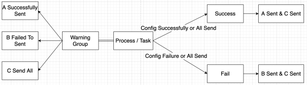
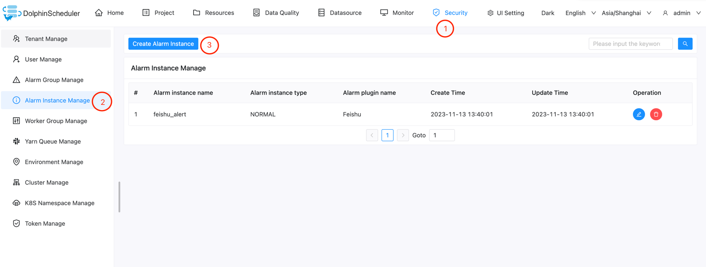
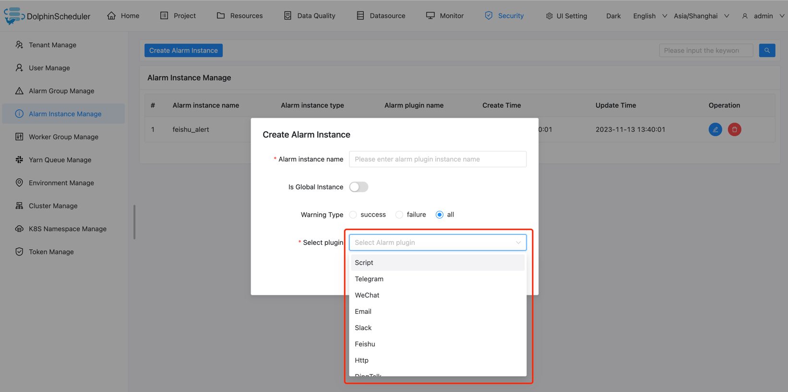
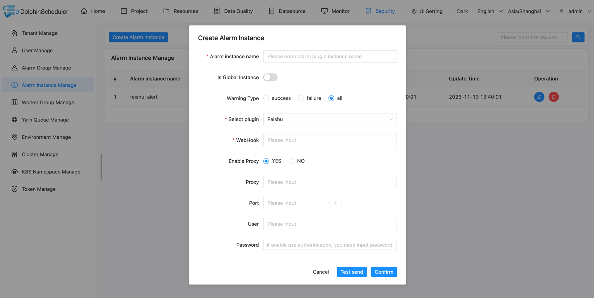
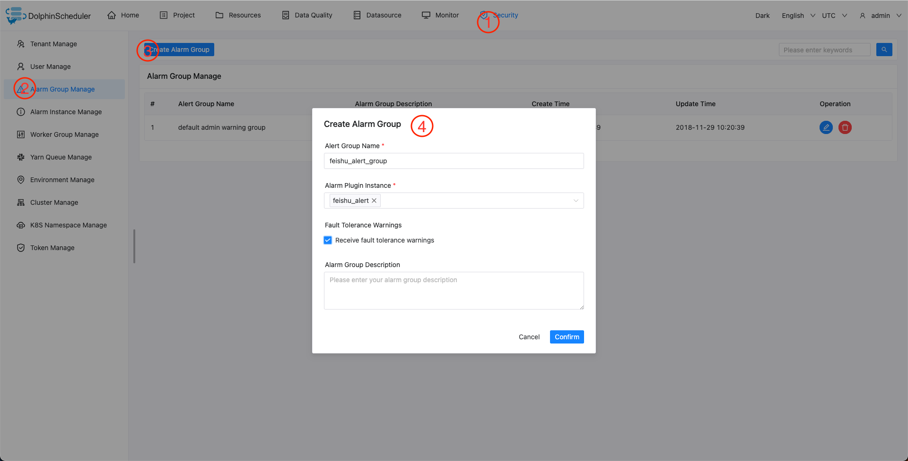

# 경고 구성 요소 사용 설명서

## 경고 플러그인 및 경고 그룹 생성

버전 2.0.0에서는 사용자가 경보 인스턴스를 생성해야 하며 경보 인스턴스를 정의할 때 경보 정책을 선택해야 합니다. 작업이 성공하면 보내기, 실패 시 보내기, 성공 및 실패 시 보내기의 세 가지 옵션이 있습니다.워크플로나 작업이 실행될 때 알람이 트리거되면 알람 인스턴스 전송 메서드를 호출하려면 알람 인스턴스를 작업 상태와 일치시키고, 일치하면 알람 인스턴스 전송 로직을 실행하고, 일치하지 않으면 필터링하는 논리적 판단이 필요합니다.경고 인스턴스를 생성할 때 이를 경고 그룹과 연결합니다.경보 그룹은 여러 경보 인스턴스를 사용할 수 있습니다.
알람 모듈은 다음 시나리오를 지원합니다.

사용되는 단계는 다음과 같습니다:

- `보안 -> 알람 그룹 관리 -> 알람 인스턴스 관리 -> 알람 인스턴스`로 이동합니다.
- 해당 알람 플러그인을 선택하고 관련 알람 매개변수를 입력합니다.
- '알람 그룹 관리'를 선택하고, 알람 그룹을 생성하고, 해당 알람 인스턴스를 선택합니다.

> '테스트 보내기' 버튼을 클릭하면 알람 인스턴스가 올바르게 구성되었는지 테스트할 수 있습니다.

