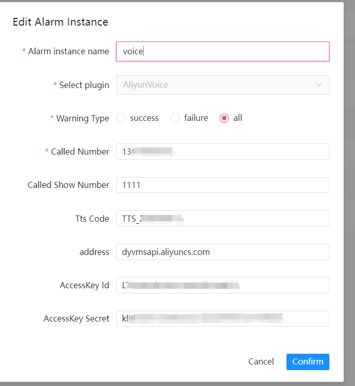

# 알리바바 클라우드 - 음성 알람

알림을 위해 '음성'을 사용해야 하는 경우 알림 인스턴스 관리에서 알림 인스턴스를 생성하고 '음성' 플러그인을 선택하세요.

## 参数配置

* 전화번호

> 호출된 디스플레이 번호

* 통화 표시 번호

> 음성알림 수신번호

* 보이스코드

> VoiceCode의 음성 ID

* 액세스키ID

> 귀하의 액세스키 ID

* accessKey비밀

> 귀하의 AccessKey 비밀

### 예

음성 알림 지정된 번호로 파일 형식의 음성 알림을 보냅니다.
다음은 `voice` 구성 예를 보여줍니다.

