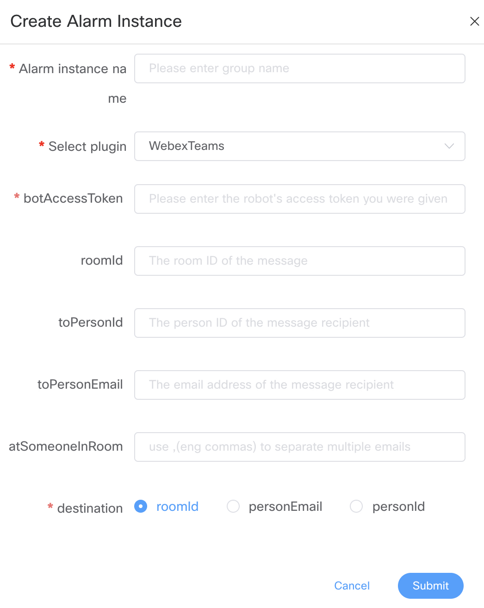
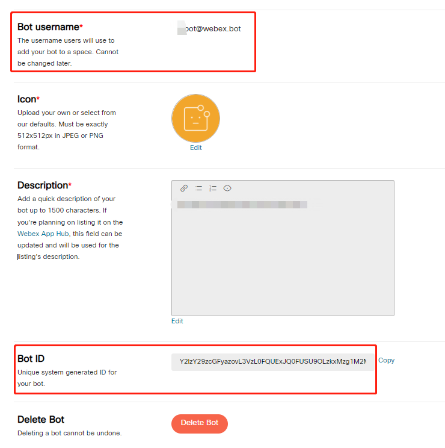
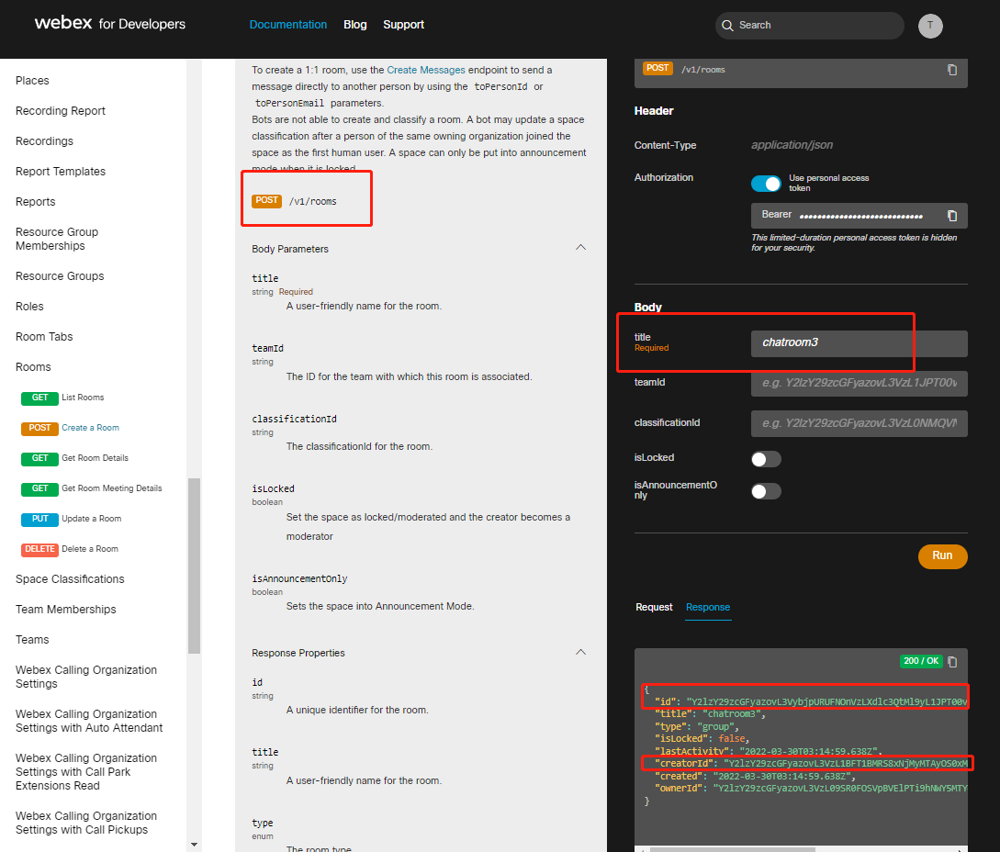
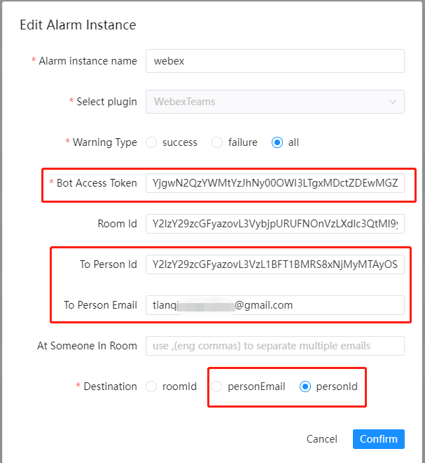
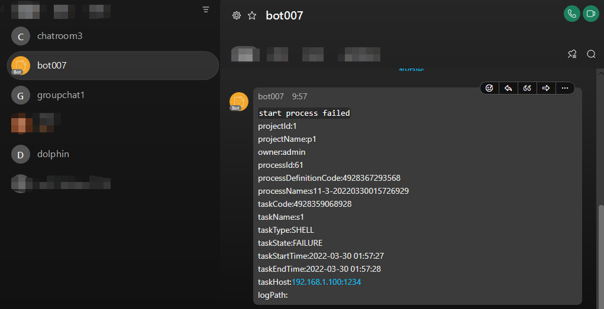
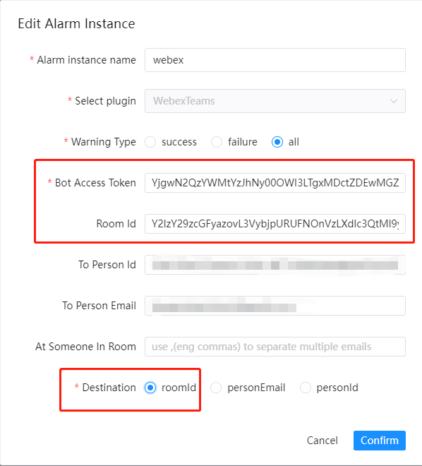
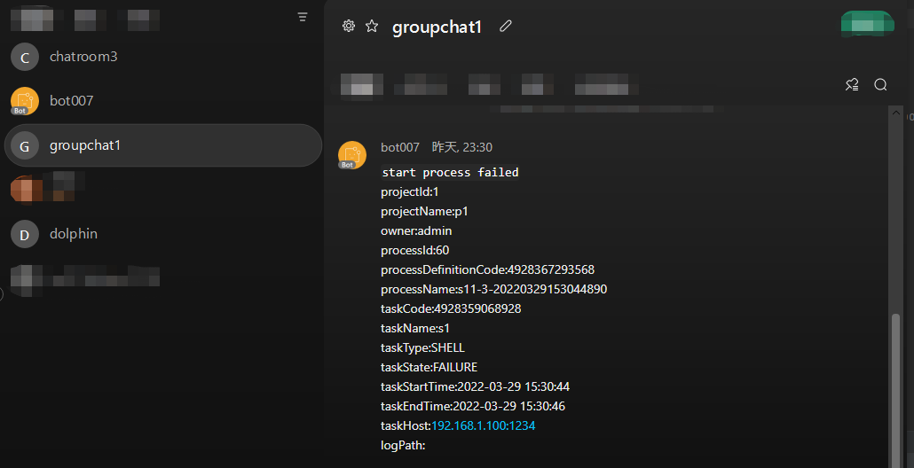

# Webex 팀

경고하기 위해 'Webex Teams'를 사용해야 하는 경우, 경고 인스턴스 관리에서 경고 인스턴스를 생성하고 WebexTeams 플러그인을 선택하십시오.비공개 알림 또는 방 그룹 채팅 알림을 선택할 수 있습니다.
다음은 `WebexTeams` 구성 예입니다.

## 매개변수 구성

|**매개변수** |**설명** |
|-----------------|------------------------------------------------------------------------------------------------------------|
|봇액세스토큰 |로봇의 액세스 토큰입니다.|
|방ID |메시지를 받는 방의 ID입니다. (1개의 방 ID만 지원합니다.)|
|toPersonId |비공개 1:1 메시지 발송 시 수신자의 개인 ID입니다.|
|toPerson이메일 |비공개 1:1 메시지 발송 시 수신자의 이메일 주소입니다.|
|atSomeoneInRoom |메시지 대상이 방이면 그 사람의 이메일이 @인 경우 `,`(eng 쉼표)를 사용하여 여러 이메일을 구분합니다.|
|목적지 |메시지의 대상입니다(하나의 메시지는 하나의 대상만 지원합니다).|

## 봇 생성

봇을 생성하려면 [공식 웹사이트 My-Apps](https://developer.webex.com/my-apps)를 방문하여 '새 앱 생성'을 선택한 후 '봇 생성'을 선택하고 봇 정보를 입력한 후 '봇 사용자 이름'과 '봇 ID'를 획득하여 추가로 사용하세요.

## 방 만들기

루트 생성 [개발자 API 공식 웹사이트](https://developer.webex.com/docs/api/v1/rooms/create-a-room)를 방문하여 새 룸을 생성하고 룸 이름을 입력한 후 `id`(룸 ID) 및 `creatorId`를 획득하여 추가 사용하세요.

### 봇을 방에 초대하기

봇 이메일(봇 사용자 이름)을 초대하여 봇을 방에 초대합니다.

## 비공개 메시지 보내기

이런 방식으로 비공개 대화에서 '사용자 이메일' 또는 '사용자 ID'를 통해 개인 메시지를 보낼 수 있습니다.'To Person Id' 또는 'To Person Email'(권장) 및 'Bot Access Token'을 입력하고 'Destination' 'personEmail' 또는 'personId'를 선택합니다.
'사용자 이메일'은 사용자가 등록한 이메일입니다.
`userId`는 새 그룹 채팅방 API를 생성하는 `creatorId`에서 얻을 수 있습니다.

### 개인 경고 메시지 예

## 그룹방 메시지 보내기

이런 방법으로 '방 ID'를 통해 해당 방에 그룹방 메시지를 보낼 수 있습니다.'Room Id' 및 'Bot Access Token'을 입력하고 'Destination' 'roomId'를 선택합니다.
'방 ID'는 새 그룹 채팅방 API를 생성하는 'id'에서 얻을 수 있습니다.

### 그룹룸 경고 메시지 예시

## 참조:

- [WebexTeams 애플리케이션 봇 가이드](https://developer.webex.com/docs/bots)
- [WebexTeams 메시지 가이드](https://developer.webex.com/docs/api/v1/messages/create-a-message)