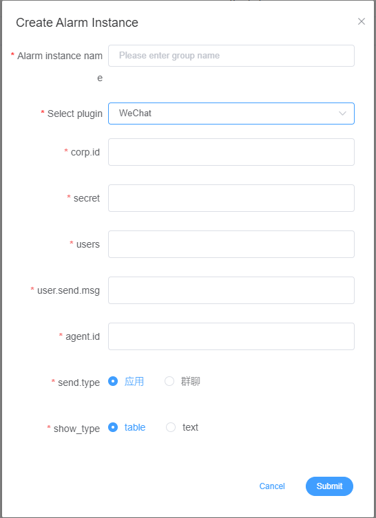
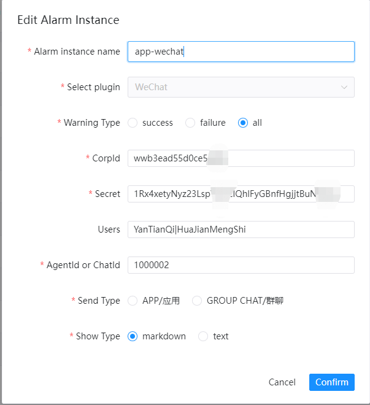
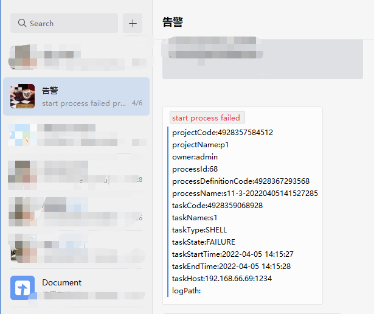
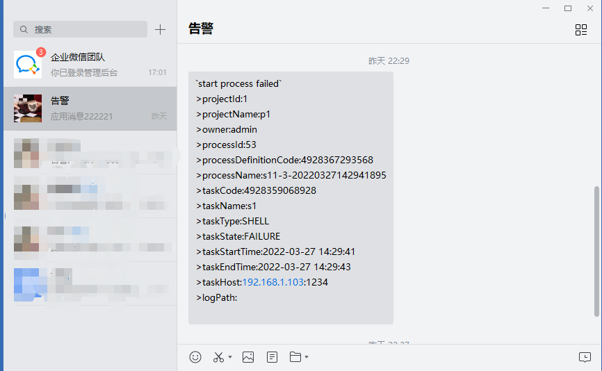
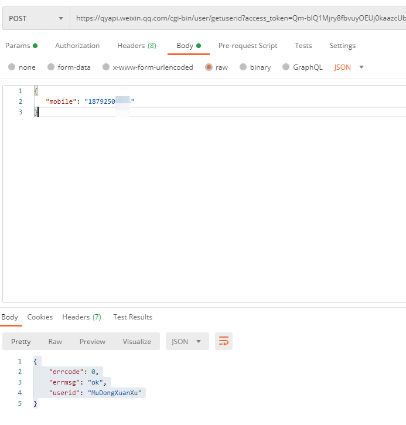
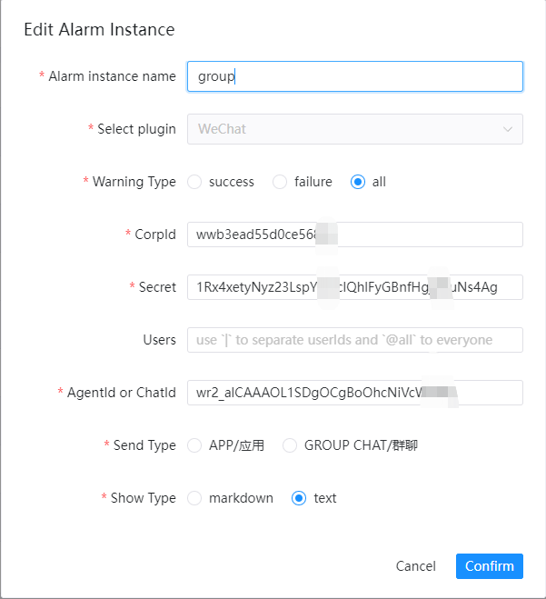
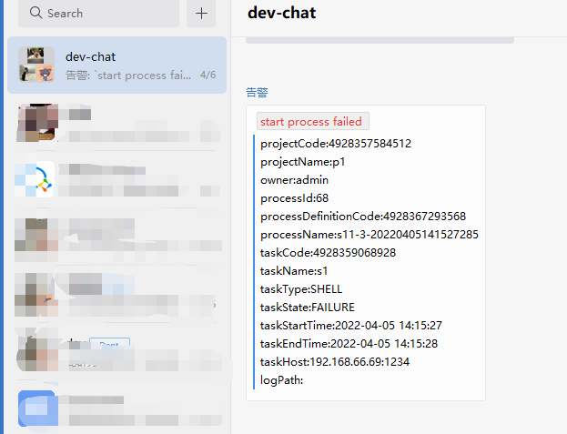
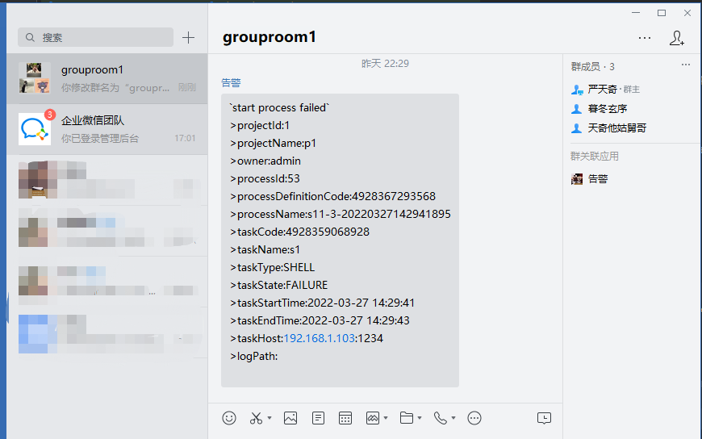
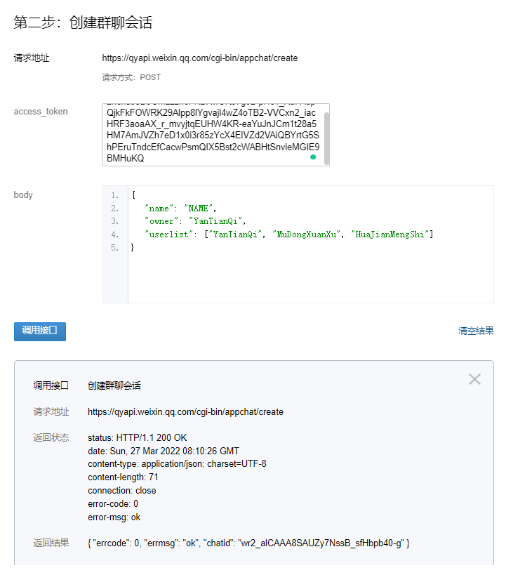

# 기업 위챗

'Enterprise WeChat'을 사용하여 알림을 보내야 하는 경우 알림 인스턴스 관리에서 알림 인스턴스를 생성하고 'WeChat' 플러그인을 선택하세요.
다음은 `WeChat` 구성 예입니다.

## 전송 유형

'send.type' 매개변수는 각각 Enterprise WeChat 맞춤형 APP과 API로 생성된 그룹 채팅에 메시지를 보내는 것에 해당합니다.

### 앱

앱 전송 유형은 기업 WeChat 맞춤형 앱을 통해 경고 결과를 알리는 수단이며 지정된 사용자와 모든 회원 모두에게 메시지 전송을 지원합니다.현재 지정된 기업 부서로 보내기 및 태그는 지원되지 않습니다. 기여할 새로운 PR을 환영합니다.
다음은 `APP` 경고 구성 예입니다.

다음은 `APP` `MARKDOWN` 경고 메시지 예입니다.

다음은 `APP` `TEXT` 경고 메시지 예입니다.

#### 전제조건

APP에 메시지를 보내기 전에 Enterprise WeChat에서 새로운 맞춤형 APP을 생성해야 하며, [APP 페이지](https://work.weixin.qq.com/wework_admin/frame#apps)에서 생성하고 APP 'AgentId'를 획득하고 표시 범위를 계층 구조의 루트로 설정해야 합니다.

#### 지정된 사용자에게 메시지 보내기

Enterprise WeChat 앱은 `|`를 사용하여 여러 `userId`를 구분하고 `@all`을 사용하여 모든 사람에게 메시지를 보내는 등 지정된 사용자와 모든 구성원 모두에게 메시지 보내기를 지원합니다.
사용자 `userId`를 획득하려면 [공식 문서](https://developer.work.weixin.qq.com/document/path/95402)를 참조하고, 사용자 전화번호로 `userId`를 획득하세요.
다음은 `query userId` API 예시입니다.

#### 참고자료

앱: https://work.weixin.qq.com/api/doc/90000/90135/90236

### 그룹 채팅

그룹 채팅 전송 유형은 Enterprise WeChat API에서 생성된 그룹 채팅을 통해 알림 결과를 알리는 것을 의미하며, 그룹의 모든 구성원 및 지정된 사용자에게 메시지를 보내는 것은 지원되지 않습니다.
다음은 `그룹 채팅` 경고 구성 예입니다.

다음은 `APP` `MARKDOWN` 경고 메시지 예입니다.

다음은 `그룹 채팅` `TEXT` 경고 메시지 예입니다.

#### 전제조건

그룹 채팅에 메시지를 보내기 전에 Enterprise WeChat API로 새 그룹 채팅을 생성하세요. [공식 문서](https://developer.work.weixin.qq.com/document/path/90245)를 참조하여 새 그룹 채팅을 생성하고 'chatid'를 획득하세요.
사용자 `userId`를 획득하려면 [공식 문서](https://developer.work.weixin.qq.com/document/path/95402)를 참조하고, 사용자 전화번호로 `userId`를 획득하세요.
다음은 `새 그룹 채팅 만들기` API 및 `userId 쿼리` API 예제입니다.

## 참조

- 그룹 채팅: https://work.weixin.qq.com/api/doc/90000/90135/90248