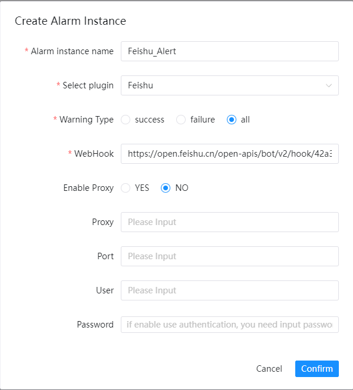
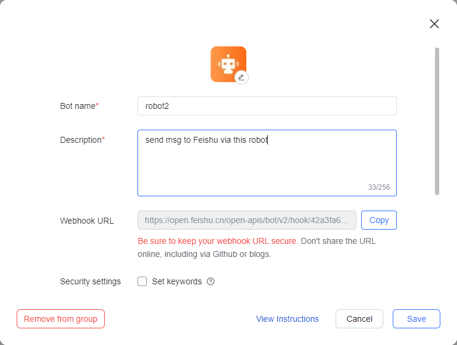

# 페이슈

알림을 위해 'Feishu'를 사용해야 하는 경우 알림 인스턴스 관리에서 알림 인스턴스를 생성하고 선택하세요.
'Feishu' 플러그인.

다음은 `Feishu` 구성 예를 보여줍니다.

## 매개변수 구성

* 웹훅

> 아래 표시된 로봇 웹훅 URL을 복사하세요.

[Feishu: 그룹으로 봇 사용](https://www.feishu.cn/hc/en-US/articles/360024984973)