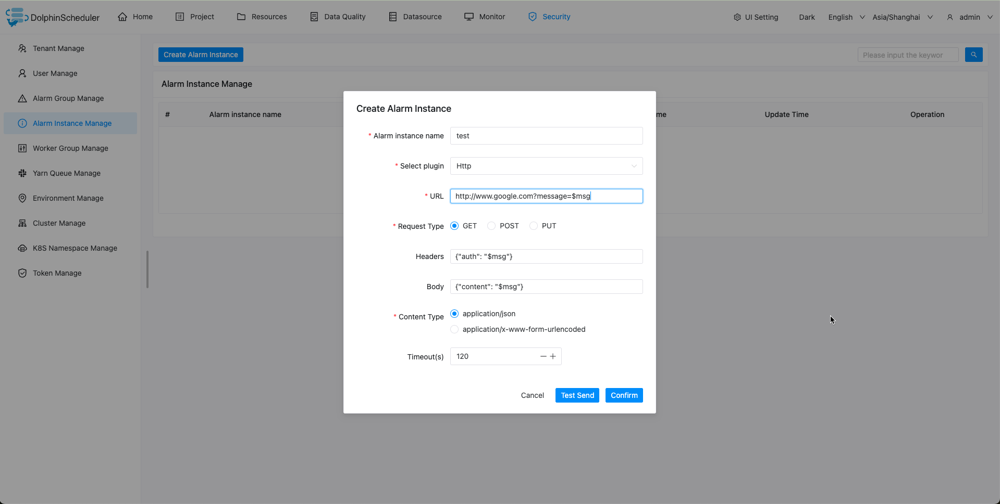

# HTTP

알림을 위해 `Http 스크립트`를 사용해야 하는 경우 알림 인스턴스 관리에서 알림 인스턴스를 생성하고 `Http` 플러그인을 선택하세요.

## 매개변수 구성

|**매개변수** |**설명** |
|---------------|--------------------------------------------------------------------------|
|URL |메소드가 `GET`인 경우 `Http` 요청 URL에는 프로토콜, 호스트, 경로 및 매개변수가 포함되어야 합니다.|
|요청 유형 |'POST', 'GET' 또는 'PUT' 중에서 요청 유형을 선택합니다.|
|헤더 |JSON 형식의 `Http` 요청 헤더입니다.콘텐츠 유형은 포함되지 않습니다.|
|몸 |경고를 위해 `POST` 또는 `PUT` 메서드를 사용할 때 JSON 형식의 `Http` 요청의 요청 본문입니다.|
|콘텐츠 유형 |헤더의 콘텐츠 유형입니다.|

> 알람 메시지는 `URL`, `Headers`, `Body`에 사용할 수 있는 `$msg` 변수를 지원합니다.

### HTTP 받기

`Http` GET 메소드로 경고 정보를 보냅니다.
다음은 `GET` 구성 예를 보여줍니다.

