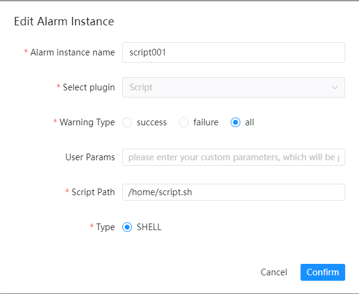

# 스크립트

알림을 위해 '쉘 스크립트'를 사용해야 하는 경우 알림 인스턴스 관리에서 알림 인스턴스를 생성하고 '스크립트' 플러그인을 선택하세요.
다음은 `Script` 구성 예를 보여줍니다.

## 매개변수 구성

|**매개변수** |**설명** |
|---------------|--------------------------------------------------|
|사용자 매개변수 |사용자 정의 매개변수가 스크립트에 전달됩니다.|
|스크립트 경로 |서버의 파일 위치 경로는 .sh 파일만 지원 |
|유형 |`Shell` 스크립트를 지원합니다.|

### 참고

1.실행 중인 테넌트의 스크립트 파일 접근 권한을 고려하세요.
2. 스크립트 경고는 해당 쉘 스크립트를 실행합니다.플랫폼은 스크립트 내용과 변조 여부를 확인하지 않습니다.이 쉘 스크립트에 대한 높은 수준의 신뢰가 필요하며 사용자가 이 기능을 남용하지 않을 것이라는 믿음이 필요합니다.