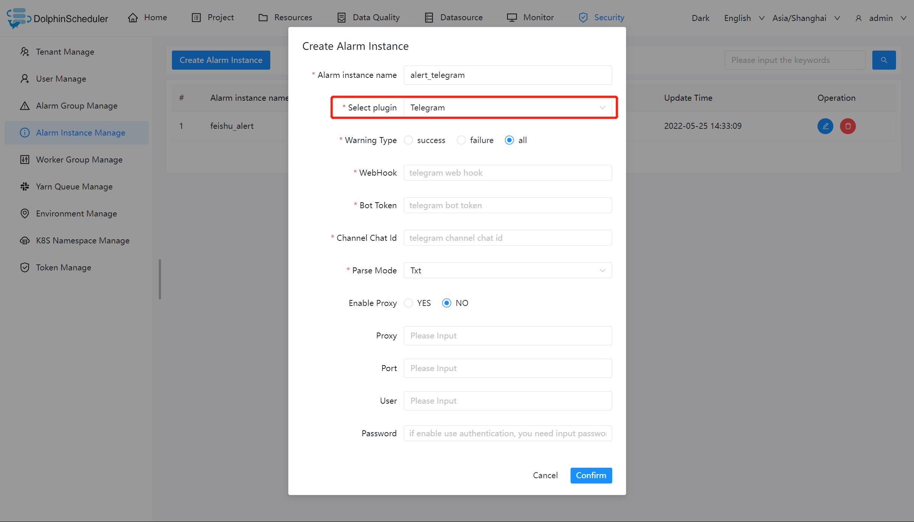

# 텔레그램

알림을 보내기 위해 '텔레그램'이 필요한 경우 알림 인스턴스 관리에서 알림 인스턴스를 생성하고 '텔레그램' 플러그인을 선택하세요.
다음은 `Telegram` 구성 예를 보여줍니다.



## 매개변수 구성

|**매개변수** |**설명** |
|---------------|--------------------------------------------------|
|웹훅 |로봇을 사용하여 메시지를 보낼 때 텔레그램의 WebHook입니다.|
|봇토큰 |로봇의 액세스 토큰입니다.|
|채팅ID |서브 텔레그램 채널.|
|구문 분석 모드 |메시지 구문 분석 유형(txt, markdown, markdownV2, html 지원)|
|활성화 프록시 |프록시 서버를 활성화합니다.|
|프록시 |프록시 서버의 프록시 주소입니다.|
|포트 |프록시 서버의 프록시 포트입니다.|
|사용자 |프록시 서버에 대한 인증(사용자 이름)입니다.|
|비밀번호 |프록시 서버에 대한 인증(비밀번호)입니다.|

### 참고

웹후크는 DolphinScheduler가 구성하는 HTTP POST의 동일한 JSON 본문을 수신하고 사용할 수 있어야 하며 다음은 JSON 본문을 보여줍니다.```json
{
    "text": "[{\"projectId\":1,\"projectName\":\"p1\",\"owner\":\"admin\",\"processId\":35,\"processDefinitionCode\":4928367293568,\"processName\":\"s11-3-20220324084708668\",\"taskCode\":4928359068928,\"taskName\":\"s1\",\"taskType\":\"SHELL\",\"taskState\":\"FAILURE\",\"taskStartTime\":\"2022-03-24 08:47:08\",\"taskEndTime\":\"2022-03-24 08:47:09\",\"taskHost\":\"192.168.1.103:1234\",\"logPath\":\"\"}]",
    "chat_id": "chat id number"
}
````

## 참조:

- [텔레그램 애플리케이션 봇 안내](https://core.telegram.org/bots)
- [텔레그램 봇 API](https://core.telegram.org/bots/api)
- [텔레그램 SendMessage API](https://core.telegram.org/bots/api#sendmessage)