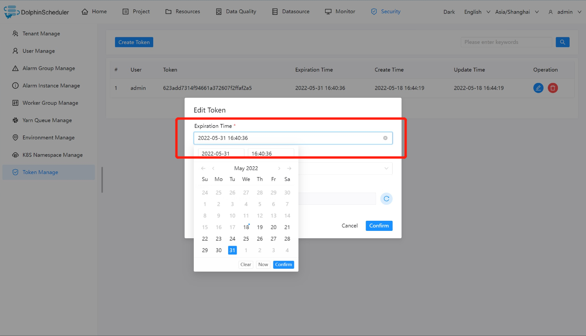
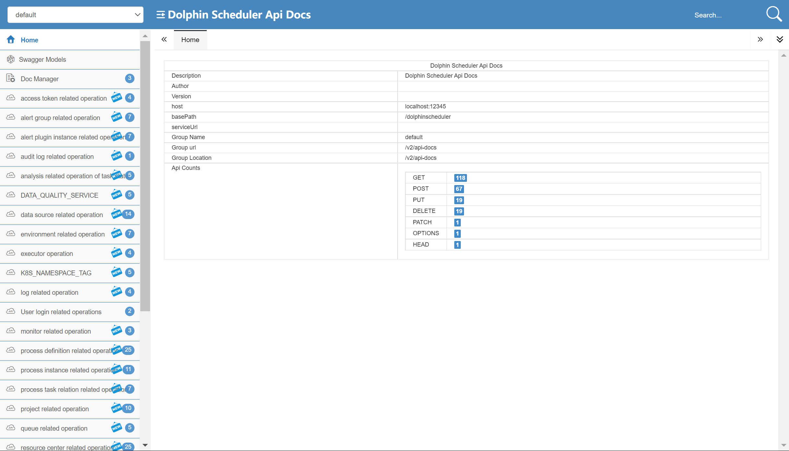
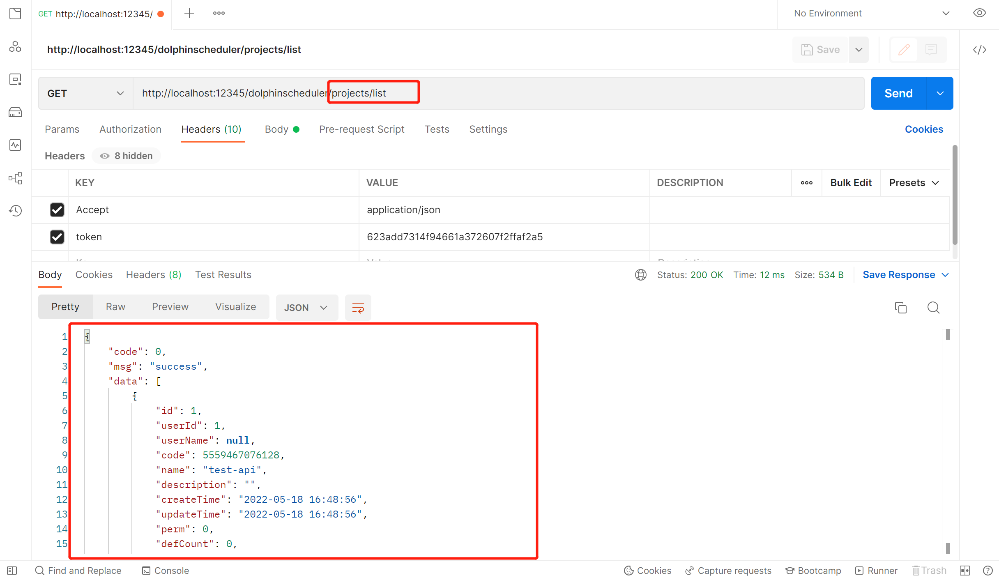
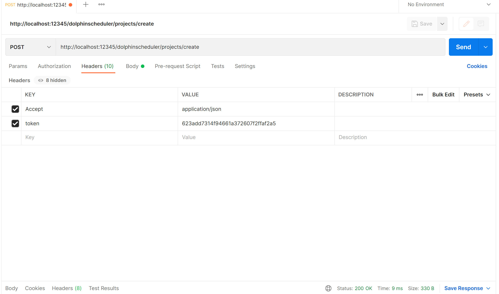
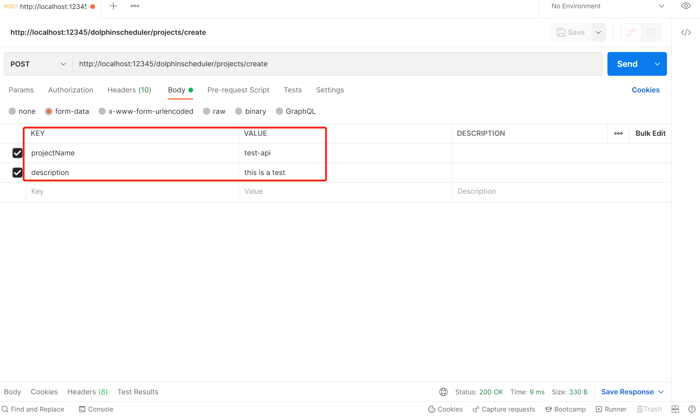
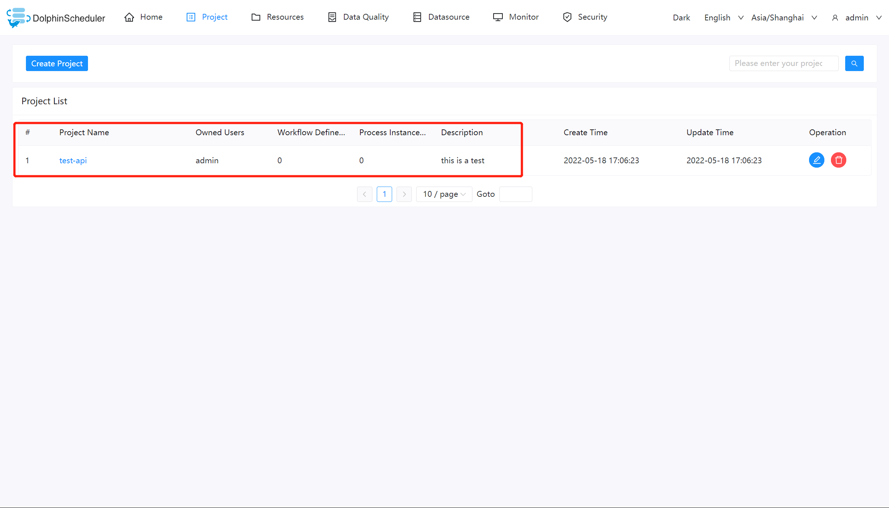
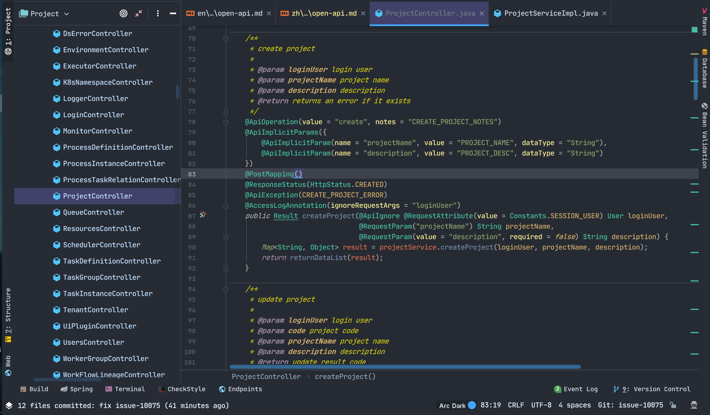
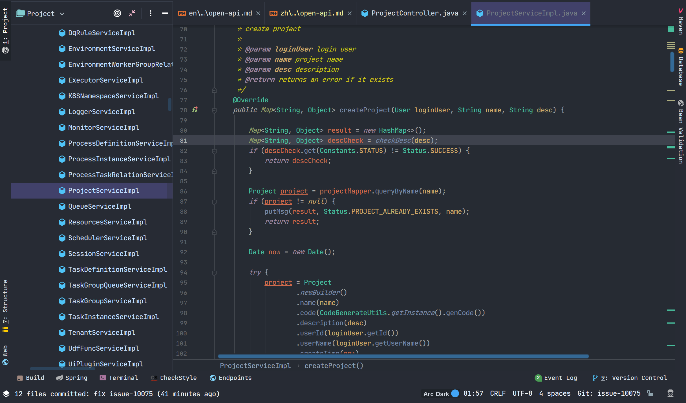

# 오픈 API

## 배경

일반적으로 프로젝트와 프로세스는 페이지를 통해 생성되지만, 타사 시스템과의 통합을 고려하면 프로젝트와 워크플로우를 관리하기 위한 API 호출이 필요합니다.

## DolphinScheduler API 호출 작업 단계

### 토큰 생성

1. 스케줄링 시스템에 로그인하고 "보안"을 클릭한 후 왼쪽의 "토큰 관리"를 클릭하고 "토큰 만들기"를 클릭하여 토큰을 생성합니다.


2. "만료 시간"(토큰 유효 시간)을 선택하고 "사용자"(API 작업을 수행할 지정된 사용자 선택)를 선택한 다음 "토큰 생성"을 클릭하고 `토큰` 문자열을 복사한 후 "제출"을 클릭합니다.



### 예

#### 프로젝트 목록 조회

1. API 문서를 엽니다

> 주소：http://{API 서버 ip}:12345/dolphinscheduler/swagger-ui/index.html?언어=en_US&lang=en



2. 테스트 API를 선택합니다. 이 테스트에 선택된 API는 'queryAllProjectList'입니다.

> 프로젝트/목록

3. `Postman`을 열고 API 주소를 입력하고 `Headers`에 `Token`을 입력한 다음 요청을 보내 결과를 확인합니다.   ```
   token: The Token just generated
````



#### 프로젝트 만들기

이는 호출 API를 사용하여 해당 프로젝트를 생성하는 방법을 보여줍니다.

API 문서를 참조하여 Postman 헤더에서 KEY를 Accept로, VALUE를 application/json의 매개변수로 구성합니다.



그런 다음 Body에서 필수 projectName 및 설명 매개변수를 구성합니다.



게시물 요청 결과를 확인하세요.



반환된 `msg` 정보는 "success"이며, 이는 API를 통해 프로젝트를 성공적으로 생성했음을 나타냅니다.

프로젝트 생성 소스 코드에 관심이 있으시면 다음 내용을 계속 읽어보세요.：

### 부록: 프로젝트 생성 소스 코드



