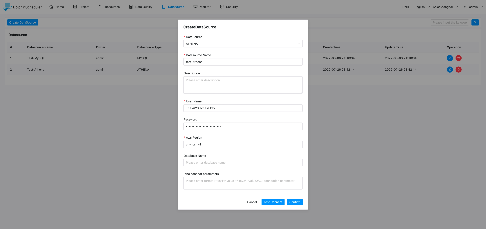

# AWS 아테나

## 데이터 소스 매개변수

|**데이터 소스** |**설명** |
|---------------|-----------------------------------------------|
|데이터 소스 |아테나를 선택하세요.|
|데이터 소스 이름 |DataSource의 이름을 입력합니다.|
|설명 |DataSource에 대한 설명을 입력합니다.|
|사용자 이름 |AWS 액세스 키를 설정합니다.|
|비밀번호 |AWS 보안 액세스 키를 설정합니다.|
|AWS 지역 |AWS 리전을 설정합니다.|
|데이터베이스 이름 |ATHENA 연결의 데이터베이스 이름을 입력합니다.|
|Jdbc 연결 매개변수 |ATHENA 연결을 위한 매개변수 설정(JSON 형식)|

## 네이티브 지원

- 아니요, 이 데이터 소스를 활성화하려면 [pseudo-cluster](../installation/pseudo-cluster.md) `플러그인 종속성 다운로드` 섹션의 섹션 예를 읽어보세요.
- JDBC 드라이버 구성 참조 문서 [athena-connect-with-jdbc](https://docs.amazonaws.cn/athena/latest/ug/connect-with-jdbc.html)
- 드라이버 다운로드 링크 [SimbaAthenaJDBC-2.0.31.1000/AthenaJDBC42.jar](https://s3.cn-north-1.amazonaws.com.cn/athena-downloads-cn/drivers/JDBC/SimbaAthenaJDBC-2.0.31.1000/AthenaJDBC42.jar)