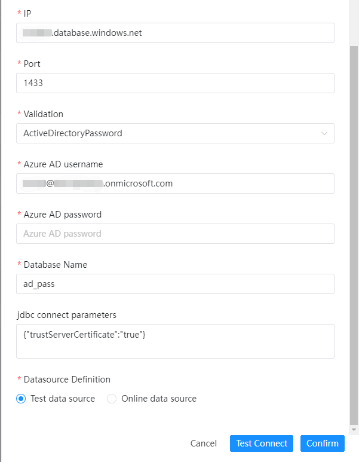
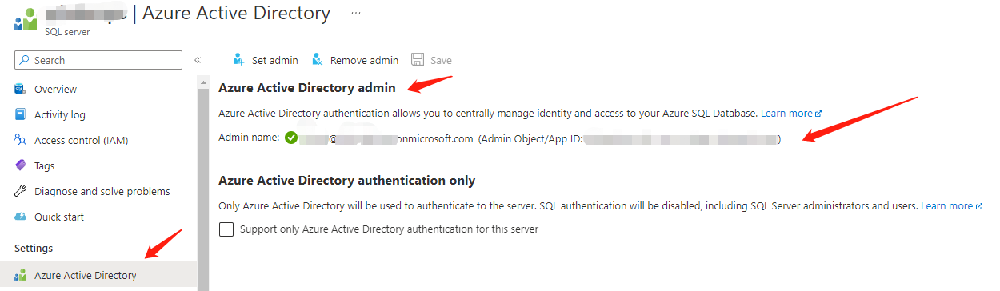
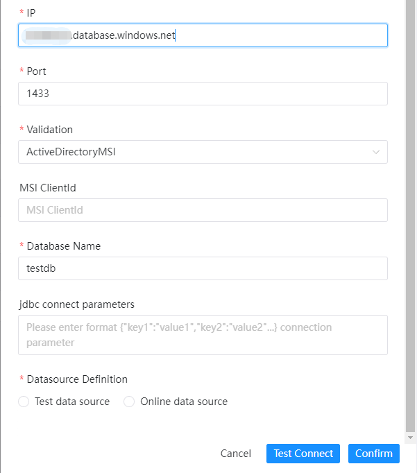
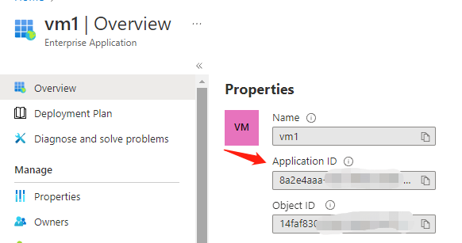
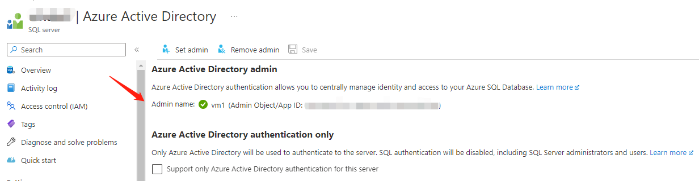
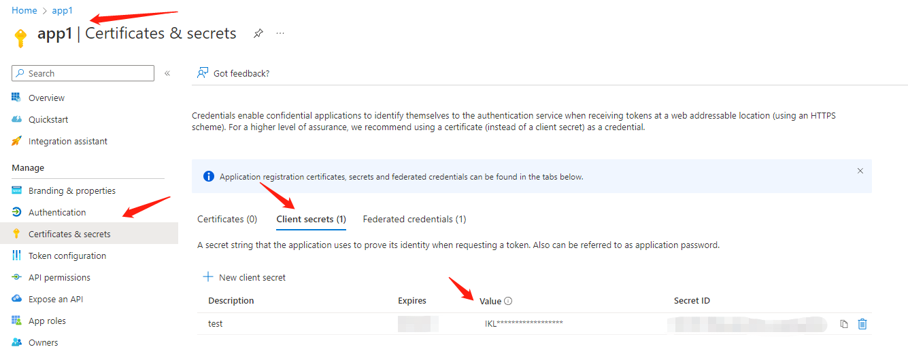
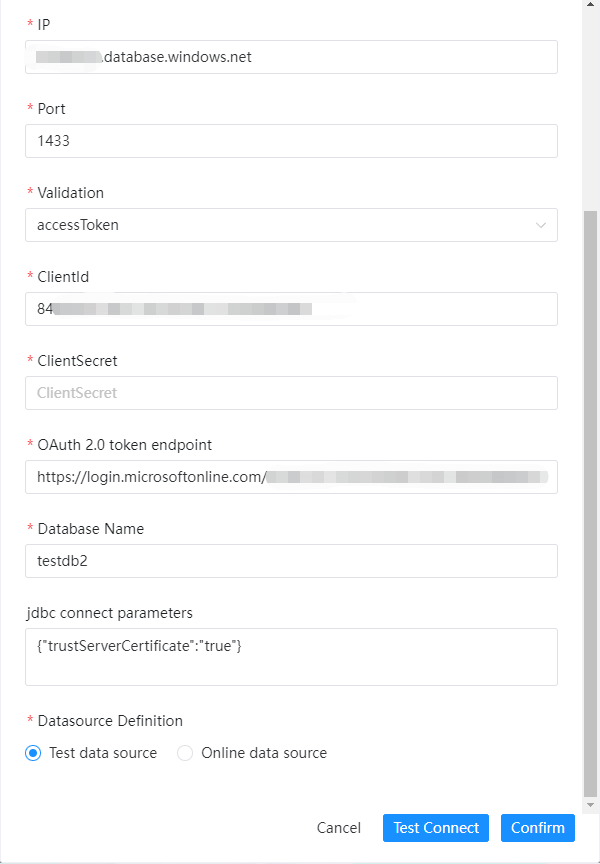
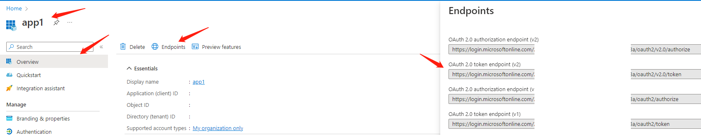

# 애저 SQL

## 인증 모드

### SQL비밀번호

Azure SQL 서버 사용자 이름과 비밀번호를 사용하여 로그인하세요.

|**데이터 소스** |**설명** |
|---------------|-----------------------------------------------------------------------------------------------------------------------------------------|
|데이터 소스 |AZURE SQL을 선택합니다.|
|데이터 소스 이름 |DataSource의 이름을 입력합니다.|
|설명 |DataSource에 대한 설명을 입력합니다.|
|IP/호스트 이름 |AZURE SQL 서비스 호스트 또는 IP를 입력합니다(예: xxx.database.windows.net).|
|포트 |기본적으로 AZURE SQL 서비스 포트인 1433을 입력합니다.|
|인증 모드 |연결 인증 모드를 설정합니다.현재 지원되는 항목은 SqlPassword,ActiveDirectoryPassword,ActiveDirectoryMSI,ActiveDirectoryServicePrincipal,accessToken입니다.|
|사용자 이름 |AZURE SQL 연결을 위한 사용자 이름을 설정합니다.|
|비밀번호 |AZURE SQL 연결을 위한 비밀번호를 설정합니다.|
|데이터베이스 이름 |AZURE SQL 연결의 데이터베이스 이름을 입력합니다.|
|Jdbc 연결 매개변수 |AZURE SQL 연결을 위한 매개변수 설정(JSON 형식)|

다음은 다양한 속성에 대해서만 설명합니다.

### ActiveDirectory 비밀번호

Azure AD 사용자 이름과 비밀번호를 사용하여 로그인하세요.

전제 조건: AD 계정을 Azure SQL 서버의 관리자로 설정합니다.

- Azure AD 사용자 이름: Azure AD 계정 이름(예: xx@xx.onmicrosoft.com)
- 비밀번호: Azure AD 비밀번호

### 액티브디렉토리MSI

Azure 내부 서비스를 사용하여 로그인하세요.
전제 조건: Azure 가상 머신을 Azure SQL 서버의 관리자로 설정합니다.MSIClientId는 VM의 애플리케이션 ID여야 하며 필수는 아닙니다.

- MSIClientId: ActiveDirectoryMSI 모드의 내부 리소스(예: Azure VM, 애플리케이션 또는 Azure Active Directory 애플리케이션 기능)의 clientId를 입력합니다.

### ActiveDirectoryServicePrincipal

애플리케이션(클라이언트) ID와 비밀번호를 사용하여 로그인하세요.
전제 조건: 애플리케이션을 Azure SQL 서버의 관리자로 설정합니다.한편, 애플리케이션에 대한 클라이언트 비밀번호를 신청하고 비밀번호와 ID를 모두 사용하여 로그인하세요.

- clientId: 애플리케이션(클라이언트) ID
- clientSecret: 애플리케이션 클라이언트 비밀번호

### 액세스토큰

임시 토큰을 신청하려면 애플리케이션(클라이언트) ID와 비밀번호를 사용하고, 로그인(JDBC 연결 아님)에는 토큰을 사용합니다.

- clientId: 애플리케이션(클라이언트) ID
- clientSecret: 애플리케이션 클라이언트 비밀번호
- OAuth 2.0 토큰 엔드포인트(v2): 애플리케이션 OAuth 2.0 토큰 엔드포인트(v2)

## 네이티브 지원

- 아니요, 이 데이터 소스를 활성화하려면 [pseudo-cluster](../installation/pseudo-cluster.md) `플러그인 종속성 다운로드` 섹션의 섹션 예를 읽어보세요.
- 드라이버 다운로드 링크 [mssql-jdbc-11.2.1.jre8](https://repo1.maven.org/maven2/com/microsoft/sqlserver/mssql-jdbc/11.2.1.jre8/mssql-jdbc-11.2.1.jre8.jar)