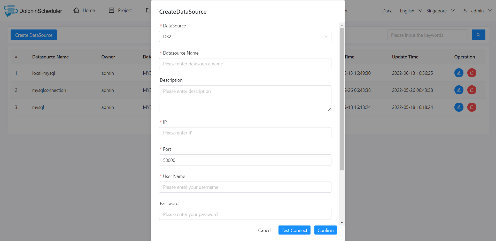

# DB2

## 데이터 소스 매개변수

|**데이터 소스** |**설명** |
|------------|-------------------------------|
|데이터 소스 |DB2를 선택하십시오.|
|데이터 소스 이름 |데이터 소스의 이름을 입력합니다.|
|설명 |데이터 소스에 대한 설명을 입력합니다.|
|IP/호스트 이름 |DB2 서비스 IP를 입력하십시오.|
|포트 |DB2 서비스 포트를 입력하십시오.|
|사용자 이름 |DB2 연결을 위한 사용자 이름을 설정합니다.|
|비밀번호 |DB2 연결을 위한 비밀번호를 설정하십시오.|
|데이터베이스 이름 |DB2 연결의 데이터베이스 이름을 입력하십시오.|
|jdbc 연결 매개변수 |JSON 형식의 DB2 연결을 위한 매개변수 설정입니다.|

## 네이티브 지원

- 아니요, 이 데이터 소스를 활성화하려면 [pseudo-cluster](../installation/pseudo-cluster.md) `플러그인 종속성 다운로드` 섹션의 섹션 예를 읽어보세요.