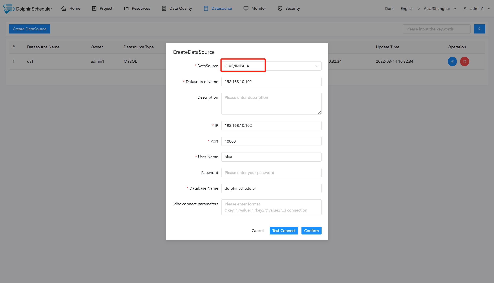
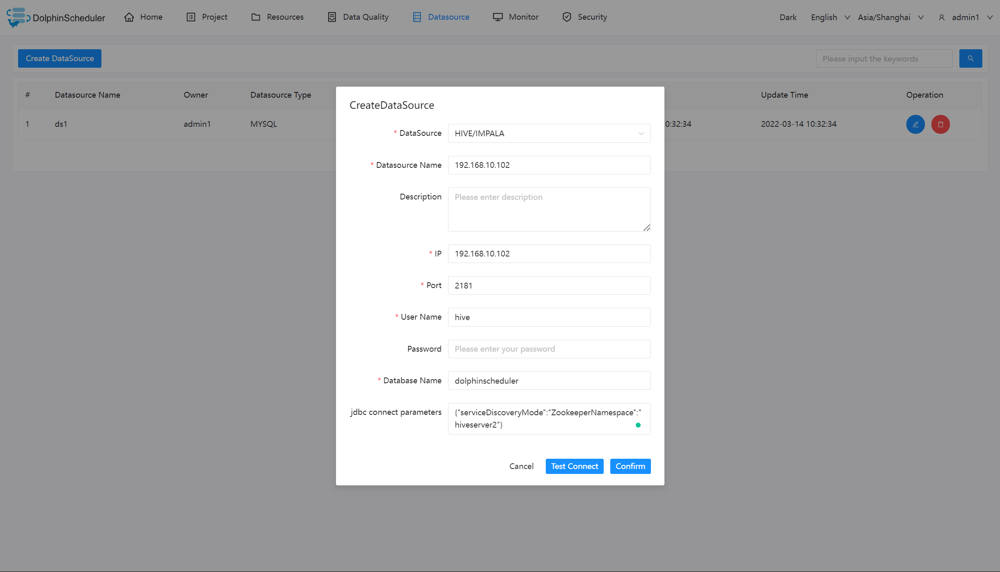

# 하이브

## HiveServer2 사용



## 데이터 소스 매개변수

|**데이터 소스** |**설명** |
|---------------|-------------------------------|
|데이터 소스 |하이브를 선택하세요.|
|데이터 소스 이름 |DataSource의 이름을 입력합니다.|
|설명 |DataSource에 대한 설명을 입력합니다.|
|IP/호스트 이름 |HIVE 서비스 IP를 입력하세요.|
|포트 |HIVE 서비스 포트를 입력하세요.|
|사용자 이름 |HIVE 연결을 위한 사용자 이름을 설정합니다.|
|비밀번호 |HIVE 연결을 위한 비밀번호를 설정합니다.|
|데이터베이스 이름 |HIVE 연결의 데이터베이스 이름을 입력합니다.|
|Jdbc 연결 매개변수 |HIVE 연결을 위한 매개변수 설정(JSON 형식)|

> 주의사항: 동일한 세션에서 여러 HIVE SQL을 실행하려면 `common.properties`에서 `support.hive.oneSession = true`를 설정하면 됩니다.
> HIVE SQL을 실행하기 전에 env 변수를 설정하려고 할 때 도움이 됩니다.'support.hive.oneSession'의 기본값은 'false'이며 다중 SQL은 서로 다른 세션에서 실행됩니다.

## HiveServer2 HA ZooKeeper 사용



주의사항: Kerberos가 비활성화된 경우 'hadoop.security.authentication.startup.state' 매개변수가 false이고 'java.security.krb5.conf.path' 매개변수 값이 null로 설정되어 있는지 확인하세요.
**Kerberos**가 활성화된 경우 `common.properties`에서 다음 매개변수를 설정해야 합니다.```conf
# whether to startup kerberos
hadoop.security.authentication.startup.state=true

# java.security.krb5.conf path
java.security.krb5.conf.path=/opt/krb5.conf

# login user from keytab username
login.user.keytab.username=hdfs-mycluster@ESZ.COM

# login user from keytab path
login.user.keytab.path=/opt/hdfs.headless.keytab
````

## 네이티브 지원

- 아니요, 이 데이터 소스를 활성화하려면 [pseudo-cluster](../installation/pseudo-cluster.md) `플러그인 종속성 다운로드` 섹션의 섹션 예를 읽어보세요.