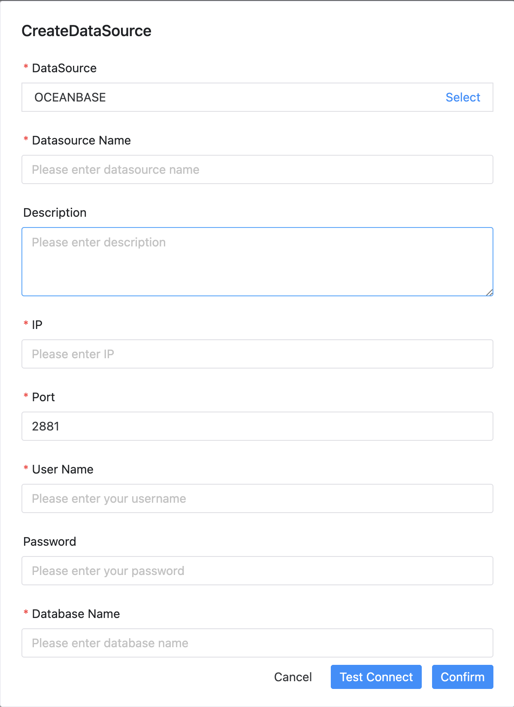

# 오션베이스

## 데이터 소스 매개변수

|**데이터 소스** |**설명** |
|---------------|--------------------------------------------------|
|데이터 소스 |오션베이스를 선택하세요.|
|데이터 소스 이름 |DataSource의 이름을 입력합니다.|
|설명 |DataSource에 대한 설명을 입력합니다.|
|IP/호스트 이름 |OceanBase 서비스 IP를 입력하세요.|
|포트 |OceanBase 서비스 포트를 입력하세요.|
|사용자 이름 |OceanBase 연결을 위한 사용자 이름을 설정합니다.|
|비밀번호 |OceanBase 연결을 위한 비밀번호를 설정하세요.|
|데이터베이스 이름 |OceanBase 연결의 데이터베이스 이름을 입력합니다.|
|호환 모드 |OceanBase 연결의 호환 모드를 설정합니다.|
|Jdbc 연결 매개변수 |OceanBase 연결을 위한 매개변수 설정(JSON 형식)|

## 네이티브 지원

아니요, 먼저 OceanBase jdbc 드라이버 [oceanbase-client](https://mvnrepository.com/artifact/com.oceanbase/oceanbase-client)를 가져와야 합니다. 이 데이터 소스를 활성화하려면 [pseudo-cluster](../installation/pseudo-cluster.md) `플러그인 종속성 다운로드` 섹션의 섹션 예를 읽어보세요.

데이터 소스의 호환 모드는 'mysql' 또는 'oracle'이 될 수 있으며, 'mysql' 모드로 OceanBase만 사용하는 경우 OceanBase를 MySQL로 취급하고 [mysql 데이터 소스](mysql.md)를 참조하여 데이터 소스를 관리할 수도 있습니다.