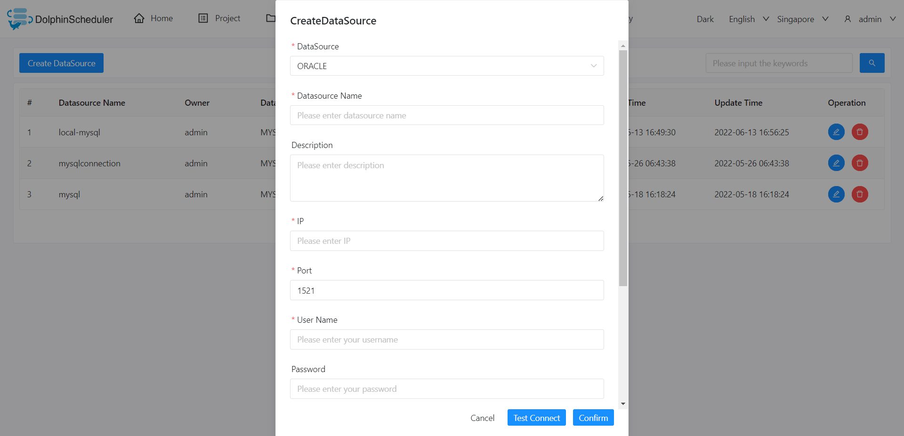

# 오라클

## 데이터 소스 매개변수

|**데이터 소스** |**설명** |
|--------------------------------------|----------------------------------------------------------------------------------------------------------------------------|
|데이터 소스 |오라클을 선택하세요.|
|데이터 소스 이름 |데이터 소스의 이름을 입력합니다.|
|설명 |데이터 소스에 대한 설명을 입력합니다.|
|IP/호스트 이름 |Oracle 서비스 IP를 입력합니다.|
|포트 |Oracle 서비스 포트를 입력합니다.|
|사용자 이름 |Oracle 연결을 위한 사용자 이름을 설정합니다.|
|비밀번호 |Oracle 연결을 위한 비밀번호를 설정합니다.|
|데이터베이스 이름 |Oracle 연결의 ServiceName 또는 SID를 입력합니다.|
|서비스 이름 또는 SID |데이터베이스 이름 열의 항목에 따라 ServiceName 또는 SID를 선택합니다.|
|jdbc 연결 매개변수 |Oracle 연결을 위한 매개변수 설정(JSON 형식)예를 들어, {"schema": "abc"}를 사용하여 사용할 데이터베이스 abc를 지정할 수 있습니다.|

## 네이티브 지원

- 아니요, 이 데이터 소스를 활성화하려면 [pseudo-cluster](../installation/pseudo-cluster.md) `플러그인 종속성 다운로드` 섹션의 섹션 예를 읽어보세요.