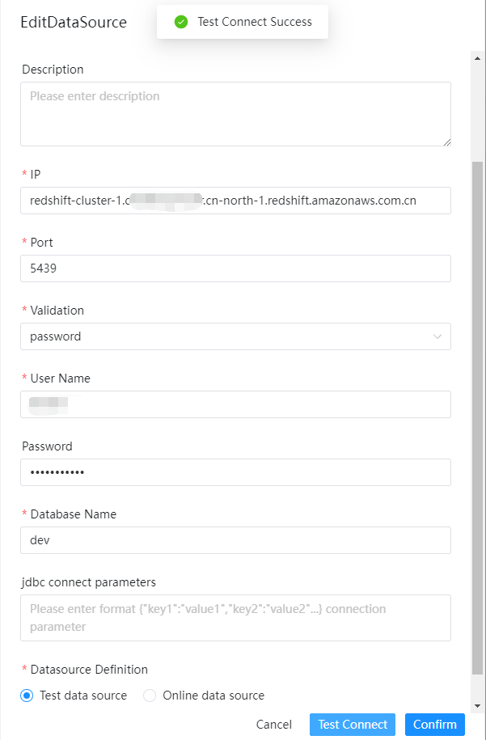
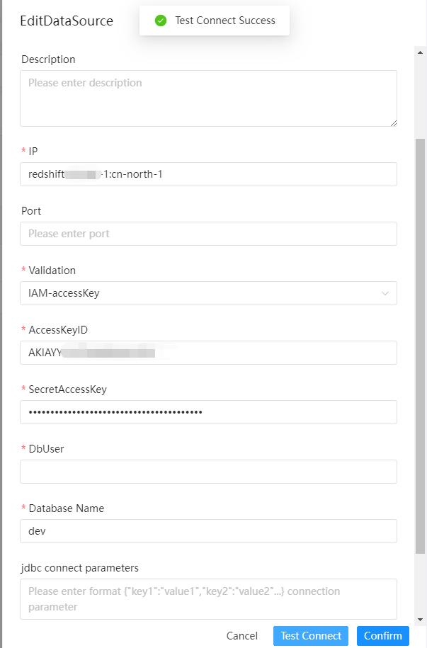
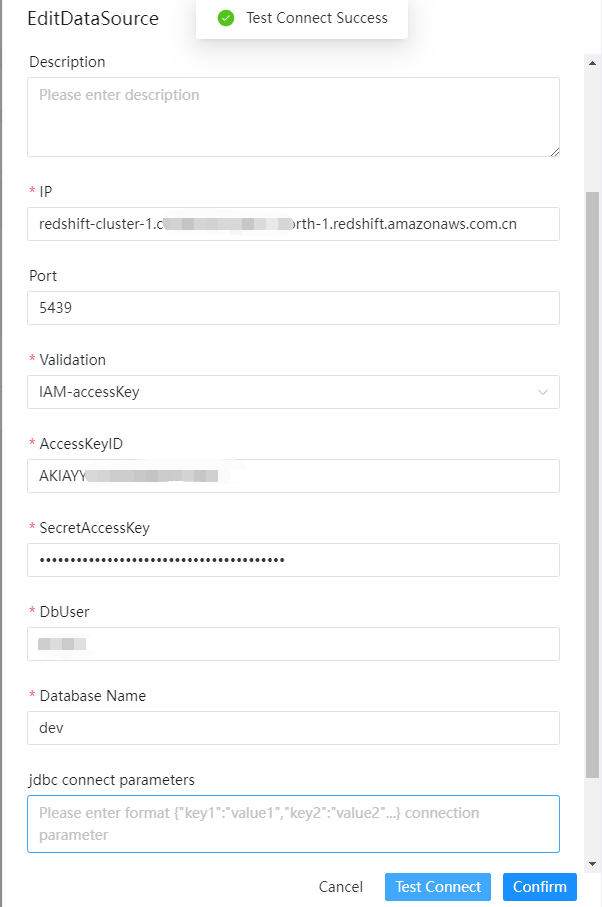

# 아마존 레드시프트

## 데이터 소스 매개변수

|**데이터 소스** |**설명** |
|------------|------------------------------------------------|
|데이터 소스 |레드시프트를 선택합니다.|
|데이터 소스 이름 |데이터 소스의 이름을 입력합니다.|
|설명 |데이터 소스에 대한 설명을 입력합니다.|
|IP/호스트 이름 |Redshift 서비스 IP를 입력하세요.|
|포트 |Redshift 서비스 포트를 입력하세요.|
|검증 |Redshift 인증 모드로 들어갑니다.|
|사용자 이름 |Redshift 연결을 위한 사용자 이름을 설정합니다.|
|비밀번호 |Redshift 연결을 위한 비밀번호를 설정합니다.|
|데이터베이스 이름 |Redshift 연결의 데이터베이스 이름을 입력합니다.|
|jdbc 연결 매개변수 |JSON 형식의 Redshift 연결을 위한 매개변수 설정입니다.|
|액세스키ID |모드 IAM-accessKey 액세스 키 ID입니다.|
|비밀액세스키 |모드 IAM-accessKey 비밀 액세스 키입니다.|

### 유효성 검사: 비밀번호

AWS redshift 데이터베이스 사용자 이름과 비밀번호를 사용하여 로그인합니다.

### 검증: IAM-accessKey

클러스터 ID, AWS 리전, 포트(선택 사항) 및 IAM을 사용하여 로그인합니다.

## 네이티브 지원

- 아니요, 이 데이터 소스를 활성화하려면 [pseudo-cluster](../installation/pseudo-cluster.md) `플러그인 종속성 다운로드` 섹션의 섹션 예를 읽어보세요.
- Redshift IAM JDBC 드라이버 구성 참조 문서 [redshift-connect-IAM-jdbc](https://docs.aws.amazon.com/redshift/latest/mgmt/geneating-iam-credentials-configure-jdbc-odbc.html)에 대해 자세히 알아보세요.