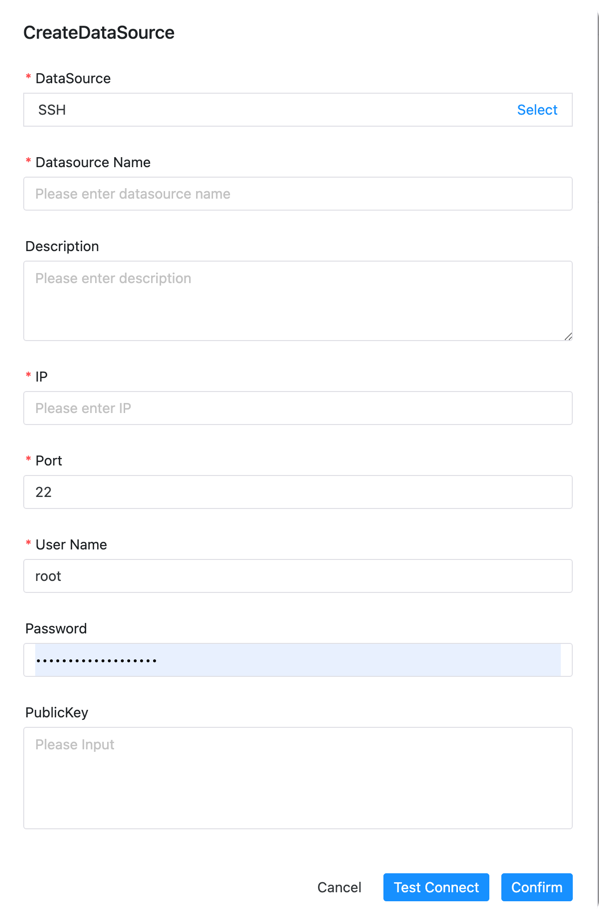

# SSH 데이터 소스

이 데이터 소스는 RemoteShell 구성 요소가 원격으로 명령을 실행하는 데 사용됩니다.

- 데이터 소스: SSH
- 데이터 소스 이름: 데이터 소스의 이름을 입력합니다.
- 설명 : 데이터소스에 대한 설명을 입력합니다.
- IP Hostname : SSH 접속을 위한 IP를 입력하세요.
- 포트 : SSH에 접속할 포트를 입력하세요.
- 사용자 이름: SSH에 접속하기 위한 사용자 이름을 설정합니다.
- 비밀번호 : SSH에 접속하기 위한 비밀번호를 설정합니다.
- 공개키: SSH 접속을 위한 공개키를 설정합니다.

## 네이티브 지원

- 아니요, 이 데이터 소스를 활성화하려면 [pseudo-cluster](../installation/pseudo-cluster.md) `플러그인 종속성 다운로드` 섹션의 섹션 예를 읽어보세요.