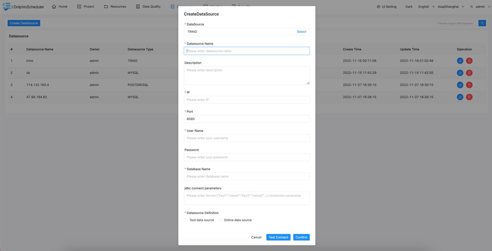

# 트리노

## 데이터 소스 매개변수

|**데이터 소스** |**설명** |
|------------|------------------------------------------------------------------|
|데이터 소스 |트리노를 선택하세요.|
|데이터 소스 이름 |데이터 소스의 이름을 입력합니다.|
|설명 |데이터 소스에 대한 설명을 입력합니다.|
|IP/호스트 이름 |Trino 서비스 IP를 입력하세요.|
|포트 |Trino 서비스 포트를 입력하세요.|
|사용자 이름 |Trino 연결을 위한 사용자 이름을 설정합니다.|
|비밀번호 |Trino 연결을 위한 비밀번호를 설정하세요.|
|데이터베이스 이름 |Trino 연결의 데이터베이스 이름을 입력합니다.|
|jdbc 연결 매개변수 |JSON 형식의 Trino 연결을 위한 매개변수 설정입니다.|
|데이터 소스 정의 |데이터 소스가 테스트 데이터 소스인지 아니면 온라인 데이터 소스인지 정의 |

## 네이티브 지원

- 아니요, 이 데이터 소스를 활성화하려면 [pseudo-cluster](../installation/pseudo-cluster.md) `플러그인 종속성 다운로드` 섹션의 섹션 예를 읽어보세요.