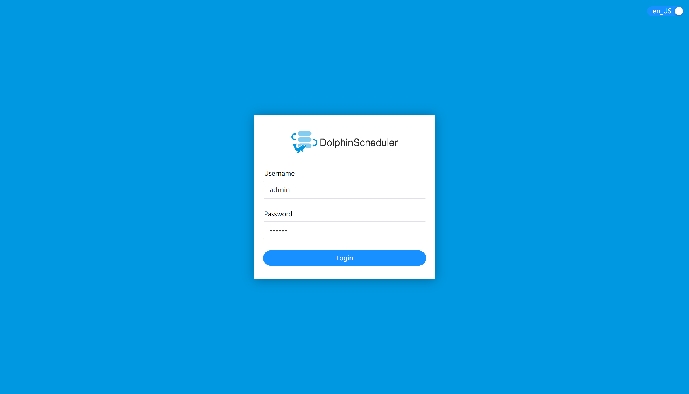

# 독립형

DolphinScheduler의 빠른 경험을 위한 독립 실행형입니다.

초보자이고 DolphinScheduler 기능을 경험하고 싶다면 [Standalone 배포](standalone.md)에 따라 설치하는 것이 좋습니다.
보다 완벽한 기능을 경험하고 대규모 작업을 예약하려면 [pseudo-cluster 배포](pseudo-cluster.md)에 따라 설치하는 것이 좋습니다.
DolphinScheduler를 프로덕션 환경에 배포하려면 [클러스터 배포](cluster.md) 또는 [Kubernetes 배포](kubernetes.md)를 따르는 것이 좋습니다.

> **_참고:_** Standalone은 기본적으로 인메모리 H2 데이터베이스인 ZooKeeper Testing Server를 사용하므로 작업량이 너무 많으면 불안정해질 수 있으므로 20개 미만의 워크플로만 사용하는 것이 좋습니다.
> Standalone이 중지되거나 다시 시작되면 메모리 내 H2 데이터베이스가 지워집니다.mysql 또는 postgresql과 같은 외부 데이터베이스와 함께 독립 실행형을 사용하려면 [`데이터베이스 구성`](#database-configuration)을 참조하세요.

## 준비

- JDK: [JDK][jdk](1.8 또는 11)를 다운로드하고 `JAVA_HOME` 환경 변수를 설치 및 구성한 다음 `bin` 디렉토리(`JAVA_HOME`에 포함됨)를 `PATH` 변수에 추가합니다.사용자 환경에 이미 있는 경우 이 단계를 건너뛸 수 있습니다.
- 바이너리 패키지: [다운로드 페이지](https://dolphinscheduler.apache.org/en-us/download/<version>)에서 DolphinScheduler 바이너리 패키지를 다운로드하세요.<!-- markdown-link-check-disable-line -->

## 플러그인 종속성 다운로드

의사 클러스터 배포 시 [플러그인 종속성 다운로드](../installation/pseudo-cluster.md)를 참조하세요.독립형 최소 작업에는 플러그인 종속성 `dolphinscheduler-task-shell` 및 `dolphinscheduler-storage-hdfs`를 다운로드해야 합니다.

### 사용자 면제 및 권한 구성

배포 사용자를 생성하고 비밀번호 없이 `sudo`를 구성해야 합니다.다음은 `dolphinscheduler` 사용자를 생성하는 예입니다.```shell
# To create a user, login as root
useradd dolphinscheduler

# Add password
echo "dolphinscheduler" | passwd --stdin dolphinscheduler

# Configure sudo without password
sed -i '$adolphinscheduler  ALL=(ALL)  NOPASSWD: NOPASSWD: ALL' /etc/sudoers
sed -i 's/Defaults    requiretty/#Defaults    requiretty/g' /etc/sudoers

# Modify directory permissions and grant permissions for user you created above
chown -R dolphinscheduler:dolphinscheduler apache-dolphinscheduler-*-bin
chmod -R 755 apache-dolphinscheduler-*-bin
````

> **_주의사항:_**
>
> - `sudo -u {linux-user} -i` 명령을 사용하는 DolphinScheduler의 다중 테넌트 작업 전환 사용자로 인해 배포 사용자는 `sudo` 권한이 있어야 하며 비밀번호가 없어야 합니다.초보 학습자가 이해하지 못한다면 지금은 이 점을 무시해도 됩니다.
> - `/etc/sudoers` 파일에서 "Defaults requiretty" 줄을 찾으면 내용에 주석을 달아주세요.

## DolphinScheduler 독립형 서버 시작

### DolphinScheduler 추출 및 시작

바이너리 압축 패키지에는 독립 실행형 시작 스크립트가 있으며, 추출 후 빠르게 시작할 수 있습니다.sudo 권한이 있는 사용자로 전환하고 스크립트를 실행합니다.```shell
# Extract and start Standalone Server
tar -xvzf apache-dolphinscheduler-*-bin.tar.gz
chmod -R 755 apache-dolphinscheduler-*-bin
cd apache-dolphinscheduler-*-bin
bash ./bin/dolphinscheduler-daemon.sh start standalone-server
````

### 로그인 DolphinScheduler

`http://localhost:12345/dolphinscheduler/ui` 주소에 접속하여 DolphinScheduler UI에 로그인합니다.기본 사용자 이름과 비밀번호는 **admin/dolphinscheduler123**입니다.



### 서버 시작 또는 중지

`./bin/dolphinscheduler-daemon.sh` 스크립트는 독립 실행형을 빠르게 시작할 수 있을 뿐만 아니라 서비스 작업을 중지하는 데에도 사용할 수 있습니다.다음은 모든 명령입니다.```shell
# Start Standalone Server
bash ./bin/dolphinscheduler-daemon.sh start standalone-server
# Stop Standalone Server
bash ./bin/dolphinscheduler-daemon.sh stop standalone-server
# Check Standalone Server status
bash ./bin/dolphinscheduler-daemon.sh status standalone-server
````

> 참고: Python 게이트웨이 서비스는 기본적으로 비활성화되어 있습니다.Python 게이트웨이를 시작하려는 경우
> api-server 구성에서 yaml 구성 `python-gateway.enabled : true`를 변경하여 서비스를 활성화하세요.
> 경로 `api-server/conf/application.yaml`

[jdk]: https://www.oracle.com/technetwork/java/javase/downloads/index.html

## 데이터베이스 구성

독립 실행형 서버는 H2 데이터베이스를 메타데이터 저장소로 사용하므로 간편하며 사용자는 서버를 설정하기 전에 데이터베이스를 시작할 필요가 없습니다.
그러나 사용자가 MySQL이나 PostgreSQL과 같은 다른 데이터베이스에 메타베이스를 저장하려면 일부 구성을 변경해야 합니다.데이터베이스를 생성하고 초기화하려면 [datasource-setting](datasource-setting.md) `독립형 스위칭 메타데이터 데이터베이스 구성` 섹션의 지침을 따르세요.

> 참고: DS는 기본적으로 /tmp/dolphinscheduler 디렉터리를 리소스 센터로 사용합니다.리소스 센터의 디렉터리를 변경해야 하는 경우 conf/common.properties 파일에서 리소스 항목을 변경하세요.