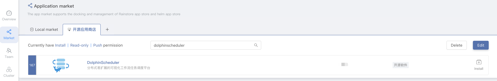
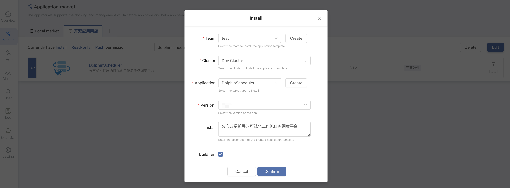
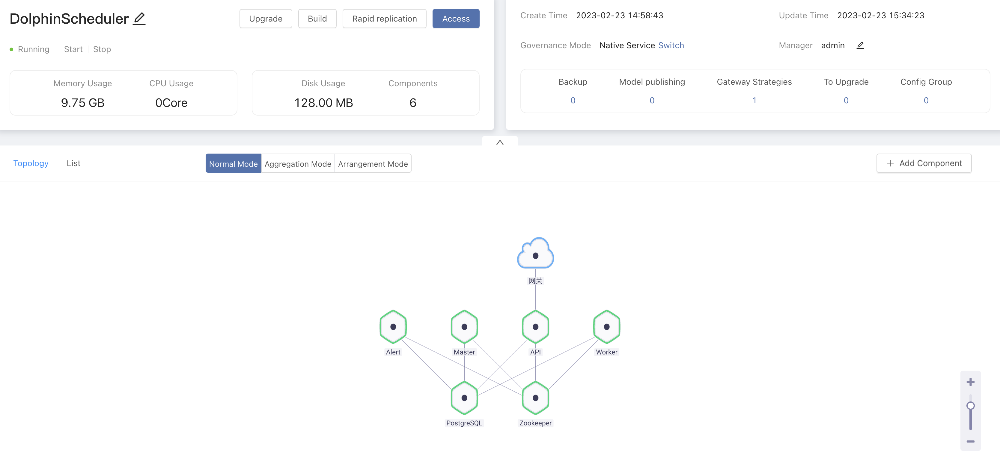
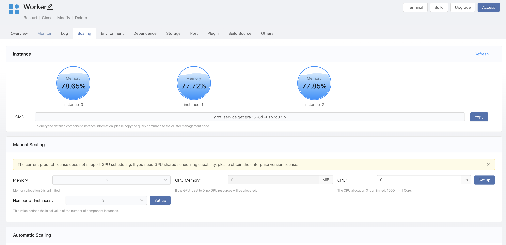
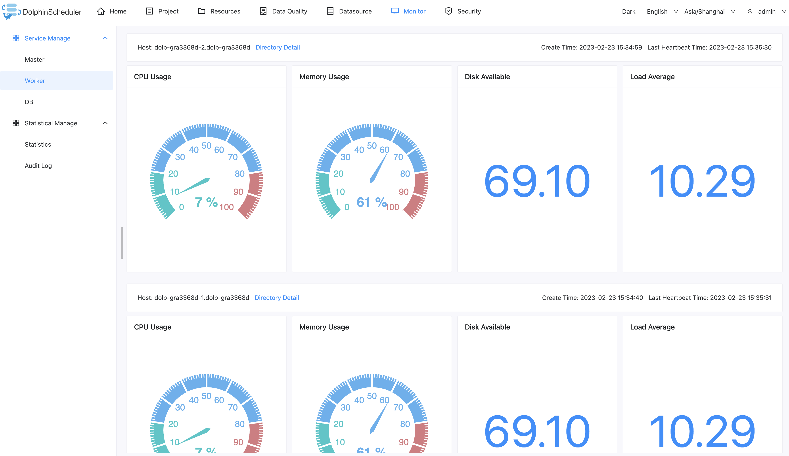
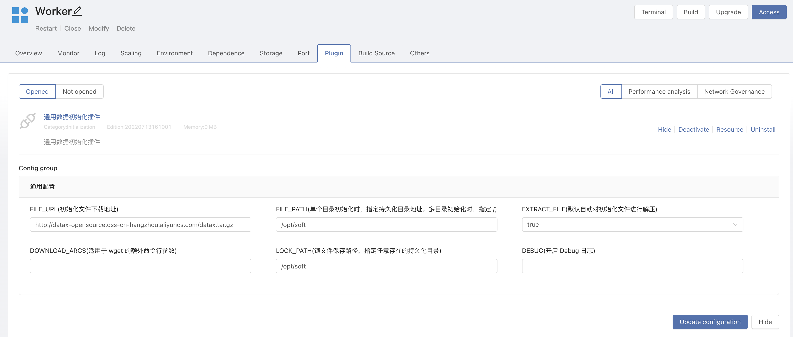

# Rainbond 배포 사용

이 섹션에서는 [Rainbond](https://www.rainbond.com/) 클라우드 네이티브 애플리케이션 관리 플랫폼을 통한 고가용성 DolphinScheduler 클러스터의 원클릭 배포에 대해 설명합니다.이 방법은 'Kubernetes' 모드에서 DolphinScheduler를 배포하기 위한 임계값을 낮추어 'Kubernetes'와 같은 복잡한 기술에 대해 잘 모르는 사용자에게 적합합니다.

## 전제 조건

* 사용 가능한 Rainbond 클라우드 네이티브 애플리케이션 관리 플랫폼이 전제 조건입니다. 공식 'Rainbond' 문서 [Rainbond 빠른 설치](https://www.rainbond.com/docs/quick-start/quick-install)를 참조하세요.

## DolphinScheduler 클러스터 원클릭 배포

1. Rainbond **플랫폼 관리 -> 앱 마켓플레이스 -> 오픈 소스 앱 스토어**로 이동하여 **dolphinScheduler**를 검색하여 DolphinScheduler 애플리케이션을 찾습니다.

2. DolphinScheduler 우측의 **install**을 클릭하면 설치 페이지로 이동합니다.해당 정보를 입력하고 '확인'을 클릭하면 설치가 시작됩니다.자동으로 애플리케이션 보기로 리디렉션됩니다.

|항목 선택 |설명 |
|---------------|------------|
|팀명 |사용자 작업 공간，네임스페이스로 격리 |
|클러스터 이름 |Kubernetes 클러스터 선택 |
|앱 선택 |애플리케이션 선택 |
|앱 버전 |DolphinScheduler 버전 선택 |

3. 몇 분 정도 기다리면 설치가 완료되고 'DolphinScheduler'가 실행됩니다.

4. 기본적으로 Rainbond에서 제공하는 도메인 이름을 통해 DolphinScheduler-API 구성 요소에 액세스하려면 애플리케이션에서 `접속` 버튼을 클릭합니다.기본 사용자 비밀번호는 **admin/dolphinscheduler123**입니다.

## API 마스터 워커 노드 텔레스코픽

DolphinScheduler API、Master、Worker는 모두 여러 인스턴스 확장을 지원하여 전체 서비스의 고가용성을 보장합니다.

예를 들어 `worker`를 선택하세요. `comment -> Telescopic` 페이지로 들어가서 인스턴스 수를 설정하세요.

`worker` 노드를 확인하려면 `DolphinScheduler UI -> Monitoring -> Worker` 페이지에 들어가 자세한 노드 정보를 확인하세요.

## 구성 파일

API와 작업자 서비스는 `/opt/dolphinscheduler/conf/common.properties` 구성 파일을 공유합니다.구성을 수정하려면 API 서비스의 구성만 수정하면 됩니다.

## Python 3를 어떻게 지원하나요?

작업자 서비스는 기본 `Python3`과 함께 설치됩니다. `PYTHON_LAUNCHER=/usr/bin/python3` 환경 변수를 추가할 수 있습니다.

## Hadoop, Spark, DataX를 어떻게 지원하나요?

'DataX'를 예로 들어 보겠습니다.

1. 플러그인 설치。Rainbond Team View -> 플러그인 -> App Store에서 플러그인 설치 -> '초기화 플러그인' 검색 설치.
2. Plugin.enter Worker 컴포넌트 -> 플러그인 -> '초기화 플러그인'을 열고 구성을 수정합니다.
* 파일_URL: http://datax-opensource.oss-cn-hangzhou.aliyuncs.com/datax.tar.gz
* FILE_PATH:/opt/soft
* LOCK_PATH:/opt/soft
3. 구성 요소 업데이트, 플러그인 'Datax'가 자동으로 다운로드되고 '/opt/soft'에 압축이 풀립니다.

---