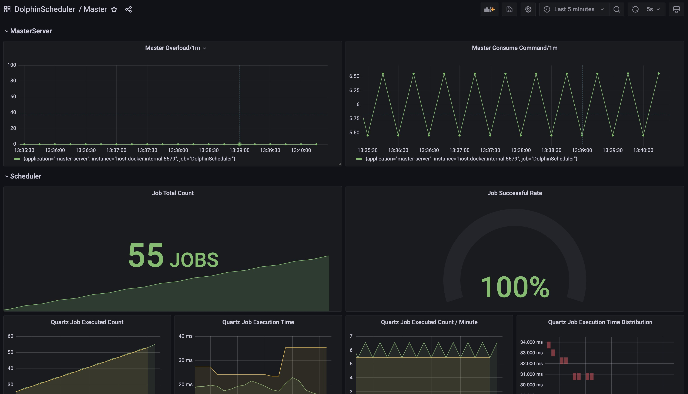
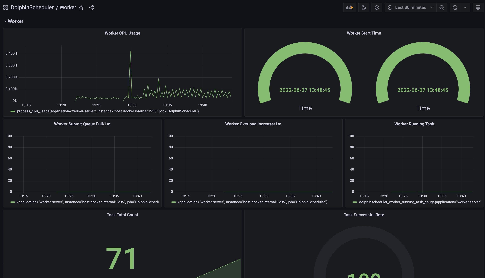
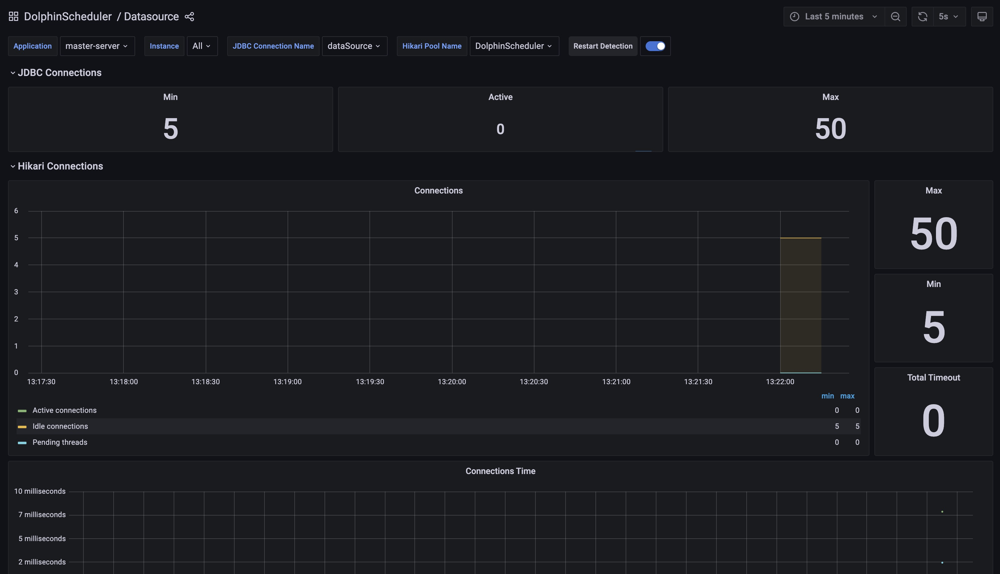

# 소개

Apache DolphinScheduler는 시스템 관찰 가능성에 대한 측정항목을 내보냅니다.우리는 애플리케이션 메트릭 파사드로 [마이크로미터](https://micrometer.io/)를 사용합니다.
현재는 'Prometheus 내보내기'만 지원하지만 곧 더 많은 기능이 지원될 예정입니다.

## 빠른 시작

- 사용자가 손을 쉽게 더럽힐 수 있도록 Apache DolphinScheduler를 사용하여 '독립형' 모드로 측정항목을 내보낼 수 있습니다.
- `독립형` 모드에서 작업을 트리거한 후 URL `http://localhost:12345/dolphinscheduler/actuator/metrics`를 방문하여 측정항목 목록에 액세스할 수 있습니다.
- `독립형` 모드에서 작업을 트리거한 후 `http://localhost:12345/dolphinscheduler/actuator/prometheus` URL을 방문하여 `prometheus-format` 측정항목에 액세스할 수 있습니다.
- 'Prometheus' 및 'Grafana'에 대한 더 나은 경험을 위해 기본 제공되는 'Grafana' 구성을 준비했습니다. 'Grafana' 대시보드를 찾을 수 있습니다.
`dolphinscheduler-meter/resources/grafana`에서 이러한 대시보드를 `Grafana` 인스턴스로 직접 가져옵니다.
- `docker`를 사용해 보려면 다음 명령을 사용하여 기본 `Prometheus` 및 `Grafana`를 시작할 수 있습니다.```shell
cd dolphinscheduler-meter/src/main/resources/grafana-demo
docker compose up
````

그런 다음 대시보드의 경우 URL `http://localhost:3001`을 통해 `Grafana`에 액세스합니다.





- '클러스터' 모드에서 몇 가지 실험을 해보고 싶다면 아래의 [구성](#configuration) 섹션을 참조하세요.

## 구성

URL `http://ip:port/actuator/prometheus`를 통해 측정항목에 액세스할 수 있습니다.

내보내기 포트는 application.yaml에 정의된 `server.port`입니다(예: master: `server.port: 5679`, 작업자: `server.port: 1235`, 경고: `server.port: 50053`, api: `server.port: 12345`).

예를 들어 `curl http://localhost:5679/actuator/prometheus`를 통해 마스터 측정항목을 얻을 수 있습니다.

## 엔드포인트 보안 인증

Spring Boot Actuator는 애플리케이션 모니터링 및 관리를 위한 일련의 HTTP 엔드포인트를 제공합니다.기본적으로 이러한 엔드포인트는 공용 또는 내부 네트워크에 노출되어 정보 유출 위험이 있을 수 있습니다.

따라서 프로덕션 환경에서는 엔드포인트 보안 인증을 활성화하는 것이 좋습니다.현재 HTTP 기본 인증이 지원되며, 다음 두 가지 구성 방법 중 하나를 선택할 수 있습니다.

- 각 서비스의 application.yaml 파일에서 개별적으로 구성할 수 있습니다.```yaml
management:
  security:
    enabled: true
    username: username
    password: password
    exclude: [health,metrics]
````

- 또는 Dolphinscheduler_env.sh 파일을 통해 전역적으로 구성할 수 있습니다.```sh
export MANAGEMENT_SECURITY_ENABLED=true
export MANAGEMENT_SECURITY_USERNAME=username
export MANAGEMENT_SECURITY_PASSWORD=password
export MANAGEMENT_SECURITY_EXCLUDE="health,metrics"
````

- 보안 인증을 활성화한 후 다음 명령을 사용하여 `prometheus-format` 측정항목에 액세스할 수 있습니다.```sh
curl -u username:password 'http://localhost:12345/dolphinscheduler/actuator/prometheus'
curl -H 'Authorization: Basic xxxxx' 'http://localhost:12345/dolphinscheduler/actuator/prometheus' 
````

## 명명 규칙 및 매핑

- Apache DolphinScheduler 지표의 이름 지정은 [Micrometer](https://github.com/micrometer-metrics/micrometer-docs/blob/main/src/docs/concepts/naming.adoc)에서 공식적으로 권장하는 접근 방식을 따릅니다.
- '마이크로미터'는 구성한 외부 측정 시스템에 맞게 측정항목 이름을 자동으로 매핑합니다.현재는 'Prometheus 내보내기'만 지원하지만 곧 더 많은 기능이 지원될 예정입니다.

### 프로메테우스

- 밑줄에 매핑된 모든 점
- 접두사 `m_`이 추가된 숫자로 시작하는 측정항목 이름
- COUNTER: 접미사 '_total'로 끝나지 않는 경우 '_total' 접미사 추가
- LONG_TASK_TIMER: '_timer_seconds' 접미사로 끝나지 않는 경우 추가됨
- GAUGE: `_baseUnit` 접미사로 끝나지 않는 경우 추가됨

## Dolphin Scheduler 지표 요약표

- `마스터 서버`, `작업자 서버`, `API 서버`, `경고 서버`와 같은 돌핀 스케줄러 구성요소별로 측정항목을 분류합니다.
- '마스터 서버'와 '작업자 서버'에서 내보낸 작업/워크플로 관련 지표이지만 사용자가 보다 편리하게 쿼리할 수 있도록 별도로 분류합니다.

### 작업 관련 지표

- ds.task.instance.count: (카운터) `state` 태그로 분할된 작업 인스턴스 수:
- timeout: 타임아웃 작업의 개수
- 완료: 완료된 작업 수(성공 및 실패 포함)
- 성공: 성공한 작업의 수
- 실패: 실패한 작업 수
- 중지: 중지된 작업 수
- 재시도: 재시도한 작업 횟수
- 제출: 제출된 작업 수
- 장애 조치(failover): 작업 장애 조치 횟수
- ds.task.dispatch.count: (카운터) 작업자에게 파견된 작업 수
- ds.task.dispatch.failure.count: (카운터) 디스패치에 실패한 작업 수, 재시도 실패 포함
- ds.task.dispatch.error.count: (카운터) 작업 디스패치 오류 수
- ds.task.execution.count.by.type: (카운터) `task_type` 태그로 그룹화된 작업 실행 수
- ds.task.prepared: (게이지) 작업 대기열에 준비된 작업 수
- ds.task.execution.count: (카운터) 실행된 작업 수
- ds.task.execution.duration: (히스토그램) 작업 실행 기간

### 워크플로 관련 측정항목

- ds.workflow.create.command.count: (카운터) 워크플로에서 생성 및 삽입된 명령 수
- ds.workflow.instance.submit.count: (카운터) 제출된 워크플로 인스턴스 수
- ds.workflow.instance.running: (게이지) 실행 중인 워크플로 인스턴스 수
- ds.workflow.instance.count: (카운터) 'process.definition.code' 및 'state' 태그로 분할된 워크플로 인스턴스 수입니다.특정 워크플로를 모니터링하려면 워크플로의 정의 코드를 참조하는 'process.definition.code' 태그로 측정항목을 필터링할 수 있습니다.워크플로 인스턴스에는 다음과 같은 7가지 상태가 있습니다.
- 제출: 제출된 워크플로 인스턴스 수
- timeout: 시간 초과 워크플로 인스턴스 수
- 완료: 완료된 워크플로 인스턴스 수(성공 및 실패 포함)
- 성공: 성공한 워크플로 인스턴스 수
- 실패: 실패한 워크플로우 인스턴스 수
- 중지: 중지된 워크플로 인스턴스 수
- 장애 조치: 워크플로 인스턴스 장애 조치 횟수

### RPC 관련 측정항목

- ds.rpc.client.sync.request.Exception.count: (카운터) 동기화 rpc 요청에서 발생한 예외 수
- ds.rpc.client.sync.request.duration.time: (히스토그램) 동기화 rpc 요청의 시간 비용

### 마스터 서버 측정항목

- ds.master.overload.count: (카운터) 마스터가 오버로드된 횟수
- ds.master.consume.command.count: (카운터) 마스터가 소비한 명령 수
- ds.master.scheduler.failover.check.count: (카운터) 스케줄러(마스터) 장애 조치 확인 횟수
- ds.master.scheduler.failover.check.time: (히스토그램) 스케줄러(마스터) 장애 조치 확인에 소요되는 총 시간 비용
- ds.master.quartz.job.executed: 실행된 총 Quartz 작업 수
- ds.master.quartz.job.execution.time: Quartz 작업의 총 실행 시간

### 작업자 서버 측정항목- ds.worker.overload.count: (카운터) 작업자가 오버로드된 횟수
- ds.worker.task: 보류 및 실행 중인 작업을 포함하여 작업자의 작업 수를 측정합니다.
- ds.worker.execute.queue.size: (게이지) 작업자에서 보류 중인 작업 수
- ds.worker.active.execute.thread: (게이지) 작업자에서 실행 중인 작업 수
- ds.worker.memory.available: (게이지) 작업자의 사용 가능한 물리적 메모리(GB)
- ds.worker.cpu.usage: (게이지) 작업자의 CPU 사용량 비율
- ds.worker.memory.usage: (게이지) 작업자의 메모리 사용량 비율
- ds.worker.full.submit.queue.count: (카운터) 작업자의 제출 대기열이 가득 찬 횟수
- ds.worker.resource.download.count: (카운터) 'status' 태그로 분할된 작업자에 다운로드된 리소스 파일 수
- ds.worker.resource.download.duration: (히스토그램) 작업자의 리소스 다운로드 시간 비용
- ds.worker.resource.download.size: (히스토그램) 작업자에 다운로드된 리소스 파일의 크기(바이트)

### API 서버 측정항목

- ds.api.request.count: (카운터) API 서버가 수신한 요청 수
- ds.api.response.count: (카운터) API 서버가 수신한 응답 수, 'code' 태그로 분할됨
- ds.api.response.time: (타이머) `user_id` 태그로 분할된 API 서버의 응답 시간 분포
- ds.api.resource.upload.size: (히스토그램) API 서버가 업로드한 리소스 파일의 크기 분포(바이트)
- ds.api.resource.download.size: (히스토그램) API 서버가 다운로드한 리소스 파일의 크기 분포(바이트)

### 알림 서버 관련

- ds.alert.send.count: (카운터) 'status' 태그로 구분된 전송된 알림 수
- ds.alert.pending: (게이지) 실행 대기 중인 경고 수

**각 서버에는 `데이터베이스 연결`, `JVM` 등과 관련된 몇 가지 기본 시스템 수준 측정항목이 있습니다. 참고용으로 아래에 나열되어 있습니다.**

### 데이터베이스 관련 측정항목(기본값)

- hikaricp.connections: 총 연결 수
- hikaricp.connections.creation : 연결 생성 시간(최대, 횟수, 합계 포함)
- hikaricp.connections.acquire : 연결 획득 시간 (max, count, sum 포함)
- hikaricp.connections.usage : 연결 사용 시간 (최대, 횟수, 합계 포함)
- hikaricp.connections.max: 최대 연결 수
- hikaricp.connections.min: 최소 연결 수
- hikaricp.connections.active: 활성 연결 수
- hikaricp.connections.idle: 유휴 연결 수
- hikaricp.connections.pending: 보류 중인 연결 수
- hikaricp.connections.timeout: 총 시간 초과 연결 수
- jdbc.connections.max : 동시에 할당할 수 있는 최대 활성 연결 수
- jdbc.connections.min: 풀의 최소 유휴 연결 수
- jdbc.connections.idle: 설정되었지만 유휴 상태인 연결 수
- jdbc.connections.active: 데이터 소스에서 할당된 현재 활성 연결 수

### JVM 관련 측정항목(기본값)- jvm.buffer.total.capacity: 풀에 있는 버퍼의 총 용량 추정치
- jvm.buffer.count: 풀에 있는 버퍼 수의 추정치
- jvm.buffer.memory.used: JVM이 이 버퍼 풀에 사용하고 있는 메모리의 추정치입니다.
- jvm.memory.committed: JVM이 사용하기 위해 커밋된 메모리 양(바이트)
- jvm.memory.max: 메모리 관리에 사용할 수 있는 최대 메모리 양(바이트)
- jvm.memory.used : 사용된 메모리 양
- jvm.threads.peak: JVM 시작 또는 피크 재설정 이후 피크 라이브 스레드 수
- jvm.threads.states: NEW 상태를 갖는 현재 스레드 수
- jvm.gc.memory.allocation: 한 GC 이후부터 다음 GC 이전까지 (젊은) 힙 메모리 풀의 크기가 증가함에 따라 증가합니다.
- jvm.gc.max.data.size: 장기 힙 메모리 풀의 최대 크기
- jvm.gc.pause: GC 일시 정지에 소요된 시간(개수, 합계, 최대값 포함)
- jvm.gc.live.data.size: 회수 후 수명이 긴 힙 메모리 풀의 크기
- jvm.gc.memory.promoted: GC 이전부터 GC 이후까지 구세대 메모리 풀 크기의 양수 증가 횟수입니다.
- jvm.classes.loaded: 현재 JVM에 로드된 클래스 수
- jvm.threads.live: 데몬 스레드와 비데몬 스레드를 모두 포함하는 현재 라이브 스레드 수
- jvm.threads.daemon: 현재 라이브 데몬 스레드 수
- jvm.classes.unloaded: JVM이 시작된 이후 언로드된 총 클래스 수
- process.cpu.usage: JVM 프로세스의 `최근 CPU 사용량`
- process.start.time: Unix epoch 이후 프로세스의 시작 시간
- process.uptime: JVM의 가동 시간

### 기타(기본값)

- jetty.threads.config.max: 풀의 최대 스레드 수
- jetty.threads.config.min: 풀의 최소 스레드 수
- jetty.threads.current: 풀의 총 스레드 수
- jetty.threads.idle: 풀의 유휴 스레드 수
- jetty.threads.busy: 풀의 사용 중인 스레드 수
- jetty.threads.jobs: 스레드를 기다리는 대기열 작업 수
- process.files.max: 최대 파일 설명자 수
- process.files.open: 열려 있는 파일 설명자 수
- system.cpu.usage: 전체 시스템의 최근 CPU 사용량
- system.cpu.count: JVM에 사용 가능한 프로세서 수
- system.load.average.1m: 사용 가능한 프로세서에 대기 중인 실행 가능한 엔터티의 총 수와 일정 기간 동안 평균화된 사용 가능한 프로세서에서 실행되는 실행 가능한 엔터티 수
- logback.events: `level` 태그로 그룹화된 로그에 발생한 이벤트 수
- http.server.requests: 총 http 요청 수