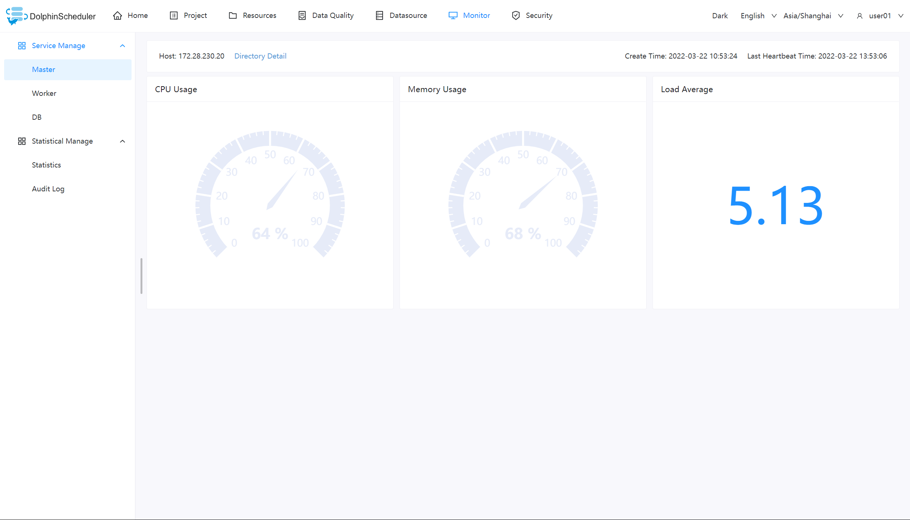
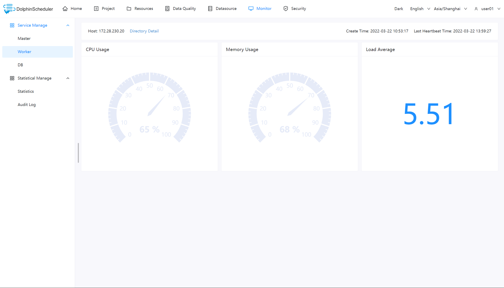
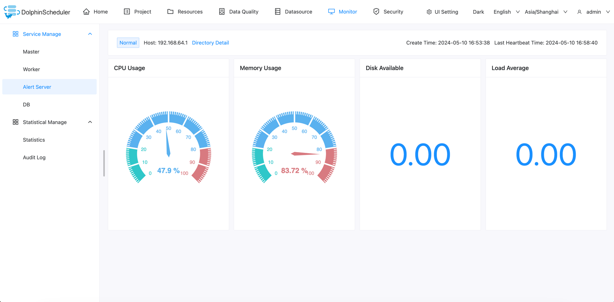
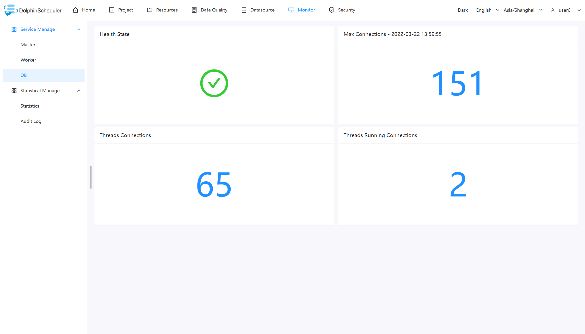
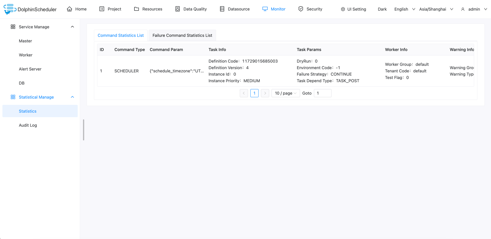
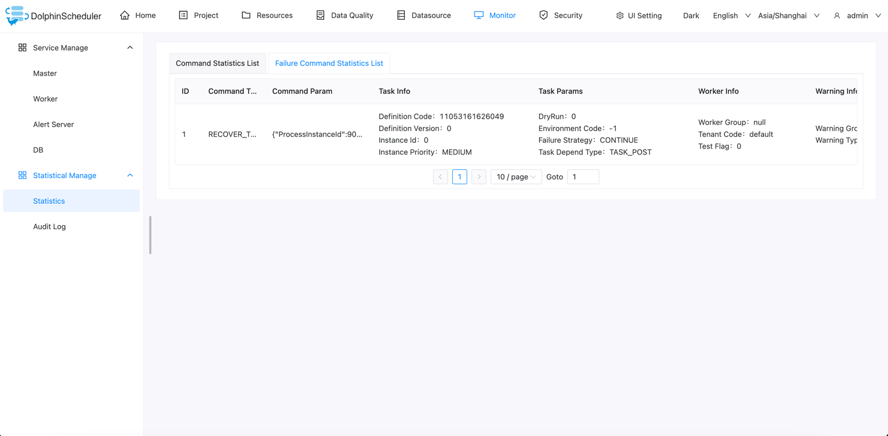
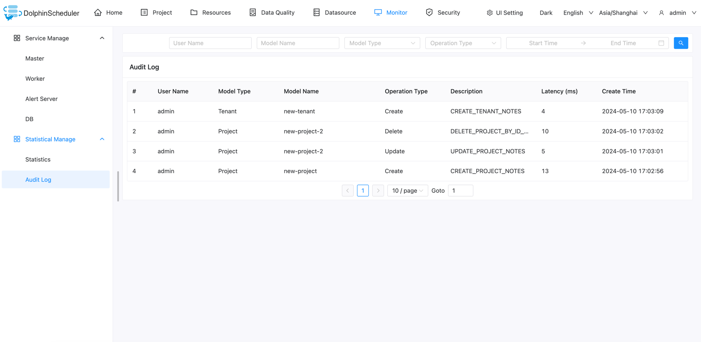

# 모니터

## 서비스 관리

- 서비스 관리는 주로 시스템 내 각 서비스의 상태 및 기본 정보를 모니터링하고 표시하는 것입니다.

### 마스터 서버

- 주로 마스터정보와 관련된 내용입니다.

### 작업자 서버

- 주로 근로자 정보와 관련된 내용입니다.

### 경고 서버

- 주로 알림 서버 정보와 관련되어 있습니다.

### 데이터베이스

- 주로 DB의 Health 상태입니다.

## 통계관리

### 통계

시스템의 명령 목록을 표시합니다.데이터는 't_ds_command' 테이블에서 가져옵니다.

시스템의 실패 명령 목록을 표시합니다.데이터는 `t_ds_error_command` 테이블에서 가져온 것입니다.

### 감사 로그

감사 로그는 시스템에 접근한 사람, 시스템에 수행된 작업 및 관련 기록에 대한 정보를 제공합니다.
시스템 보안과 유지관리를 강화합니다.

