# 매개변수 컨텍스트

DolphinScheduler는 전역 매개변수를 참조하는 로컬 매개변수와 업스트림 및 다운스트림 매개변수 전송을 포함하여 매개변수 간에 서로를 참조하는 기능을 제공합니다.참조가 존재하기 때문에 매개변수 이름이 동일할 경우 매개변수의 우선순위가 적용됩니다.[매개변수 우선순위](priority.md)도 참조하세요.

## 로컬 작업은 전역 매개변수를 참조합니다.

전역 매개변수를 참조하는 로컬 작업의 전제는 [전역 매개변수](global.md)를 이미 정의했다는 것입니다.사용법은 [로컬 파라미터](local.md)에서의 사용법과 유사하지만, 해당 파라미터의 값을 글로벌 파라미터의 키로 설정해야 합니다.

## 업스트림 작업에서 다운스트림으로 매개변수 전달

DolphinScheduler는 작업 간 매개변수 전송을 허용합니다.현재 전송 방향은 업스트림에서 다운스트림으로의 단방향 전송만 지원합니다.이 기능을 지원하는 작업 유형은 다음과 같습니다.

* [쉘](../task/shell.md)
* [SQL](../task/sql.md)
* [절차](../task/stored-procedure.md)
* [파이썬](../task/python.md)
* [하위 워크플로](../task/sub-workflow.md)
* [쿠버네티스](../task/kubernetes.md)

업스트림 노드를 정의할 때 해당 노드의 결과를 종속성 관련 다운스트림 노드로 전송할 필요가 있는 경우.[현재 노드 설정]의 [사용자 정의 매개변수]에서 'OUT' 방향 매개변수를 설정해야 합니다.하위 워크플로 노드인 경우 [현재 노드 설정]에서 매개변수를 설정할 필요가 없지만, 하위 워크플로의 워크플로 정의에서 'OUT' 방향 매개변수를 설정해야 합니다.

업스트림 매개변수의 값은 [매개변수 설정](#create-a-shell-task-and-set-parameters)과 동일한 방법으로 다운스트림 노드에서 업데이트될 수 있습니다.

다운스트림 노드에서 동일한 이름의 매개변수를 정의하면 업스트림 매개변수가 무시됩니다.

> 참고: 노드 간 종속성이 없으면 로컬 매개변수를 업스트림으로 전달할 수 없습니다.

### 예

이 샘플은 매개변수 전달 기능을 사용하는 방법을 보여줍니다.로컬 매개변수를 생성하고 SHELL 작업을 통해 다운스트림에 할당합니다.SQL 작업은 업스트림 작업의 매개변수를 가져와 쿼리 작업을 완료합니다.

#### SHELL 작업 생성 및 매개변수 설정

사용자는 쉘 스크립트를 생성할 때 매개변수를 전달해야 하며, 출력 문 형식은 `'${setValue(key=value)}'`, 키는 해당 매개변수의 `prop`, 값은 매개변수의 값입니다.

Node_A 작업을 생성하고 사용자 지정 매개변수에 출력 및 값 매개변수를 추가하고 다음 스크립트를 작성합니다.

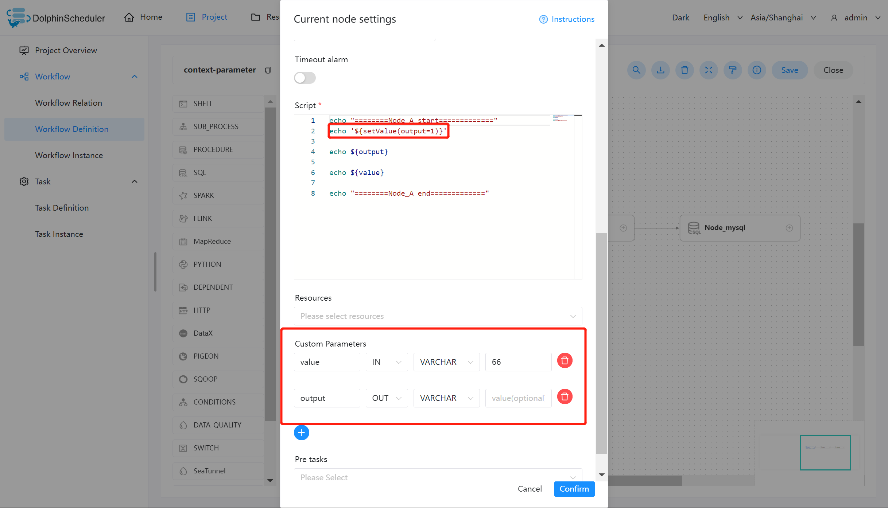

매개변수 설명:

- 값 : 방향 선택이 IN 이고, 값은 66 입니다.
- 출력: 방향은 OUT으로 선택되고 `'${setValue(output=1)}'` 스크립트를 통해 할당되며 다운스트림 매개변수에 전달됩니다.

SHELL 노드가 정의되면 로그는 `${setValue(output=1)}` 형식을 감지하여 출력에 1을 할당하고 다운스트림 노드는 변수 출력의 값을 직접 사용할 수 있습니다.마찬가지로 [워크플로 인스턴스] 페이지에서 해당 노드 인스턴스를 찾은 후 이 변수의 값을 볼 수 있습니다.

업스트림 작업 Node_A가 전달한 매개변수를 테스트하고 출력하는 데 주로 사용되는 Node_B 작업을 만듭니다.

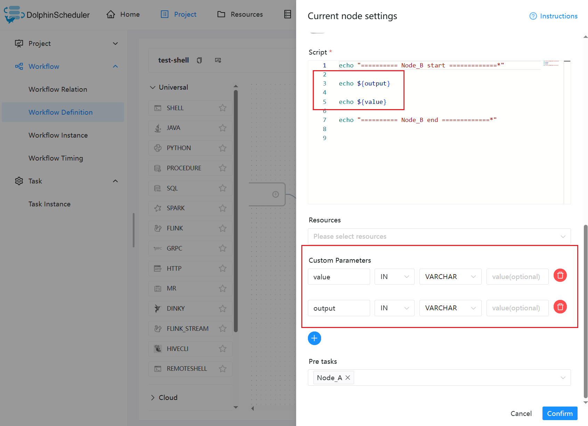

#### SQL 작업 생성 및 매개변수 사용

SHELL 작업이 완료되면 업스트림으로 전달된 출력을 SQL의 쿼리 개체로 사용할 수 있습니다.쿼리의 ID가 ID로 이름이 변경되어 매개변수로 출력됩니다.

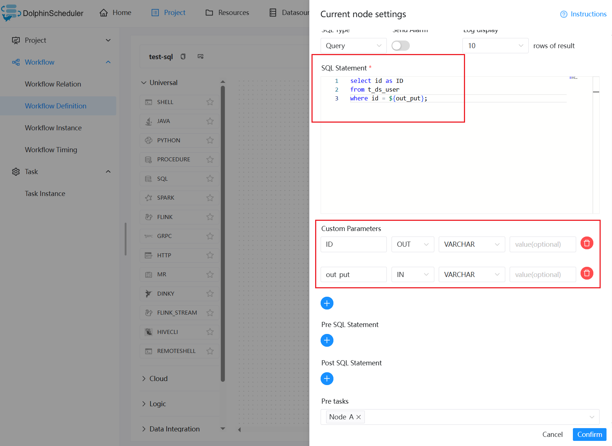> 참고: SQL 노드의 결과에 단 하나의 행, 하나 또는 여러 개의 필드가 있는 경우 `prop`의 이름은 필드 이름과 동일해야 합니다.데이터 유형은 `LIST`를 제외한 구조를 선택할 수 있습니다.이 매개변수는 SQL 쿼리 결과에서 동일한 열 이름에 따라 값을 할당합니다.
>
> SQL 노드의 결과에 여러 행, 하나 이상의 필드가 있는 경우 `prop`의 이름은 필드 이름과 동일해야 합니다.데이터 유형 구조를 `LIST`로 선택하면 SQL 쿼리 결과가 `LIST<VARCHAR>`로 변환되고 매개변수 값으로 JSON으로 변환되어 전달됩니다.

#### 워크플로를 저장하고 전역 매개변수를 설정합니다.

워크플로 저장 아이콘을 클릭하고 전역 매개변수 출력 및 값을 설정합니다.

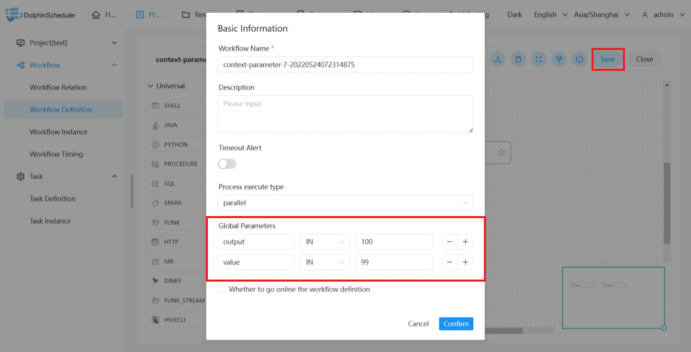

#### 결과 보기

워크플로가 생성된 후 온라인으로 워크플로를 실행하고 실행 결과를 확인합니다.

Node_A의 결과는 다음과 같습니다.

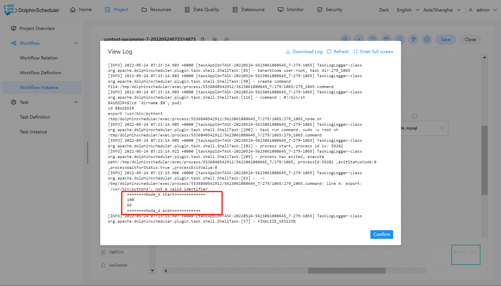

Node_B의 결과는 다음과 같습니다.

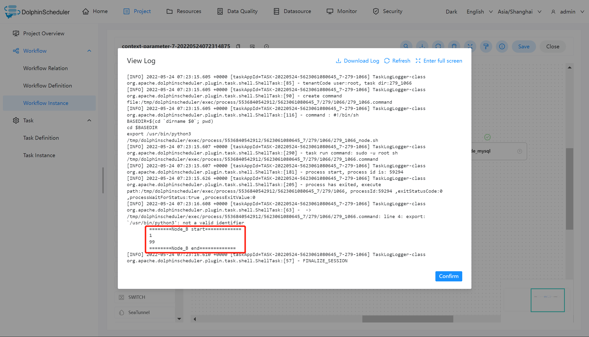

Node_mysql의 결과는 다음과 같습니다.

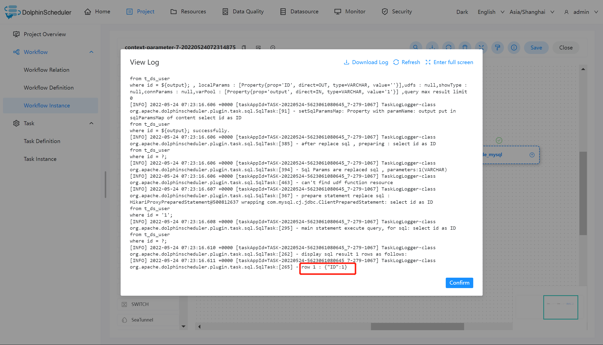

Node_A의 스크립트에서 출력 값이 1로 지정되어 있어도 로그에는 여전히 100의 값이 표시됩니다. 하지만 [매개 변수 우선 순위](priority.md)의 원칙인 `Startup Parameter > Local Parameter > Parameter Context > Global Parameter`에 따르면 Node_B의 출력 값은 1입니다. 이는 출력 매개 변수가 예상 값을 참조하여 워크플로에 전달되고 Node_mysql에서 이 값을 사용하여 쿼리 작업이 완료되었음을 증명합니다.

그런데 출력값 66은 Node_A에만 나타나는데, 그 이유는 값의 방향이 IN으로 선택되어 있고, 방향이 OUT인 경우에만 가변 출력으로 정의되기 때문입니다.

#### Python 작업에서 다운스트림으로 매개변수 전달

`print('${setValue(key=%s)}' % value)`를 사용하면 DolphinScheduler는 출력에서 `${setValue(key=value}`)를 캡처하여 매개변수를 캡처하고 다운스트림으로 전달합니다.

예를 들어

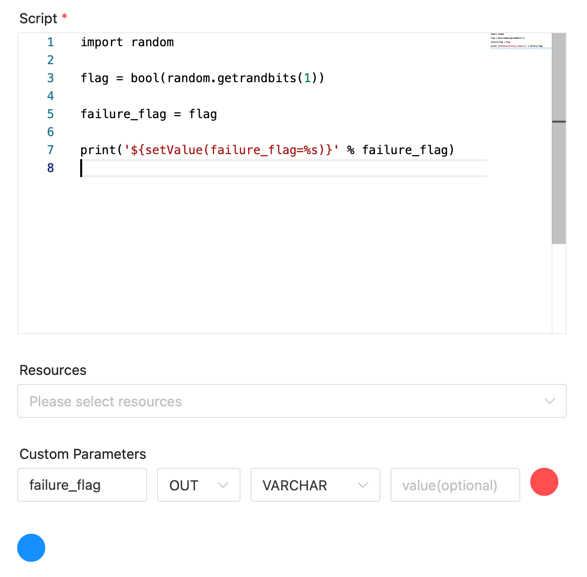

주의: 변수 값에 `value = "hello \n world" `와 같은 `\n` 식별자가 포함된 경우 값은 특별한 방식으로 수행되어야 합니다.`print('${setValue(key=%s)}' % repr(value))`를 사용해야 합니다. 그렇지 않으면 인수를 후속 흐름에 전달할 수 없습니다.

#### SubWorkflow 작업의 매개변수를 다운스트림으로 전달

하위 워크플로의 워크플로 정의에서 'OUT' 방향 매개변수를 출력 매개변수로 정의하면 이러한 매개변수가 하위 워크플로 노드의 다운스트림 작업에 전달될 수 있습니다.

하위 워크플로의 워크플로 정의에서 A 작업을 생성하고, var1 및 var2 매개변수를 사용자 지정 매개변수에 추가하고, 다음 스크립트를 작성합니다.

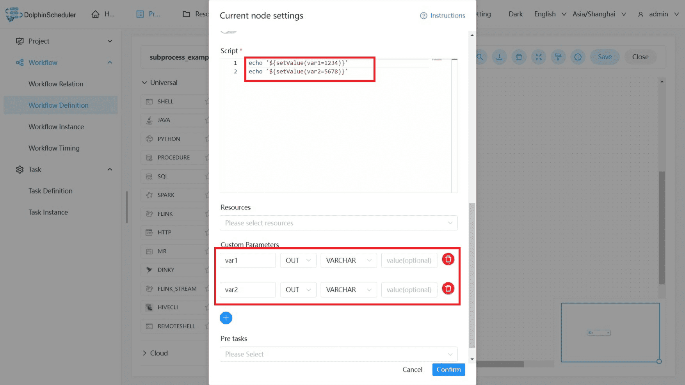

하위 workflow_example1 워크플로를 저장하고 전역 매개변수 var1을 설정합니다.

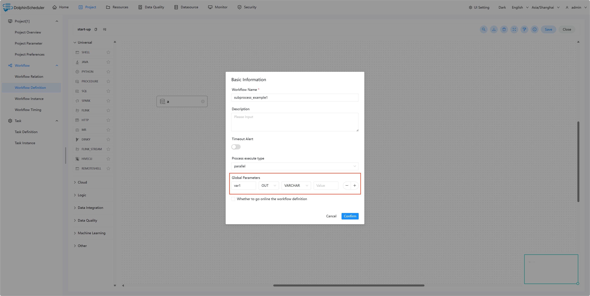

새 워크플로에서 sub_workflow 작업을 생성하고 sub-workflow_example1 워크플로를 하위 노드로 사용합니다.

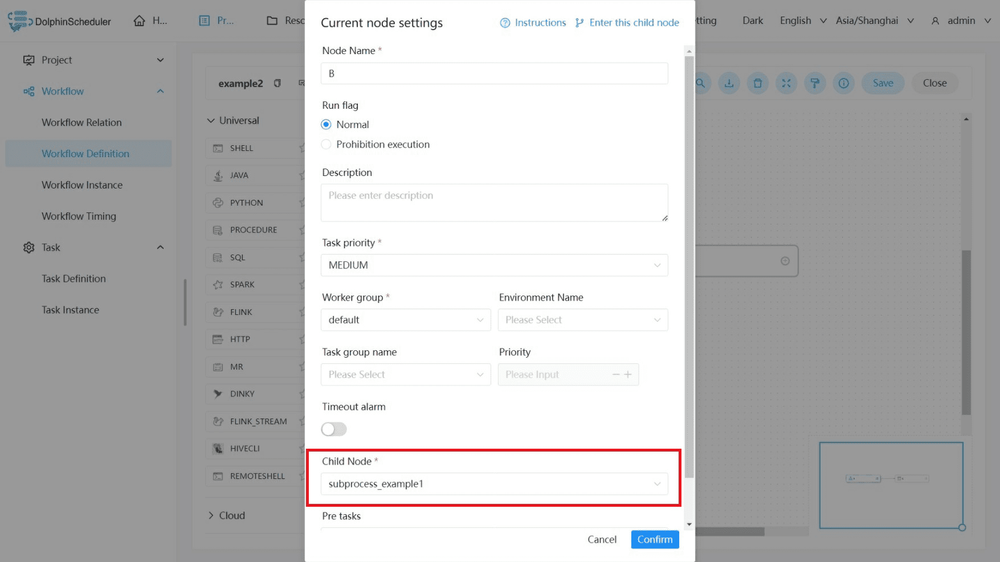

sub_workflow 작업의 다운스트림 작업으로 셸 작업을 생성하고 다음 스크립트를 작성합니다.

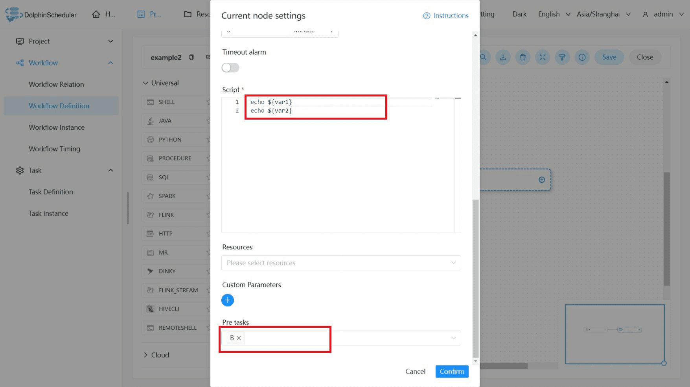

워크플로를 저장하고 실행합니다.다운스트림 작업의 결과는 다음과 같습니다.

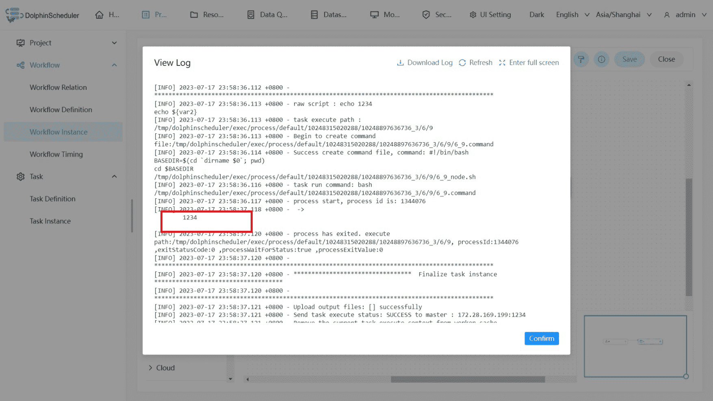

두 매개변수 var1 및 var2가 A 작업에 출력되지만 'OUT' 매개변수 var1만 워크플로 정의에 정의되어 있으며 다운스트림 작업은 성공적으로 var1을 출력합니다.이는 예상 값을 참조하여 var1 매개변수가 워크플로에 전달되었음을 증명합니다.#### Kubernetes 작업에서 다운스트림으로 매개변수 전달

다양한 프로그래밍 언어는 Kubernetes 작업에서 다양한 로깅 프레임워크를 사용할 수 있습니다.이러한 프레임워크와 호환되도록 DolphinScheduler는 `${(key=value)}` 또는 `#{(key=value)}` 범용 로깅 데이터 형식을 제공합니다.사용자는 애플리케이션의 터미널 로그 형식으로 로그 데이터를 출력할 수 있습니다. 여기서 'key'는 해당 매개변수 prop이고 'value'는 해당 매개변수의 값입니다.DolphinScheduler는 출력 로그에서 `${(key=value)}` 또는 `#{(key=value)}`를 캡처하여 매개변수를 캡처하고 다운스트림으로 전달합니다.

예를 들어

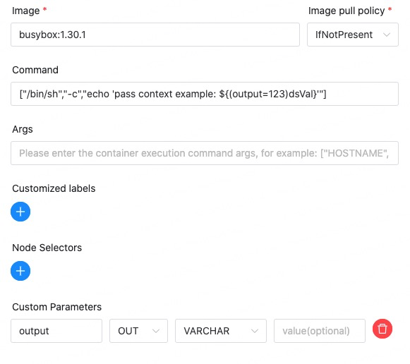

또 다른 특별 고려 사항은 DolphinScheduler가 Pod 로그를 항상 수집할 수 있는 것은 아닙니다. 사용자가 로그 출력 스트림을 리디렉션하는 경우 DolphinScheduler는 사용할 로그를 수집할 수 없으며 출력 매개 변수도 사용할 수 없습니다.