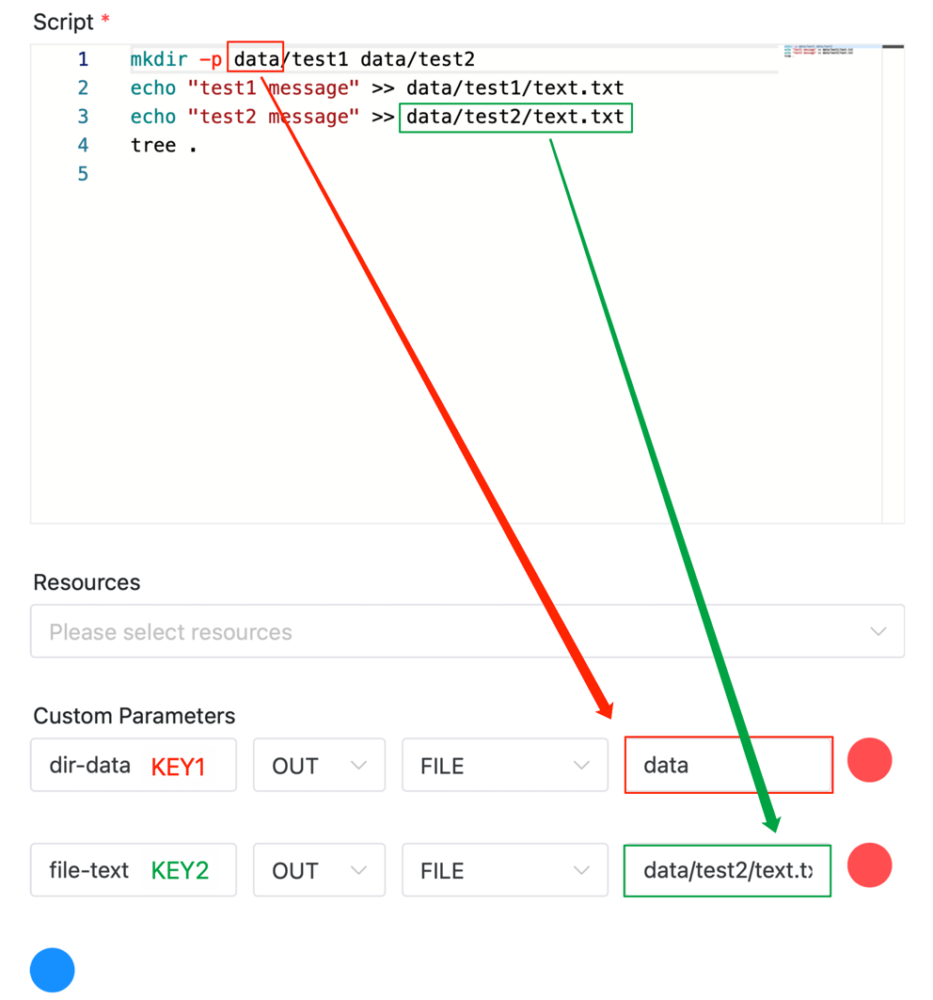
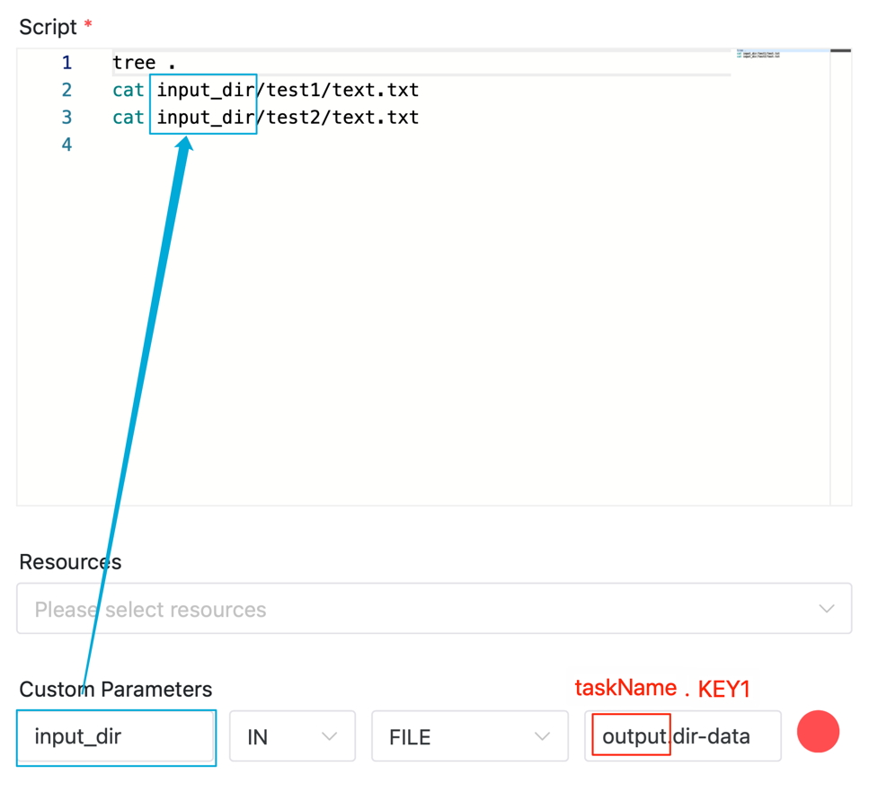
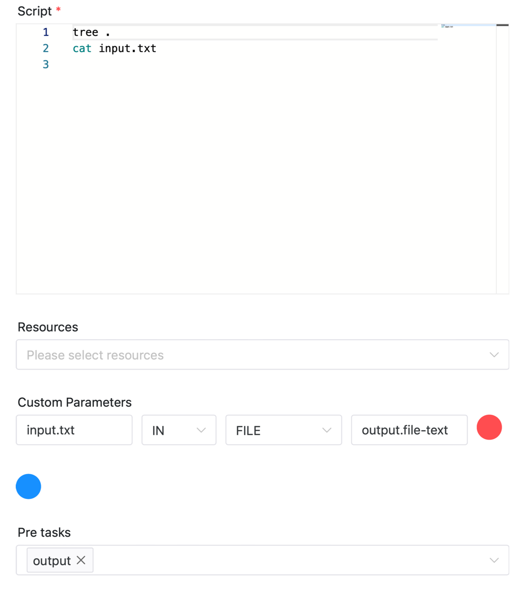

# 파일 매개변수

업스트림 작업의 작업 디렉터리에 있는 파일(또는 폴더, 이하 **파일**이라고 함)을 동일한 워크플로 인스턴스의 다운스트림 작업에 전달하려면 file 매개 변수를 사용합니다.다음 시나리오가 사용될 수 있습니다

- ETL 작업에서는 여러 업스트림 작업에서 처리된 데이터 파일을 특정 다운스트림 작업으로 전달합니다.
- 기계 학습 시나리오에서는 업스트림 데이터 준비 작업의 데이터 세트 파일을 다운스트림 모델 교육 작업에 전달합니다.

## 사용법

### 파일 매개변수 구성

파일 매개변수 구성 방법: 구성할 작업 정의 페이지에서 "사용자 정의 매개변수" 오른쪽에 있는 더하기 기호를 클릭합니다.

### 다운스트림 작업으로 출력 파일

**맞춤 매개변수의 네 가지 옵션은 다음과 같습니다.**

- 매개변수 이름: 아래 그림의 'KEY1', 'KEY2' 등 작업을 전달할 때 사용되는 식별자
- 방향: OUT, 이는 파일을 다운스트림 작업으로 출력함을 의미합니다.
- 매개변수 유형: FILE, 파일 매개변수를 나타냄
- 매개변수 값: 출력 파일 경로(예: 아래 그림의 `data` 및 `data/test2/text.txt`)

아래 그림의 구성은 '출력' 작업이 두 개의 파일 데이터를 각각 다운스트림 작업에 전달함을 나타냅니다.

- `data` 폴더를 전달하고 `dir-data`로 표시합니다.다운스트림 작업은 `output.dir-data`를 통해 이 폴더를 가져올 수 있습니다.
- `data/test2/text.txt` 파일을 전달하고 `file-text`로 표시합니다.다운스트림 작업은 `output.file-text`를 통해 이 폴더를 가져올 수 있습니다.



### 업스트림 작업에서 파일 가져오기

**맞춤 매개변수의 네 가지 옵션은 다음과 같습니다.**

- 매개변수 이름 : 입력 후 업스트림 파일이 저장되는 위치, 아래 그림에서 사용된 `input_dir` 등
- 방향: IN, 업스트림 작업에서 파일을 가져오는 것을 의미합니다.
- 매개변수 유형: FILE, 파일 매개변수를 나타냄
- 매개변수 값: 'taskName.KEY' 형식의 업스트림 파일 식별자입니다.예를 들어 아래 그림의 'output.dir-data'에서 'output'은 업스트림 작업의 이름이고, 'dir-data'는 업스트림 작업에서 출력된 파일 식별자입니다.

아래 그림의 구성은 작업이 업스트림 작업 `output`에서 `dir-data`로 식별된 폴더를 가져와 `input_dir`로 저장함을 나타냅니다.



아래 그림의 구성은 작업이 업스트림 작업 'output'에서 'file-text'로 식별된 파일을 가져와서 'input.txt'로 저장함을 나타냅니다.



## 기타

### 참고- 업스트림과 다운스트림 작업 간의 파일 전송은 리소스 센터를 기반으로 전송되며, 데이터는 리소스 센터의 'DATA_TRANSFER' 디렉터리에 저장됩니다.따라서 **리소스센터 기능이 활성화되어 있어야 합니다**. 자세한 내용은 [리소스센터 구성 세부정보](../resource/configuration.md)를 참조하세요. 그렇지 않으면 파일 매개변수 기능을 사용할 수 없습니다.
- 파일 명명 규칙은 `DATA_TRANSFER/DATE/ProcessDefineCode/ProcessDefineVersion_ProcessInstanceID/TaskName_TaskInstanceID_FileName`입니다.
- 전송되는 파일데이터가 폴더인 경우 '.zip' 확장자를 붙인 압축파일로 패키징되어 업로드됩니다.다운스트림 작업은 이를 수신한 후 압축을 풀고 해당 디렉터리에 저장합니다.
- 파일 데이터를 삭제해야 하는 경우 리소스 센터의 `DATA_TRANSFER` 디렉터리에서 해당 폴더를 삭제하면 됩니다.날짜 하위 디렉터리를 직접 삭제하면 해당 날짜 아래의 모든 파일 데이터가 삭제됩니다.[오픈 API 인터페이스](../api/open-api.md)(`resources/data-transfer`)를 사용하여 해당 파일 데이터를 삭제할 수도 있습니다(N일 전 데이터 삭제).
- 작업 체인 task1->task2->tas3이 있는 경우 다운스트림 작업 task3도 task1의 파일 데이터를 가져올 수 있습니다.
- 일대다 전송 및 다대일 전송 지원
- 많은 양의 파일을 자주 전송하는 경우, 전송되는 데이터의 양에 따라 시스템 IO 성능이 영향을 받을 것은 자명합니다.

### 예

다음 YAML 파일을 로컬에 저장한 다음 `pydolphinscheduler yaml -f data-transfer.yaml`을 실행하여 데모를 실행할 수 있습니다.```yaml
# Define the workflow
workflow:
  name: "data-transfer"
  run: true

# Define the tasks under the workflow
tasks:
  - name: output
    task_type: Shell
    command: |
      mkdir -p data/test1 data/test2
      echo "test1 message" >> data/test1/text.txt
      echo "test2 message" >> data/test2/text.txt
      tree .
    local_params:
      - { "prop": "dir-data", "direct": "OUT", "type": "FILE", "value": "data" }
      - { "prop": "file-text", "direct": "OUT", "type": "FILE", "value": "data/test2/text.txt" }

  - name: input_dir
    task_type: Shell
    deps: [output]
    command: |
      tree .
      cat input_dir/test1/text.txt
      cat input_dir/test2/text.txt
    local_params:
      - { "prop": "input_dir", "direct": "IN", "type": "FILE", "value": "output.dir-data" }


  - name: input_file
    task_type: Shell
    deps: [output]
    command: |
      tree .
      cat input.txt
    local_params:
      - { "prop": "input.txt", "direct": "IN", "type": "FILE", "value": "output.file-text" }
````