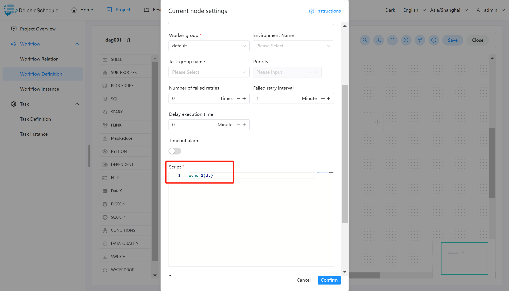
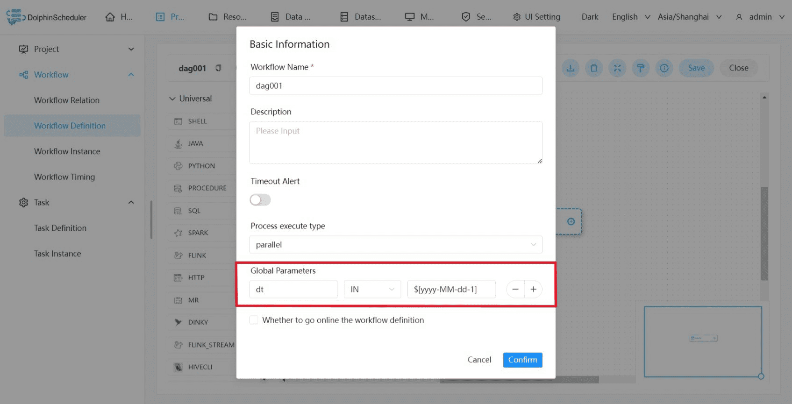
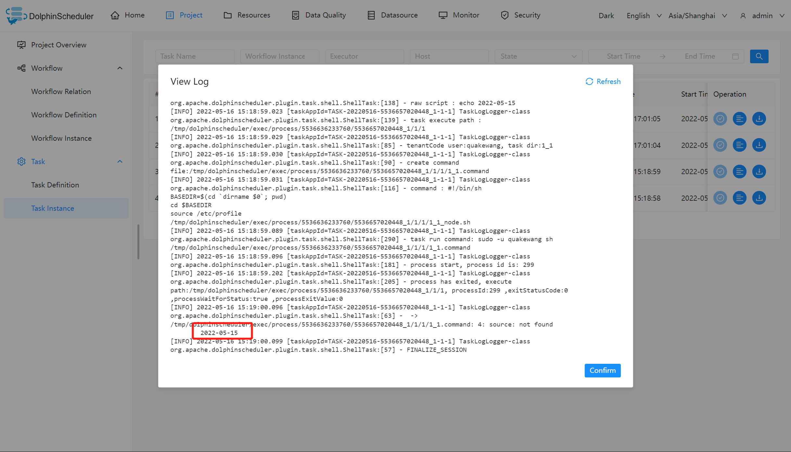

# 전역 매개변수

## 범위

전역 매개변수는 워크플로우 정의 페이지에서 구성할 수 있습니다.

'IN' 방향 매개변수는 전체 워크플로의 모든 작업 노드에 유효합니다.

'OUT' 방향 매개변수는 워크플로의 출력 매개변수이며 상위 워크플로에 있는 해당 SubProcess 작업의 다운스트림 작업으로 전달됩니다.

## 사용법

구체적인 사용 방법은 실제 생산 상황에 따라 결정될 수 있습니다.이 예에서는 쉘 작업을 사용하여 어제의 날짜 값을 인쇄합니다.

## 예

### 셸 작업 만들기

셸 작업을 생성하고 스크립트 콘텐츠에 `echo ${dt}`를 입력합니다.이 경우 dt는 선언해야 하는 전역 매개변수입니다.아래와 같이:

### 워크플로 저장 및 전역 매개변수 설정

글로벌 매개변수 설정: 워크플로우 정의 페이지에서 "글로벌 설정" 오른쪽에 있는 더하기 기호를 클릭하고 변수 이름과 값을 입력한 후 적절한 매개변수 값 유형을 선택하고 저장합니다.

> 참고: 여기에 정의된 dt 매개변수는 다른 노드의 로컬 매개변수에 의해 참조될 수 있습니다.

### 태스크 인스턴스 보기 실행 결과에서

태스크 인스턴스 페이지에서는 로그를 통해 태스크의 실행 결과를 확인하고, 매개변수가 유효한지 확인할 수 있습니다.

