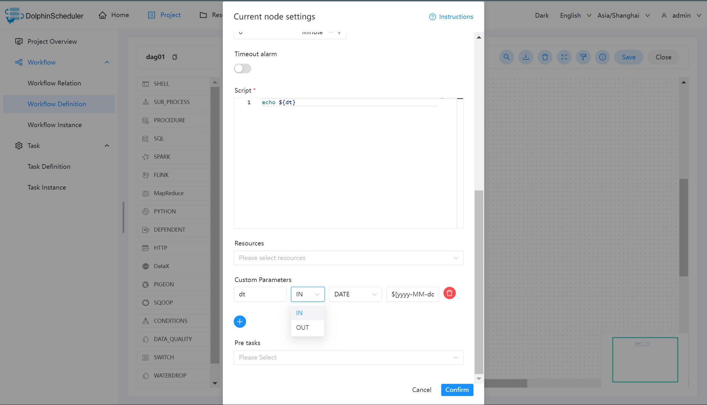
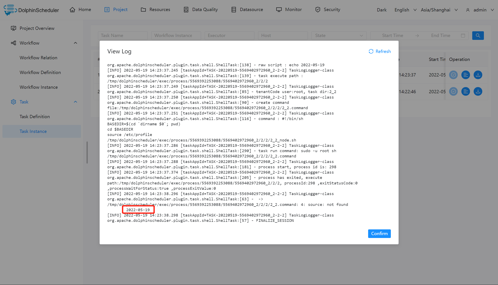
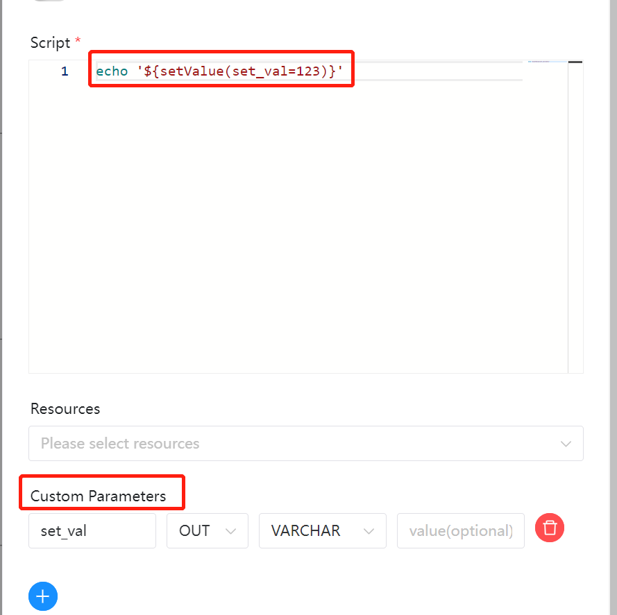
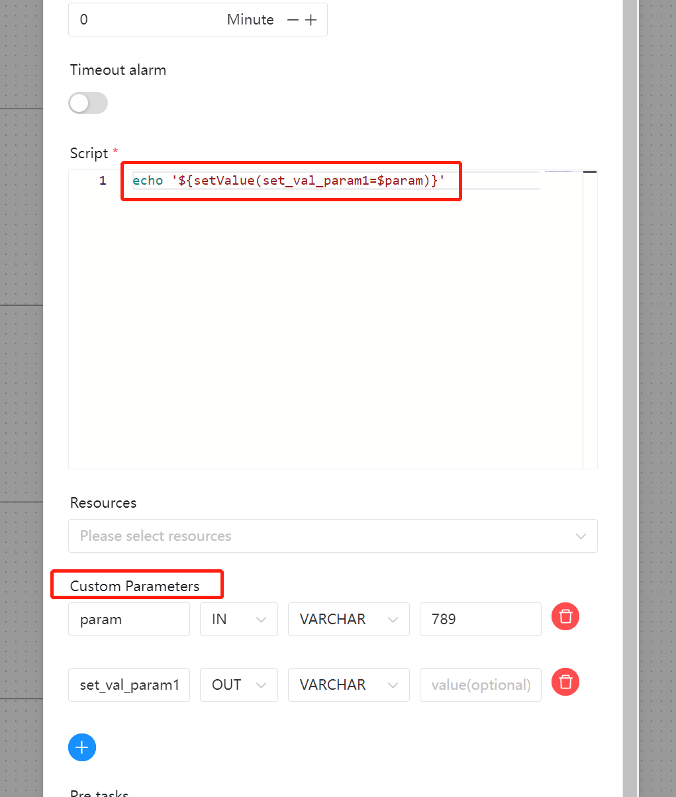
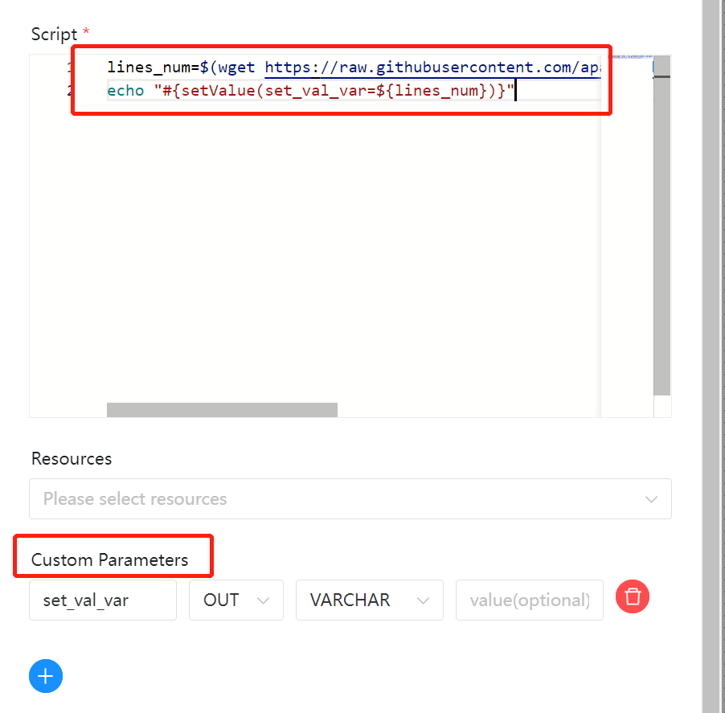

# 로컬 매개변수

## 범위

작업 정의 페이지에 구성된 매개변수. 이 매개변수의 범위는 이 작업 내부에만 해당됩니다.하지만 [매개변수 컨텍스트 참조](context.md)에 따라 구성하면 다운스트림 작업으로 전달될 수 있습니다.

## 사용법

* 단일 작업에서 매개변수를 사용하려면 [맞춤 매개변수가 포함된 로컬 매개변수](#use-local-parameter-by-custom-parameter)를 참조하세요.
* 작업에서 설정된 매개변수를 사용하고 이를 다운스트림 작업에서 사용하려는 경우:
* 맞춤 매개변수를 사용하지 않고 간단히 사용하려면 [`setValue`를 통해 매개변수 내보내기](#export-local-parameter-by-setvalue)를 참조하세요.
* 맞춤 매개변수 사용 방법은 [`setValue`를 통해 매개변수 내보내기 및 맞춤 매개변수](#export-local-parameter-by-setvalue-and-custom-parameter)를 참조하세요.
* Bash 변수 사용 방법은 [`setValue` 및 bash 변수를 통해 매개변수 내보내기](#export-local-parameter-by-setvalue-and-bash-variable)를 참조하세요.

로컬 매개변수 사용법: 작업 정의 페이지에서 '사용자 정의 매개변수' 옆의 '+'를 클릭하고 저장할 키와 값을 입력합니다.

## 예

### 사용자 정의 매개변수로 로컬 매개변수 사용

이 예에서는 로컬 매개변수를 사용하여 현재 날짜를 인쇄하는 방법을 보여줍니다.

셸 작업을 만들고 'echo ${dt}' 콘텐츠로 스크립트를 작성하세요.구성 표시줄에서 **맞춤 매개변수**를 클릭하면 다음과 같이 구성됩니다.



매개변수:

- dt: 매개변수 이름을 나타냅니다.
- IN: IN은 로컬 매개변수가 현재 노드에서만 사용될 수 있음을 나타내고, OUT은 로컬 매개변수가 다운스트림으로 전송될 수 있음을 나타냅니다.
- DATE : 데이터 타입의 DATE를 나타낸다.
- $[YYYY-MM-DD] : 사용자 정의 형식에서 파생된 내장 매개변수를 나타냅니다.

워크플로를 저장하고 실행합니다.Shell 작업 로그를 봅니다.



> 참고: 로컬 매개변수는 현재 작업 노드의 워크플로우에서 사용될 수 있습니다.OUT으로 설정된 경우 다운스트림 워크플로로 전달될 수 있습니다.[매개변수 컨텍스트](context.md)를 참조하세요.

### `setValue`로 로컬 매개변수 내보내기

매개변수를 간단하게 내보낸 후 다운스트림 작업에서 사용하려면 작업에서 `setValue`를 사용할 수 있습니다.그리고 매개변수를 하나의 단일 작업으로 관리할 수 있습니다.Shell 작업에서 `echo '${setValue(set_val=123)}'`(**작은따옴표를 잊지 마세요**) 구문을 사용하고 새로운 `OUT` 사용자 정의 매개변수를 추가하여 내보낼 수 있습니다.



`echo '${set_val}'` 구문을 사용하여 다운스트림 작업에서 이 값을 얻을 수 있습니다.

### `setValue` 및 맞춤 매개변수로 로컬 매개변수 내보내기

상수 값 대신 사용자 정의 매개변수로 매개변수를 내보낸 후 다운스트림 작업에서 사용하려는 경우,
작업에서 `setValue`를 사용할 수 있습니다. 이는 원할 때 "사용자 정의 매개변수" 블록을 변경하여 유지 관리하기가 더 쉽습니다.
그 값을 변경합니다.`echo "#{setValue(set_val_param=${val})}"` 구문을 사용할 수 있습니다(**큰따옴표를 잊지 마세요.
Shell 작업에서 `setValue`**)와 함께 변수를 사용하고 입력 변수 `val` 및 `OUT` 사용자 정의에 대한 새로운 `IN` 사용자 정의 매개변수를 추가합니다.
매개변수 `set_val_param`을 내보내기 위한 매개변수입니다.



`echo '${set_val_param}'` 구문을 사용하여 다운스트림 작업에서 이 값을 얻을 수 있습니다.

### `setValue` 및 Bash 변수로 로컬 매개변수 내보내기

상수 값 대신 bash 변수를 사용하여 매개변수를 내보낸 후 다운스트림 작업에서 사용하려면,
작업에서 `setValue`를 사용할 수 있습니다. 이는 존재하는 로컬 또는 HTTP 리소스에 대한 변수를 얻을 수 있는 것과 같이 보다 유연합니다.
다음과 같은 구문을 사용할 수 있습니다.```shell
lines_num=$(wget https://raw.githubusercontent.com/apache/dolphinscheduler/dev/README.md -q -O - | wc -l | xargs)
echo "#{setValue(set_val_var=${lines_num})}"
````

쉘 작업에서(**`setValue`와 함께 변수를 사용하는 경우 큰따옴표를 잊지 마세요**) `OUT` 사용자 정의 매개변수를 추가하세요
매개변수 `set_val_var` 내보내기
.



`echo '${set_val_var}'` 구문을 사용하여 다운스트림 작업에서 이 값을 얻을 수 있습니다.