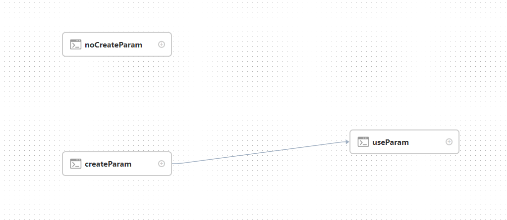
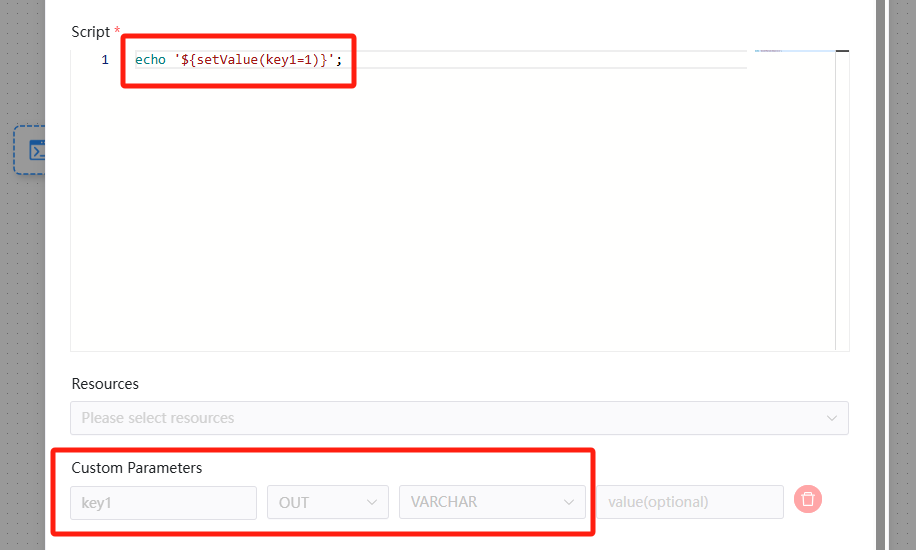
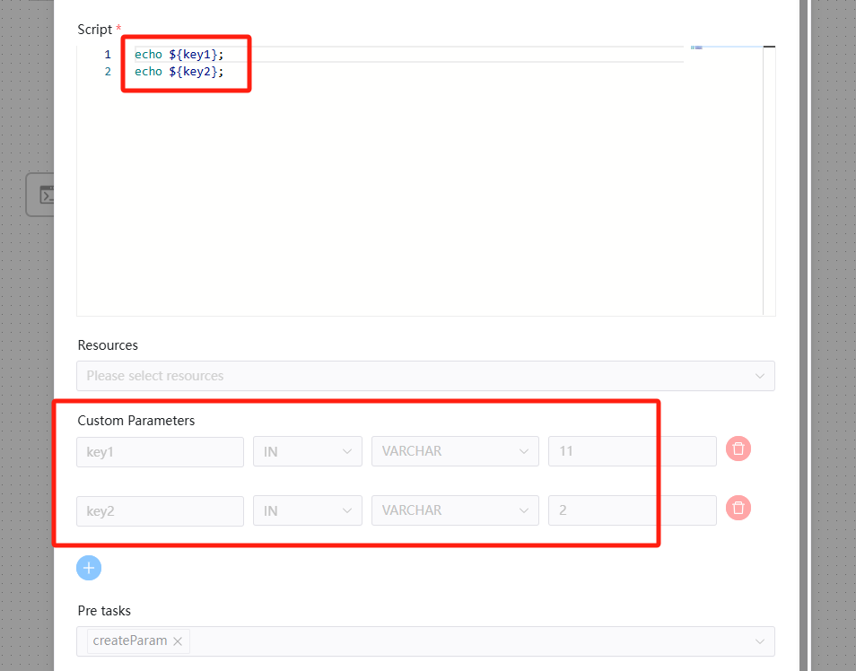
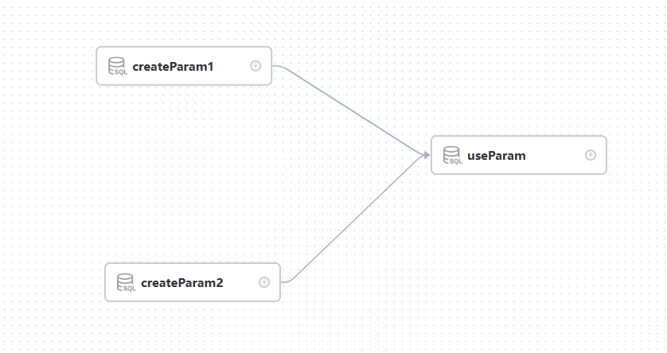

# 매개변수 우선순위

DolphinScheduler에는 세 가지 매개변수 유형이 있습니다.

* [프로젝트 수준 매개변수](project-parameter.md) : 프로젝트 관리 페이지에서 정의하는 매개변수입니다.
* [Global Parameter](global.md): 워크플로우 정의 페이지에서 정의된 매개변수입니다.
* [시작 매개변수](startup-parameter.md): 워크플로 시작 페이지에 정의된 매개변수입니다.
* [Parameter Context](context.md): 업스트림 작업 노드가 전달하는 매개변수입니다.
* [로컬 매개변수](local.md): 매개변수는 해당 노드에 속하며, [사용자 정의 매개변수]에서 사용자가 정의한 매개변수입니다.

사용자는 워크플로우 정의를 생성할 때 매개변수의 일부를 정의할 수 있습니다.

매개변수 값의 소스가 여러 개 있으므로 매개변수 이름이 동일하면 매개변수 우선순위 문제가 발생합니다.DolphinScheduler 매개변수의 우선순위는 높은 것부터 낮은 것 순으로 '시작 매개변수 > 로컬 매개변수 > 매개변수 컨텍스트 > 전역 매개변수 > 프로젝트 수준 매개변수'입니다.

업스트림 작업이 다운스트림으로 매개변수를 전달할 수 있는 경우 동일한 매개변수 이름을 전달하는 업스트림 작업이 여러 개 있을 수 있습니다.

* 다운스트림 노드는 비어 있지 않은 값이 있는 매개변수를 사용하는 것을 선호합니다.
* 값이 비어 있지 않은 매개변수가 여러 개 있는 경우 완료 시간이 가장 늦은 업스트림 작업의 값을 선택하세요.

## 예

다음은 작업 매개변수 우선순위 문제를 보여주는 예입니다.

1: 쉘 노드를 사용하여 첫 번째 사례를 설명합니다.

[useParam] 노드는 [createParam] 노드에 설정된 파라미터를 사용할 수 있습니다.[useParam] 노드는 [noUseParam] 노드 사이에 종속성이 없기 때문에 매개변수를 얻을 수 없습니다.다른 작업 노드 유형에는 여기에 있는 셸 예제와 동일한 사용 규칙이 있습니다.

[createParam] 노드는 매개변수를 직접 사용할 수 있습니다.또한 노드는 "key"와 "key1"이라는 두 개의 매개변수를 생성하며 "key1"은 업스트림 노드가 전달한 것과 동일한 이름을 가지며 값 "12"를 할당합니다.그러나 우선순위 규칙으로 인해 값 할당은 "12"를 할당하고 업스트림 노드의 값은 삭제됩니다.

2: SQL 노드를 사용하여 다른 사례를 설명합니다.

다음은 [use_create] 노드의 정의를 보여줍니다.

"상태"는 현재 노드에서 설정한 노드의 자체 매개변수입니다.그러나 사용자는 프로세스 정의를 저장할 때 "상태" 매개변수(전역 매개변수)도 설정하고 해당 값을 -1에 할당합니다.그러면 상태 값은 2가 되며 SQL이 실행될 때 우선 순위가 더 높아집니다.전역 매개변수 값은 삭제됩니다.

여기서 "ID"는 업스트림 노드에서 설정한 매개변수입니다.사용자는 [createparam1] 노드와 [createparam2] 노드에 대해 동일한 매개변수 이름 "ID"의 매개변수를 설정합니다.그리고 [use_create] 노드는 먼저 완료된 [createParam1] 값을 사용합니다.