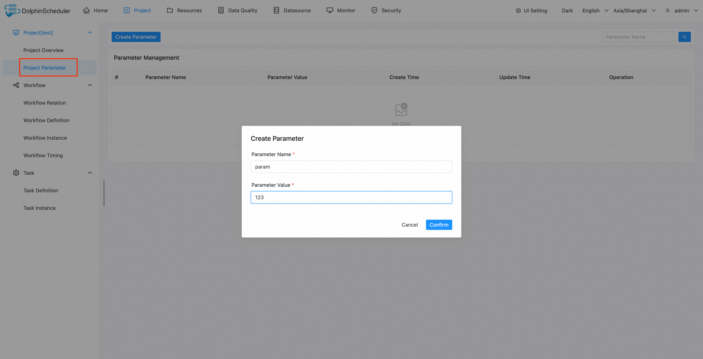
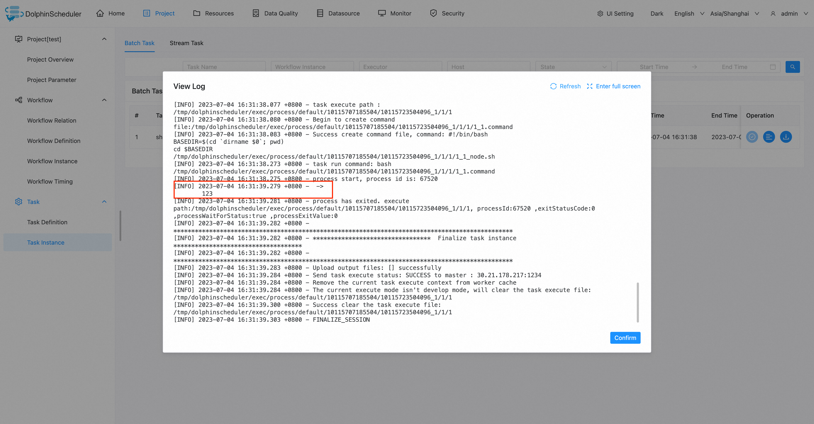

# 프로젝트 수준 매개변수

## 범위

프로젝트 수준 매개변수는 전체 프로젝트 아래의 모든 작업 노드에 유효합니다.

## 사용법

### 프로젝트 수준 매개변수 정의

프로젝트 페이지에서 프로젝트 매개변수 및 매개변수 생성을 클릭하고 매개변수 이름과 매개변수 값을 입력한 후 적절한 매개변수 값 유형을 선택합니다.아래와 같이:

### 프로젝트 수준 매개변수 사용

셸 작업을 예로 들어 스크립트 콘텐츠에 `echo ${param}`을 입력합니다. 여기서 `param`은 이전 단계에서 생성된 프로젝트 수준 매개변수입니다.

셸 작업을 실행합니다.작업 인스턴스 페이지에서 작업 로그를 보고 매개변수가 유효한지 확인할 수 있습니다.

