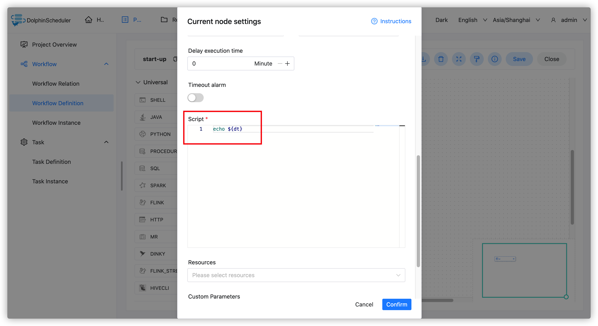
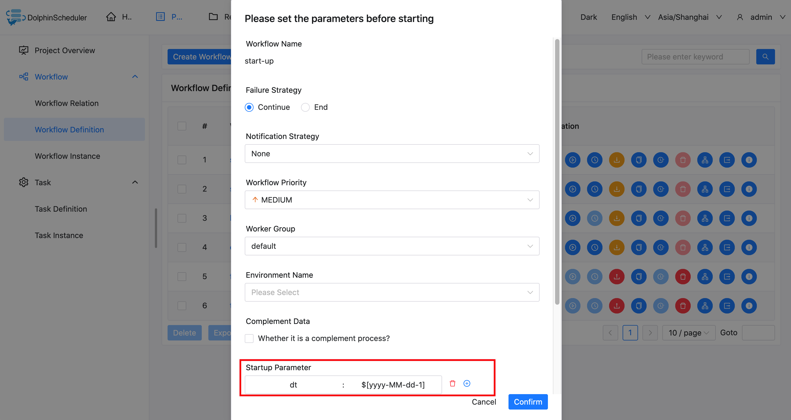
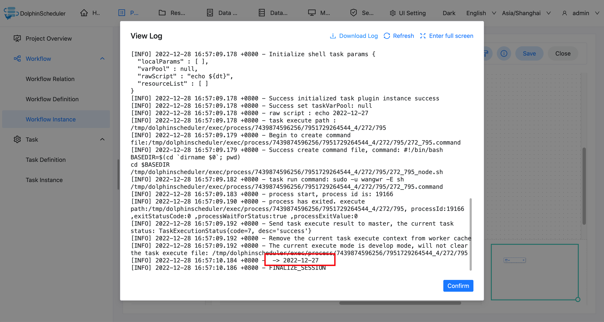
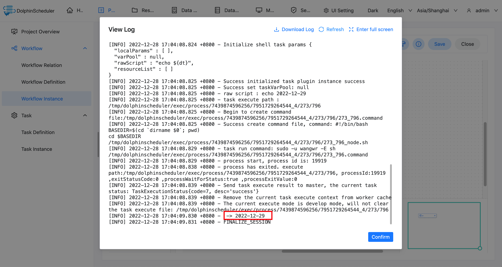

# 시작 매개변수

## 범위

매개변수는 전체 워크플로우의 모든 작업 노드에 유효합니다.작업 시작 페이지에서 구성할 수 있습니다.

## 사용법

시작 매개변수 사용법은 다음과 같습니다. 작업 시작 페이지에서 '시작 매개변수' 아래의 '+'를 클릭하고 키와 값을 입력한 후 적절한 매개변수 값 유형을 선택한 후 저장합니다.워크플로우는 이를 전역 매개변수에 추가합니다.

## 예

이 예에서는 시작 매개변수를 사용하여 다른 날짜를 인쇄하는 방법을 보여줍니다.

### 셸 작업 만들기

셸 작업을 생성하고 스크립트 콘텐츠에 `echo ${dt}`를 입력합니다.이 경우 dt는 선언해야 하는 전역 매개변수입니다.아래와 같이:

### 작업 시작 페이지에서 워크플로를 저장하고 시작 매개변수를 설정합니다.

다음과 같이 시작 매개변수를 설정합니다.

> 참고: 여기에 정의된 dt 매개변수는 다른 노드의 로컬 매개변수에 의해 참조될 수 있습니다.

### 태스크 인스턴스 보기 실행 결과에서

태스크 인스턴스 페이지에서는 로그를 통해 태스크의 실행 결과를 확인하고, 매개변수가 유효한지 확인할 수 있습니다.

### 다른 시작 매개변수를 설정하고 다시 실행하세요.

### 태스크 인스턴스 보기 실행 결과에서

로그를 확인하여 셸 작업이 다른 날짜를 출력하는지 확인할 수 있습니다.

