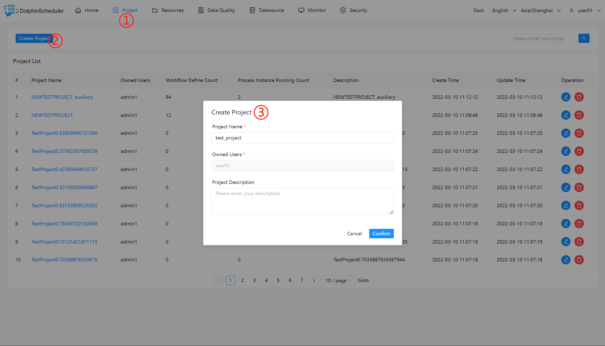
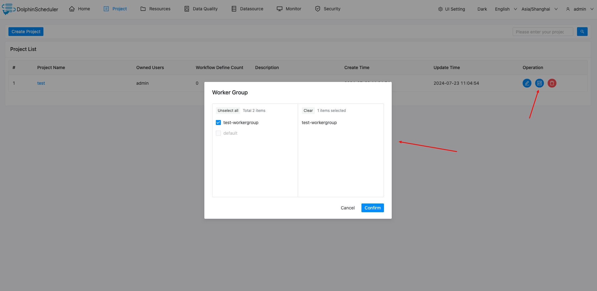
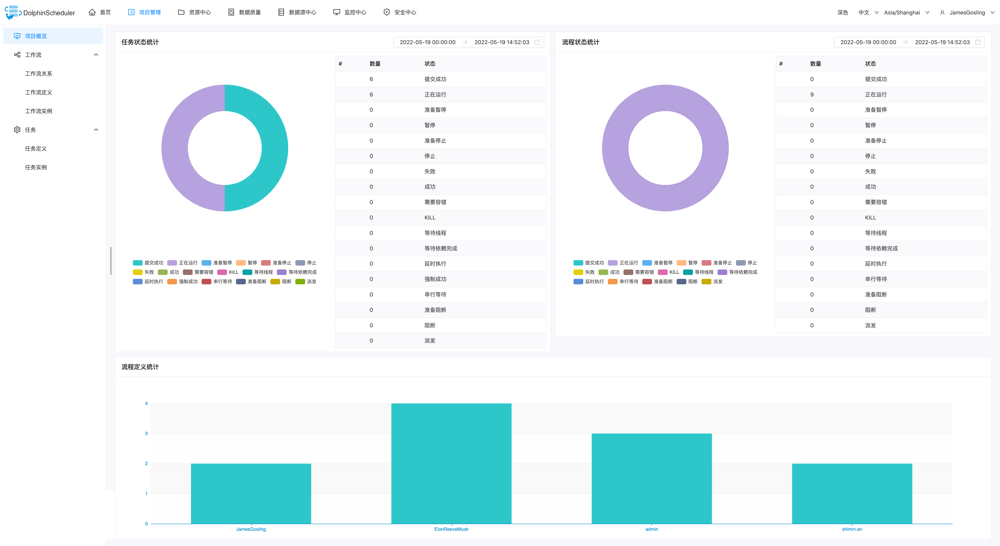

# 프로젝트

Apache DolphinScheduler의 프로젝트 화면에 대한 세부 사항을 설명하는 페이지입니다.여기에서는 이 화면에서 처리할 수 있는 모든 기능을 볼 수 있습니다.다음 표에서는 Apache DolphinScheduler에서 일반적으로 사용되는 용어를 설명합니다.

|용어집 |설명 |
|-----------------------------------|---------------------------------------------------------------------------------------------------------------------------------------------------------------------------------------------------------------------------------------------------------------------|
|대그 |워크플로의 작업은 DAG(방향성 비순환 그래프) 형식으로 구성됩니다.후속 노드가 없을 때까지 진입도가 0인 노드에서 위상 순회가 수행됩니다.|
|워크플로우 정의 |작업 노드를 드래그하고 DAG(작업 노드 연결)를 설정하여 형성된 시각화입니다.|
|워크플로우 인스턴스 |수동 시작 또는 예약된 예약을 통해 생성될 수 있는 워크플로 정의의 인스턴스화입니다.프로세스 정의가 실행될 때마다 워크플로 인스턴스가 생성됩니다.|
|워크플로우 관계 |프로젝트의 모든 워크플로의 동적 상태를 표시합니다.|
|작업 |작업은 워크플로의 개별 작업입니다.Apache DolphinScheduler는 SHELL, SQL, SUB_WORKFLOW, PROCEDURE, MR, SPARK, PYTHON, DEPENDENT(종속)를 지원하며 동적 플러그인 확장(SUB_WORKFLOW)을 지원할 계획입니다.또한 별도로 시작하고 실행할 수 있는 별도의 프로세스 정의이기도 합니다.|
|태스크 인스턴스 |특정 작업 실행 상태를 식별하는 프로세스 정의의 작업 노드 인스턴스화입니다.|

## 프로젝트 목록

프로젝트 화면에는 이름, 소유자, 워크플로 정의, 프로세스 인스턴스, 생성 및 업데이트 시간과 같은 세부 정보와 함께 모든 기존 프로젝트 목록이 표시됩니다.이 페이지에서는 프로젝트 생성, 편집, 삭제와 같은 작업도 쉽게 수행할 수 있습니다.

## 프로젝트 생성

- '프로젝트 관리'를 클릭해 프로젝트 관리 페이지로 이동한 후 '프로젝트 생성' 버튼을 클릭하고 프로젝트 이름과 프로젝트 설명을 입력한 후 '제출'을 클릭해 새 프로젝트를 생성합니다.

## 프로젝트 작업자 그룹 권한

- 프로젝트 관리 페이지에서 '작업자 그룹 인증' 버튼을 클릭하여 작업자 그룹 인증 페이지로 이동합니다. 아래 그림과 같이 작업자 그룹을 선택하고 'WorkerGroup'을 클릭하면 인증이 성공하면 프로젝트에서 작업자 그룹에 접근할 수 있습니다.

## 프로젝트 개요- 프로젝트 관리 페이지에서 프로젝트 이름 링크를 클릭하면 프로젝트 홈 페이지로 이동합니다. 아래 그림과 같이 프로젝트 홈 페이지에는 프로젝트의 작업 상태 통계, 프로세스 상태 통계, 워크플로 정의 통계가 포함되어 있습니다.해당 측정항목에 대한 소개는 다음과 같습니다.
- 작업 상태 통계: 지정된 시간 범위 내에서 작업 인스턴스 상태의 개수를 성공적인 제출, 실행 중, 일시 중지 준비, 일시 중지, 중지 준비, 중지, 실패, 성공, 내결함성 필요, 종료 및 대기 스레드로 계산합니다.
- 프로세스 상태 통계: 지정된 시간 범위 내에서 제출 성공, 실행 중, 일시 중지 준비, 일시 중지, 중지 준비, 중지, 실패, 성공, 내결함성 필요, 종료 및 대기 스레드 등 워크플로 인스턴스 상태 수를 계산합니다.
- 워크플로 정의 통계: 이 사용자가 생성하고 관리자가 부여한 워크플로 정의를 계산합니다.

