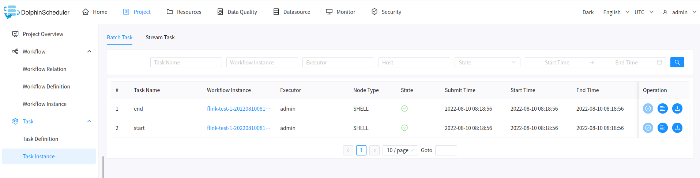
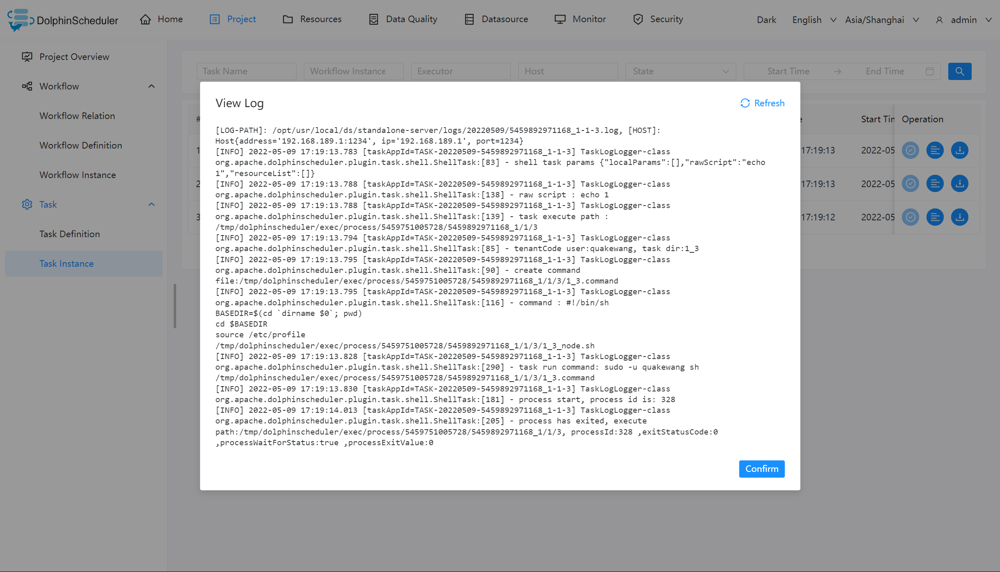
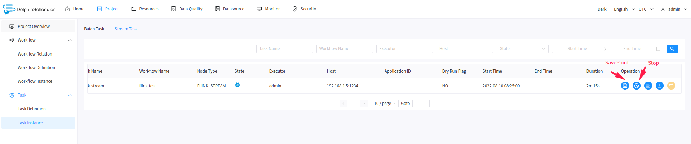

# 태스크 인스턴스

## 일괄 작업 인스턴스

### 태스크 인스턴스 생성

'프로젝트 관리 -> 워크플로 -> 태스크 인스턴스'를 클릭하여 태스크 인스턴스 페이지로 들어갑니다. 아래 그림과 같이 워크플로 인스턴스 이름을 클릭하면 워크플로 인스턴스의 DAG 다이어그램으로 이동하여 태스크 상태를 볼 수 있습니다.

### 로그 보기

작업 열의 '로그 보기' 버튼을 클릭하면 작업 실행 로그를 볼 수 있습니다.

## 스트림 태스크 인스턴스

-다음 그림과 같이 스트림 작업 인스턴스 페이지로 전환합니다.

- SavePoint: 작업 열에서 'SavePoint' 버튼을 클릭하여 스트림 작업 저장점을 수행합니다.
- 중지: 작업 열에서 '중지' 버튼을 클릭하면 스트림 작업이 중지됩니다.