# 워크플로우 정의

## 개요

작업 정의 화면에는 기존 워크플로우 목록과 워크플로우를 생성하거나 가져오기 위한 유틸리티가 표시됩니다.

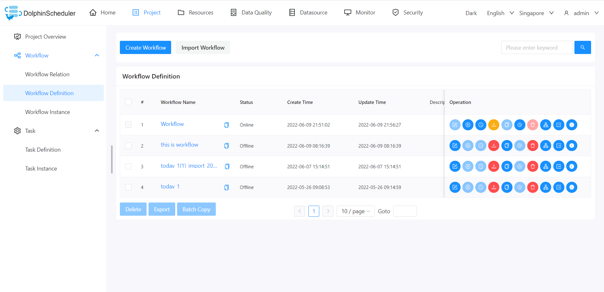

## 워크플로 정의 만들기

'프로젝트 관리 -> 워크플로 -> 워크플로 정의'를 클릭하고 '워크플로 정의' 페이지로 들어간 후 '워크플로 만들기' 버튼을 클릭하여 다음 그림과 같이 **워크플로 DAG 편집** 페이지로 들어갑니다.

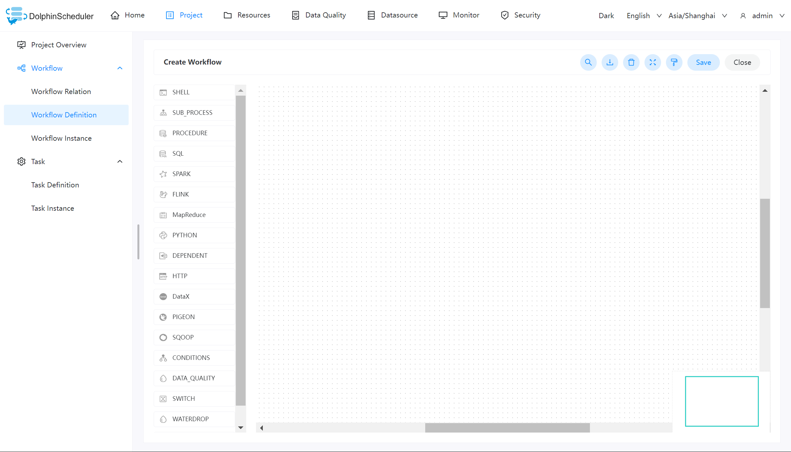

### 작업 흐름에 대한 작업 만들기

아래 그림과 같이 툴바 를 캔버스로 드래그하여 캔버스에 셸 작업을 추가합니다.

**셸 작업에 대한 매개변수 설정 추가:**

1. '노드 이름', '설명' 및 '스크립트' 필드를 입력합니다.
2. 'Run Flag'를 'Normal'로 체크하세요.'실행 금지'를 선택하면 워크플로가 실행될 때 작업이 실행되지 않습니다.
3. '작업 우선순위'를 선택합니다. 작업자 스레드 수가 부족하면 우선순위가 높은 작업이 실행 대기열에서 먼저 실행되고, 우선순위가 동일한 작업이 선입선출 순서로 실행됩니다.
4. 타임아웃 알람(옵션): 타임아웃 알람, 타임아웃 실패를 확인하고 "타임아웃 기간"을 입력합니다.작업 실행 시간이 **시간 초과 기간**을 초과하면 알림 이메일이 전송되고 작업 시간 초과가 실패합니다.
5. 리소스(선택 사항).리소스는 `리소스센터 -> 파일관리` 페이지에서 생성되거나 업로드되는 파일입니다.예를 들어 파일 이름은 `test.sh`이고, 스크립트에서 리소스를 사용하는 명령어는 `sh test.sh`이다.리소스 파일의 전체 경로를 사용해야 한다는 점에 유의하세요.
6. 매개변수를 사용자 정의합니다(선택 사항).
7. 작업 설정을 저장하려면 '추가 확인' 버튼을 클릭하세요.

### 작업 간 종속성 설정

작업 노드 오른쪽에 있는 더하기 기호를 클릭하여 작업을 연결합니다.아래 그림과 같이 Node_B 작업과 Node_C 작업이 병렬로 실행되며, Node_A 작업이 완료되면 Node_B 작업과 Node_C 작업이 동시에 실행됩니다.

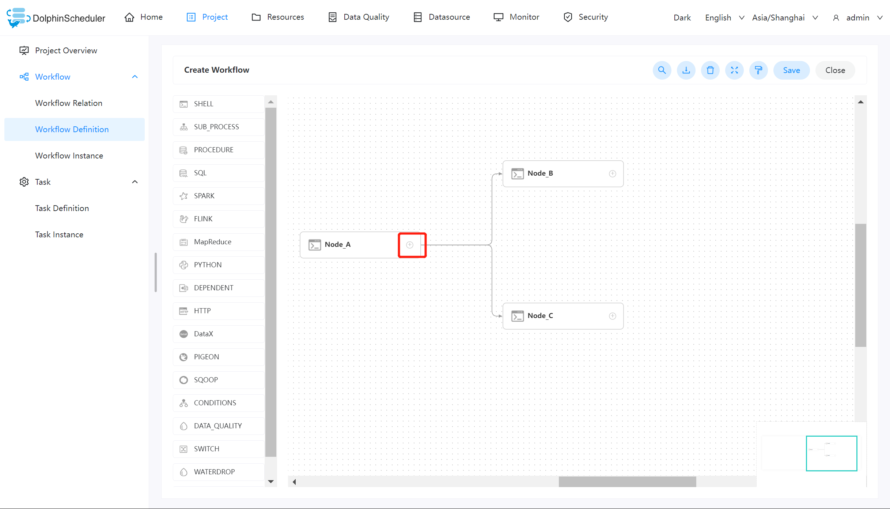

### 스트림 작업과의 종속성

DAG에 스트림 작업이 포함된 경우 스트림 작업 간의 관계가 점선으로 표시되고 워크플로 인스턴스가 실행될 때 스트림 작업 실행을 건너뜁니다.

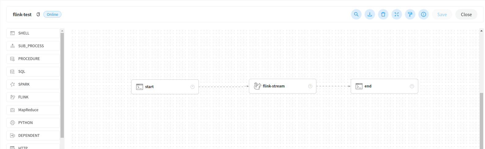

**종속성 삭제:** 마우스를 사용하여 연결선을 선택한 후 오른쪽 상단의 "삭제" 아이콘 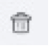을 클릭하여 작업 간의 종속성을 삭제합니다.

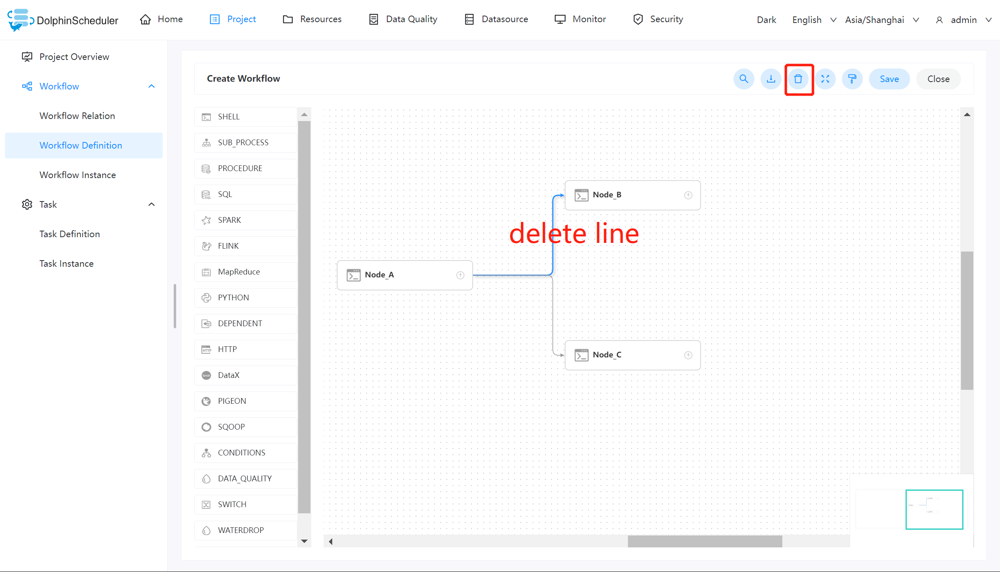

### 워크플로 정의 저장

'저장' 버튼을 클릭하면 아래 그림과 같이 'DAG 차트 이름 설정' 창이 나타납니다.워크플로우 정의 이름, 워크플로우 정의 설명을 입력하고 전역 매개변수를 설정합니다(선택사항, [전역 매개변수](../parameter/global.md) 참조). '추가' 버튼을 클릭하면 워크플로우 정의 생성이 완료됩니다.

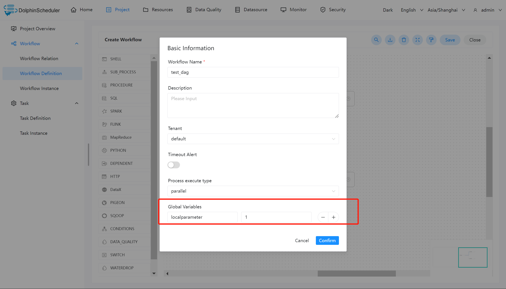

### 워크플로(프로세스) 실행 유형 구성

'저장' 버튼을 클릭하고 팝업창에서 '프로세스 실행 유형'을 설정하세요.프로세스 실행 유형에는 네 가지가 있습니다.

- `병렬`: 동일한 워크플로 정의의 인스턴스가 여러 개 있는 경우 인스턴스를 병렬로 실행합니다.
- `직렬 대기`: 동일한 워크플로 정의의 인스턴스가 여러 개 있는 경우 인스턴스를 직렬로 실행합니다.
- '직렬 삭제': 동일한 워크플로 정의의 인스턴스가 여러 개 있는 경우 이후 항목을 삭제하고 현재 실행 중인 항목을 종료합니다.
- `직렬 우선순위`: 동일한 워크플로우 정의의 인스턴스가 여러 개 있는 경우 우선순위에 따라 인스턴스를 직렬로 실행합니다.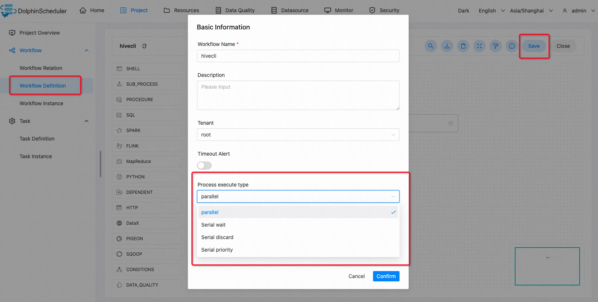

## 워크플로우 정의 작업 기능

아래와 같이 '프로젝트 관리 -> 워크플로 -> 워크플로 정의'를 클릭하여 워크플로 정의 페이지로 들어갑니다.

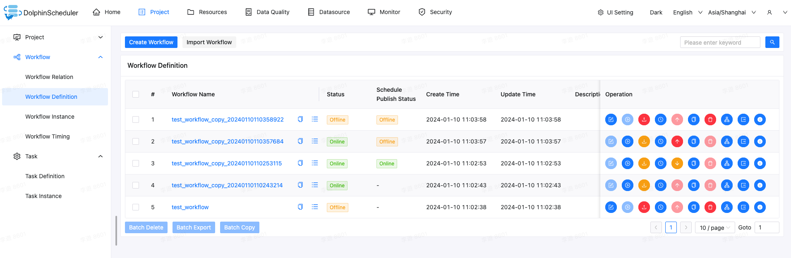

### 단일 워크플로에서 지원되는 작업

- **편집:** "오프라인" 워크플로 정의만 편집할 수 있습니다.워크플로 DAG 편집은 [워크플로 정의 생성](#create-workflow-definition)과 동일합니다.
- **실행:** 온라인 상태의 워크플로만 실행할 수 있습니다.작업 단계는 [워크플로 실행](#run-the-workflow)을 참조하세요.
- **온라인:** 워크플로 상태가 "오프라인"인 경우 워크플로를 온라인으로 만드는 데 사용됩니다."온라인" 상태의 워크플로만 실행할 수 있지만 편집할 수는 없습니다.
- **오프라인:** 워크플로 상태가 "온라인"인 경우 워크플로를 오프라인으로 만드는 데 사용됩니다."오프라인" 상태의 워크플로만 편집할 수 있지만 실행할 수는 없습니다.
- **타이밍:** 타이밍은 온라인 워크플로에만 설정할 수 있으며 시스템은 자동으로 워크플로를 제 시간에 실행하도록 예약합니다.타이밍 설정을 생성한 후 상태는 "오프라인"입니다. 적용하려면 오른쪽의 버튼을 클릭해야 온라인으로 전환됩니다.타이밍 작업 단계는 [워크플로 타이밍](#workflow-schedule)을 참조하세요.
- **온라인 타이밍:** 온라인으로 예약됩니다. 일정은 일정이 생성되고 워크플로 상태가 "온라인"인 후에만 클릭할 수 있습니다.
- **오프라인 타이밍:** 오프라인으로 예약됩니다.
- **타이밍 관리:** 타이밍 관리 페이지에서는 온라인 또는 오프라인으로 타이밍을 편집하고 삭제할 수 있습니다.
- **삭제:** 워크플로 정의를 삭제합니다.동일한 프로젝트 내에서는 본인이 생성한 워크플로 정의만 삭제할 수 있으며, 다른 사용자의 워크플로 정의는 삭제할 수 없습니다.삭제가 필요한 경우에는 작성자나 관리자에게 문의하시기 바랍니다.
- **다운로드:** 워크플로 정의를 로컬로 다운로드합니다.
- **복사:** 현재 프로젝트 아래에 현재 워크플로를 기반으로 새 워크플로를 복사합니다. 새 워크플로 이름에는 원본 워크플로 이름을 기준으로 '_copy_<날짜>' 접미사가 붙습니다.
- **내보내기:** 워크플로 정의 json 파일을 내보냅니다.
- **버전 정보:** 워크플로 버전 정보를 확인하고, 버전 정보 목록에서 워크플로 버전을 전환합니다.
- **트리 다이어그램:** 아래 그림과 같이 작업 노드 유형과 작업 상태를 트리 구조로 표시합니다.

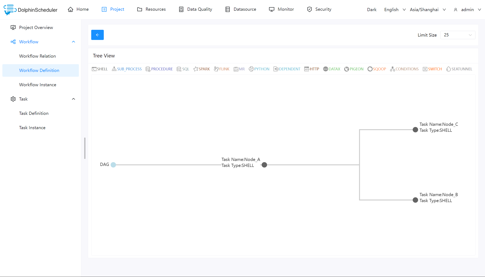

### 워크플로 일괄 작업

여러 워크플로우를 선택한 후 워크플로우 정의 목록 하단에서 다음과 같이 일괄 작업을 수행할 수 있습니다.

- **일괄 삭제:** 여러 워크플로 정의를 일괄 삭제합니다.
- **일괄 내보내기:** 여러 워크플로 정의를 json 파일로 일괄 내보냅니다.
- **일괄 복사:** 여러 워크플로 정의를 일괄 복사합니다. 복사된 워크플로를 생성할 프로젝트에서 선택할 수 있습니다.

## 워크플로 실행

- `프로젝트 관리 -> 워크플로우 -> 워크플로우 정의`를 클릭하여 워크플로우 정의 페이지로 들어갑니다. 아래 그림과 같이 "온라인으로 전환" 버튼 을 클릭하여 워크플로우를 온라인으로 만듭니다.

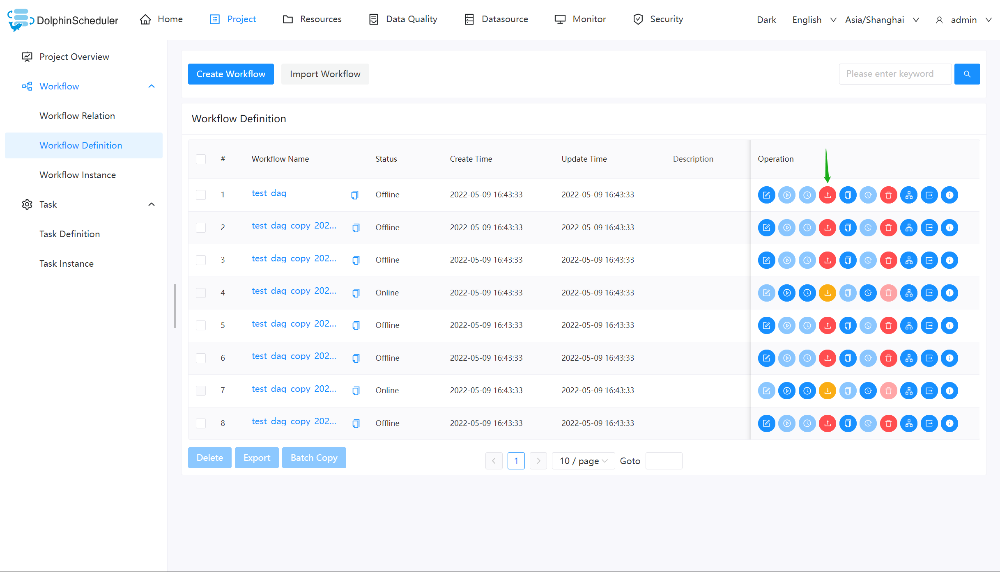

- '실행' 버튼을 클릭하면 아래 그림과 같이 시작 매개변수 설정 창이 팝업되어 시작 매개변수를 설정한 후 팝업 상자에서 '실행' 버튼을 클릭하면 워크플로가 실행되고 워크플로 인스턴스 페이지에서 워크플로 인스턴스가 생성됩니다.

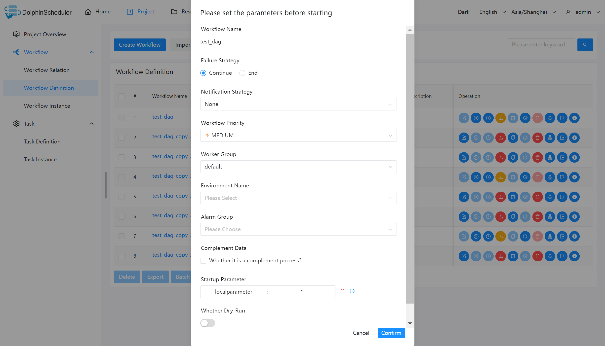

작업흐름 운영 매개변수에 대한 설명:* 실패 전략: 작업 노드 실행에 실패하면 다른 병렬 작업 노드가 이 전략을 실행해야 합니다."계속"은 특정 작업이 실패한 후 다른 작업 노드가 정상적으로 실행됨을 의미합니다."종료"는 모든 작업 실행을 종료하고 전체 프로세스를 종료하는 것을 의미합니다.
* 알림 전략: 프로세스가 끝나면 프로세스 상태에 따라 프로세스 실행 결과 알림 이메일을 보냅니다. 전송 없음, 성공 시 보내기, 실패 시 보내기, 결과 보내기 등의 옵션이 있습니다.
* 프로세스 우선순위: 프로세스 작업의 우선순위로 최고(HIGHEST), 높음(HIGH), 중간(MEDIUM), 낮음(LOW), 가장 낮음(LOWEST)의 5가지 수준으로 구분됩니다.마스터 스레드 수가 부족하면 우선 순위가 높은 프로세스가 실행 큐에서 먼저 실행되고, 우선 순위가 같은 프로세스가 선입선출(FIFO) 순서로 실행됩니다.
* 작업자 그룹: 지정된 작업자 머신 그룹에서만 프로세스를 실행할 수 있습니다.기본값은 모든 작업자에서 실행할 수 있는 `Default`입니다.
* 알림 그룹: 알림 전략 선택||시간 초과 경보||내결함성이 발생하면 알림 그룹의 모든 구성원에게 처리 결과 정보 또는 이메일이 전송됩니다.
* 수신자: 알림 정책 선택||타임아웃 알람||내결함성 발생 시 처리 결과 정보 또는 알람 이메일이 수신자 목록으로 전송됩니다.
* 참조: 알림 정책 선택||시간 초과 경보||내결함성 발생 시 처리 결과 정보 또는 경고 이메일이 참조 목록에 복사됩니다.
* 시작 매개변수: 새 프로세스 인스턴스를 시작할 때 전역 매개변수 값을 설정하거나 덮어씁니다.
* 보완: 지정된 날짜 범위 내에서 워크플로우 정의를 실행하고 보완 정책에 따라 해당 워크플로우 인스턴스를 생성하는 것을 의미합니다.보완 정책에는 **직렬 보완** 및 **병렬 보완**의 두 가지 모드가 포함됩니다.날짜는 페이지에서 선택하거나 수동으로 입력할 수 있습니다.
* 연속 보완: 지정된 시간 범위 내에서 시작 날짜부터 종료 날짜까지 보완이 실행되며 여러 프로세스 인스턴스가 차례로 생성됩니다.워크플로 실행을 클릭하고 직렬 보완 모드를 선택합니다. 예를 들어 7월 9일부터 7월 10일까지 순서대로 실행하고 프로세스 인스턴스 페이지에서 두 개의 프로세스 인스턴스를 순서대로 생성합니다.

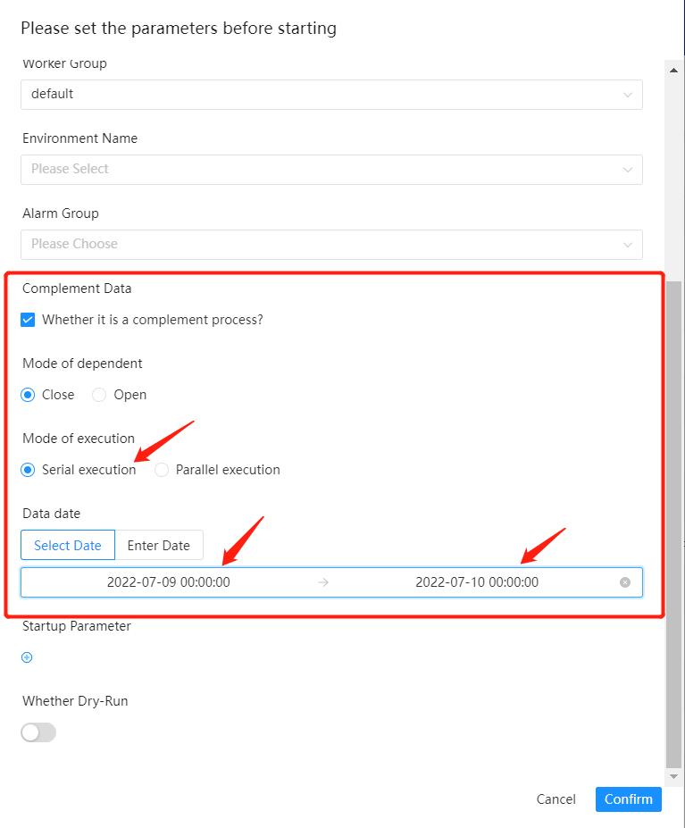

* 병렬 보충: 지정된 시간 범위 내에서 여러 날 동안 동시에 보충이 수행되며 여러 프로세스 인스턴스가 동시에 생성됩니다.날짜 수동 입력: 'yyyy MM DD hh:mm:ss'의 쉼표로 구분된 날짜 형식으로 날짜를 수동으로 입력합니다. 워크플로 실행을 클릭하고 병렬 보완 모드를 선택합니다. 예를 들어 7월 9일부터 7월 10일까지 워크플로 정의를 동시에 실행하고 프로세스 인스턴스 페이지에서 두 개의 프로세스 인스턴스를 동시에 생성합니다.

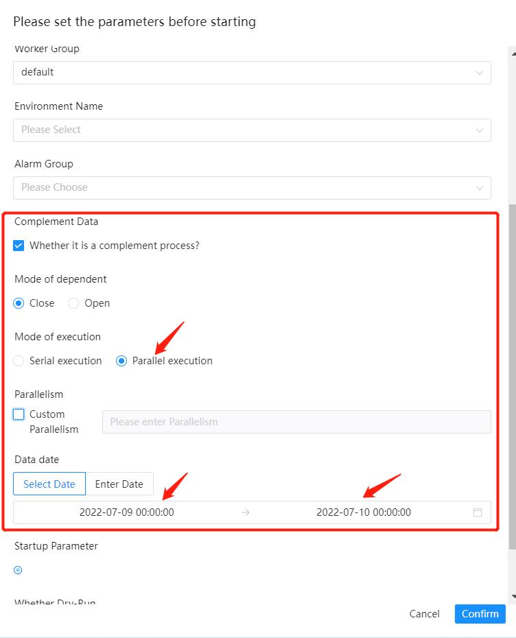

* 동시성: 병렬 보완 모드에서 병렬로 실행되는 최대 인스턴스 수를 나타냅니다. 예를 들어 7월 6일부터 7월 10일까지의 작업이 동시에 실행되고 동시성이 2인 경우 프로세스 인스턴스는 다음과 같습니다.

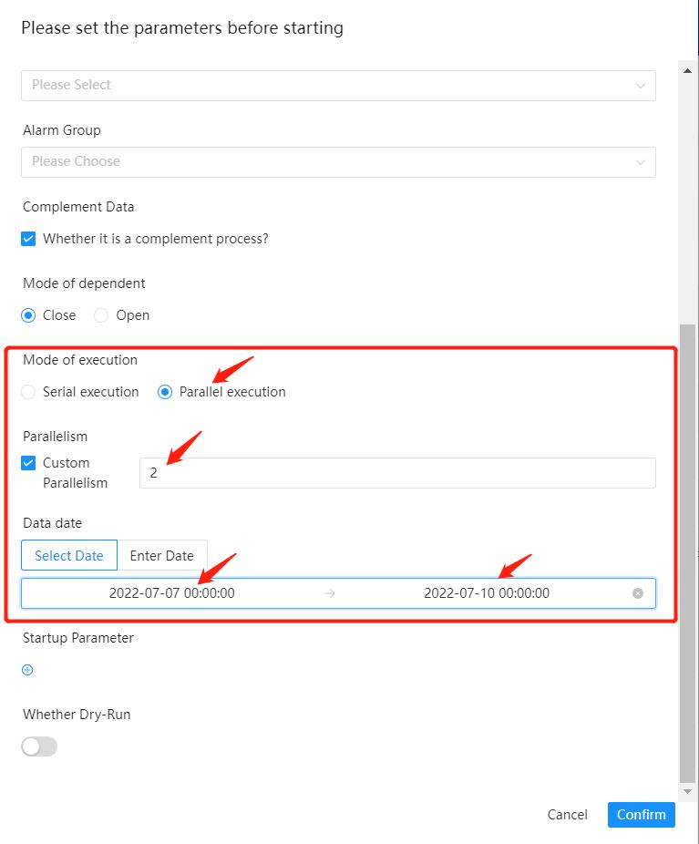

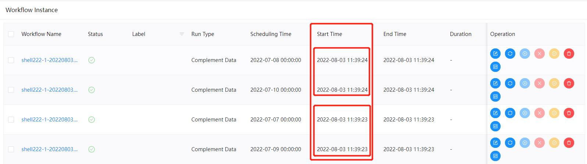

* 종속 모드: 다운스트림 종속 노드가 현재 워크플로우에 의존하는 워크플로우 인스턴스의 보충을 트리거할지 여부(현재 보충이 필요한 워크플로우 인스턴스의 타이밍 상태는 온라인이며, 이는 현재 워크플로우에 직접적으로 의존하는 다운스트림 보충만 트리거합니다).

* 날짜 선택:

1. 페이지에서 날짜를 선택하세요:

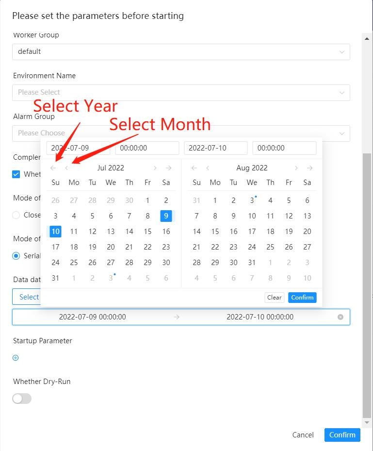2. 수동 입력:

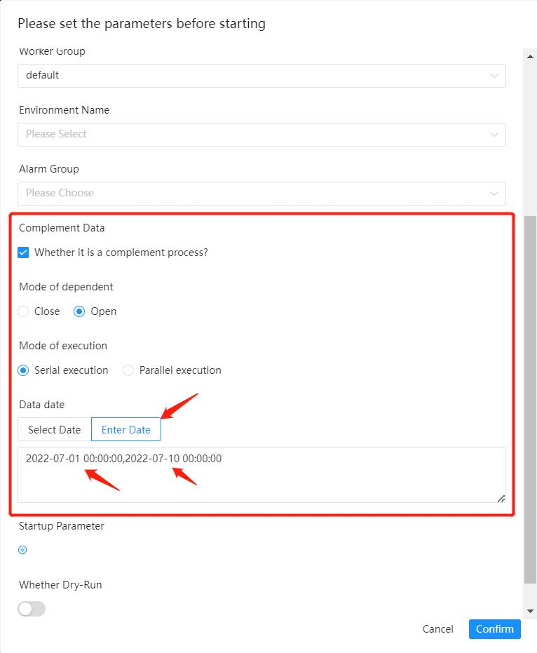

* 보완과 타이밍 구성의 관계:

1. 구성되지 않은 타이밍: 타이밍 구성이 없는 경우 기본적으로 선택한 시간 범위에 따라 일일 보충이 수행됩니다.예를 들어 워크플로 예약 날짜는 7월 7일부터 7월 10일까지입니다. 타이밍이 구성되지 않은 경우 프로세스 인스턴스는 다음과 같습니다.

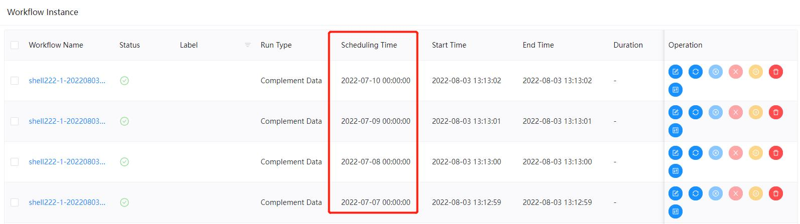

2. 구성된 타이밍: 타이밍 구성이 있는 경우 타이밍 구성과 결합하여 선택한 시간 범위에 따라 보완됩니다.예를 들어 워크플로 예약 날짜는 7월 7일부터 7월 10일이고 타이밍이 구성됩니다(오전 5시마다 실행).프로세스 예는 다음과 같습니다.

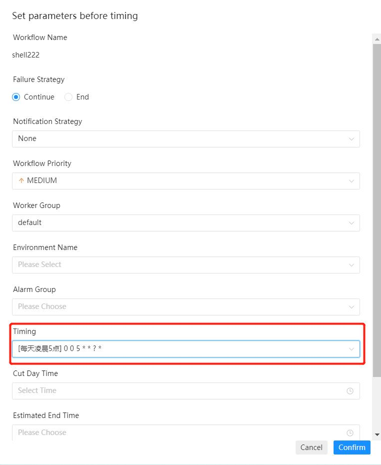

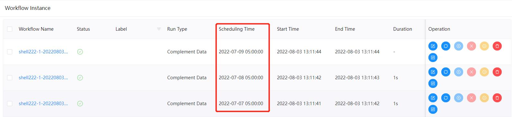

## 태스크를 단독으로 실행

- 작업을 마우스 오른쪽 버튼으로 클릭하고 '시작' 버튼을 클릭합니다. (온라인 작업만 클릭하여 실행할 수 있습니다.)

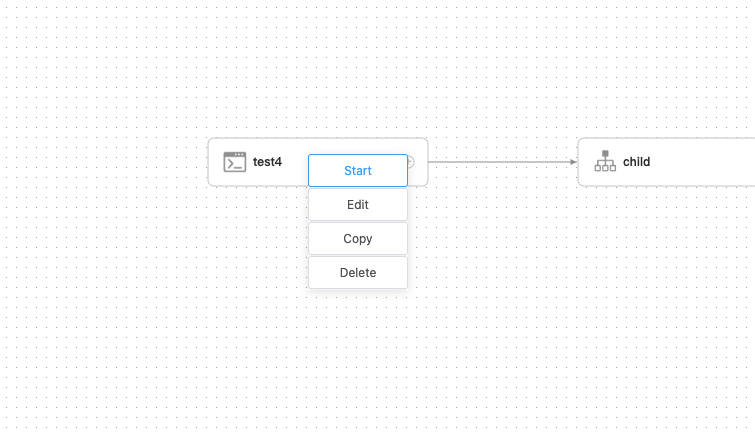

- 시작 매개변수 설정 대화상자가 표시되며, 매개변수 설명은 [워크플로우 실행](#run-the-workflow)과 동일합니다.

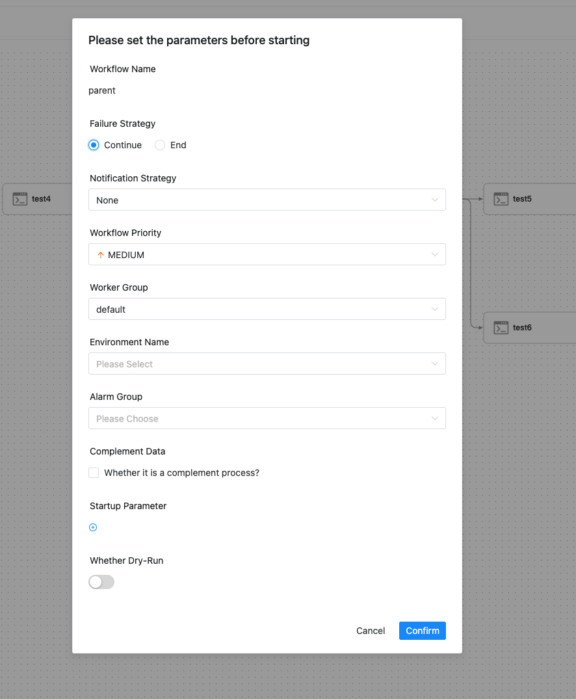

## 작업 흐름 일정

- 일정 생성: `프로젝트 관리 -> 워크플로 -> 워크플로 정의`를 클릭하고 워크플로 정의 페이지에 들어가서 워크플로를 온라인으로 만든 다음 "timing" 버튼 을 클릭하면 아래 그림과 같이 타이밍 매개변수 설정 대화상자가 나타납니다.

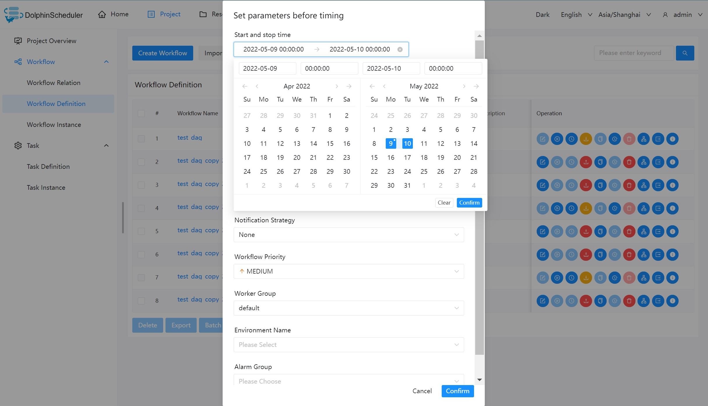

- 시작 시간과 종료 시간을 선택하세요.시작 및 종료 시간 범위 내에서 워크플로는 정기적으로 실행됩니다.시작 및 종료 시간 범위를 벗어나면 시간이 지정된 워크플로 인스턴스가 생성되지 않습니다.

- 다음 그림과 같이 5분에 한 번 실행되는 타이밍을 추가합니다.

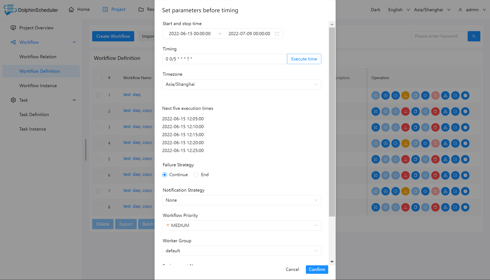

- 실패 전략, 알림 전략, 프로세스 우선 순위, 작업자 그룹, 알림 그룹, 수신자, CC는 워크플로 실행 매개 변수와 동일합니다.

- 타이밍을 생성하려면 "만들기" 버튼을 클릭하세요.이제 타이밍 상태는 "**오프라인**"이며 적용하려면 타이밍이 **온라인**이어야 합니다.

- 온라인 예약: `온라인 타이밍` 버튼 을 클릭하고 `온라인` 버튼을 클릭하면 아래 그림과 같이 타이밍 상태가 `온라인`으로 변경되며 워크플로가 정기적으로 적용됩니다.

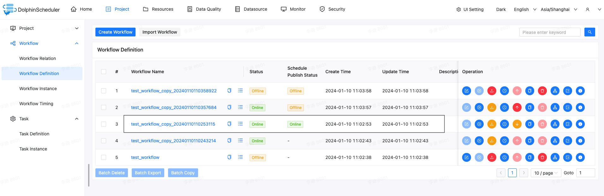

- 일정 타이밍 보기: 예정된 시간이 온라인이 된 후 "타이밍" 버튼을 통해 현재 타이밍 상황을 확인할 수 있습니다.하지만 아래 그림과 같이 수정할 수는 없습니다.
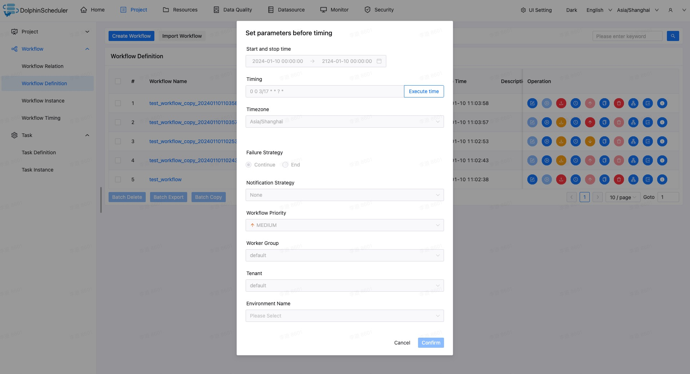

## 가져오기 작업 흐름

'프로젝트 관리 -> 워크플로 -> 워크플로 정의'를 클릭하여 워크플로 정의 페이지로 들어가고, '워크플로 가져오기' 버튼을 클릭하여 로컬 워크플로 파일을 가져오면 워크플로 정의 목록에 가져온 워크플로가 표시되며 상태는 오프라인입니다.