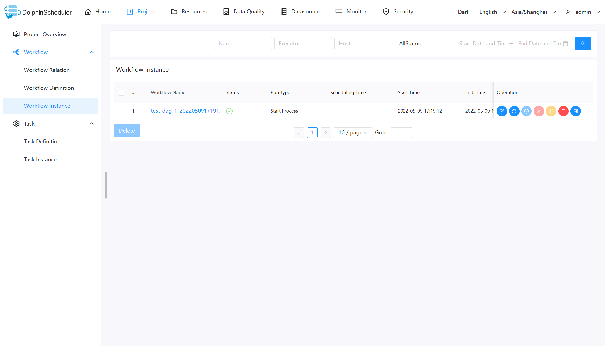
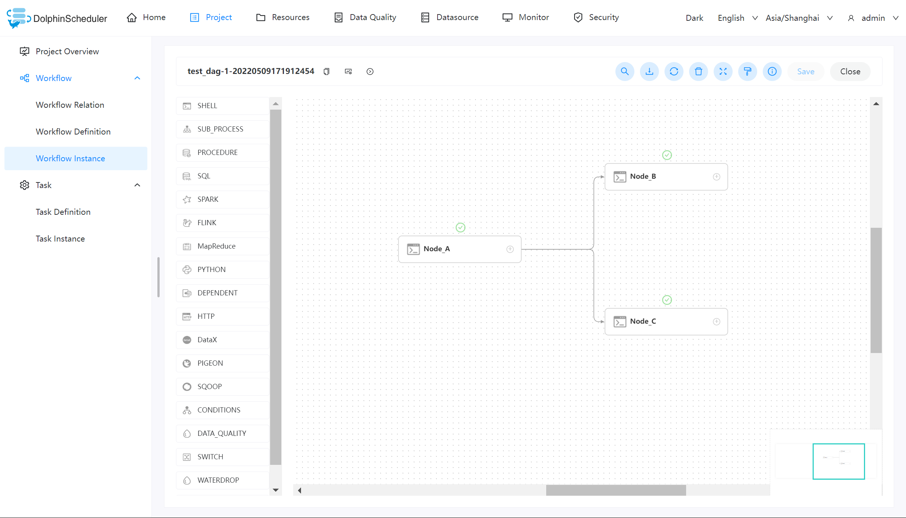
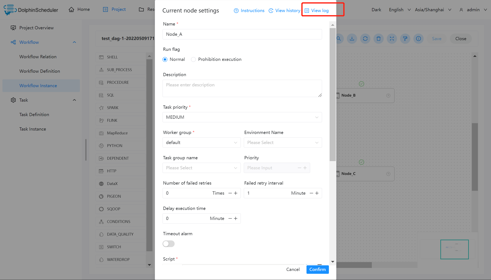
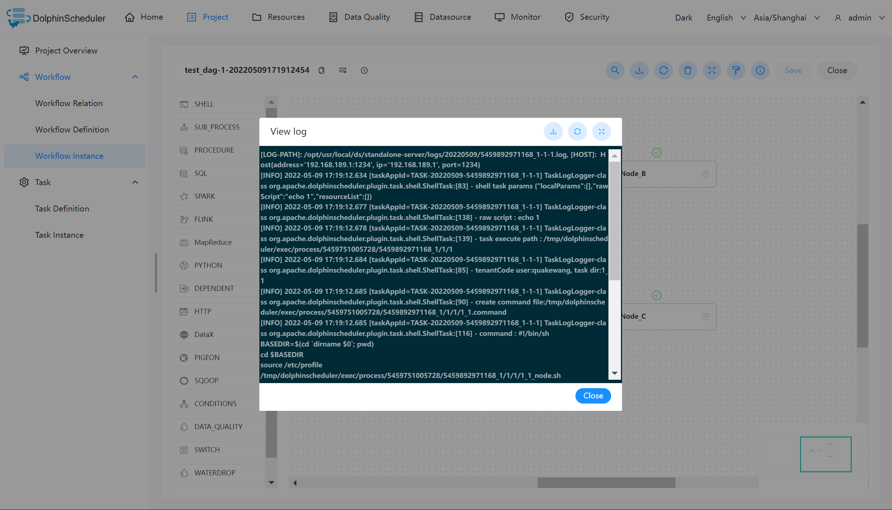
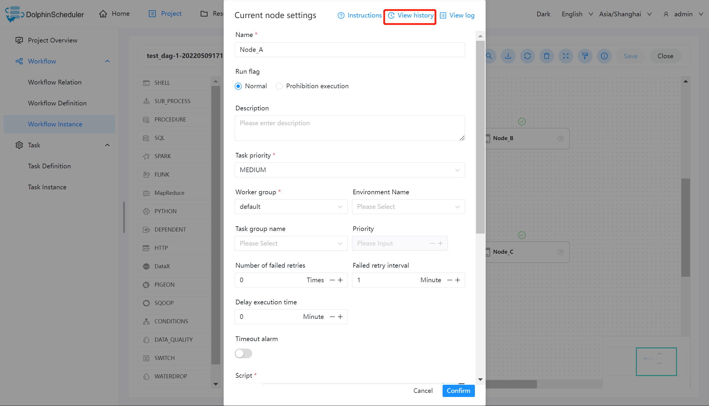
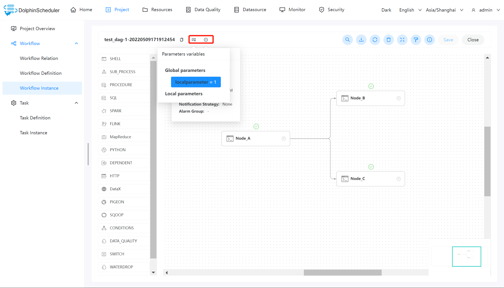
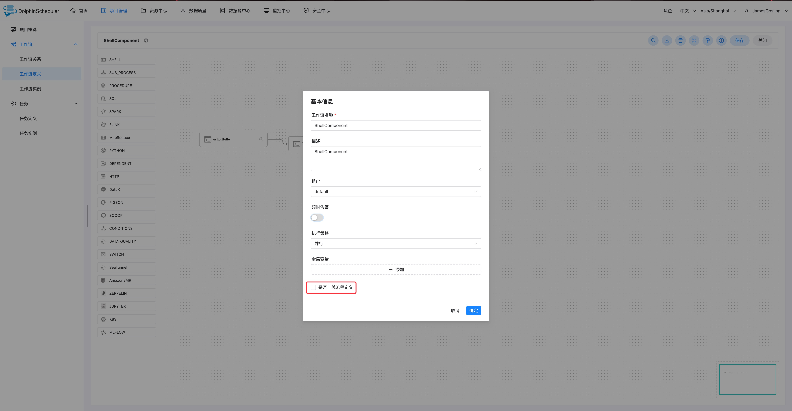
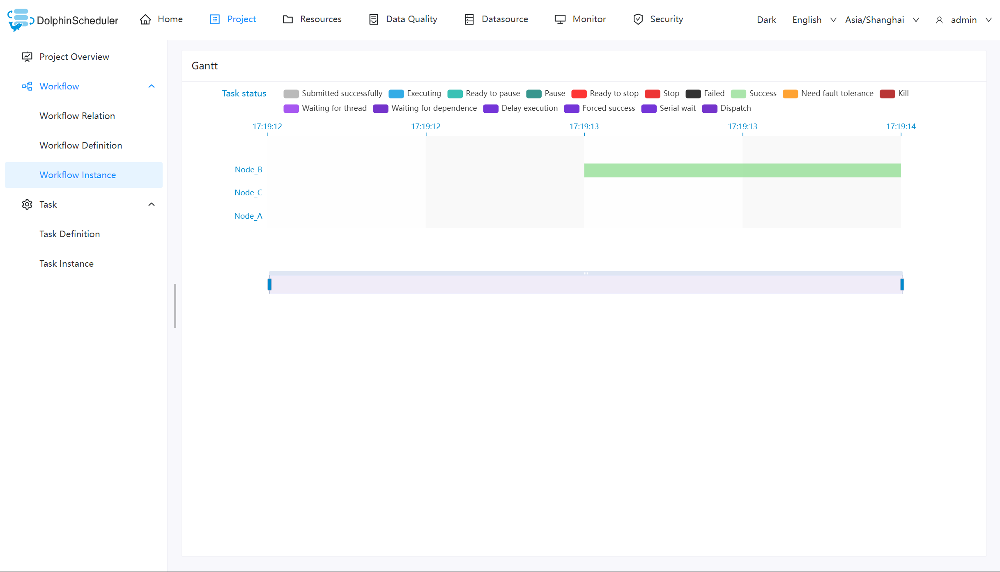

# 워크플로우 인스턴스

## 워크플로 인스턴스 보기

'프로젝트 관리 -> 워크플로 -> 워크플로 인스턴스'를 클릭하고 다음과 같이 워크플로 인스턴스 페이지로 들어갑니다.
그림:

워크플로 이름을 클릭하면 다음과 같이 DAG 뷰 페이지로 진입하여 작업 실행 상태를 확인할 수 있습니다.
그림:

## 작업 로그 보기

표시된 대로 워크플로 인스턴스 페이지에 들어가서 워크플로 이름을 클릭하고 DAG 보기 페이지에 들어가서 작업 노드를 두 번 클릭합니다.
다음 그림에서:

"로그 보기"를 클릭하면 아래 그림과 같이 로그 창이 팝업되며, 작업에 대한 작업 로그도 볼 수 있습니다.
인스턴스 페이지는 [작업 보기 로그](./task-instance.md)를 참고하세요.

## 작업 기록 보기

`프로젝트 관리 -> 워크플로우 -> 워크플로우 인스턴스`를 클릭하여 워크플로우 인스턴스 페이지로 들어가고, 워크플로우 이름을 클릭합니다.
워크플로 DAG 페이지로 들어갑니다.

작업 노드를 두 번 클릭하고 `기록 보기`를 클릭하여 작업 인스턴스 페이지로 이동하고 작업 목록을 표시합니다.
작업 정의에 의해 실행되는 인스턴스.

## 실행 매개변수 보기

`프로젝트 관리 -> 워크플로우 -> 워크플로우 인스턴스`를 클릭하여 워크플로우 인스턴스 페이지로 들어가고, 워크플로우 이름을 클릭합니다.
워크플로 DAG 페이지로 들어갑니다.

왼쪽 상단에 있는 아이콘 을 클릭하면
워크플로 인스턴스의 시작 매개변수 아이콘을 클릭하여
다음 그림과 같이 워크플로우 인스턴스의 전역 매개변수와 로컬 매개변수를 확인합니다.

## Workflow 인스턴스 운영 기능

'프로젝트 관리 -> 워크플로 -> 워크플로 인스턴스'를 클릭하고 다음과 같이 워크플로 인스턴스 페이지로 들어갑니다.
그림:

|WorkflowInstanceState \ 작업 |편집 |재방송 |중지 |일시중지 |재개 일시중지 |삭제 |간트 차트 |
|----------------------|------|-------|------|-------|---|---------|-------------|
|제출_성공 |||√ |√ |||√ |
|SERIAL_WAIT |||√ ||||√ |
|WAIT_TO_RUN |||√ ||||√ |
|실행 중 |||√ |√ |||√ |
|준비 일시중지 |||||||√ |
|일시중지 |√ |√ |||√ |√ |√ |
|준비 정지 |||||||√ |
|중지 |√ |√ |||√ |√ |√ |
|실패 |√ |√ ||||√ |√ |
|성공 |√ |√ ||||√ |√ |

- **편집:** 성공/실패/중지 상태의 프로세스만 편집할 수 있습니다."편집" 버튼을 클릭하거나 워크플로를 클릭하세요.
DAG 편집 페이지로 들어가기 위한 인스턴스 이름입니다.수정 후 그림과 같이 "저장" 버튼을 클릭하여 확인하세요.
아래.팝업 상자에서 "워크플로우 정의 업데이트 여부"를 체크하고, 수정된 정보를 저장한 후
인스턴스는 워크플로 정의로 업데이트됩니다.선택하지 않으면 워크플로 정의가 업데이트되지 않습니다.

- **재실행:** 종료된 프로세스를 다시 실행합니다.

- **복구 실패:** 실패한 프로세스의 경우 실패한 노드부터 실패 복구 작업을 수행할 수 있습니다.

- **중지:** 실행 중인 프로세스를 **중지**합니다. 백그라운드 코드는 먼저 작업자 프로세스를 '종료'한 다음
`kill -9` 작업을 실행합니다.

- **일시 중지:** 실행 중인 프로세스를 **일시 중지**합니다. 시스템 상태는 **실행 대기 중**으로 변경됩니다.
작업을 완료하고 다음 시퀀스 작업을 일시 중지합니다.

- **일시 중지 재개:** 일시 중지된 프로세스를 재개하고 **일시 중지된 노드**에서 직접 실행을 시작합니다.

- **삭제:** 워크플로 인스턴스와 워크플로 인스턴스 아래의 태스크 인스턴스를 삭제합니다.

- **간트 차트:** 간트 차트의 세로축은 워크플로우의 작업 인스턴스를 토폴로지 정렬한 것입니다.
그림과 같이 가로축은 작업 인스턴스의 실행 시간입니다.

