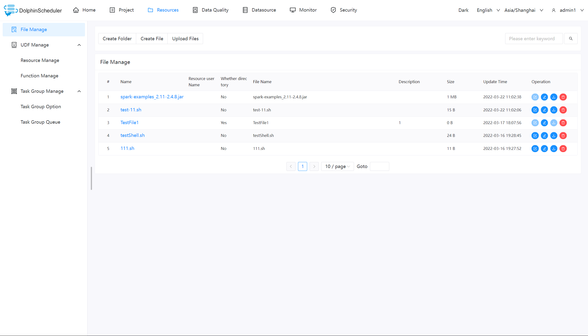
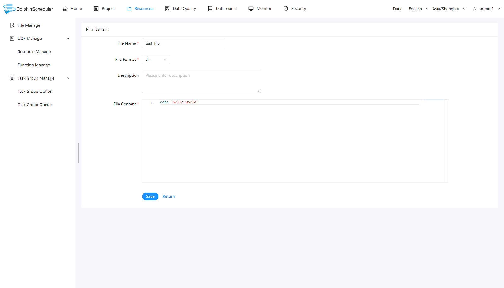
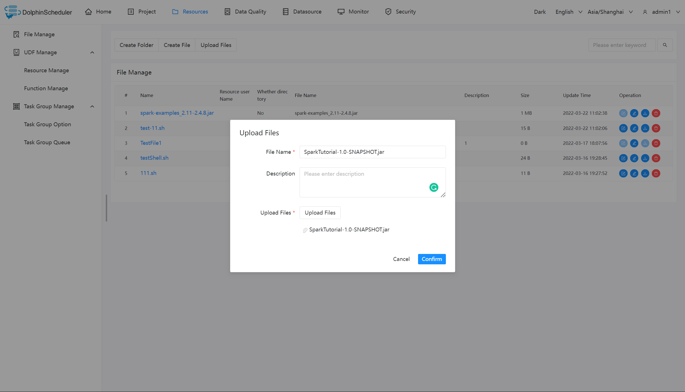
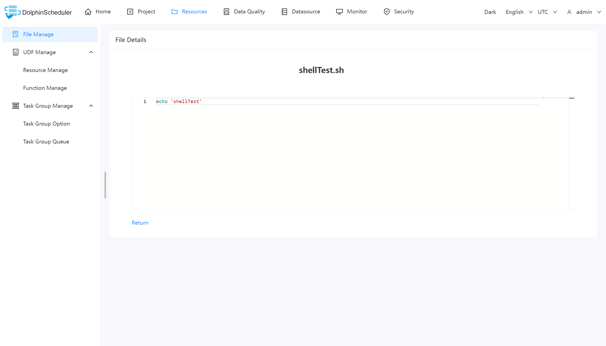
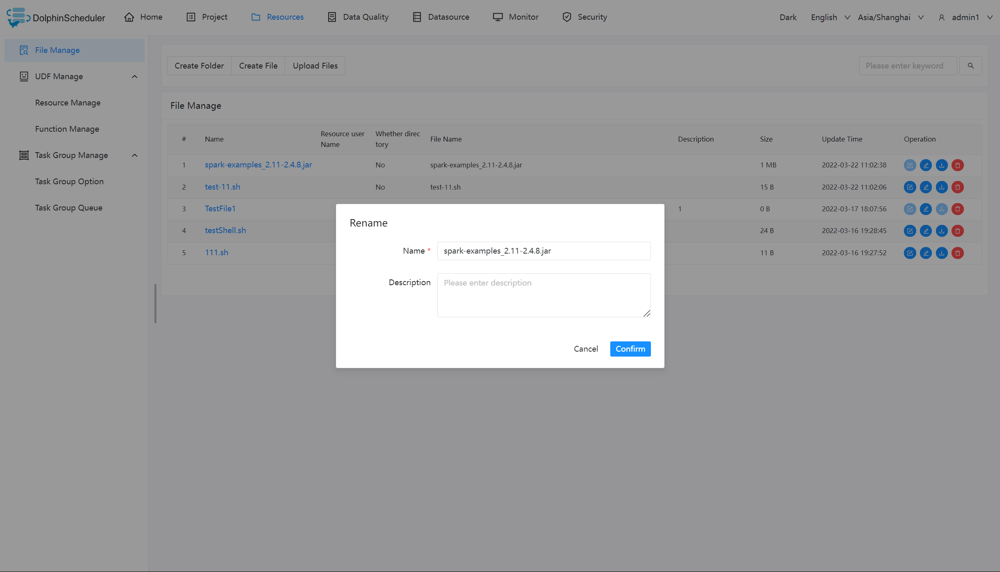
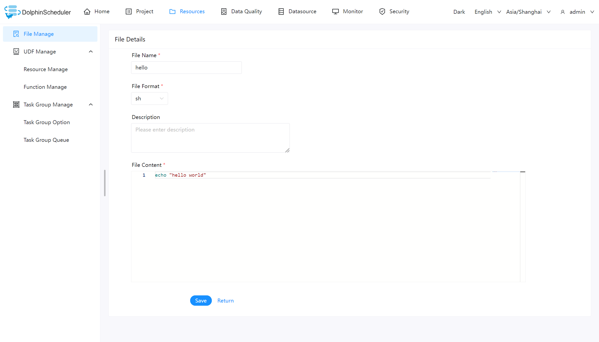
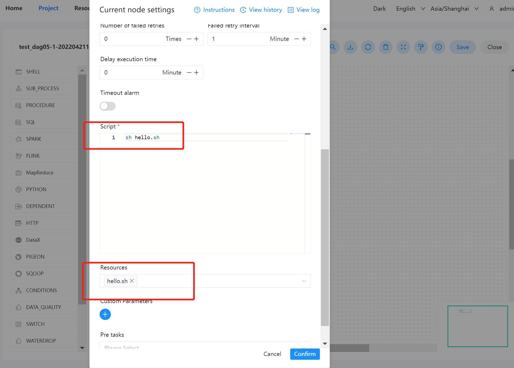
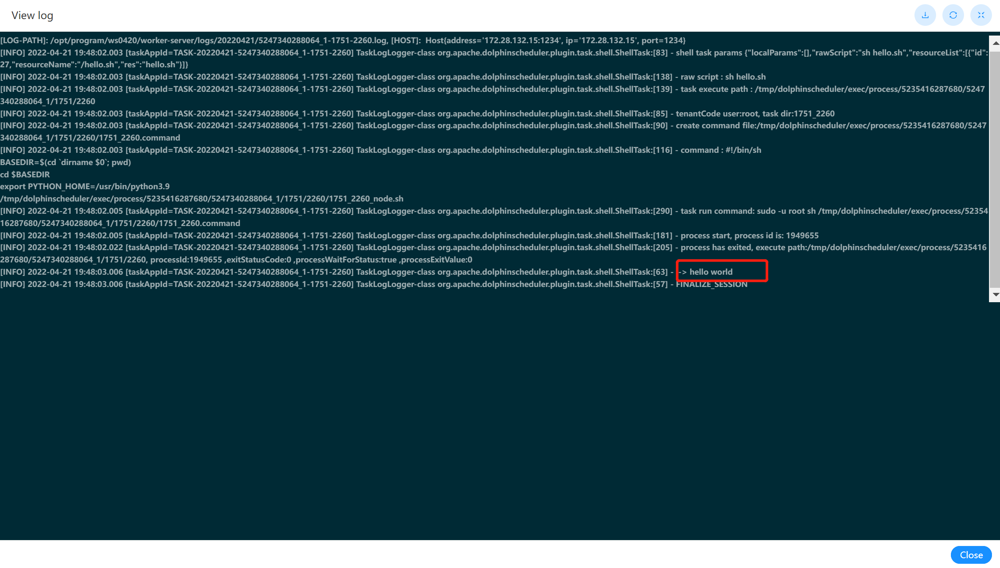

# 파일 관리

스케줄링 프로세스에서 타사 jar을 사용해야 하거나 사용자가 스크립트를 사용자 정의해야 하는 경우 이 페이지에서 관련 작업을 완료할 수 있습니다.생성할 수 있는 파일 형식에는 `txt`, `log`, `sh`, `conf`, `py`, `java` 등이 있습니다. 그리고 파일을 편집하고, 이름을 바꾸고, 다운로드하고 삭제할 수 있습니다.

> **_참고:_**
>
> * `admin`으로 파일을 관리하는 경우 먼저 `admin`에 대해 `tenant`를 설정해야 한다는 점을 기억하세요.

## 기본 작업

### 파일 생성

파일 형식은 txt, log, sh, conf, cfg, py, java, sql, xml, hql, Properties 유형을 지원합니다.

### 파일 업로드

업로드하려면 "파일 업로드" 버튼을 클릭하고 파일을 업로드 영역으로 드래그하면 파일 이름이 업로드된 파일 이름으로 자동 완성됩니다.

### 파일 보기

볼 수 있는 파일 형식의 경우 파일 이름을 클릭하면 파일 세부 정보를 볼 수 있습니다.

### 파일 다운로드

파일 목록에서 "다운로드" 버튼을 클릭하여 파일을 다운로드하거나, 파일 세부정보 오른쪽 상단의 "다운로드" 버튼을 클릭하여 파일을 다운로드하세요.

### 파일 이름 바꾸기

### 파일 삭제

파일 목록 -> "삭제" 버튼을 클릭하면 지정된 파일이 삭제됩니다.

> 참고: 로컬 파일의 파일 이름이나 소스 이름은 '.' 또는 '/'와 같은 특정 문자를 포함할 수 없습니다.
> 리소스 센터에서 파일을 업로드하거나 생성하거나 이름을 바꿉니다.

## 예

이 샘플은 주로 간단한 셸 스크립트를 사용하여 작업 흐름 정의에서 컨텐츠 센터 파일을 사용하는 방법을 보여줍니다.jar 패키지가 필요한 MR 및 Spark와 같은 작업의 경우에도 마찬가지입니다.

### 쉘 파일 생성

쉘 파일을 생성하고 `hello world`를 인쇄합니다.

### 워크플로 실행 셸 만들기

프로젝트 관리의 워크플로 정의 모듈에서 셸 작업을 사용하여 새 워크플로를 생성합니다.

- 스크립트: 'sh 자원/hello.sh'
- 리소스: 'resource/hello.sh'를 선택하세요.

> 주의사항: 스크립트에서 리소스 파일을 사용할 때 파일 이름은 선택한 리소스의 전체 경로와 동일해야 합니다.
> 예를 들어 리소스 경로가 `resource/hello.sh`인 경우 `resource/hello.sh`의 전체 경로를 사용해야 스크립트에서 사용할 수 있습니다.

### 결과 보기

워크플로우 인스턴스에서 실행 중인 노드의 로그 결과를 볼 수 있습니다.아래와 같이:

