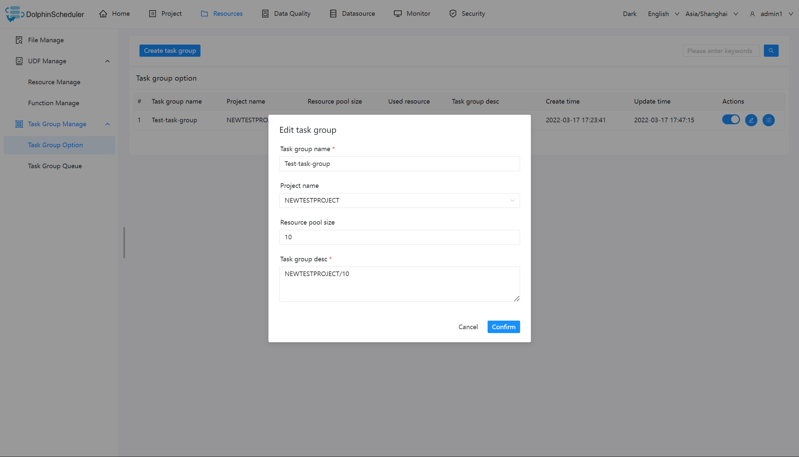
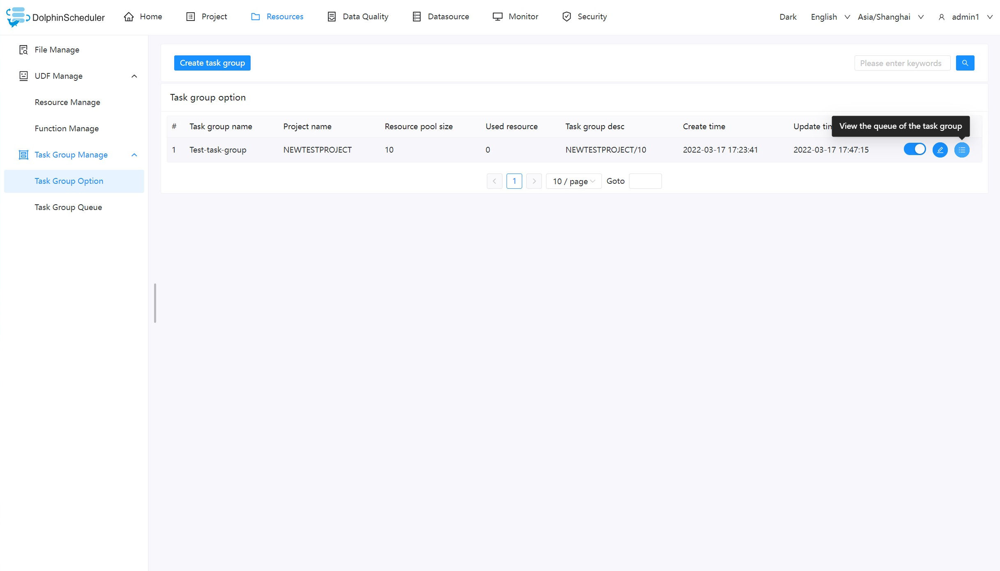
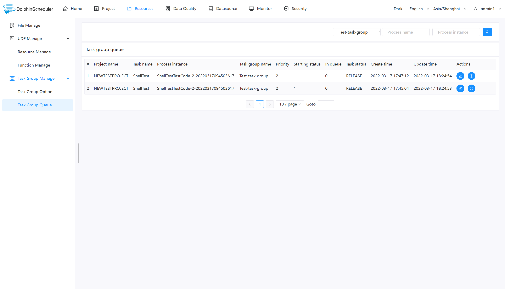
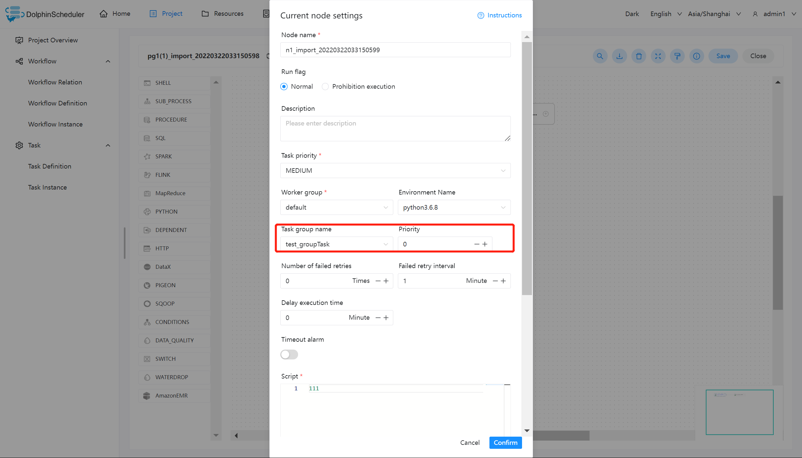
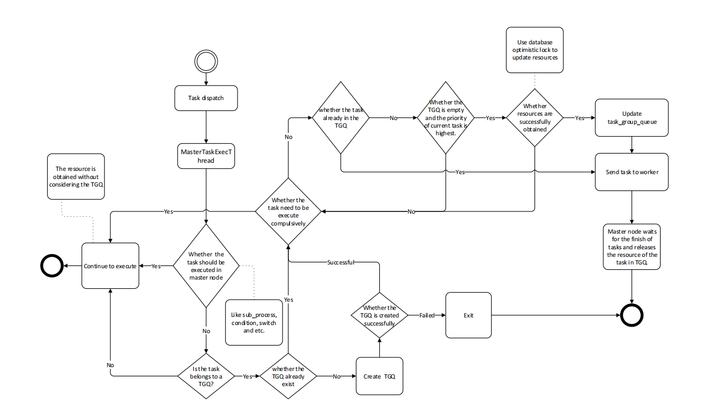

# 작업 그룹 설정

작업 그룹은 주로 작업 인스턴스의 동시성을 제어하는 데 사용되며 다른 리소스의 압력을 제어하도록 설계되었습니다(Hadoop 클러스터의 압력도 제어할 수 있으며 클러스터는 대기열을 제어합니다).새 작업 정의를 생성할 때 해당 작업 그룹을 구성하고 작업 그룹에서 실행되는 작업의 우선 순위를 구성할 수 있습니다.사용자는 승인된 프로젝트에 속한 작업 그룹만 볼 수 있으며, 쓰기 권한이 있는 경우에만 하나의 프로젝트에 속한 작업 그룹을 생성하거나 업데이트할 수 있습니다.

> 참고: 작업 그룹의 리소스 제한은 프로젝트 수준에 있으며 테넌트와 관련이 없습니다.

## 작업 그룹 구성

### 작업 그룹 생성

사용자가 `리소스 -> 작업 그룹 관리 -> 작업 그룹 옵션 -> 작업 그룹 생성`을 클릭합니다.

사진 안의 정보를 입력해야 합니다.

- **작업 그룹 이름**: 작업 그룹 사용 시 표시되는 이름입니다.
- **프로젝트 이름**: 작업 그룹이 수행하는 프로젝트. 이 항목은 선택 사항이며, 선택하지 않을 경우 전체 시스템의 모든 프로젝트가 이 작업 그룹을 사용할 수 있습니다.
- **리소스 풀 크기**: 허용되는 최대 동시 작업 인스턴스 수입니다.

### 작업 그룹 대기열 보기

작업 그룹 사용 정보를 보려면 버튼을 클릭하세요.

### 작업 그룹 사용

**참고**: 작업 그룹의 사용은 `switch` 노드, `condition` 노드, `sub_workflow`와 같은 작업자가 실행하는 작업에 적용 가능하며 마스터가 실행하는 기타 노드 유형은 작업 그룹에 의해 제어되지 않습니다.

쉘 노드를 예로 들어보겠습니다.

작업 그룹 구성과 관련하여 빨간색 상자에 있는 다음 부분을 구성하기만 하면 됩니다.

- 작업 그룹 이름: 작업 그룹 이름은 작업 그룹 구성 페이지에 표시됩니다.여기서는 프로젝트에 액세스 권한이 있는 작업 그룹(작업 그룹을 생성할 때 프로젝트가 선택됨) 또는 전역적으로 범위를 지정하는 작업 그룹(작업 그룹을 생성할 때 프로젝트가 선택되지 않음)만 볼 수 있습니다.

- 우선순위: 대기 중인 자원이 있는 경우 우선순위가 높은 작업을 마스터가 먼저 작업자에게 분배합니다.이 부분의 값이 클수록 우선순위가 높아집니다.

## 태스크 그룹의 구현 로직

### 작업 그룹 리소스 가져오기

마스터는 태스크를 분배할 때 태스크가 태스크 그룹으로 구성되어 있는지 판단합니다.작업이 구성되지 않은 경우 일반적으로 작업자에게 전달되어 실행됩니다.작업 그룹이 구성되면 작업 그룹 리소스 풀의 남은 크기가 현재 작업 작업을 충족하는지 확인한 후 실행을 위해 작업자에게 던집니다., 자원 풀 -1이 충족되면 계속 실행합니다.그렇지 않은 경우 작업 배포를 종료하고 다른 작업이 깨어날 때까지 기다립니다.

### 해제 및 깨우기

작업 그룹 리소스를 점유한 작업이 완료되면 작업 그룹 리소스가 해제됩니다.해제 후에는 현재 작업 그룹에 대기 중인 작업이 있는지 확인합니다.있는 경우 실행 우선순위가 가장 높은 작업을 표시하고 새 실행 가능 이벤트를 생성합니다.이벤트는 리소스를 획득하도록 표시된 작업 ID를 저장한 다음 작업이 작업 그룹 리소스를 획득하고 실행합니다.

#### 작업 그룹 흐름도

