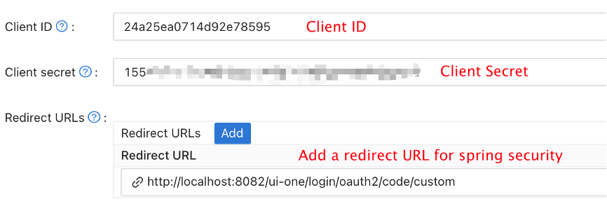
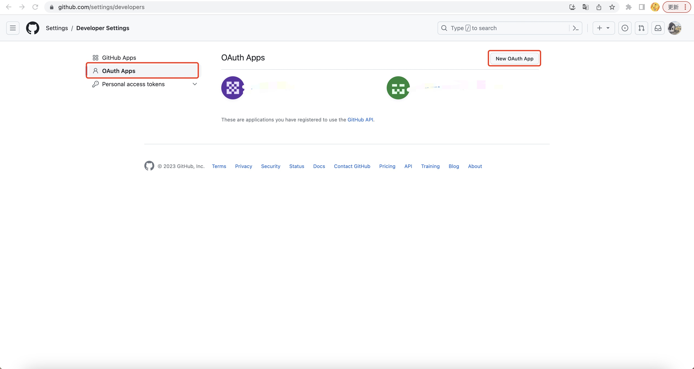
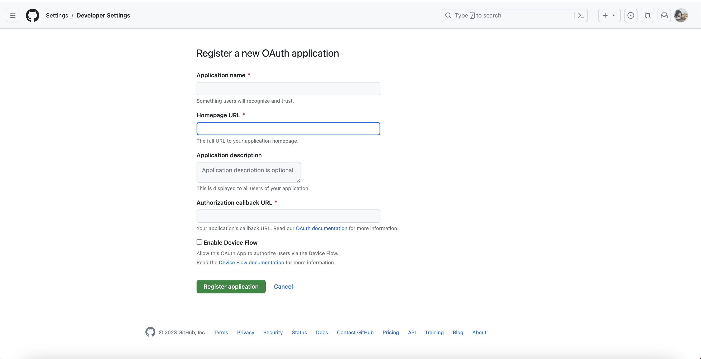
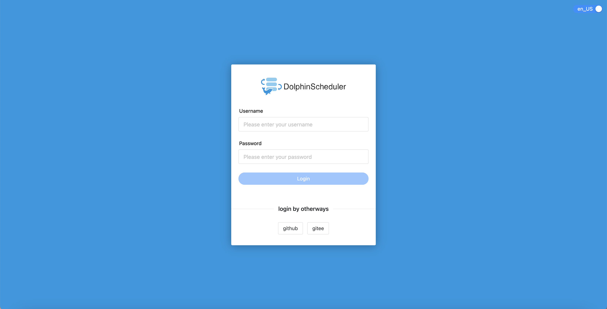

# 인증 유형

* 지금까지 Apache DolphinScheduler 비밀번호, LDAP, Casdoor SSO, OAuth2 및 OIDC(OpenID Connect)의 네 가지 인증 유형을 지원합니다.OAuth2 인증 로그인 모드는 다른 인증 모드와 함께 사용할 수 있습니다.

## 인증 유형 변경

> 돌고래스케줄러-api/src/main/resources/application.yaml```yaml
security:
  authentication:
    # Authentication types (supported types: PASSWORD,LDAP,CASDOOR_SSO, OIDC)
    type: LDAP
    # IF you set type `LDAP`, below config will be effective
    ldap:
      # ldap server config
      url: ldap://ldap.forumsys.com:389/
      base-dn: dc=example,dc=com
      username: cn=admin,dc=example,dc=com
      password: password
      user:
        # admin userId when you use LDAP login
        admin: ldap-admin
        # user search filter to find admin user
        admin-user-filter: (&(cn={0}))
        identity-attribute: uid
        email-attribute: mail
        # action when ldap user is not exist (supported types: CREATE,DENY)
        not-exist-action: DENY
      ssl:
        enable: false
        # jks file absolute path && password
        trust-store: "/ldapkeystore.jks"
        trust-store-password: "password"
    casdoor:
      user:
        admin: ""
    oauth2:
      enable: false
      provider:
        github:
          authorizationUri: ""
          redirectUri: ""
          clientId: ""
          clientSecret: ""
          tokenUri: ""
          userInfoUri: ""
          callbackUrl: ""
          iconUri: ""
          provider: github
        google:
          authorizationUri: ""
          redirectUri: ""
          clientId: ""
          clientSecret: ""
          tokenUri: ""
          userInfoUri: ""
          callbackUrl: ""
          iconUri: ""
          provider: google
casdoor:
   # Your Casdoor server url
   endpoint: ""
   client-id: ""
   client-secret: ""
   # The certificate may be multi-line, you can use `|-` for ease
   certificate: ""
   # Your organization name added in Casdoor
   organization-name: ""
   # Your application name added in Casdoor
   application-name: ""
   # Doplhinscheduler login url
   redirect-url: ""
````

## 카스도어 SSO

[Casdoor](https://casdoor.org/)는 OAuth 2.0, OIDC, SAML 및 CAS를 기반으로 하는 UI 우선 ID 액세스 관리(IAM)/SSO(Single-Sign-On) 플랫폼입니다.다음 단계에 따라 Casdoor를 통해 Dolphinscheduler에 SSO 기능을 추가할 수 있습니다.

### 1단계.Casdoor 배포

먼저 Casdoor를 배치해야 합니다.

[서버 설치](https://casdoor.org/docs/basic/server-installation)는 Casdoor 공식 문서를 참고하실 수 있습니다.

성공적인 배포 후에는 다음을 확인해야 합니다.

* Casdoor 서버는 http://localhost:8000에서 성공적으로 실행되고 있습니다.
* 즐겨 사용하는 브라우저를 열고 http://localhost:7001을 방문하면 Casdoor의 로그인 페이지가 나타납니다.
* 로그인 기능을 테스트하기 위해 admin 및 123을 입력하면 정상적으로 작동합니다.

그러면 다음 단계에 따라 앱에 Casdoor 기반 로그인 페이지를 빠르게 구현할 수 있습니다.

### 2단계.Casdoor 애플리케이션 구성

1. 기존 Casdoor 애플리케이션을 생성하거나 사용합니다.
2. 리디렉션 URL을 추가하세요(리디렉션 URL을 얻는 방법에 대한 자세한 내용은 다음 섹션에서 확인할 수 있습니다).

3. 원하는 제공자를 추가하고 기타 설정을 보완하세요.

당연히 애플리케이션 설정 페이지에서 위 그림과 같이 `클라이언트 ID`와 `클라이언트 비밀`이라는 두 가지 값을 얻을 수 있습니다.다음 단계에서 이를 사용하겠습니다.

즐겨 사용하는 브라우저를 열고 **http://`CASDOOR_HOSTNAME`/.well-known/openid-configuration**을 방문하면 Casdoor의 OIDC 구성이 표시됩니다.

### 3단계.Dolphinscheduler 구성

> 돌고래스케줄러-api/src/main/resources/application.yaml```yaml
security:
  authentication:
    # Authentication types (supported types: PASSWORD,LDAP,CASDOOR_SSO)
    type: CASDOOR_SSO
casdoor:
  # Your Casdoor server url
  endpoint:
  client-id:
  client-secret:
  # The certificate may be multi-line, you can use `|-` for ease
  certificate: 
  # Your organization name added in Casdoor
  organization-name:
  # Your application name added in Casdoor
  application-name:
  # Doplhinscheduler login url
  redirect-url: http://localhost:5173/login 
````

## OAuth2

Dolphinscheduler는 여러 OAuth2 공급자를 지원할 수 있습니다.

### 1단계.클라이언트 자격 증명 생성





### 2단계.Api 구성 파일에서 OAuth2 로그인 활성화```yaml
security:
  authentication:
    # omit
    oauth2:
      # Set enable to true to enable oauth2 login mode
      enable: true
      provider:
        github:
          # Set the provider authorization address, for example:https://github.com/login/oauth/authorize
          authorizationUri: ""
          # dolphinscheduler backend redirection interface address, for example :http://127.0.0.1:12345/dolphinscheduler/redirect/login/oauth2
          redirectUri: ""
          #  clientId
          clientId: ""
          # client secret
          clientSecret: ""
          # Set the provider's request token address
          tokenUri: ""
          # Set the provider address for requesting user information
          userInfoUri: ""
          # Redirect address after successful login, http://{ip}:{port}/login
          callbackUrl: ""
          # The image url of the login page jump button, if not filled, a text button will be displayed
          iconUri: ""
          provider: github
        google:
          authorizationUri: ""
          redirectUri: ""
          clientId: ""
          clientSecret: ""
          tokenUri: ""
          userInfoUri: ""
          callbackUrl: ""
          iconUri: ""
          provider: google
        gitee:
          authorizationUri: "https://gitee.com/oauth/authorize"
          redirectUri: "http://127.0.0.1:12345/dolphinscheduler/redirect/login/oauth2"
          clientId: ""
          clientSecret: ""
          tokenUri: "https://gitee.com/oauth/token?grant_type=authorization_code"
          userInfoUri: "https://gitee.com/api/v5/user"
          callbackUrl: "http://127.0.0.1:5173/login"
          iconUri: ""
          provider: gitee
````

### 3단계 OAuth2로 로그인



---

## OIDC(오픈ID 커넥트)

OIDC 인증 방법을 통해 DolphinScheduler는 광범위한 외부 ID 공급자와 통합하여 중앙 집중식 SSO(Single Sign-On)를 활성화할 수 있습니다.이는 내부 사용자 디렉터리 또는 타사 공급자와 연결해야 하는 기업 환경에 이상적입니다.

이 구현은 일반화되었으며 **Keycloak, Okta, Microsoft Entra ID(Azure AD), Google, DexIDP, Auth0, Feishu 및 WeChat Work Login**과 같은 모든 OIDC 준수 공급자를 지원합니다.

### 1단계. API 구성 파일에서 OIDC 활성화

1. OIDC를 활성화하려면 먼저 인증 '유형'을 'OIDC'로 설정하고 'dolphinscheduler-api/src/main/resources/application.yaml'에서 다음 구성을 수정해야 합니다.```yaml
security:
  authentication:
    # Authentication types (supported types: PASSWORD, LDAP, CASDOOR_SSO, OIDC)
    type: OIDC
````

2. 그런 다음 사용하려는 OIDC 공급자를 구성해야 합니다.다음은 각 매개변수에 대한 자세한 설명과 함께 Keycloak을 사용한 전체 구성 예시입니다.

> **참고**: OIDC를 구성하기 전에 API 및 UI에 대한 공개 URL을 설정했는지 확인하세요. 이는 OIDC 제공업체에 대한 올바른 콜백 URL을 구성하는 데 중요합니다.```yaml
# dolphinscheduler-api/src/main/resources/application.yaml

# These top-level URLs are essential for OIDC to function correctly.
api:
  # The public-facing base URL of the DolphinScheduler API server.
  # This is used to build the `redirect_uri` for the OIDC provider.
  # It must be reachable by the user's browser.
  base-url: http://localhost:12345/dolphinscheduler
  # The public-facing URL of the DolphinScheduler UI.
  # Users will be redirected here after a successful login.
  ui-url: http://localhost:5173

security:
  authentication:
    # Set the primary authentication type to OIDC.
    type: OIDC
    oidc:
      # Master switch to enable or disable the OIDC feature.
      enable: true
      # A map of OIDC provider configurations. The key (e.g., "keycloak") is the provider's unique registrationId,
      # which is used in the login and callback URLs.
      providers:
        # --- Example for Keycloak ---
        keycloak:
          # The text displayed on the login button on the UI.
          display-name: "Login with Keycloak"
          # The URL of your OIDC provider's issuer. This is the core endpoint for OIDC discovery.
          # For Keycloak, it typically ends with /realms/{your-realm-name}.
          issuer-uri: http://localhost:8080/realms/dolphinscheduler
          # The relative path to an icon for the login button. The image should be placed in the `dolphinscheduler-ui/public/images/providers-icon/` directory.
          icon-uri: "/images/providers-icon/keycloak.png"
          # The Client ID obtained from your OIDC provider after registering DolphinScheduler as a client.
          client-id: dolphinscheduler-client
          # The Client Secret obtained from your OIDC provider.
          client-secret: dolphinscheduler-client-secret
          # (Optional) The method used to authenticate with the token endpoint.
          # Can be "client_secret_basic" (default) or "client_secret_post".
          # client-authentication-method: client_secret_basic
          # The OIDC scopes to request. "openid" is mandatory. "profile", "email", and "groups" are recommended
          # to get user information and roles.
          scope: openid, profile, email, groups
          # The claim in the ID Token or UserInfo response to use as the DolphinScheduler username.
          # "preferred_username" is common, but could also be "email", "sub", or a custom claim.
          user-name-attribute: preferred_username
          # (Optional) The claim that contains the user's group or role memberships.
          # This is required for admin role mapping.
          groups-claim: groups

        # --- You can add more providers here ---
        # okta:
        #   display-name: "Login with Okta"
        #   issuer-uri: [https://your-okta-domain.okta.com/oauth2/default](https://your-okta-domain.okta.com/oauth2/default)
        #   ...

      # Settings for automatic user provisioning in DolphinScheduler upon first OIDC login.
      user:
        # If true, a new DolphinScheduler user will be created if one doesn't exist upon successful login.
        # If false, only existing users can log in. Default is false.
        auto-create: true
        # The default tenant to assign to newly created users.
        default-tenant-code: "default"
        # The default queue to assign to newly created users.
        default-queue: "default"
        # A list of group names from the OIDC provider that will grant a user ADMIN privileges in DolphinScheduler.
        # The user's groups are read from the claim specified in "groups-claim".
        admin-group-mapping:
          - dolphinscheduler-admins
````

> **`issuer-uri`에 대한 참고사항**: 올바른 값은 환경에 따라 다릅니다.
> - DolphinScheduler를 **로컬로(예: IDE에서)** 실행하고 Docker에서 Keycloak을 실행하는 경우 호스트 컴퓨터의 주소(예: `http://localhost:8080/...`)를 사용하세요.
> - DolphinScheduler와 Keycloak이 모두 **동일한 Docker 네트워크** 내에서 실행 중인 경우(제공된 에서와 같이) 컨테이너 간 통신을 위해 Docker 서비스 이름(예: `http://keycloak:8080/...`)을 사용해야 합니다.`docker-compose.yaml`
>
> **💡 팁**: **환경 변수로 구성** - `application.yaml`의 모든 속성은 환경 변수를 사용하여 구성할 수 있습니다.이는 컨테이너화된 배포에 특히 유용합니다.YAML 경로를 환경 변수로 변환하려면 대문자를 사용하고 점(`.`)과 하이픈(`-`)을 밑줄(`_`)로 바꾸세요.
> 예를 들어 `security.authentication.oidc.providers.keycloak.client-id`는 `SECURITY_AUTHENTICATION_OIDC_PROVIDERS_KEYCLOAK_CLIENT_ID`가 됩니다.

### 2단계. OIDC 공급자 구성(Keycloak 예)

OIDC 제공업체에 DolphinScheduler를 클라이언트로 등록해야 합니다.Keycloak을 사용하는 방법은 다음과 같습니다.

#### 2.1.사전 구성된 영역 내보내기를 사용한 손쉬운 설정:

1. 사전 구성된 영역이 포함된 제공된 `docker-compose.yaml`을 사용하여 Keycloak을 시작하고 docker가 백그라운드에서 실행되고 있는지 확인합니다.   ```bash
   cd dolphinscheduler-api-test/dolphinscheduler-api-test-case/src/test/resources/docker/oidc-login/
   docker-compose up -d keycloak
````

그러면 '8081' 포트에서 Keycloak이 시작되고 필요한 클라이언트, 사용자 및 그룹이 포함된 영역을 가져옵니다.

2. `http://localhost:8081`(사용자 이름: `admin`, 비밀번호: `admin`)에서 Keycloak 관리 콘솔에 액세스합니다.

3. `dolphinscheduler` 영역으로 전환하고 가져온 구성을 확인합니다.

4. 'dolphinscheduler-client' 클라이언트에서 **유효한 리디렉션 URI**를 로컬 설정과 일치하도록 업데이트합니다.

* `http://localhost:12345/dolphinscheduler/login/oauth2/code/keycloak`
5. CORS 문제를 방지하려면 `http://localhost:5173`을 포함하도록 **웹 원본**을 업데이트하세요.
6. 변경 사항을 저장합니다.
7. Keycloak의 `dolphinscheduler-client` 클라이언트에서 **클라이언트 ID** 및 **클라이언트 비밀번호**를 얻습니다.
8. 1단계에 표시된 대로 DolphinScheduler 구성에서 이 값을 사용합니다.
9. 테스트/개발이 완료되면 다음을 사용하여 Keycloak 컨테이너를 중지할 수 있습니다.   ```bash
   docker-compose down
````

_**또는**_

#### 2.2.사용자 정의 구성 사용:

1. docker를 사용하여 Keycloak 인스턴스를 가동하고(아직 실행하지 않은 경우) docker가 백그라운드에서 실행되고 있는지 확인합니다.   ```bash
   docker run --rm -p 8080:8080 -e KEYCLOAK_ADMIN=admin -e KEYCLOAK_ADMIN_PASSWORD=admin quay.io/keycloak/keycloak:22.0.1 start-dev
````

그러면 관리자(사용자 이름: `admin`, 비밀번호: `admin`)로 포트 `8080`에서 Keycloak이 시작됩니다.

2. **영역 생성**: 영역이 없으면 새 영역(예: `dolphinscheduler`)을 생성합니다.

3. **클라이언트 생성**:

* **클라이언트**로 이동하여 **클라이언트 생성**을 클릭합니다.
* **클라이언트 ID**를 구성과 일치하도록 설정하세요(예: `dolphinscheduler-client`).
* **클라이언트 인증**이 **켜짐**인지 확인하세요.
* 다음 화면에서 **유효한 리디렉션 URI**를 설정하세요.이는 매우 중요하며 `api.base-url`에서 생성된 URL과 일치해야 합니다.
* `http://{your-dolphinscheduler-host:port}/dolphinscheduler/login/oauth2/code/{registrationId}`
* 예: `http://localhost:12345/dolphinscheduler/login/oauth2/code/keycloak`
* UI가 Keycloak과 통신할 수 있도록 **웹 출처**를 설정합니다(예: `http://localhost:5173`).
* **이메일 및 프로필에 대한 클라이언트 범위 구성**:
* Keycloak 관리 콘솔에서 **클라이언트 범위**로 이동합니다.
* 내장된 'email' 및 'profile' 범위가 클라이언트에 할당되었는지 확인하세요.
* 클라이언트로 이동합니다(**클라이언트** -> 클라이언트 선택 -> **클라이언트 범위** 탭).
* **할당된 기본 클라이언트 범위**에서 `email` 및 `profile`이 아직 없으면 추가합니다.
* 이를 통해 OIDC 토큰에는 DolphinScheduler가 사용자 프로비저닝 및 표시에 필요할 수 있는 사용자 이메일 및 프로필 정보가 포함됩니다.
4. **자격 증명 받기**:

* 새 클라이언트의 **자격 증명** 탭으로 이동하여 **클라이언트 비밀번호**를 복사하세요.

5. **재사용 가능한 '그룹' 범위 만들기(권장)**:
- 왼쪽 메뉴에서 **클라이언트 범위**로 이동하여 **클라이언트 범위 만들기**를 클릭합니다.
- **이름**을 `그룹`으로 설정하고 **저장**을 클릭합니다.
- 새 `그룹` 범위를 보려면 **매퍼** 탭으로 이동하세요.
- **매퍼 생성**을 클릭하고 목록에서 **그룹 멤버십**을 선택합니다.
- **이름**(예: "그룹 매퍼")을 지정합니다.
- **토큰 클레임 이름**을 `groups`로 설정합니다(이는 의 속성과 일치해야 합니다).`groups-claim``application.yaml`
- **ID 토큰에 추가**가 활성화되어 있는지 확인하세요.**저장**을 클릭합니다.
- 마지막으로 클라이언트로 다시 이동합니다(**클라이언트** -> -> **클라이언트 범위** 탭).`dolphinscheduler-클라이언트`
- **기본 클라이언트 범위**에 새 `그룹` 범위를 추가합니다.이렇게 하면 이 클라이언트의 모든 사용자에게 'groups' 클레임이 포함됩니다.
6. **그룹 및 사용자 생성**:

* **그룹**으로 이동하여 `admin-group-mapping`(예: `dolphinscheduler-admins`)에 지정한 이름으로 그룹을 만듭니다.
* **사용자**로 이동하여 새 사용자를 생성하고 이 그룹에 할당합니다.

_**또는**_

#### 2.3.기존 OIDC 공급자(Okta, Azure AD, Google 등)가 있는 경우

1. 공급자의 설명서에 따라 새 애플리케이션/클라이언트를 등록합니다.
2. 리디렉션 URI를 `http://{your-dolphinscheduler-host:port}/dolphinscheduler/login/oauth2/code/{registrationId}`로 설정합니다.
3. 클라이언트 ID와 클라이언트 비밀번호를 얻습니다.
4. 필요한 경우 `openid`, `profile`, `email` 및 `group/role` 클레임을 포함하도록 범위를 구성합니다.
5. 사용자 정보 엔드포인트가 사용자 이름 및 그룹에 필요한 클레임을 제공하는지 확인합니다.
6. DolphinScheduler 구성의 'admin-group-mapping'과 일치하도록 OIDC 공급자의 필요한 역할 또는 그룹을 매핑합니다.
7. admin 그룹에 속한 사용자로 로그인하여 구성을 테스트하십시오.
8. 필요한 추가 설정에 대해서는 공급자별 설명서를 참조하십시오.
9. DolphinScheduler API 서버에서 OIDC 공급자의 메타데이터 엔드포인트(일반적으로 `/.well-known/openid-configuration`)에 액세스할 수 있는지 확인합니다.
10. 필요한 경우 DolphinScheduler와 OIDC 공급자 간의 통신을 허용하도록 방화벽 또는 네트워크 설정을 조정합니다.
11. HTTPS에 자체 서명된 인증서를 사용하는 경우 DolphinScheduler API 서버가 인증서를 신뢰하는지 확인하십시오.
12. 클라이언트 비밀번호를 정기적으로 업데이트하고 OIDC 공급자의 보안 설정을 검토하여 보안 통합을 유지합니다.

### 3단계. OIDC로 로그인새로운 구성으로 DolphinScheduler API 서버를 다시 시작하면 이제 로그인 페이지에 구성된 각 OIDC 공급자에 대한 새 버튼이 표시됩니다.

버튼을 클릭하면 인증을 위해 OIDC 제공업체로 리디렉션됩니다.로그인에 성공하면 DolphinScheduler로 다시 리디렉션되어 자동으로 로그인됩니다.

> **참고:** 사용자가 공급자의 로그인 버튼을 클릭하면 먼저 DolphinScheduler 백엔드의 특정 엔드포인트(예: `/dolphinscheduler/oauth2/authorization/keycloak`)로 연결됩니다.그런 다음 백엔드는 전체 요청을 구성하고 사용자의 브라우저를 OIDC 공급자의 로그인 페이지로 리디렉션합니다.