# 보안(인증시스템)

보안 센터의 관리자 계정만이 대기열 관리, 테넌트 관리, 사용자 관리, 알람 그룹 관리, 작업자 그룹 관리, 토큰 관리 및 기타 기능을 포함하는 작업 권한을 갖습니다.사용자 관리 모듈에서는 리소스, 데이터 소스, 프로젝트 등에 대한 권한을 부여할 수 있습니다.

관리자 로그인, 기본 사용자 이름/비밀번호: admin/dolphinscheduler123

## 대기열 생성

- 큐는 스파크, 맵리듀스 등의 프로그램을 실행할 때 사용되며, "queue" 매개변수를 사용해야 합니다.
- 관리자는 '보안센터->큐 관리' 페이지에 접속하여 '큐 생성' 버튼을 클릭하여 새로운 큐를 생성합니다.

> 참고: 현재는 관리자만 대기열을 수정할 수 있습니다.

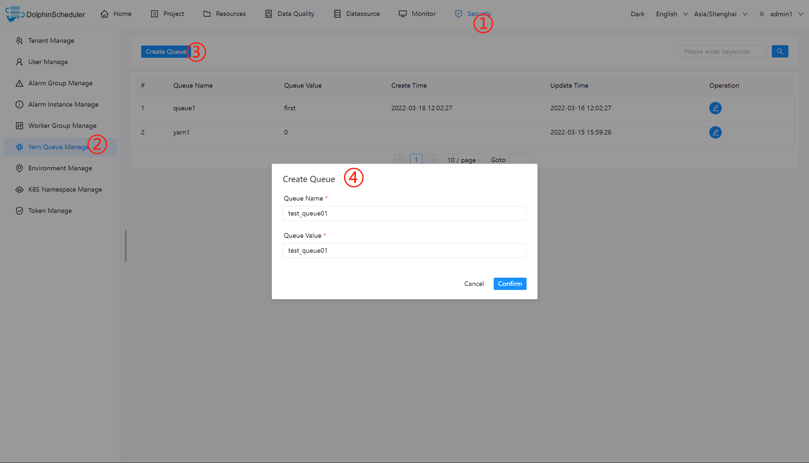

## 테넌트 추가

- 테넌트는 작업자가 작업을 제출하는 데 사용하는 Linux 사용자에 해당합니다.Linux에 이 사용자가 없으면 작업이 실패하게 됩니다.`worker.properties` 구성 파일의 매개변수를 수정하여 사용자가 존재하지 않는 경우 Linux 사용자를 자동으로 생성할 수 있습니다.매개변수를 사용하려면 작업자가 `worker.tenant.auto.create = true; 명령을 실행할 수 있어야 합니다.Worker.tenant.auto.create = truesudo`
- 테넌트 코드: **테넌트 코드는 Linux의 사용자이며 고유하며 반복될 수 없습니다**
- 관리자는 '보안센터->테넌트 관리' 페이지에 진입하여 '테넌트 생성' 버튼을 클릭하여 테넌트를 생성합니다.

> 참고:
> 1. 현재는 관리자만 테넌트를 수정할 수 있습니다.
> 2. Linux에서 수동으로 테넌트를 생성하는 경우 수동으로 생성된 테넌트를 Dolphinscheduler 부트스트랩 사용자 그룹에 추가해야 테넌트가 충분한 작업 디렉터리 권한을 갖게 됩니다.

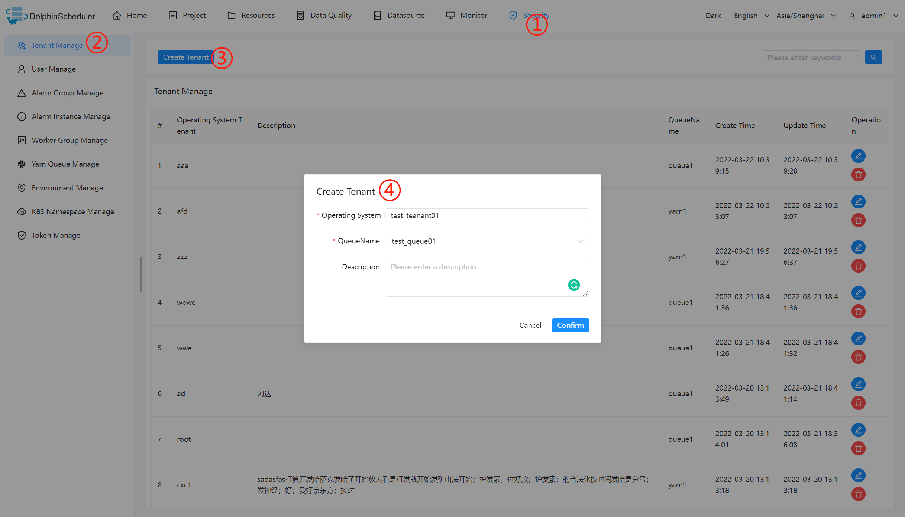

## 일반 사용자 생성

사용자는 **관리자 사용자**와 **일반 사용자**로 구분됩니다.

- 관리자는 인증, 사용자 관리 등의 권한을 가지지만, 워크플로에서 정의한 프로젝트 및 작업을 생성할 수 있는 권한은 없습니다.
- 일반 사용자도 프로젝트를 생성하고 워크플로우 정의를 생성, 편집, 실행할 수 있습니다.
- **참고**: 사용자가 테넌트를 전환하면 사용자가 속한 테넌트 아래의 모든 리소스가 전환된 새 테넌트로 복사됩니다.

'보안센터 -> 사용자 관리' 페이지로 이동하여 '사용자 생성' 버튼을 클릭하면 관리자 전용 사용자를 생성할 수 있습니다.

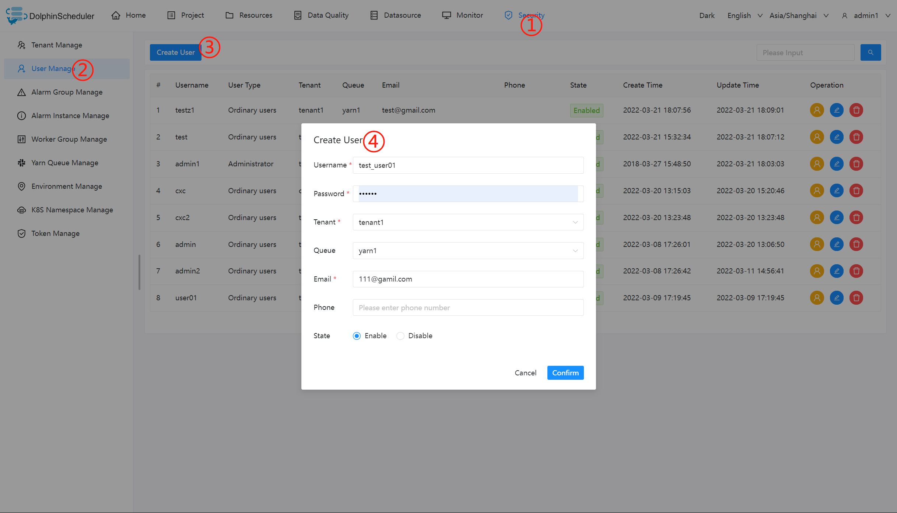

### 사용자 정보 편집

관리자는 '보안센터->사용자 관리' 페이지에 접속하여 '수정' 버튼을 클릭하면 사용자 정보를 편집할 수 있습니다.

일반 사용자로 로그인 후, 사용자 이름 드롭다운 박스에서 사용자 정보를 클릭하면 사용자 정보 페이지로 진입한 후, '편집' 버튼을 클릭하면 사용자 정보를 편집할 수 있습니다.

### 사용자 비밀번호 수정

관리자는 '보안센터 -> 사용자 관리' 페이지에 들어가 '수정' 버튼을 클릭합니다.사용자 정보 수정 시 새로운 비밀번호를 입력하여 사용자 비밀번호를 수정하세요.

일반 사용자로 로그인 후, 사용자 이름 드롭다운 박스에서 사용자 정보를 클릭하여 비밀번호 수정 페이지로 진입한 후, 비밀번호를 입력하고 비밀번호를 확인한 후 '수정' 버튼을 클릭하면 비밀번호 수정이 성공합니다.

## 알람 그룹 생성

알람 그룹은 기동 시 설정되는 파라미터입니다.프로세스가 종료되면 프로세스 상태 및 기타 정보가 이메일을 통해 알람 그룹으로 전송됩니다.

관리자는 '보안센터 -> 알람그룹 관리' 페이지에 접속하여 '알람그룹 생성' 버튼을 클릭하면 알람그룹이 생성됩니다.

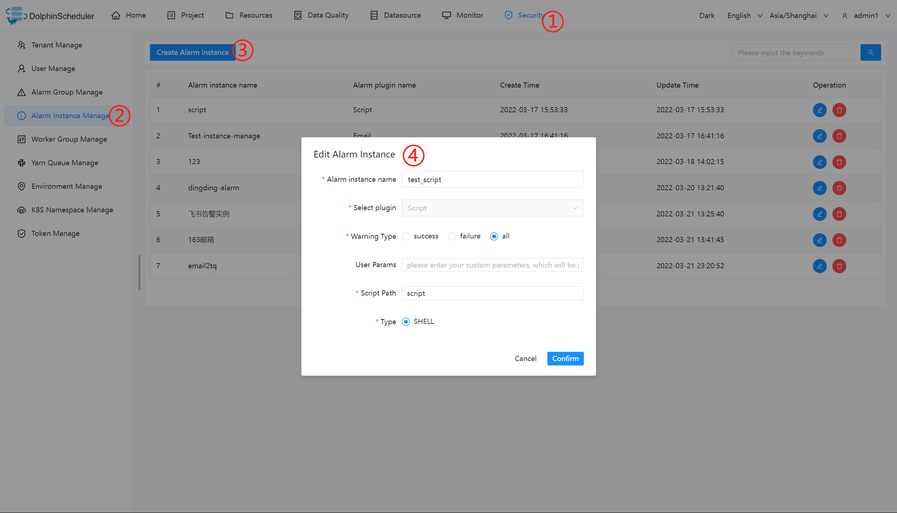

## 토큰 관리

백엔드 인터페이스에는 로그인 확인 기능이 있으므로 토큰 관리는 인터페이스를 호출하여 시스템에서 다양한 작업을 수행할 수 있는 방법을 제공합니다.관리자는 '보안 센터 -> 토큰 관리 페이지'에 접속하여 '토큰 생성' 버튼을 클릭하고 만료 시간과 사용자를 선택한 후 '토큰 생성' 버튼을 클릭하고 '제출' 버튼을 클릭하면 선택한 사용자의 토큰이 성공적으로 생성됩니다.

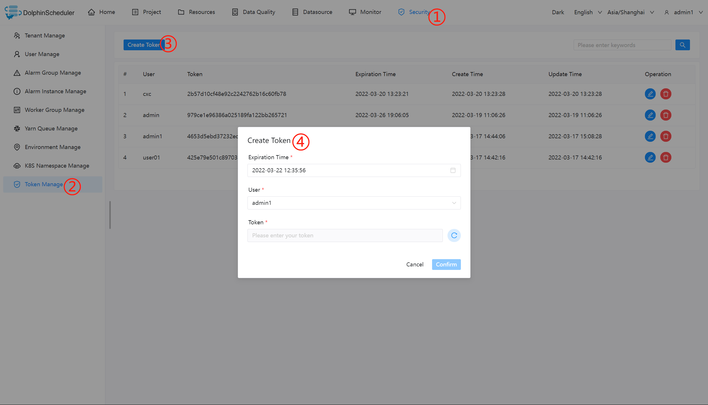

일반 사용자가 로그인한 후, 사용자 이름 드롭다운 박스에서 사용자 정보를 클릭하고, 토큰 관리 페이지에 들어가서 만료 시간을 선택한 후 '토큰 생성' 버튼을 클릭하고 '제출' 버튼을 클릭하면 사용자가 토큰을 성공적으로 생성합니다.

호출의 예:```java
/**
 * test token
 */
public  void doPOSTParam()throws Exception{
    // create HttpClient
    CloseableHttpClient httpclient = HttpClients.createDefault();
    // create http post request
    HttpPost httpPost = new HttpPost("http://127.0.0.1:12345/escheduler/projects/create");
    httpPost.setHeader("token", "123");
    // set parameters
    List<NameValuePair> parameters = new ArrayList<NameValuePair>();
    parameters.add(new BasicNameValuePair("projectName", "qzw"));
    parameters.add(new BasicNameValuePair("desc", "qzw"));
    UrlEncodedFormEntity formEntity = new UrlEncodedFormEntity(parameters);
    httpPost.setEntity(formEntity);
    CloseableHttpResponse response = null;
    try {
        // execute
        response = httpclient.execute(httpPost);
        // response status code 200
        if (response.getStatusLine().getStatusCode() == 200) {
            String content = EntityUtils.toString(response.getEntity(), "UTF-8");
            System.out.println(content);
        }
    } finally {
        if (response != null) {
            response.close();
        }
        httpclient.close();
    }
}
````

## 부여된 권한

* 부여된 권한에는 프로젝트 권한, 리소스 권한, 데이터 소스 권한이 포함됩니다.
* 관리자는 일반 사용자가 생성하지 않는 프로젝트, 리소스, 데이터소스에 대한 권한을 부여할 수 있습니다.프로젝트, 리소스, 데이터 소스의 인증 방법은 모두 동일하므로 프로젝트 인증을 예로 들어 소개합니다.
* 참고: 사용자가 생성한 프로젝트에 대해서는 사용자가 모든 권한을 갖습니다.따라서 사용자가 직접 만든 프로젝트에 대한 권한 변경은 유효하지 않습니다.
- 관리자는 '보안센터 -> 사용자 관리' 페이지에 접속하여, 아래 그림과 같이 인증하고자 하는 사용자의 "인증" 버튼을 클릭합니다.

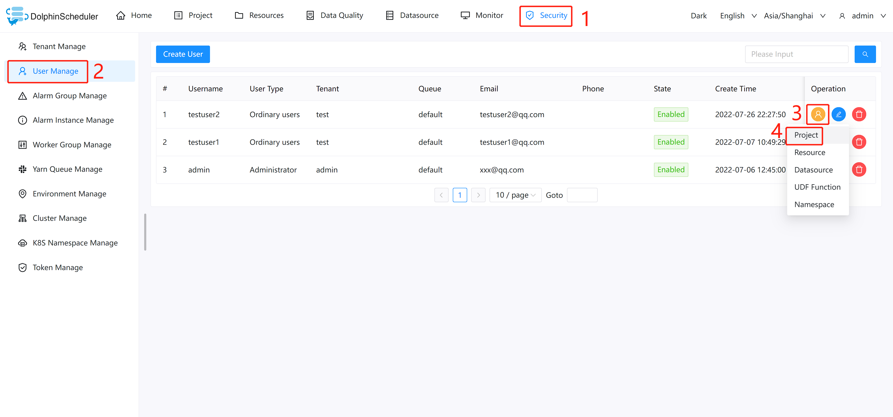

- 하나 이상의 프로젝트를 선택하고 위 버튼을 클릭하여 프로젝트를 승인하세요.왼쪽에서 오른쪽으로 위쪽 버튼은 '모든 권한 취소', '읽기 권한 부여', '모든 권한 부여'(읽기 및 쓰기 권한 모두 포함)에 해당합니다.

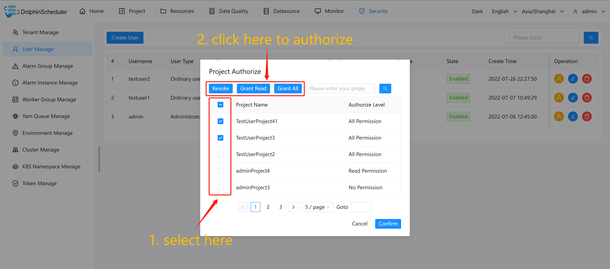

- 사용자가 프로젝트에 대해 읽기 권한만 있고 쓰기 권한이 없는 경우, 사용자가 프로젝트 삭제, 업데이트 등의 작업을 수행하려고 하면 사용자에게 쓰기 권한이 없어 작업을 완료할 수 없다는 오류 메시지가 표시됩니다.

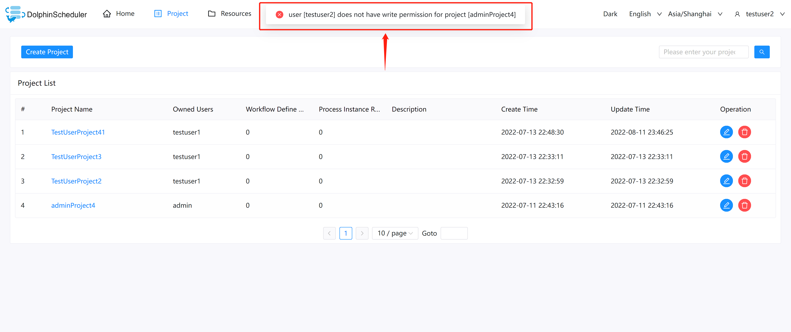

- 리소스, 데이터소스 권한은 프로젝트 권한과 동일합니다.

## 작업자 그룹화

각 작업자 노드는 일부 작업자 그룹에 속하며 기본 그룹은 `default`입니다.

DolphinScheduler가 작업을 실행할 때 구성된 작업자 그룹에 작업을 할당하고 그룹의 작업자 노드가 작업을 실행합니다.

### 작업자 그룹 추가 또는 업데이트

- 그룹을 구성하려는 작업자 노드에서 `worker-server/conf/application.yaml`을 열고 `worker` 섹션에서 `groups` 매개변수를 수정합니다.
- `groups` 파라미터의 값은 워커 노드가 속한 그룹의 이름입니다.기본값은 '기본값'입니다.
- 작업자 노드가 여러 그룹에 속하는 경우 하이픈을 사용하여 나열합니다.```conf
worker:
......
  groups:
    - default
    - group-1
    - group-2
......
````

- 아래와 같이 `application.yaml`의 구성에 관계없이 런타임 중에 작업자에 대한 새 작업자 그룹을 추가할 수 있습니다.
`보안 센터` -> `작업자 그룹 관리` -> `작업자 그룹 생성` -> `그룹 이름`과 `작업자 주소` 입력 -> `확인`을 클릭합니다.

## 환경경영

- 작업자 실행 환경을 온라인으로 구성합니다. 작업자는 여러 환경을 지정할 수 있으며, 각 환경은 `dolphinscheduler_env.sh` 파일과 동일합니다.
- 기본 환경은 `dolphinscheduler_env.sh` 파일입니다.
- 태스크 실행 시 지정된 워커 그룹에 태스크를 할당하고, 워커 그룹에 따라 해당 환경을 선택하여 최종적으로 그룹 내 워커 노드가 환경을 실행한 후 태스크를 실행하게 된다.

### 환경 추가 또는 업데이트

환경 구성은 `dolphinscheduler_env.sh` 파일의 구성과 동일합니다.

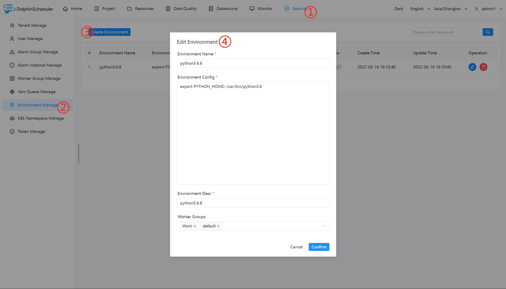

### 사용환경

워크플로 정의에서 작업 노드를 생성하고 작업자 그룹과 작업자 그룹에 해당하는 환경을 선택합니다.작업을 실행할 때 작업자는 작업을 실행하기 전에 먼저 환경을 실행합니다.

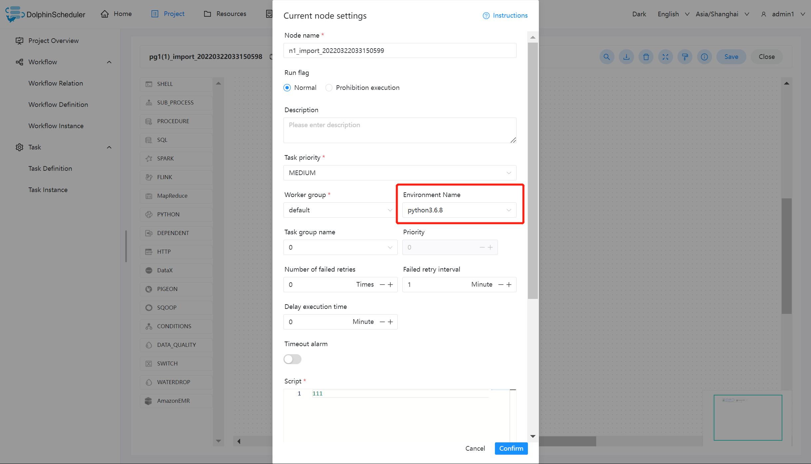

> 참고: 워크플로 정의 페이지에서 또는 워크플로를 트리거할 때 '환경 이름'을 선택할 수 없는 경우 '환경'을 '작업자 그룹'과 연결했는지 확인하세요.

## 클러스터 관리

> 클러스터 추가 또는 업데이트
> - 각 프로세스는 여러 환경을 지원하기 위해 0개 또는 여러 개의 클러스터와 관련될 수 있지만 이제는 k8s만 지원합니다.
>
> 사용량 클러스터
> - 생성 및 승인 후 k8s 네임스페이스와 프로세스는 클러스터를 연결합니다.각 클러스터에는 독립적으로 실행되는 별도의 워크플로와 작업 인스턴스가 있습니다.

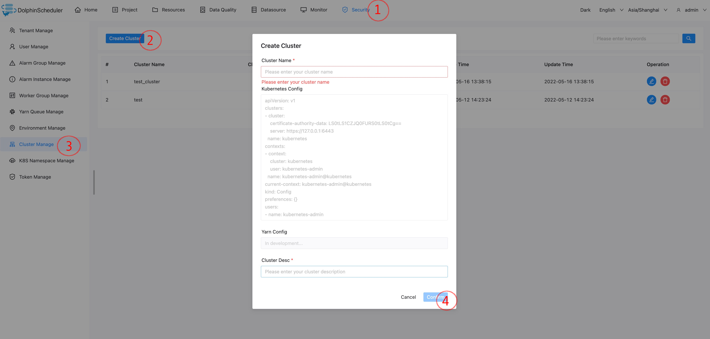

## 네임스페이스 관리

> k8s 클러스터 추가 또는 업데이트

- 먼저 일괄 작업을 위해 데이터베이스의 't_ds_k8s' 테이블에 k8s 클러스터 연결 구성을 입력하고 나중에 제거할 예정이며, 이제 네임스페이스 생성 시 드롭다운 옵션으로 클러스터를 선택합니다.

> 네임스페이스 추가 또는 업데이트

- 생성 및 승인 후 k8s 작업 편집 시 네임스페이스 드롭다운 목록에서 선택할 수 있습니다. k8s 클러스터 이름이 'ds_null_k8s'인 경우 실제로 클러스터를 작동하지 않는 테스트 모드를 의미합니다.

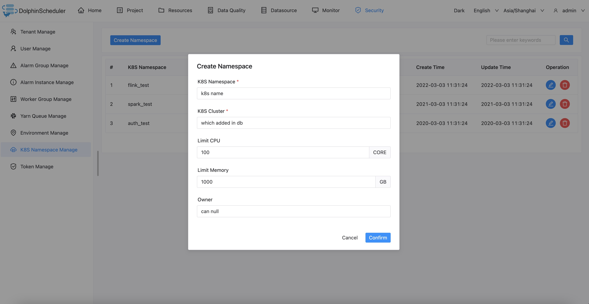