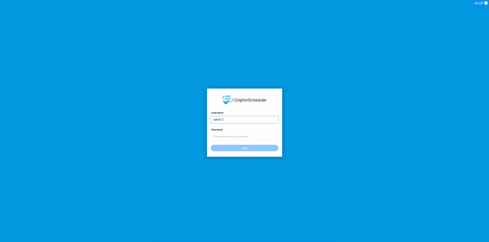
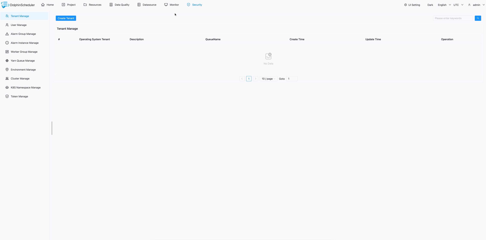
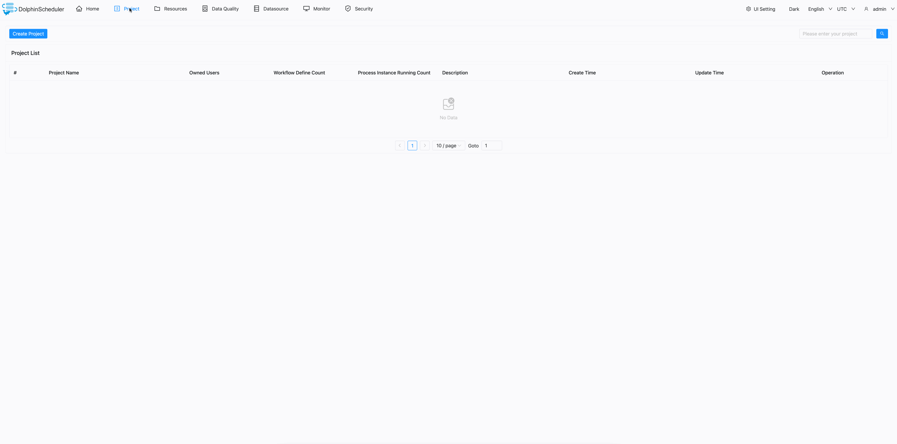
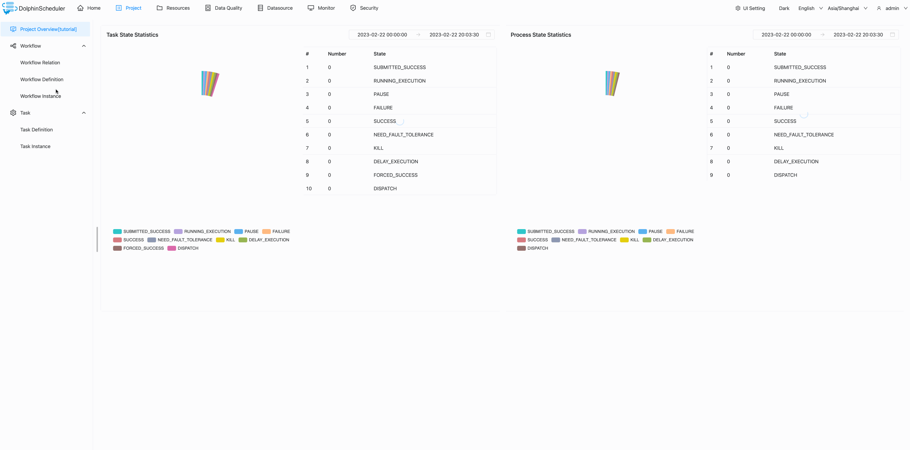
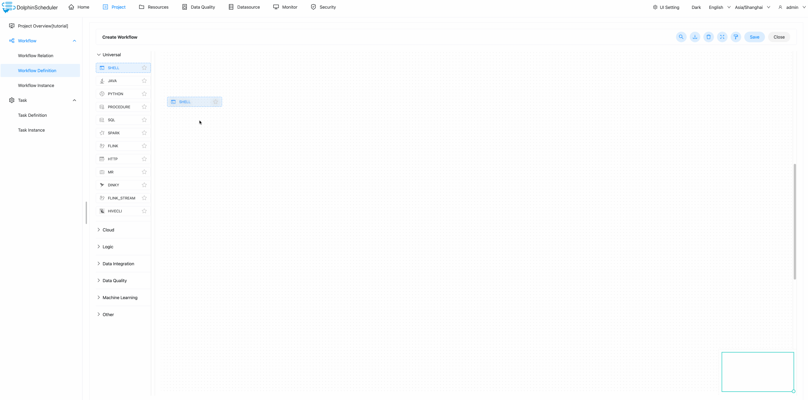
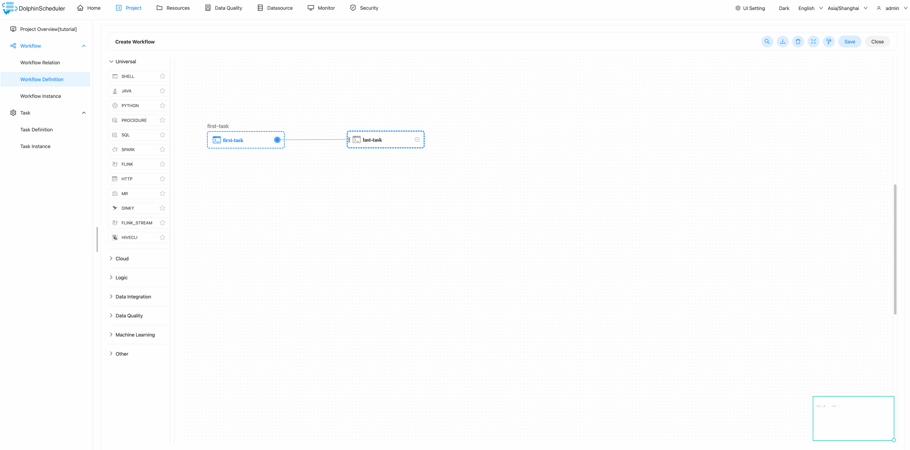
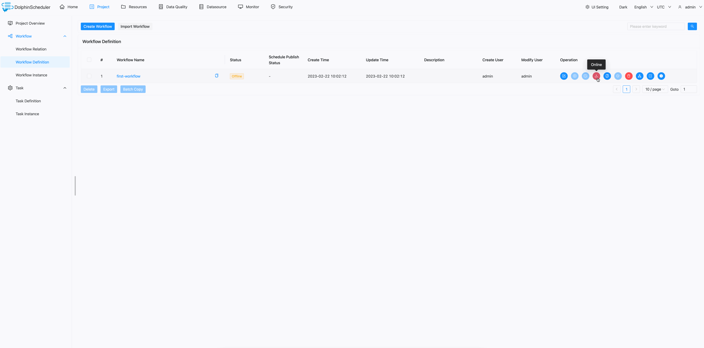
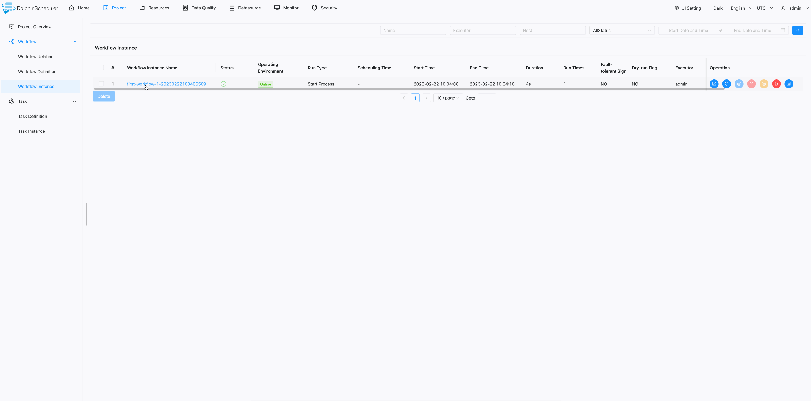

# 빠른 시작

이 섹션에서는 DolphinScheduler를 사용하여 간단한 워크플로를 단계별로 생성하고 실행해 보겠습니다.이번 여행 동안,
DolphinScheduler의 기본 개념을 배우고 워크플로우를 실행하기 위한 가장 기본적인 구성을 알게 됩니다.우리
이 튜토리얼에서는 비디오와 텍스트를 모두 제공하며 원하는 방식을 선택할 수 있습니다.

## 비디오 튜토리얼

<그림 클래스="video_container">
<iframe src="https://www.youtube.com/embed/nrF20hpCkug"frameborder="0"allowfullscreen="true"></iframe>
</Figure>

## 텍스트 튜토리얼

### 돌핀스케줄러 설정

계속 진행하기 전에 먼저 돌핀 스케줄러를 설치하고 시작해야 합니다.초보자의 경우 설정을 권장합니다.
공식 Docker 이미지 또는 독립 실행형 서버를 사용하는 DolphinScheduler.

* [독립형 서버](../installation/standalone.md)
* [도커](./docker.md)

### 첫 번째 워크플로 구축

http://localhost:12345/dolphinscheduler/ui 및 기본 사용자 이름/비밀번호를 통해 DolphinScheduler에 로그인할 수 있습니다.
'admin/dolphinscheduler123'입니다.

#### 테넌트 생성

DolphinScheduler를 사용함에 있어 Tenant는 중요한 개념이므로
먼저 테넌트의 개념을 간략하게 소개하겠습니다.

DolphinScheduler는 DolphinScheduler에 로그인하는 데 사용하는 `admin` 계정을 `user`에 매핑합니다.
시스템 리소스를 더 효과적으로 제어하기 위해 DolphinScheduler는 다음과 같은 개념을 도입했습니다.
작업을 실행하는 데 사용되는 테넌트입니다.

개요는 다음과 같습니다.

* 사용자: 웹 UI에 로그인하고 워크플로 관리 및 테넌트 생성을 포함한 모든 작업을 웹 UI에서 수행합니다.
* 테넌트: 작업의 실제 실행자, DolphinScheduler 작업자용 Linux 사용자입니다.

DolphinScheduler `Security -> Tenant Manage` 페이지에서 테넌트를 생성할 수 있습니다.

> 참고: 사용자는 기본 테넌트가 생성될 때 해당 테넌트에 바인딩됩니다. 기본 테넌트를 사용하는 경우 작업은 작업자의 부트스트랩 사용자에 의해 실행됩니다.

#### 사용자에게 테넌트 할당

위의 `Create Tenant` 섹션에서 설명한 것처럼 `user`는 `tenant`를 할당할 때까지 작업을 실행할 수 없습니다.

DolphinScheduler `Security -> User Manage` 페이지에서 특정 사용자에게 테넌트를 할당할 수 있습니다.

테넌트를 생성하고 이를 사용자에게 할당한 후에는
DolphinScheduler의 간단한 작업 흐름.

#### 프로젝트 생성

하지만 DolphinScheduler에서는 모든 워크플로가 프로젝트에 속해야 하므로 다음이 필요합니다.
먼저 프로젝트를 생성합니다.

DolphinScheduler `Project` 페이지에서 다음을 클릭하여 프로젝트를 생성할 수 있습니다.
'프로젝트 만들기' 버튼.

#### 워크플로 만들기

이제 `tutorial` 프로젝트에 대한 워크플로를 만들 수 있습니다.방금 생성한 프로젝트를 클릭하고,
'Workflow Definition' 페이지로 이동하여 'Create Workflow' 버튼을 클릭하면 리디렉션됩니다.
워크플로 세부정보 페이지로 이동합니다.

#### 작업 만들기

마우스를 사용하여 워크플로 캔버스의 도구 모음에서 생성하려는 작업을 끌 수 있습니다.
이 경우 'Shell' 작업을 만듭니다.업무에 필요한 정보를 입력하고,
이 간단한 워크플로의 작업에 `Script`를 사용하여 `Node Name` 속성을 채웁니다.
그런 다음 '저장' 버튼을 클릭하여 작업을 워크플로에 저장할 수 있습니다.우리는 다른 작업을 만듭니다
같은 방법을 사용합니다.

#### 작업 종속성 설정

따라서 워크플로에서 실행할 이름과 명령이 다른 두 가지 작업이 있습니다.는
현재 워크플로에서 누락된 유일한 것은 작업 종속성입니다.다음을 사용하여 종속성을 추가할 수 있습니다.
마우스를 사용하여 업스트림 작업에서 다운스트림 작업으로 화살표를 끈 다음 마우스를 놓습니다.
그리고 두 작업 사이에 화살표가 있는 링크가 업스트림에서 생성된 것을 볼 수 있습니다.
다운스트림 작업에 대한 작업입니다.마지막으로 오른쪽 상단에 있는 '저장' 버튼을 클릭하면 됩니다.
워크플로를 저장하려면 워크플로 이름을 입력하는 것을 잊지 마세요.

#### 워크플로 실행모든 작업이 완료되면 '온라인'을 클릭한 다음 '실행' 버튼을 클릭하여 워크플로를 실행할 수 있습니다.
워크플로 목록.워크플로 인스턴스를 보려면 '워크플로 인스턴스'로 이동하세요.
페이지에서 워크플로 인스턴스가 실행 중이고 상태가 `Executing`인 것을 볼 수 있습니다.

#### 로그 보기

작업 로그를 보려면 워크플로 인스턴스에서 워크플로 인스턴스를 클릭하세요.
목록에서 로그를 보려는 작업을 찾은 다음 마우스 오른쪽 버튼을 클릭하고 `로그 보기`를 선택합니다.
컨텍스트 대화 상자에서 작업에 대한 자세한 로그를 볼 수 있습니다.

작업이 `Hello DolphinScheduler`와 `Ending...`을 인쇄하는 것을 볼 수 있습니다. 이는 우리와 동일합니다.
작업을 생성할 때 정의됩니다.

방금 DolphinScheduler의 첫 번째 튜토리얼을 마쳤습니다. 이제 몇 가지 간단한 워크플로를 실행할 수 있습니다.
DolphinScheduler에서 축하드립니다!