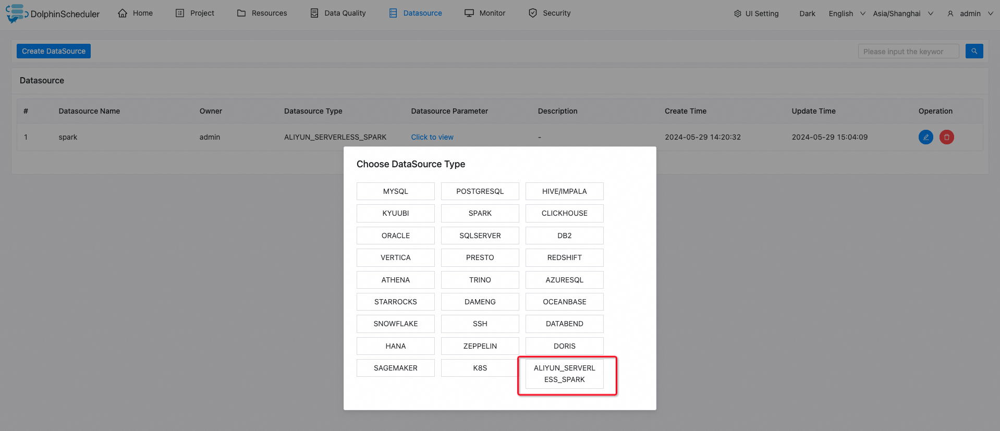
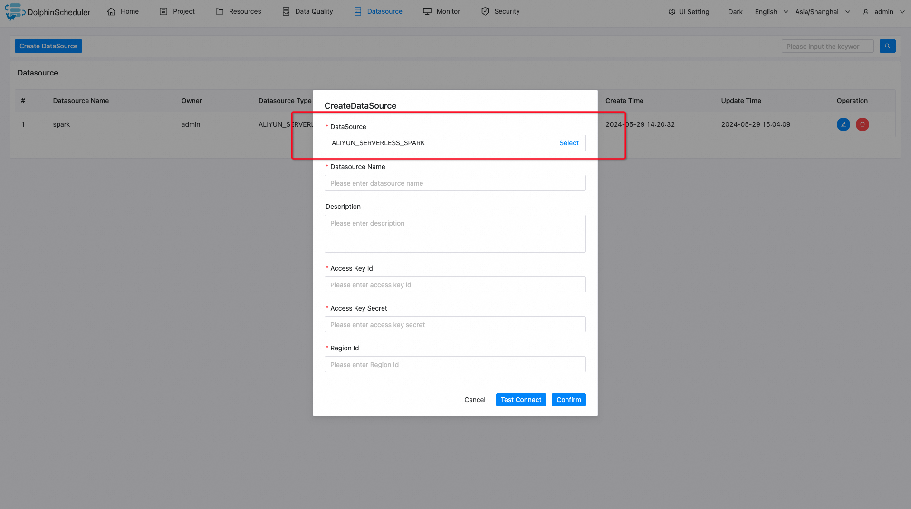
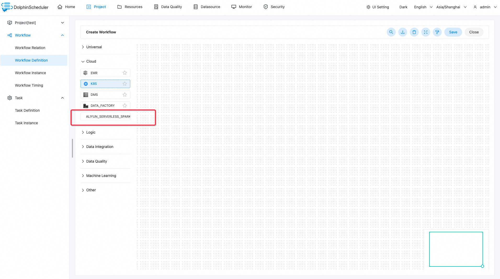
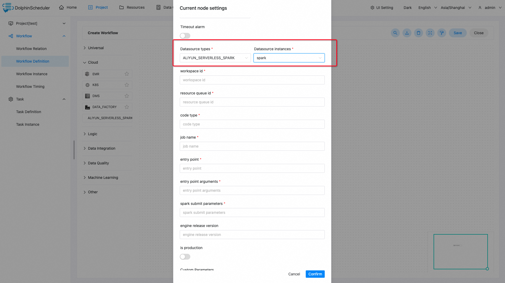

# Aliyun EMR 서버리스 스파크

## 소개

'Aliyun EMR Serverless Spark' 작업 플러그인은 Spark 작업을 다음에 제출합니다.
[`Aliyun EMR Serverless Spark`](https://help.aliyun.com/zh/emr/emr-serverless-spark/product-overview/what-is-emr-serverless-spark) 서비스.

## 연결 만들기

- '데이터 소스 -> 데이터 소스 생성 -> ALIYUN_SERVERLESS_SPARK'를 클릭하여 연결을 생성합니다.

- `Datasource Name`, `Access Key Id`, `Access Key Secret`, `Region Id`를 입력하고 `Confirm`을 클릭합니다.

## 작업 만들기

- `Porject -> Workflow Definition -> Create Workflow`를 클릭하고 `ALIYUN_SERVERLESS_SPARK` 작업을 캔버스로 드래그합니다.

- 작업 매개변수를 입력하고 `확인`을 클릭하여 작업 노드를 생성합니다.

## 작업 매개변수

- 기본 매개변수는 [DolphinScheduler 작업 매개변수 부록](appendix.md) `기본 작업 매개변수` 섹션을 참조하세요.

|**매개변수** |**설명** |
|--------------------------------------|--------------------------------------------------------------------------|
|데이터 소스 유형 |작업에서 사용하는 데이터 소스 유형은 `ALIYUN_SERVERLESS_SPARK`여야 합니다.|
|데이터 소스 인스턴스 |`ALIYUN_SERVERLESS_SPARK` 데이터 소스의 인스턴스입니다.|
|작업공간 ID |`Aliyun Serverless Spark` 작업공간 ID.|
|리소스 대기열 ID |작업이 Spark 작업을 제출하는 데 사용하는 'Aliyun Serverless Spark' 리소스 대기열입니다.|
|코드 유형 |`Aliyun Serverless Spark` 코드 유형은 `JAR`, `PYTHON` 또는 `SQL`일 수 있습니다.|
|직업 이름 |'Aliyun Serverless Spark' 작업 이름입니다.|
|진입점 |jar 패키지, Python 파일, SQL 파일과 같은 작업 코드의 위치입니다.OSS 위치가 지원됩니다.|
|진입점 인수 |작업 기본 프로그램의 인수입니다.|
|스파크 제출 매개변수 |Spark 제출 관련 매개변수.|
|엔진 출시 버전 |Spark 엔진 릴리스 버전.|
|생산입니다 |Spark 작업이 프로덕션 환경에서 실행되는지 아니면 개발 환경에서 실행되는지 여부입니다.|

## 예

### Jar 작업 제출|**매개변수** |**예시 값/작업** |
|--------------------------------------|----------------------------------------------------------------------------------------------------------------------------------------------------------------------------|
|지역 ID |cn-항저우 |
|액세스 키 ID |<액세스 키 ID> |
|액세스 키 비밀 |<액세스 키-비밀> |
|리소스 대기열 ID |루트_큐 |
|코드 유형 |항아리 |
|직업 이름 |ds-emr-스파크-항아리 |
|진입점 |oss://datadev-oss-hdfs-test/spark-resource/examples/jars/spark-examples_2.12-3.3.1.jar |
|진입점 인수 |100 |
|스파크 제출 매개변수 |--class org.apache.spark.examples.SparkPi --conf Spark.executor.cores=4 --conf Spark.executor.memory=20g --conf Spark.driver.cores=4 --conf Spark.driver.memory=8g --conf Spark.executor.instances=1 |
|엔진 출시 버전 |esr-2.1-native(Spark 3.3.1, Scala 2.12, 네이티브 런타임) |
|생산입니다 |스위치를 열어주세요 |

### SQL 작업 제출|**매개변수** |**예시 값/작업** |
|--------------------------------------|------------------------------------------------------------------------------------------------------------------------------------------------------------------------------------------------------------|
|지역 ID |cn-항저우 |
|액세스 키 ID |<액세스 키 ID> |
|액세스 키 비밀 |<액세스 키-비밀> |
|리소스 대기열 ID |루트_큐 |
|코드 유형 |SQL |
|직업 이름 |ds-emr-스파크-sql-1 |
|진입점 |비어 있지 않은 문자열 |
|진입점 인수 |-e#테이블 표시;테이블 표시;|
|스파크 제출 매개변수 |--class org.apache.spark.sql.hive.thriftserver.SparkSQLCLIDriver --conf Spark.executor.cores=4 --conf Spark.executor.memory=20g --conf Spark.driver.cores=4 --conf Spark.driver.memory=8g --conf Spark.executor.instances=1 |
|엔진 출시 버전 |esr-2.1-native(Spark 3.3.1, Scala 2.12, 네이티브 런타임) |
|생산입니다 |스위치를 열어주세요 |

### OSS에 있는 SQL 작업 제출|**매개변수** |**예시 값/작업** |
|--------------------------------------|------------------------------------------------------------------------------------------------------------------------------------------------------------------------------------------------------------|
|지역 ID |cn-항저우 |
|액세스 키 ID |<액세스 키 ID> |
|액세스 키 비밀 |<액세스 키-비밀> |
|리소스 대기열 ID |루트_큐 |
|코드 유형 |SQL |
|직업 이름 |ds-emr-스파크-sql-2 |
|진입점 |비어 있지 않은 문자열 |
|진입점 인수 |-f#oss://datadev-oss-hdfs-test/spark-resource/examples/sql/show_db.sql |
|스파크 제출 매개변수 |--class org.apache.spark.sql.hive.thriftserver.SparkSQLCLIDriver --conf Spark.executor.cores=4 --conf Spark.executor.memory=20g --conf Spark.driver.cores=4 --conf Spark.driver.memory=8g --conf Spark.executor.instances=1" |
|엔진 출시 버전 |esr-2.1-native(Spark 3.3.1, Scala 2.12, 네이티브 런타임) |
|생산입니다 |스위치를 열어주세요 |

### PySpark 작업 제출|**매개변수** |**예시 값/작업** |
|--------------------------------------|-----------------------------------------------------------------------------------------------------------------------------------------------|
|지역 ID |cn-항저우 |
|액세스 키 ID |<액세스 키 ID> |
|액세스 키 비밀 |<액세스 키-비밀> |
|리소스 대기열 ID |루트_큐 |
|코드 유형 |파이썬 |
|직업 이름 |ds-emr-스파크-파이썬 |
|진입점 |oss://datadev-oss-hdfs-test/spark-resource/examples/src/main/python/pi.py |
|진입점 인수 |100 |
|스파크 제출 매개변수 |--conf Spark.executor.cores=4 --conf Spark.executor.memory=20g --conf Spark.driver.cores=4 --conf Spark.driver.memory=8g --conf Spark.executor.instances=1 |
|엔진 출시 버전 |esr-2.1-native(Spark 3.3.1, Scala 2.12, 네이티브 런타임) |
|생산입니다 |스위치를 열어주세요 |