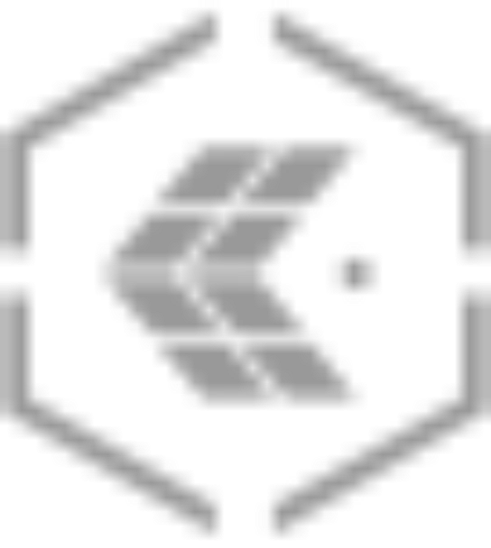
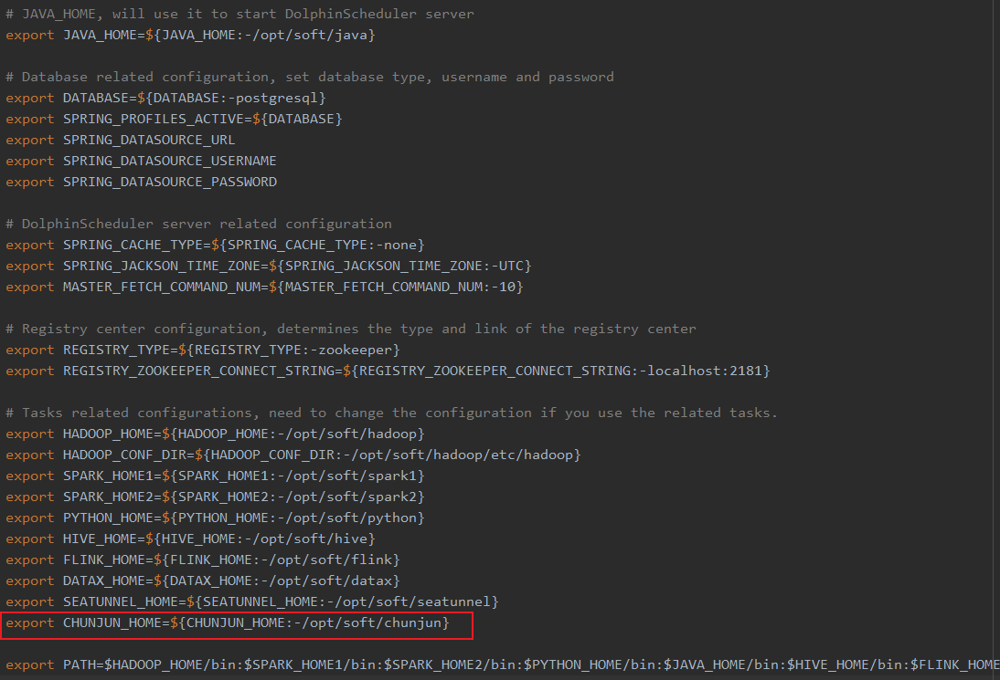
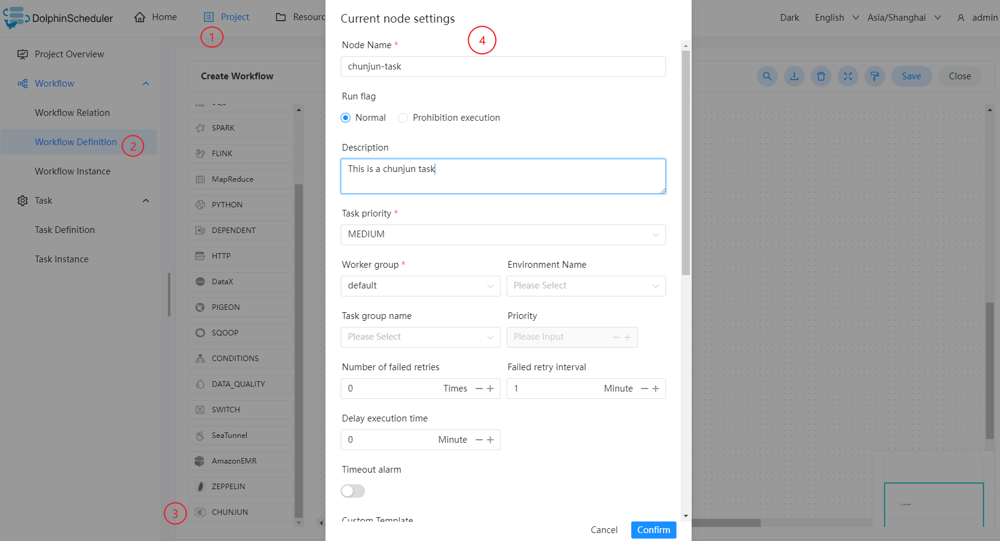
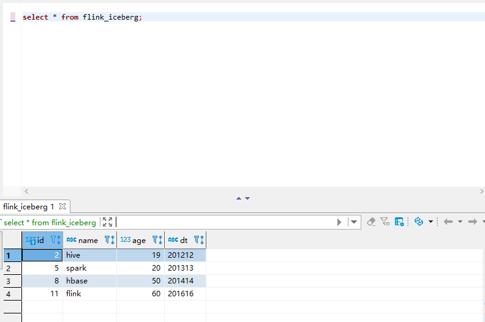

#춘준

## 개요

ChunJun 프로그램을 실행하기 위한 ChunJun 작업 유형입니다.ChunJun 노드의 경우 작업자는 `${CHUNJUN_HOME}/bin/start-chunjun`을 실행하여 입력 json 파일을 분석합니다.

## 작업 생성

- '프로젝트 관리 -> 프로젝트 이름 -> 워크플로 정의'를 클릭한 후, '워크플로 생성' 버튼을 클릭하면 DAG 편집 페이지로 진입합니다.
- 툴바에서 를 드로잉 보드로 드래그하세요.

## 작업 매개변수

[//]: # (TODO: 웹사이트 템플릿이 이 구문을 지원하면 아래에 주석이 달린 앵커를 사용하세요)
[//]: # (- 기본 매개변수는 [DolphinScheduler 작업 매개변수 부록]&#40;appendix.md#default-task-parameters&#41; `기본 작업 매개변수` 섹션을 참조하세요.)

- 기본 매개변수는 [DolphinScheduler 작업 매개변수 부록](appendix.md) `기본 작업 매개변수` 섹션을 참조하세요.

|**매개변수** |**설명** |
|--------------------------------|----------------------------------------------------------------------------------------------------------------|
|사용자 정의 템플릿 |ChunJun 노드의 json 프로필 콘텐츠를 사용자 정의합니다.|
|JSON |ChunJun 동기화를 위한 json 구성 파일입니다.|
|맞춤 매개변수 |이는 사용자 정의 매개변수이며 스크립트에서 내용을 `${variable}`로 대체합니다.|
|배포 모드 |chunjun 작업 모드(예: 로컬 독립 실행형)를 실행합니다.|
|옵션 매개변수 |`-confProp "{\"flink.checkpoint.interval\":60000}"`와 같은 지원 |
|전임자 과제 |현재 작업에 대한 선행 작업을 선택하면 선택한 선행 작업이 현재 작업의 업스트림으로 설정됩니다.|

## 작업 예

이 예에서는 Hive에서 MySQL로 데이터를 가져오는 방법을 보여줍니다.

### DolphinScheduler에서 ChunJun 환경 구성

프로덕션 환경에서 ChunJun 작업 유형을 사용하는 경우 먼저 필요한 환경을 구성해야 합니다.구성 파일은 `/dolphinscheduler/conf/env/dolphinscheduler_env.sh`입니다.



환경이 구성된 후에는 DolphinScheduler를 다시 시작해야 합니다.

### ChunJun 작업 노드 구성

Hive에서 읽어올 데이터는 Custom json이 필요하며, [Hive Json 템플릿](https://github.com/DTStack/chunjun/blob/master/chunjun-examples/json/hive/binlog_hive.json)을 참고하세요.

필수 json 파일을 작성한 후 아래 다이어그램의 단계에 따라 노드 콘텐츠를 구성할 수 있습니다.



### 실행 결과 보기



### 참고

${CHUNJUN_HOME}/bin/start-chunjun을 실행하기 전에 ${CHUNJUN_HOME}/bin/start-chunjun 쉘을 변경해야 하며, 앞에서 실행하려면 '&'를 제거해야 합니다.

와 같은:```shell
nohup $JAVA_RUN -cp $JAR_DIR $CLASS_NAME $@ &
````

다음으로 업데이트:```shell
nohup $JAVA_RUN -cp $JAR_DIR $CLASS_NAME $@
````