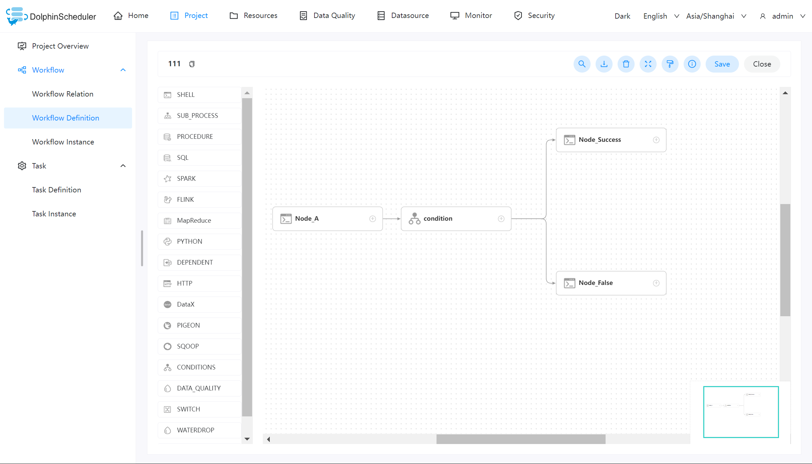
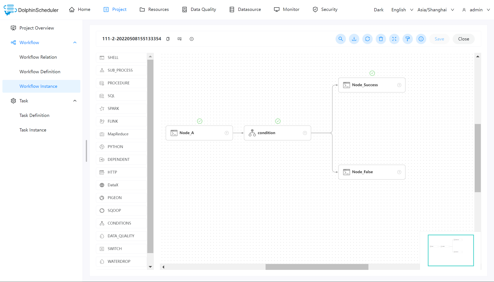
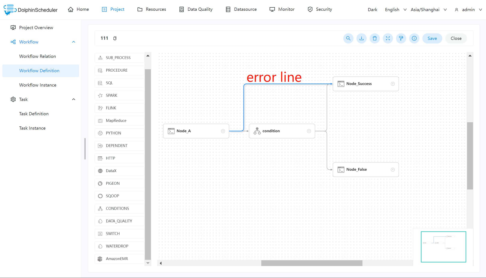
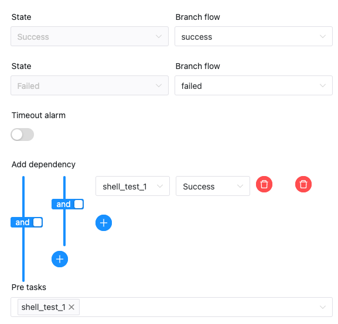

# 조건

Condition은 업스트림 작업의 조건에 따라 실행해야 하는 다운스트림 작업을 결정하는 조건부 노드입니다.현재 조건은 여러 업스트림 작업을 지원하지만 다운스트림 작업은 두 개만 지원합니다.업스트림 작업 수가 1개를 초과하는 경우 `and` 및 `or` 연산자를 통해 복잡한 업스트림 종속성을 달성합니다.

## 작업 생성

- '프로젝트 관리 -> 프로젝트 이름 -> 워크플로 정의'를 클릭한 후, '워크플로 생성' 버튼을 클릭하면 DAG 편집 페이지로 진입합니다.
- 도구 모음  작업 노드에서 캔버스로 드래그합니다.

## 작업 매개변수

[//]: # (TODO: 웹사이트 템플릿이 이 구문을 지원하면 아래에 주석이 달린 앵커를 사용하세요)
[//]: # (- 기본 매개변수는 [DolphinScheduler 작업 매개변수 부록]&#40;appendix.md#default-task-parameters&#41; `기본 작업 매개변수` 섹션을 참조하세요.)

- 기본 매개변수는 [DolphinScheduler 작업 매개변수 부록](appendix.md) `기본 작업 매개변수` 섹션을 참조하세요.

|**매개변수** |**설명** |
|-------------------------------|-----------------------------------------------------------------------------------------------------------------------------------------------------------------------------------------------------------------------------------------------------------------------------------------------------------------------------------------------------------------------------------------------|
|다운스트림 작업 선택 |선행 작업 상태에 따라 해당 브랜치로 점프할 수 있으며, 현재 성공, 실패 2가지 브랜치가 지원됩니다. <ul><li>성공: 업스트림 작업이 성공적으로 실행되면 성공 브랜치를 실행합니다.</li><li>실패: 업스트림 작업 실행이 실패하면 실패 브랜치를 실행합니다.</li></ul></li></ul> |
|상류 조건 선택 |조건에 대해 하나 이상의 업스트림 작업을 선택할 수 있습니다.<ul><li>업스트림 종속성을 추가합니다. 첫 번째 매개변수는 지정된 작업 이름을 선택하고 두 번째 매개변수는 조건을 트리거할 업스트림 작업 상태를 선택하는 것입니다.</li><li>업스트림 작업 관계 선택: 조건에 대한 업스트림 작업이 여러 개 있는 경우 `and` 및 `or` 연산자를 사용하여 업스트림의 복잡한 관계를 처리합니다.</li></ul></li></ul> |

## 관련 작업

[switch](switch.md): 조건 작업은 주로 업스트림 노드의 실행 상태(성공, 실패)를 기반으로 해당 분기를 실행합니다.[스위치](switch.md) 태스크 노드는 주로 [전역 매개변수](../parameter/global.md)의 값과 사용자가 작성한 표현식의 결과를 기반으로 해당 분기를 실행합니다.

## 예

이 샘플은 [Shell](shell.md) 작업을 사용하여 조건 작업의 작동을 보여줍니다.

### 워크플로 만들기

워크플로 정의 페이지로 이동한 후 다음 작업 노드를 만듭니다.

- Node_A: 쉘 작업, "hello world"를 인쇄합니다. 주요 기능은 Condition의 업스트림 분기이며, 실행 성공 여부에 따라 해당 분기 노드를 트리거합니다.
- 조건: 조건 태스크는 업스트림 태스크의 실행 상태에 따라 해당 분기를 실행합니다.
- Node_Success: 쉘 작업, "성공"을 인쇄하고 Node_A는 성공적인 분기를 실행합니다.
- Node_False: 쉘 작업, "false"를 인쇄하면 Node_A가 실패한 분기를 실행합니다.

### 실행 결과 보기

워크플로 생성을 마친 후 온라인으로 워크플로를 실행할 수 있습니다.워크플로우 인스턴스 페이지에서 각 작업의 실행 상태를 볼 수 있습니다.아래와 같이:

위 그림에서 녹색 체크 표시가 있는 작업 상태는 성공적으로 실행된 작업 노드입니다.

## 참고

- 조건 작업은 여러 업스트림 작업을 지원하지만 다운스트림 작업은 2개만 지원합니다.
- 조건 작업 및 이를 포함하는 워크플로는 복사 작업을 지원하지 않습니다.
- Conditions의 선행 작업은 분기 노드에 연결할 수 없으므로 논리적 혼란이 발생하고 DAG 스케줄링을 따르지 않습니다.아래에 표시된 상황은 **잘못**되었습니다.

