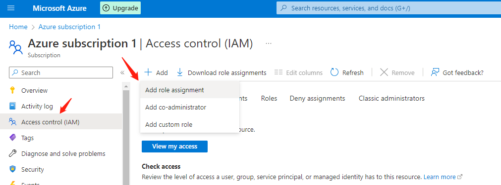
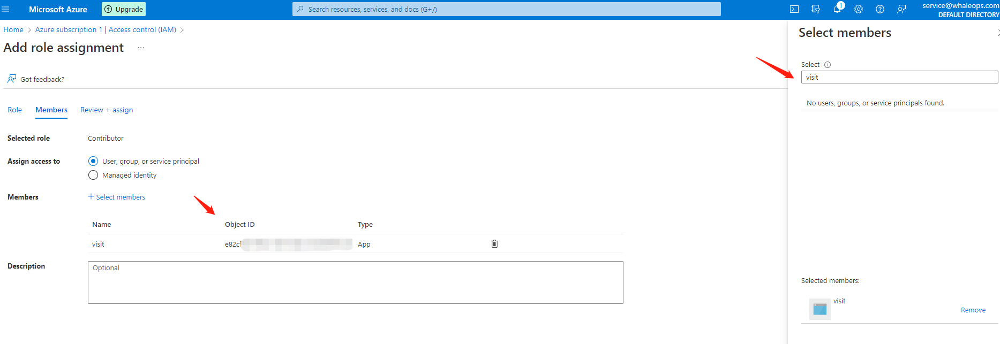
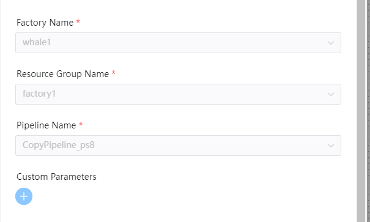

# Azure DataFactory 노드

## 개요

빅 데이터 세계에서 정리되지 않은 원시 데이터는 관계형, 비관계형 및 기타 스토리지 시스템에 저장되는 경우가 많습니다. [Azure DataFactory](https://learn.microsoft.com/en-us/azure/data-factory/introduction)는 이러한 복잡한 하이브리드 추출-변환-로드(ETL), 추출-로드-변환(ELT) 및 데이터 통합 프로젝트를 위해 구축된 관리형 클라우드 서비스입니다.

DolphinScheduler DataFactory 함수:

- Azure DataFactory 작업을 생성하면 DolphinScheduler가 DataFactory 파이프라인을 예약하고 실행이 완료될 때까지 쿼리 파이프라인 실행 상태를 유지할 수 있습니다.

## 전제 조건

- **ResourceGroup**: Azure는 리소스 그룹을 소유합니다.
- **DataFactory**: Azure는 리소스 그룹 아래에 데이터 팩터리를 소유합니다.
- **파이프라인**: Azure는 할당된 리소스 그룹 및 데이터 팩터리에서 파이프라인을 소유합니다.
- **애플리케이션**: Azure는 데이터 팩터리를 방문할 수 있는 권한이 있는 애플리케이션을 소유하고 있으며 SDK를 사용하여 데이터 팩터리 기능을 호출할 수 있습니다.
- **ApplicationClientSecret**: '인증서 및 비밀' 애플리케이션에서 클라이언트 비밀을 신청하려면
- **AZURE-CLI**: 머신에 Azure 인증 애플리케이션 AZURE-CLI를 설치합니다. [Linux에 Azure CLI 설치](https://learn.microsoft.com/en-us/cli/azure/install-azure-cli-linux)를 참조하세요.

### 애플리케이션 권한 설정

먼저 '구독' 페이지를 방문하여 '액세스 제어(IAM)'을 선택한 다음 승인 페이지에서 '역할 할당 추가'를 클릭하세요.

그 후 데이터 팩토리에서 함수 호출을 만족하는 'Contributor' 역할을 선택합니다.그런 다음 '회원' 페이지를 클릭하고 '회원 선택'을 클릭하세요.
애플리케이션 이름 또는 애플리케이션 `Object ID`를 검색하여 애플리케이션에 `Contributor` 역할을 할당합니다.


## 구성

Azure 구성을 구성하고 `common.properties`에서 `azure` 관련 구성을 수정합니다.
- **resource.azure.client.id**: Azure 애플리케이션 애플리케이션(클라이언트) ID
- **resource.azure.client.secret**: '인증서 및 비밀' 아래의 Azure 애플리케이션 클라이언트 비밀
- **resource.azure.subId**: 데이터 팩터리 구독 ID
- **resource.azure.tenant.id**: Azure Active Directory 테넌트 ID```yaml
# The Azure client ID (Azure Application (client) ID)
resource.azure.client.id=minioadmin
# The Azure client secret in the Azure application
resource.azure.client.secret=minioadmin
# The Azure data factory subscription ID
resource.azure.subId=minioadmin
# The Azure tenant ID in the Azure Active Directory
resource.azure.tenant.id=minioadmin

````

## 작업 생성

- `프로젝트 -> 관리-프로젝트 -> 이름-워크플로우 정의`를 클릭한 후 "워크플로우 생성" 버튼을 클릭하여 입력합니다.
DAG 편집 페이지.
- 도구 모음  작업 노드에서 캔버스로 드래그합니다.

## 작업 예

[//]: # (TODO: 웹사이트 템플릿이 이 구문을 지원하면 아래에 주석이 달린 앵커를 사용하세요)
[//]: # (- 기본 매개변수는 [DolphinScheduler 작업 매개변수 부록]&#40;appendix.md#default-task-parameters&#41; `기본 작업 매개변수` 섹션을 참조하세요.)

- 기본 매개변수는 [DolphinScheduler 작업 매개변수 부록](appendix.md) `기본 작업 매개변수` 섹션을 참조하세요.

DataFactory 플러그인에 대한 몇 가지 특정 매개변수는 다음과 같습니다.

- **factoryName**: 데이터 팩터리 이름
- **resourceGroupName**: 데이터 팩터리의 리소스 그룹 이름
- **pipelineName**: 리소스 그룹 및 데이터 팩터리 아래의 파이프라인 이름

다음은 작업 플러그인 예를 보여줍니다.

